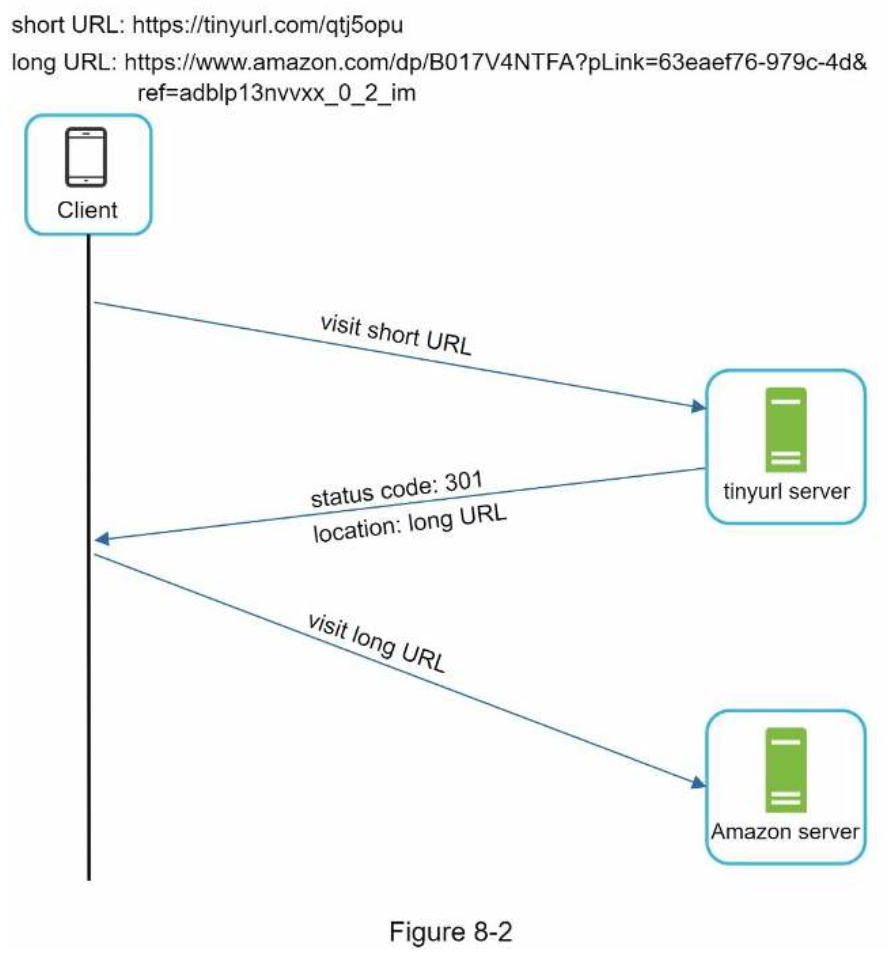
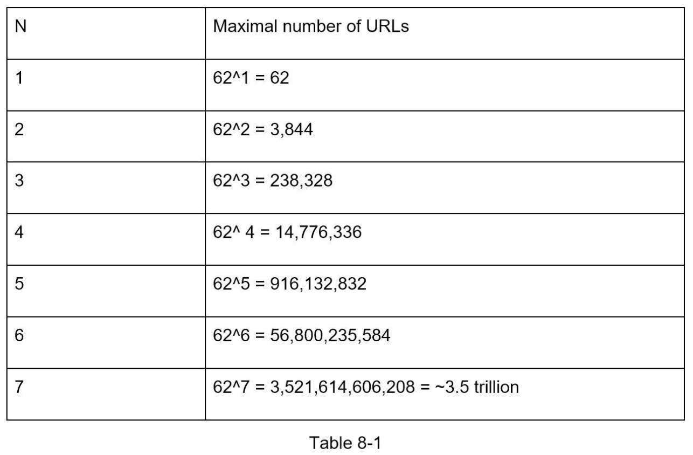
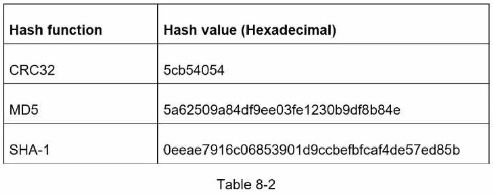
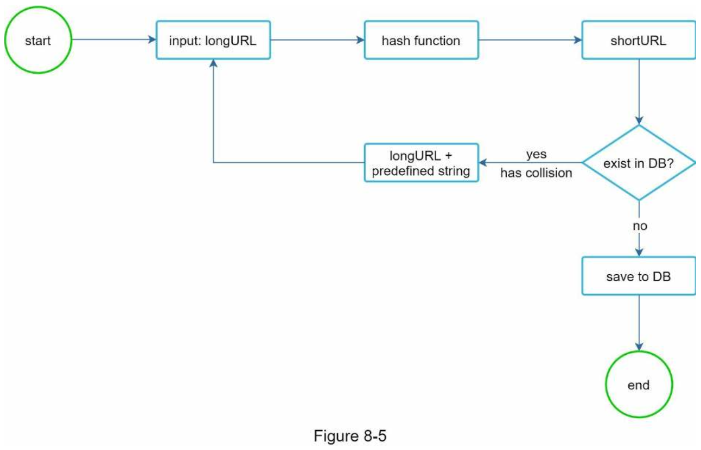
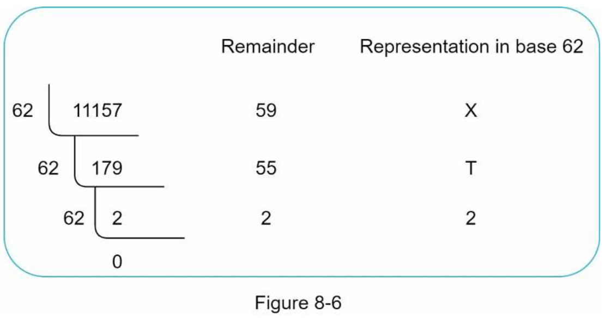
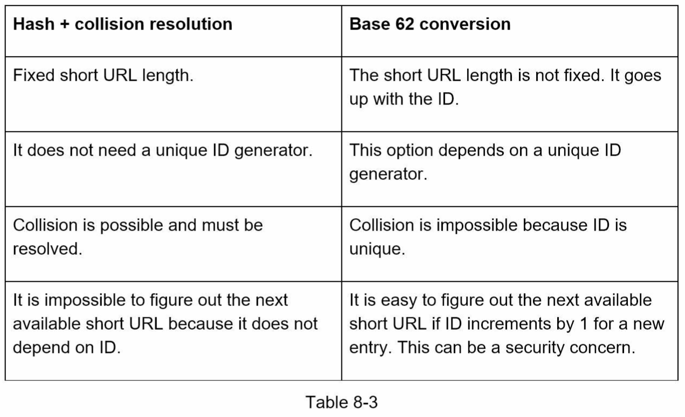
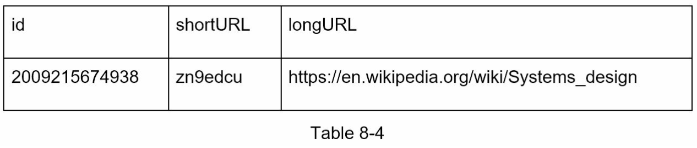
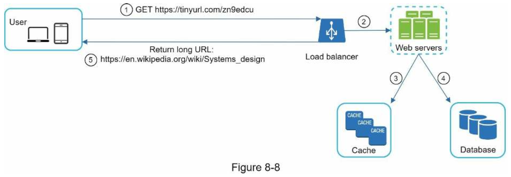

# 8. DESIGN A URL SHORTENER
### Step 1 - Understand the problem and establish design scope
-----
###### The basic use cases:
- 1.URL shortening: given a long URL => return a much shorter URL 
- 2.URL redirecting: given a shorter URL => redirect to the original URL 
- 3.High availability, scalability, and fault tolerance considerations

##### Back of the envelope estimation
- Write operation: 100 million URLs are generated per day.
- Write operation per second: 100 million / 24 /3600 = 1160
- Read operation: Assuming ratio of read operation to write operation is 10:1, read operation per second: 1160 * 10 = 11,600
- Assuming the URL shortener service will run for 10 years, this means we must support 100 million * 365 * 10 = 365 billion records.
- Assume average URL length is 100.
- Storage requirement over 10 years: 365 billion * 100 bytes * 10 years = 365 TB

### Step 2 - Propose high-level design and get buy-in
-----
##### API Endpoints
- 1.URL shortening.
    - To create a new short URL, a client sends a POST request, which contains one parameter: the original long URL.
    ```
    POST api/v1/data/shorten
    • request parameter: {longUrl: longURLString}
    • return shortURL
    ```
- 2.URL redirecting.
    - To redirect a short URL to the corresponding long URL, a client sends a GET request.
    ```
    GET api/v1/shortUrl
    • Return longURL for HTTP redirection
    ```

##### URL redirecting
- Once the server receives a tinyurl request, it changes the short URL to the long URL with 301 redirect.


- 301 redirect.
    - shows that the requested URL is “permanently” moved to the long URL.
    - the browser caches the response, and subsequent requests for the same URL will not be sent to the URL shortening service.
- 302 redirect.
    - means that the URL is “temporarily” moved to the long URL, meaning that subsequent requests for the same URL will be sent to the URL shortening service first.
- If the priority is to reduce the server load, using 301 redirect makes sense as only the first request of the same URL is sent to URL shortening servers.
- However, if analytics is important, 302 redirect is a better choice as it can track click rate and source of the click more easily.
- The most intuitive way to implement URL redirecting is to use hash tables. **<shortURL, longURL>**
    - Get longURL: longURL = hashTable.get(shortURL)
    - Once you get the longURL, perform the URL redirect.

##### URL shortening
- looks like this: www.tinyurl.com/{hashValue}
- Each longURL must be hashed to one hashValue.
- Each hashValue can be mapped back to the longURL.

### Step 3 - Design deep dive
-----
##### Data model
- A better option is to store <shortURL, longURL> mapping in a relational database.
- The simplified version of the table contains 3 columns: id, shortURL, longURL.

##### Hash function
###### Hash value length
- The hashValue consists of characters from [0-9, a-z, A-Z], containing 10 + 26 + 26 = 62 possible characters.
- To figure out the length of hashValue, find the smallest n such that 62^n ≥ 365 billion.

- When n = 7, 62 ^ n = ~3.5 trillion, 3.5 trillion is more than enough to hold 365 billion URLs, so the length of hashValue is 7.

###### Hash + collision resolution
- A straightforward solution is to use well-known hash functions like **CRC32**, **MD5**, or **SHA-1**.

- The first approach is to collect the first 7 characters of a hash value; however, this method can lead to hash collisions.
- To resolve hash collisions, we can recursively append a new predefined string until no more collision is discovered.


###### Base 62 conversion
- 0-0, ..., 9-9, 10-a, 11-b, ..., 35-z, 36-A, ..., 61-Z
- 11157 = 2 x 622 + 55 x 621 + 59 x 620 = [2, 55, 59] -> [2, T, X]


###### Comparison of the two approaches


##### URL shortening deep dive
- The distributed unique ID generator's primary function is to generate globally unique IDs, which are used for creating shortURLs.


##### URL redirecting deep dive

1. A user clicks a short URL link: https://tinyurl.com/zn9edcu
2. The load balancer forwards the request to web servers.
3. If a shortURL is already in the cache, return the longURL directly.
4. If a shortURL is not in the cache, fetch the longURL from the database. If it is not in the database, it is likely a user entered an invalid shortURL.
5. The longURL is returned to the user.

### Step 4 - Wrap up
---
- A few additional talking points:
    - **Rate limiter**: A potential security problem we could face is that malicious users send an overwhelmingly large number of URL shortening requests. Rate limiter helps to filter out requests based on IP address or other filtering rules.
    - **Web server scaling**: Since the web tier is stateless, it is easy to scale the web tier by adding or removing web servers.
    - **Database scaling**: Database replication and sharding are common techniques.
    - **Analytics**: Data is increasingly important for business success. Integrating an analytics solution to the URL shortener could help to answer important questions like _how many people click on a link?_ _When do they click the link?_ etc.
    - **Availability, consistency, and reliability.** These concepts are at the core of any large system’s success.
