# Chapter 8: Design a URL Shortener
- Classic system design interview question: designing a URL shortening service like tinyurl.

## Step 1: Understand the Problem and Establish Design Scope
- system design interviews are intentionally left open-ended. Ask clarification questions.

### Example
- Q: Can you give me an example of how a URL shortner work?
- A: https://www.systeminterview.com/q=chatsystem&c=loggedin&v=v3&l=long is the original URL. Your service creates an alias with shorter length: https://tinyurl.com/ y7keocwj. If you click the alias, it redirects you to the original URL.

- Q: What is the traffic volume?
- A: 100 million URLs generated / day

- Q: How long is the shortened URL?
- A: as short as possible

- Q: What characters are allowed in the shortened URL?
- A: combination of numbers (0-9) and characters (a-z, A-Z)

- Q: Can shortened URLs be deleted or updated?
- A: for simplicity, lets assume no

### Basic use cases:
1. URL shortening: given a long URL => return a much shorter URL 
2. URL redirecting: given a shorter URL => redirect to the original URL 
3. High availability, scalability, and fault tolerance considerations

### Back of the envelope estimation
- Write operation: 100 million URLs are generated per day.
- Write operation per second: 100 million / 24 /3600 = 1160
- Read operation: Assuming ratio of read operation to write operation is 10:1, read operation per second: 1160 * 10 = 11,600
- Assuming the URL shortener service will run for 10 years, this means we must support 100 million * 365 * 10 = 365 billion records.
- Assume average URL length is 100.
- Storage requirement over 10 years: 365 billion * 100 bytes * 10 years = 365 TB

- Walk through the assumptions and calculations with your interviewer. Make sure both of you are on the same page.

## Step 2: Propose High-Level Design and Get Buy-In

### API Endpoints
- API endpoints facilitate the communication between clients and servers.
- We will design the APIs REST-style
- A URL shortner primarily needs two API endpoints:
    1. URL shortening. 
        - POST api/v1/data/shorten
            - request parameter: {longUrl: longURLString}
            - returns shortURL
    2. URL redirecting. To redirect a short URL to the corresponding long URL, a client sends a GET request
        - GET api/v1/shortUrl
            - returns longURL for HTTP redirection

### URL Redirecting
- Once the server receives a tinyurl request, it changes the short URL to the long URL with 301 redirect

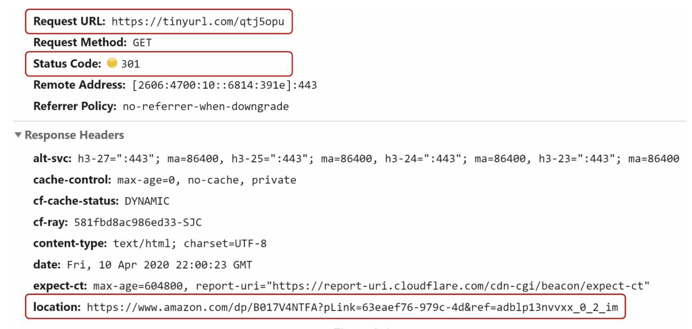

- Detailed communication between clients and servers:

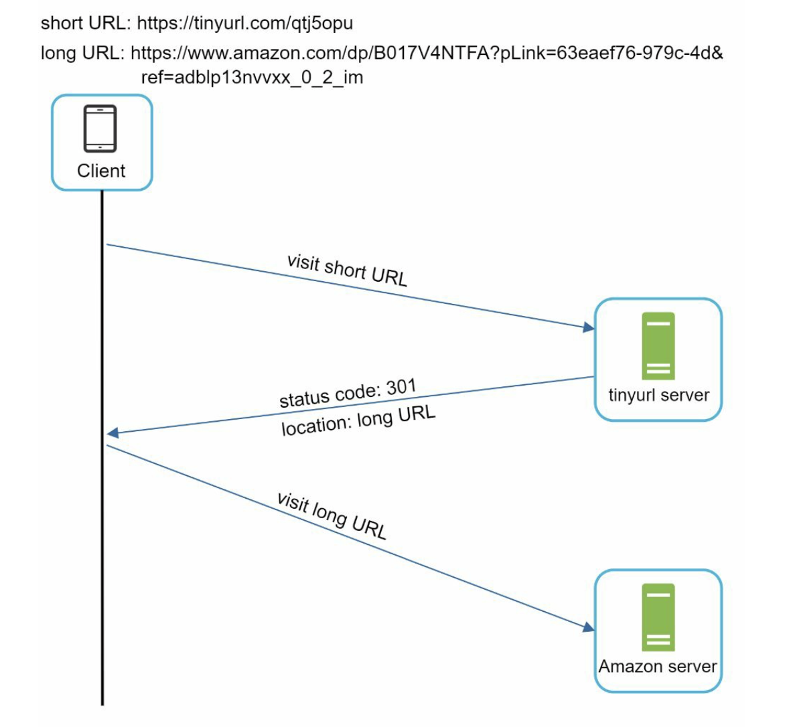

#### 301 redirect
- shows that the requested URL is "permanently" moved to the long URL
- since it's permanently redirected, the browser caches the response, and subsequent requests for the same URL will not be sent to the URL shortening service (requests are redirected to the long URL server directly).

#### 302 redirect
- URL is "temporarily" moved to the long URL, meaning that subsequent requests for the same URL will be sent to the URL shortening service first. Then, they are redirected to the long URL server.

### 301 vs 302
- If the priority is to reduce the server load, use 301 - only the first request of the same URL is sent to URL shortening servers

- If analytics is important, use 302 - it can track click rate and source of the click more easily

- The most intuitive way to implement URL redirecting: use hash tables. Assuming the hash table stores <shortURL, longURL>:
    - Get longURL: longURL = hashTable.get(shortURL)
    - Once you get the longURL, perform the URL redirect.

### URL shortening
- Example short URL: www.tinyurl.com/{hashValue}
- To support ^, we need a hash function fx that maps a long URL to the hashValue

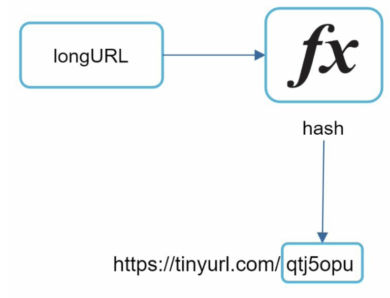

- Each longURL must be hashed to one hashValue.
- Each hashValue can be mapped back to the longURL.

## Step 3: Design Deep Dive
- Deep dive into: data model, hash function, URL shortening, URL redirecting

### Data Model
- In high-level design, everything stored in a hash table. However, this approach is not feasible for real-world systems (memory resources are limited and expensive)
- Better solution: store <shortURL, longURL> mapping in a relational db.

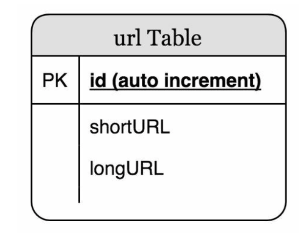

### Hash Function
- Used to hash a long URL to a short URL (aka hashValue)

#### Hash value length
- The hashValue consists of chars from [0-9,a-z,A-Z] = 10 + 26 + 26 = 62 possible chars
- The system must support up to 365 billion URLs (based on back of the envelope estimation)
- Length of hashValue and the corresponding maximal number of URLs it can support:

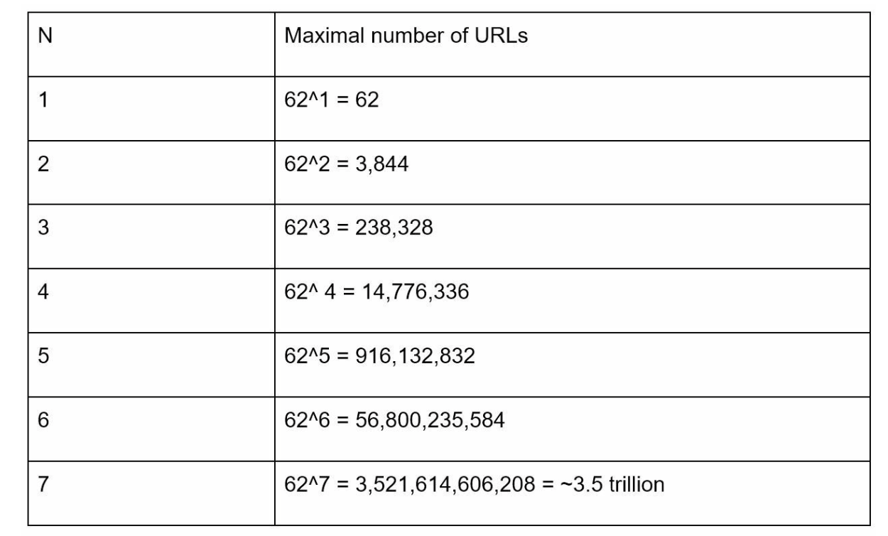

- Looking at the table, length of hashValue = 7 is sufficient

- There are two types of hash functions (long URL -> 7 char string) for a URL shortener
#### Hash + Collision Resolution
- Use well-known hash functions like CRC32, MD5, or SHA-

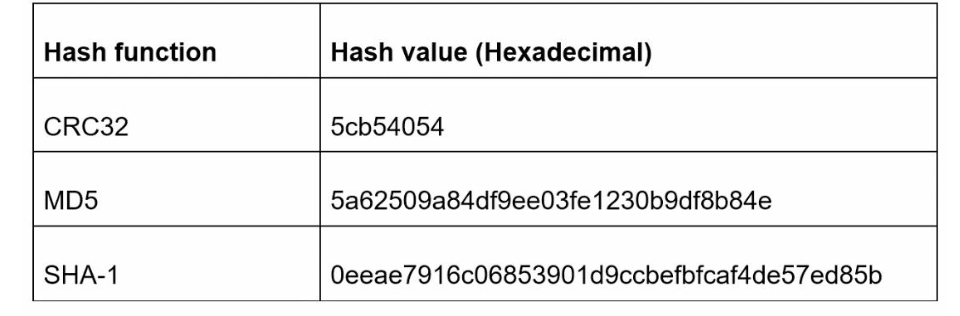

- Even the shortest hash value (CRC32) is too long (> 7 chars)

- To make it shorter, collect the first chars of a hash value
    - May lead to hash collisions
    - To resolve hash collisions, we can recursively append a new predefined string until no more collision is discovered

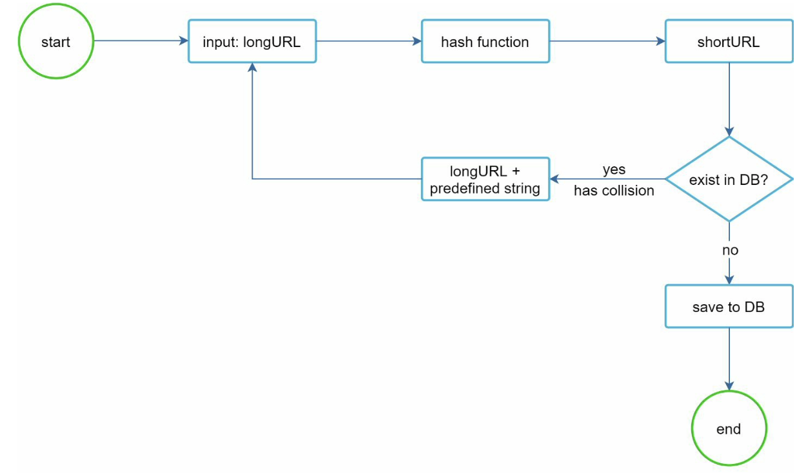

- Can eliminate collision, but is expensive to query the db to check if a shortURL exists for every request. 
- Bloom filters technique can improve performance - bloom filter is a space-efficient probabilistic technique to test if an element is a member of a set

#### Base 62 Conversion
- Helps to convert the same number between its different number representation systems
- There are 62 possible chars for hashValue

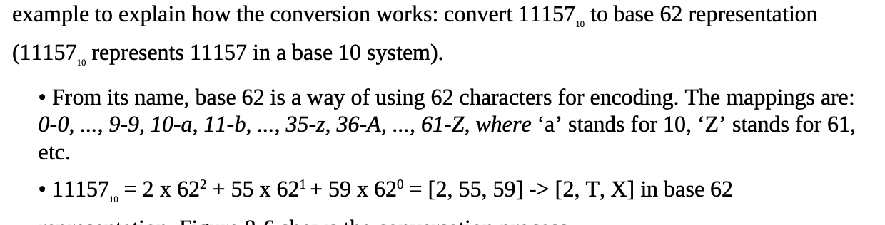

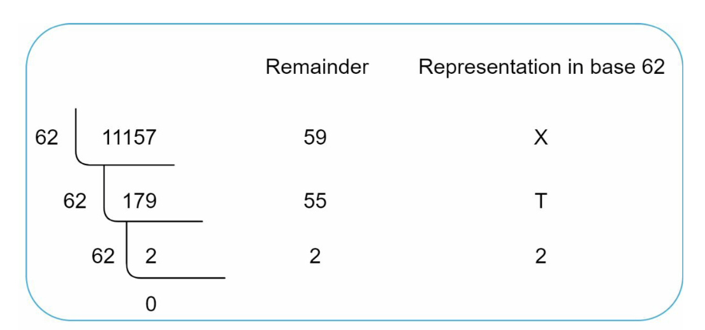
- shortURL is https://tinyurl.com/2TX

#### Comparison of the two approaches
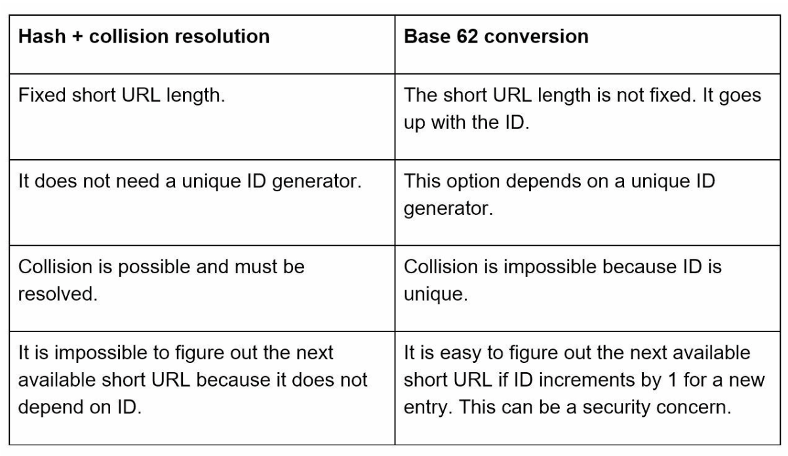

### URL Shortening Deep Dive
- As one of the core pieces of the system, we want the URL shortening flow to be logically simple and functional. Base 62 conversion is used in our design. We build the following diagram to demonstrate the flow:

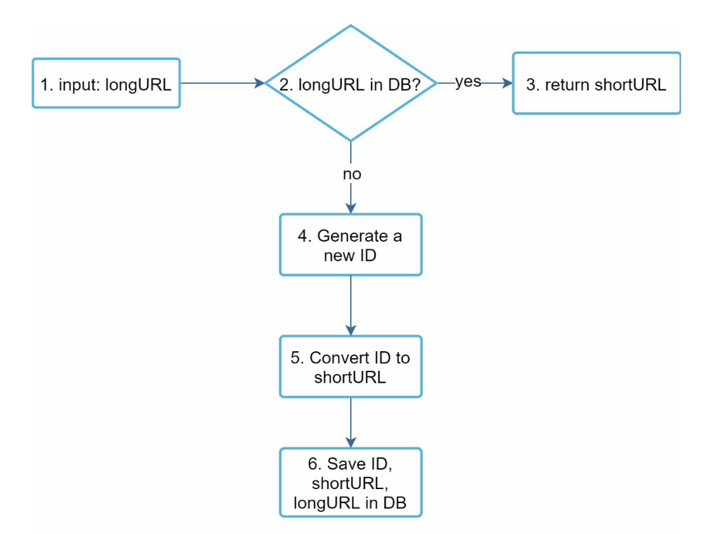

### URL redirecting Deep Dive
- Detailed design of the URL redirecting:

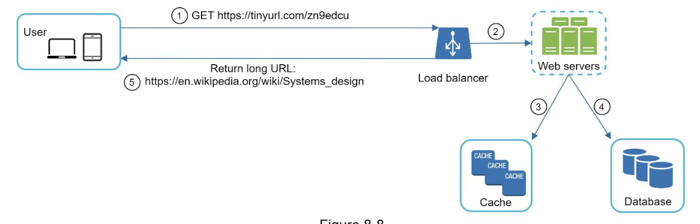

- As reads > writes, <shortURL, longURL> mapping is stored in a cache to improve performance.

- Flow of URL redirecting:
    1. User clicks a short url link (https://tinyurl.com.zn9edcu)
    2. LB forwards the request to web servers
    3. If shortURL is in cache, returns the longURL directly
    4. If not in cache, fetch the longURL from db. If not in db, it is likely user entered an invalid shortURL
    5. The longURL is returned to the user

## Step 4: Wrap Up

- If there is extra time at the end of the interview, additional talking points:
    - Rate limiter - potential security problem is when malicious user send an overwhelmingly large number of URL shortening requests. Rate limiter helps to filter out requests based on IP address or other filtering rules. 
    - Web server scaling - since the web tier is stateless, it is easy to scale the web tier by adding/removing web servers
    - Analytics - data is increasingly important for business success. Integrating an analytics solution to the URL shortener could help to answer important questions (i.e. how many people click on a link? when do they click the link?)
    - Availability, consistency, and reliability - the core concepts of any large system's success

