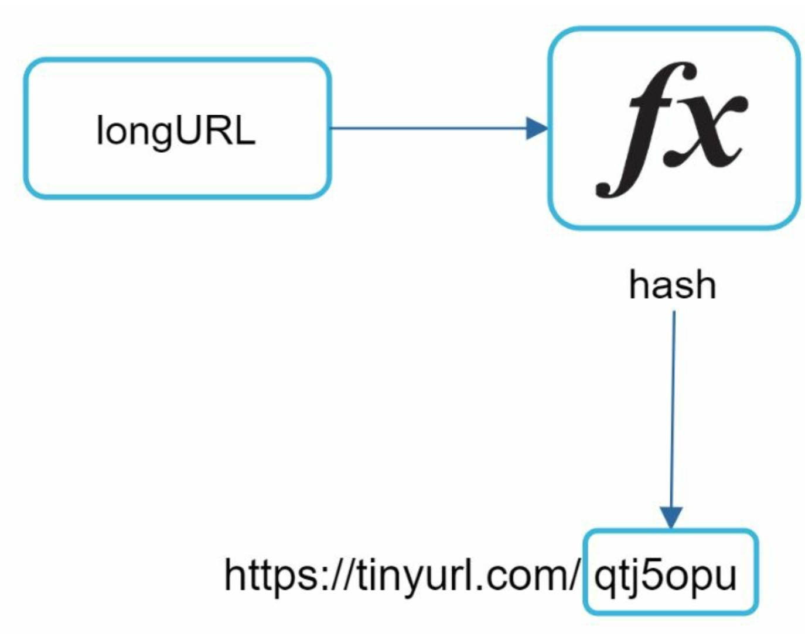
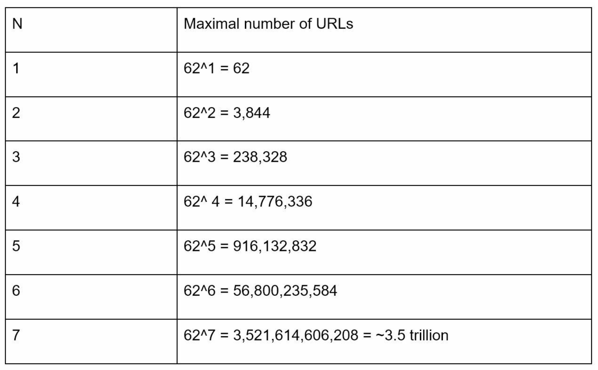
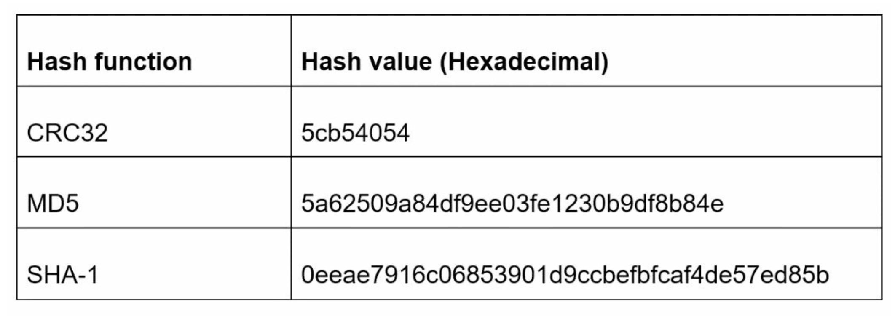
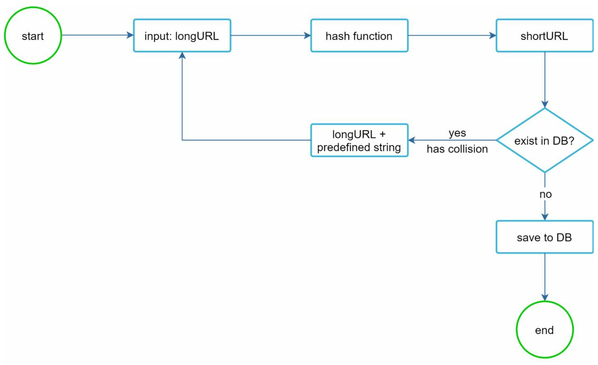
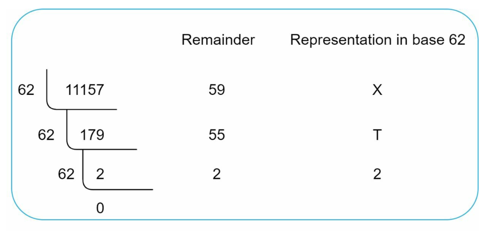
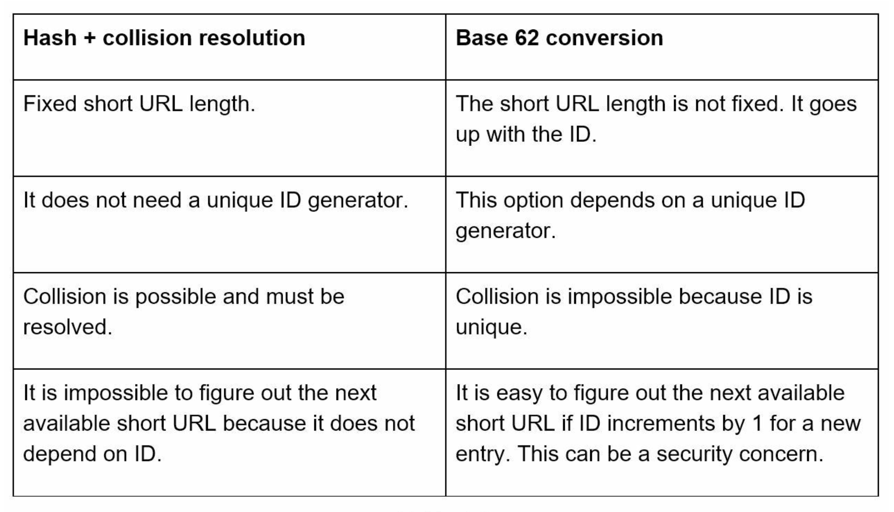

# Chapter 8. Design a URL shortener

### Step 1 - Understand the problem and establish design scope

Requirements:

- URL shortening: given a long URL -> return a much shorter URL
- URL redirecting: given a shorter URL -> redirect to the original URL
- Write operation: 100 million URLs/day
- Write operation per second: 100 million/24/3600 = 1160(approx.)
- Read operation: assuming ration of read operation to write operation is 10:1, read operation per second = 1160 \* 10 = 11,600
- Number of records: assuming the URL shortener service runs for 10 years, we must support 100 million \* 365 \* 10 = 365 billion records
- Length of URL: assuming 100
- Storage requirement over 10 years: 365 billion \* 100 bytes \* 10 years = 365 TB

> Make sure walking through the assumptions and calculations so that both of us and interviewer are on the same page

### Step 2 - Propose high-level design and get buy-in

#### API endpoints

URL shortener needs two API endpoints:

1. URL shortening
   **POST** _api/v1/data/shorten_ - request parameter: {longURL: longURLString} - returns shortURL
2. URL redirecting
   **GET** _api/v1/shortURL_ - returns longURL for HTTP redirection

#### URL shortening

To have a short URL like \*www.tinyurl.com/****{hashValue}***, we must have a hash function that maps a long URL to the *hashValue\*.

    

#### URL redirecting

Once the server receives a tinyurl requests, it changes the short URL to the long URL with 301 redirect.

    

The detailed communication between clients and servers:

    

> 301 redirect vs 302 redirect

- **301 redirect**: the request URL is **_permanently_** moved to the long URL. The browser caches the response, and subsequent requests for the same URL will not be sent to the URL shortening service. The requests are redirected to the long URL server directly.
- **302 redirect**: the URL is **_temporarily_** moved to the long URL. The subsequent requests for the same URL will be sent to the URL shortening service first, then redirected to the long URL server.

If the priority is to reduce the server load, 301 redirect makes sense as only first request of the same URL is sent to URL shortening servers. However, if analytics is important, 302 redirect is a better choice as it can track click rate and source of the click more easily.

The most intuitive way to implement URL redirecting is to use hash tables. Assuming the hash table stores <_shortURL, longURL_> pairs:

- Get longURL: longURL = hashTable.get(shortURL)
- Once you get the longURL, perform the URL redirect

### Step 3 - Design deep dive

#### Data model

Storing everything in a hash table is not feasible because memory resources are limited and expensive. A better option is storing the map in a relational database.

    

#### Hash function

##### Hash value length

The _hashValue_ contains of characters from [0-9, a-z, A-Z], containing 10 + 26 + 26 = 62 possible characters. To figure out the length of hashValue, we need to find smallest _n_ such that 62^n >= 365 billion considering the number of records in our envelope estimation.

    

When n = 7, 62^n = ~3.5 trillion which is more than enough to hold 365 billion URLs, so the length of hashValue is 7.

Two types of hash functions for a URL shortener:

1. Hash + collision resolution
2. Base 62 conversion

#### Hash + collision resolution

Well-known hash functions like CRC32, MD5, or SHA-1 look like below for an example of https://en.wikipedia.org/wiki/Systems_design.

    

The shortest one CRC32 is even longer than 7 characters. The first possible approach to resolve this is to collect the first 7 characters; however, this method can lead to hash collisions. To resolve hash collisions, we can recursively append a new predefined string to the longURL until no more collision is discovered.

    

This method is expensive to query the database to check if a shortURL exists for every request. Bloom filters technique can improve the performance though.
[Bloom filters – Introduction and Implementation, GeeksForGeeks](https://www.geeksforgeeks.org/bloom-filters-introduction-and-python-implementation/)

#### Base 62 conversion

Base conversion helps to convert the same number between its different number representation systems. Base 62 conversion is used because there are 62 possible characters for _hashValue_.

How 11157(base-10) works with bas 62 representation:

    

Thus, the short URL is https://tinyurl.com/2TX

> Comparison of Hash + collision resolution and Base 62 conversion

    

#### URL shortening deep dive

Below is the design using Base 62 conversion:

    

#### URL redirecting deep dive

Detailed design of URL redirecting:

    

### Step 4 - Wrap up

A few additional talking points:

- Rate limiter
- Web server scaling
- Database scaling: replication/sharding
- Analytics: how many people click on a link? When do they click the link? etc.
- Availability, consistency, and reliability
