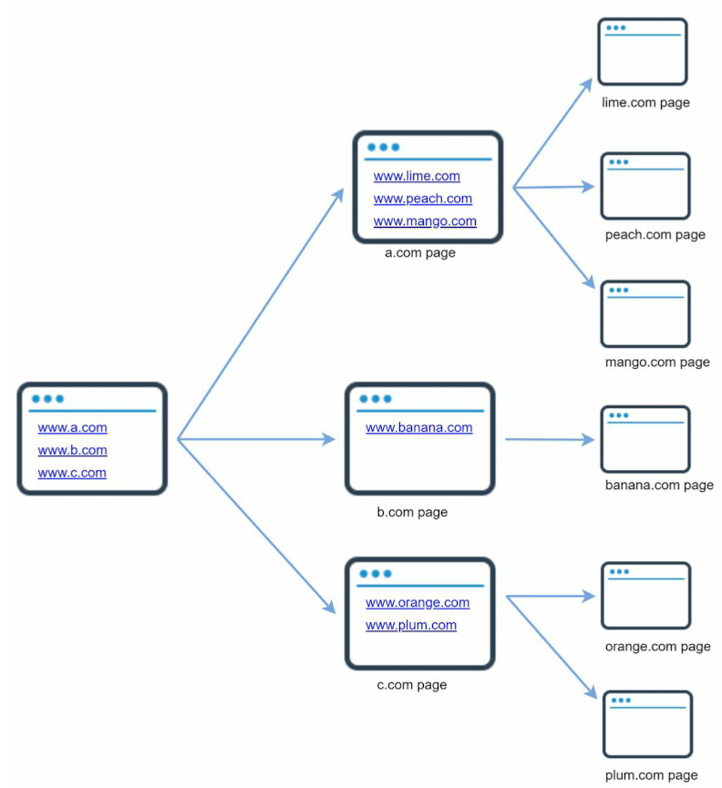
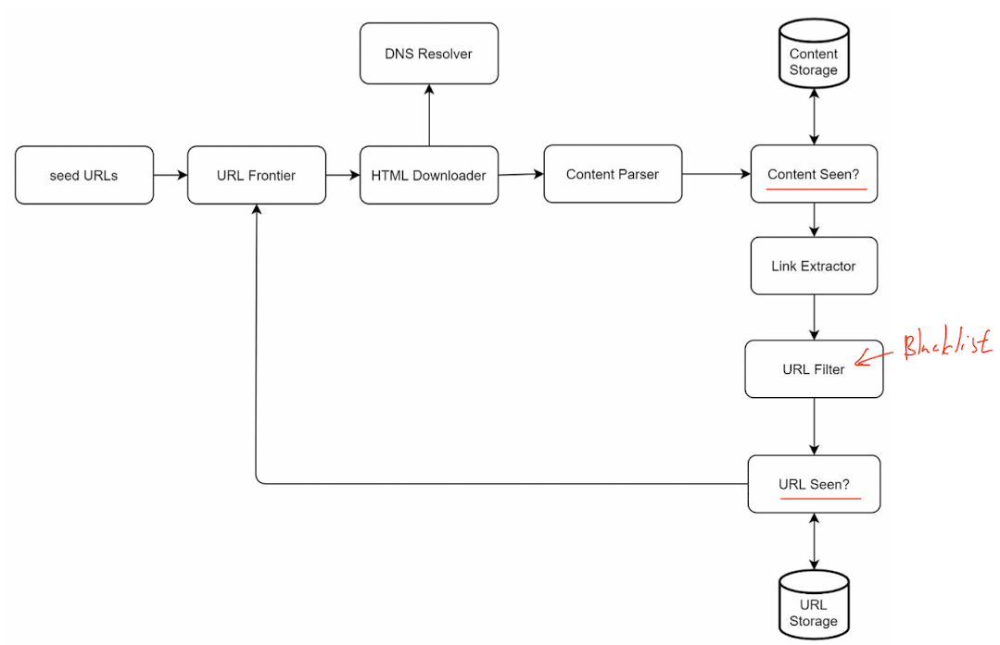
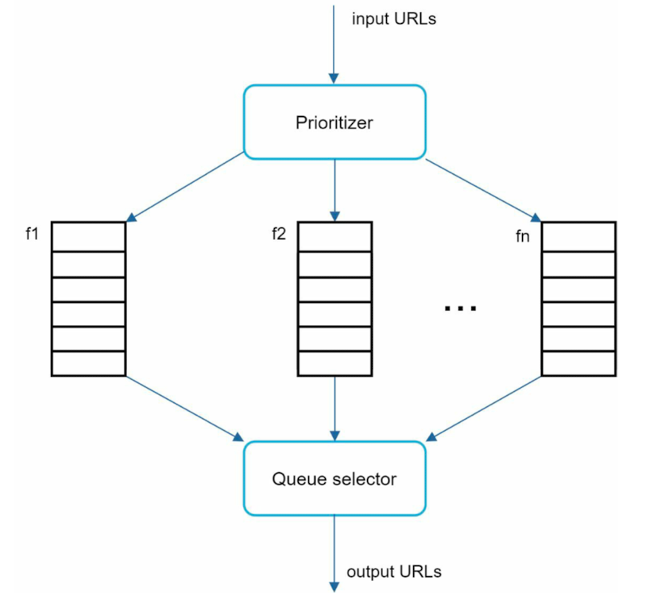
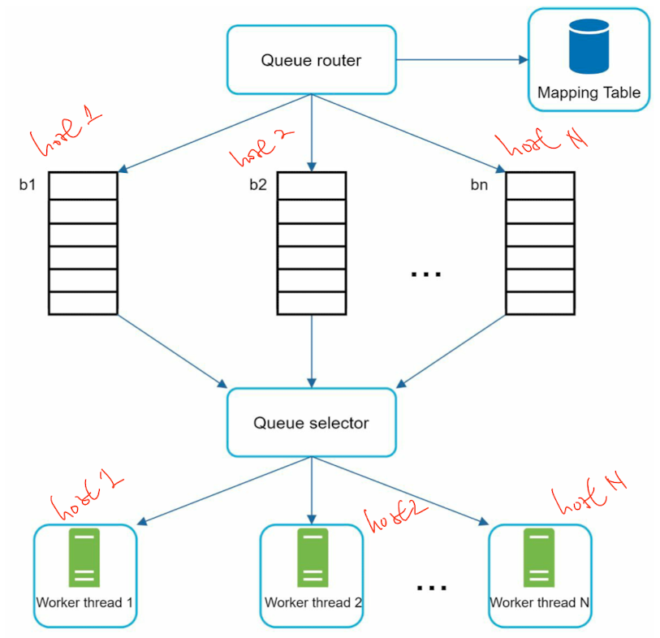
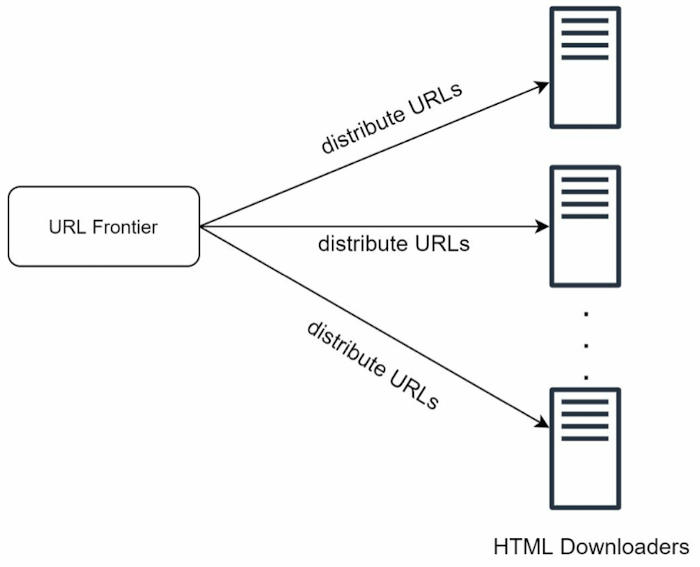
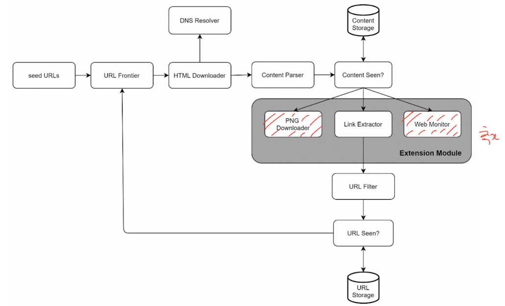

# CHAPTER 9: DESIGN A WEB CRAWLER


## Purposes
- Search engine indexing
- Web archiving
- Web mining

## Algorithm
1. Given a set of URLs, download all the web pages addressed by the URLs.
2. Extract URLs from these web pages
3.  Add new URLs to the list of URLs to be downloaded. Repeat these 3 steps.

## Design Scope
- What is the main purpose of the crawler? -> **Search engine indexing**
- How many web pages does the web crawler collect per month? -> **1 billion pages**
- What content types are included? -> **HTML Only**
- Shall we consider newly added or edited web pages? -> Yes
- Do we need to store HTML pages crawled from the web? -> 5 years
- How do we handle web pages with duplicate content? -> ignore

## Characteristics of a good web crawler
- Scalability
- Robustness
- Politeness
- Extensibility

## Back of the envelope estimation
- Assume: 1,000,000,000 web pages per month
  - QPS: 1,000,000,000 / 30 days / 24 hours / 3600 seconds = ~400 pages per second
  - Peak QPS: 2 * QPS = 800
- Assume: 500k per a web page
  - 1,000,000,000 * 500k = 500TB per month
  - 500TB * 12 months * 5 years = 30 PB

## High-level design


## Design deep dive
### URL frontier
  - Ensure politeness, URL prioritization, and freshness
    - Priority: Randomly choose a queue with a bias towards queues with higher priority.
      - 
    - Politeness: A delay can be added between two download tasks.
      - 
    - Freshness
      - Recrawl based on web pages’ update history.
      - Prioritize URLs and recrawl important pages first and more frequently.
  - Storage for URL Frontier (Hybrid approach between disk and memory)
    - To reduce the cost of reading from the disk and writing to the disk, 
      - we maintain buffers in memory for enqueue/dequeue operations
### HTML Downloader
  - Robots.txt
    - ``` 
      User-agent: Googlebot
      Disallow: /creatorhub/*
      Disallow: /rss/people/*/reviews
      Disallow: /gp/pdp/rss/*/reviews
      Disallow: /gp/cdp/member-reviews/
      Disallow: /gp/aw/cr/ 
      ```
  - Performance optimization
    - Distributed crawl
      - 
    - Cache DNS Resolver
    - Locality -> geographically
    - Short timeout
    - Robustness
      - Consistent Hashing
      - Save crawl states and data
      - Exception handling
      - Data validation
### Extensibility
- 

### URL Filter
- Redundant content
- Spider traps -> Infinite loop
- Data noise -> little or no value contents

## Others
- Server-side rendering
- Filter out unwanted pages <- URL filter
- Database replication and sharding
- Horizontal scaling <- keep servers stateless
- Availability, consistency, and reliability
- Analytics for fine-tuning
