# CHAPTER 9: DESIGN A WEB CRAWLER

A web crawler is known as `A robot or spider`.  
```
웹상의 다양한 정보를 자동으로 검색하고 색인(indexing)하기 위해 검색 엔진을 운영하는 사이트에서 사용하는 소프트웨어.
사람들이 일일이 해당 사이트의 정보를 검색하는 것이 아니라
컴퓨터 프로그램에 미리 입력된 방식에 따라 끊임없이 새로운 웹 페이지를 찾아 종합하고,
찾아진 결과를 이용하여 다시 새로운 정보를 찾아 색인(indexing)을 추가하는 작업을 반복 수행한다.)
```
🙋‍♂️It is a widely used software by search engines to discover new or updated content(a web page, an image, a video, a PDF file, etc) on the web. 

A web crawler ->> collecting a few web pages ->> follows links(on those pages) to collect new content.(Figure 9-1)

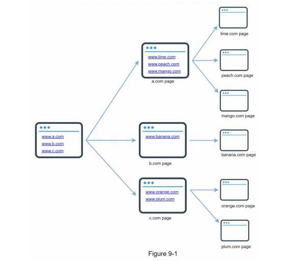

#### 🙋‍♂️**Purpose**
```
• Search engine indexing:
   (A crawler는 웹페이지를 수집해서 검색엔진을 위한 로컬 인덱스를 생성 )
   This is the most common use case. A crawler collects web pages to create a local index for search engines.
    (For example) Googlebot is the web crawler behind the Google search engine.
• Web archiving:
   (future use를 위해 장기보관용 정보를 모으는 과정)
   This is the process of collecting information from the web to preserve data for future uses.
    (For example) many national libraries run crawlers to archive web sites.
     Notable examples are the US Library of Congress [1] and the EU web archive [2].
• Web mining:
   (인터넷에서 유용한 지식 도출)
   The explosive growth of the web presents an unprecedented opportunity for data mining.
   Web mining helps to discover useful knowledge from the internet.
    (For example) top financial firms use crawlers to download shareholder meetings and annual reports to learn key company initiatives.
• Web monitoring.
   (인터넷서 저작원과 사용권 침혜 모니터링)
   The crawlers help to monitor copyright and trademark infringements over the Internet.
    (For example) Digimarc [3] utilizes crawlers to discover pirated works and reports.
```

The `Complexity` of developing a web crawler depends on the scale we intend to support. 
It could be either 
```
   A small school project, which takes only a few hours to complete 
            or 
   A gigantic project that requires continuous improvement from a dedicated engineering team. 
```
Thus, we will explore the scale and features to support below.

## Step 1 - Understand the problem and establish design scope

#### 🙋‍♂️**The basic algorithm of a web crawler:**
```
1. Given a set of URLs, download all the web pages addressed by the URLs.
2. Extract URLs from these web pages
3. Add new URLs to the list of URLs to be downloaded. Repeat these 3 steps.
```

#### - Requirements & Design scope:
```
• Functionalities: 
  The main purpose of the crawler? search engine indexing? data mining? something else?
  How many web pages does the web crawler collect per month?
  What content types? HTML only, PDFs and images.
  Newly added or edited web pages? 
  Do we need to store HTML pages crawled from the web?
  Duplicate content?

• Scalability: 
  The web is very large. There are billions of web pages out there. 
  Web crawling should be extremely efficient using parallelization.
• Robustness:(안정성) 
  The web is full of traps. 
  Bad HTML, unresponsive servers, crashes, malicious links, etc. are all common. 
  The crawler must handle all those edge cases.
• Politeness: 
  The crawler should not make too many requests to a website within a short time interval.
• Extensibility: 
  The system is flexible so that minimal changes are needed to support new content types. 
    For example, if we want to crawl image files in the future, we should not need to redesign the entire system.  
```
### - Back of the envelope estimation

• Assumptions
```
  - Assume 1 billion web pages are downloaded every month.
  - Assume the average web page size is 500k.
  - Assuming data are stored for five years.
```
• Estimations
```
Query per second (QPS) estimate:
  - QPS: 1,000,000,000 / 30 days / 24 hours / 3600 seconds = ~400 pages per second.
  - Peak QPS = 2 * QPS = 800  
  - 1-billion-page x 500k = 500 TB storage per month. 
  - 500 TB * 12 months * 5 years = 30 PB storage.(five-year content)
```

## Step 2 - Propose high-level design and get buy-in(동의)
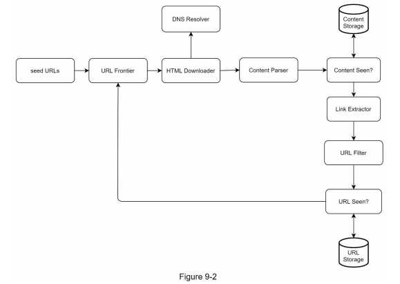

### - Design components and their functionalities
#### Seed URLs
```
 - Seed URLs = a starting point for the crawl process
 - A crawler can utilize to traverse as many links as possible
 - The general strategy
   1. locality : Different countries may have different popular websites.
   2. topics : shopping, sports, healthcare, etc
```
   
#### URL Frontier(미수집 URL 저장소)
```
The component that stores URLs to be downloaded is called the URL Frontier.( as a First-in-First-out (FIFO) queue.)
```
#### HTML Downloader
```
HTML downloader - downloads web pages from the internet. 
(Those URLs are provided by the URL Frontier.)
```

#### DNS Resolver
```
URL -(translated)-> IP address. 
The HTML Downloader calls the DNS Resolver to get the corresponding IP address for the URL. 
  For instance, URL www.wikipedia.org is converted to IP address 198.35.26.96 as of 3/5/2019.
```

#### Content Parser
```
After a web page is downloaded, it must be parsed and validated( 파싱과 검증절차를 거친다.)
   because malformed web pages could provoke problems and waste storage space. 
   Implementing a content parser in a crawl server will slow down the crawling process.
   Thus, the content parser is a separate component.
```

#### Content Seen?(중복 컨텐츠?)
```
- 29% of the web pages are duplicate
- “Content Seen?” data structure to eliminate data redundancy and shorten processing time. 
- To compare two HTML documents, we can compare them character by character. 
- However, this method is slow and time-consuming, especially when billions of web pages are involved. 
- An efficient way to accomplish this task is to compare the hash values of the two web pages.
```
#### Content Storage
```
- a storage system for storing HTML content. 
- The choice of storage system depends on factors such as data type, data size, access frequency, life span, etc. 

Both disk and memory are used.
• Most of the content is stored on disk because the data set is too big to fit in memory.
• Popular content is kept in memory to reduce latency.
```

#### URL Extractor
```
URL Extractor parses and extracts links from HTML pages. ex) Figure 9-3
```
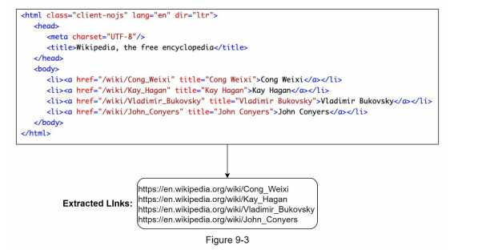

#### URL Filter
```
 - Certain content types,
 - file extensions,
 - error links and
 - URLs in “blacklisted” sites.
```

#### URL Seen? (방문URL)
```
- A data structure: visited before? or  already in the Frontier?
- prevent server load and potential infinite loops.
- Bloom filter and hash table are common techniques to implement the “URL Seen?” component.
```

#### URL Storage
```
URL Storage stores already visited URLs. 
```


### - Web crawler workflow
```
To better explain the workflow step-by-step, sequence numbers are added in the design diagram as shown in Figure 9-4.
```
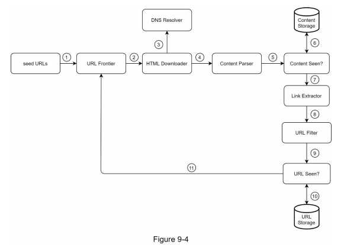
```
Step 1: Add seed URLs to the URL Frontier
Step 2: HTML Downloader fetches a list of URLs from URL Frontier.
Step 3: HTML Downloader gets IP addresses of URLs from DNS resolver and starts downloading.
Step 4: Content Parser parses HTML pages and checks if pages are malformed.
Step 5: After content is parsed and validated, it is passed to the “Content Seen?” component.
Step 6: “Content Seen” component checks if a HTML page is already in the storage.
  • If it is in the storage, this means the same content in a different URL has already been processed.
        In this case, the HTML page is discarded.
  • If it is not in the storage, the system has not processed the same content before. T
        he content is passed to Link Extractor.
Step 7: Link extractor extracts links from HTML pages.
Step 8: Extracted links are passed to the URL filter.
Step 9: After links are filtered, they are passed to the “URL Seen?” component.
Step 10: “URL Seen” component checks if a URL is already in the storage,
        if yes, it is processed before, and nothing needs to be done.
Step 11: If a URL has not been processed before, it is added to the URL Frontier.
```

## Step 3 - Design deep dive
- Depth-first search (DFS) vs Breadth-first search (BFS)
- URL frontier
- HTML Downloader
- Robustness
- Extensibility
- Detect and avoid problematic content

  
### (1) DFS vs BFS

웹 페이지가 노드 역할을 하고 하이퍼링크(URL)가 가장자리(edge) 역할을 하는 방향성 그래프(directed graph)
```
Two common graph traversal algorithms 
- DFS(Not good choice because of the deep depth)
- BFS(Common and is implemented by a first-in-first-out (FIFO)

<Two problems of BFS>
• Most links from the same web page are linked back to the same host.(같은 호스트내 traversal 접근 -> 부하발생)
 example) Figure 9-5, 
   “impolite”: When the crawler tries to download web pages in parallel,  the same host (wikipedia.com) servers will be flooded with requests.

• Standard BFS does not take the priority of a URL into consideration.(no priority)
   The web is large and *NOT* every page has the same level of quality and importance.
   Therefore, we may want to prioritize URLs according to their page ranks, web traffic, update frequency, etc.
```

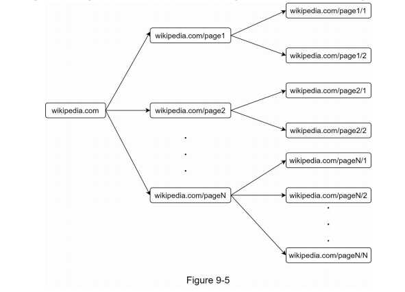
### (2) URL frontier -  URLs storage to be downloaded
```
URL frontier to address these problems(politeness/URL prioritization/freshness)
```
URL frontier에 대한 주목할 만한 몇 가지 논문 내용

##### a. _Politeness_ of the URL frontier
```
The general idea
 - For the same host, downloading one page at a time 
 - For the same host, a delay can be added between two download tasks.
 - Each downloader(worker) thread has a separate FIFO queue and only downloads URLs obtained from that queue(Same host).
   (Downloader(worker) thread의 별도 FIFO queue 통해 주어지는 URL만 다운로드)
Figure 9-6
```
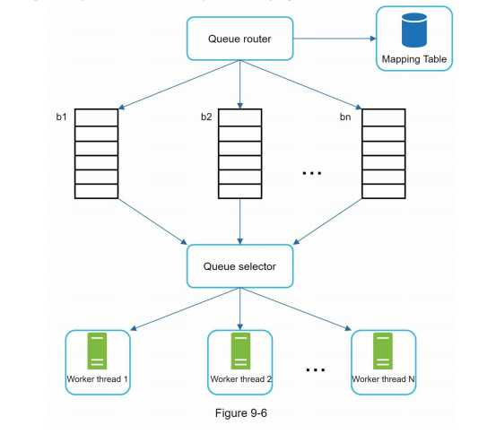
```
• Queue router: It ensures that each queue (b1, b2, … bn) only contains URLs from the same host. 같은 호스트내 URLs은 지정된 queue로만 가도록 보장
• Mapping table: It maps each host to a queue. /mapping정보보관
```
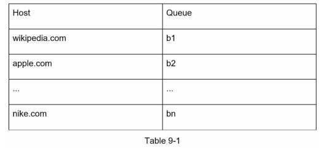
```
• FIFO queues b1, b2 to bn: Each queue contains URLs from the same host. 즉, 같은 호스트내 URLs은 지정된 queue
• Queue selector: Each worker thread is mapped to a FIFO queue, and it only downloads URLs from that queue.
                  The queue selection logic is done by the Queue selector.
                  큐들을 순회하면서 URL을 꺼내서 오직 그 해당 URL을 다운로드하도록 지정된 작업 스레드에 전달   
• Worker thread 1 to N: A worker thread downloads web pages one by one from the same host.(A delay can be added) 다운로드 작업수행
```

##### b. _Priority_ of the URL frontier
```
“Prioritizer” is the component that handles URL prioritization. URL 우선순위 결정 컴포넌트
We prioritize URLs based on usefulness, which can be measured by PageRank [10], website 
traffic, update frequency, etc.
Figure 9-7 

• Prioritizer: It takes URLs as input and computes the priorities. URL입력받아 우선순위계산
• Queue f1 to fn: Each queue has an assigned priority. Queues with high priority are selected with higher probability.
                  우선순위별로 큐 하나씩 할당. 우선순위 up, 선택될 확률 up
• Queue selector: Randomly choose a queue with a bias towards queues with higher priority.임의 큐에서 처리할 URL을 꺼내는 역할
```
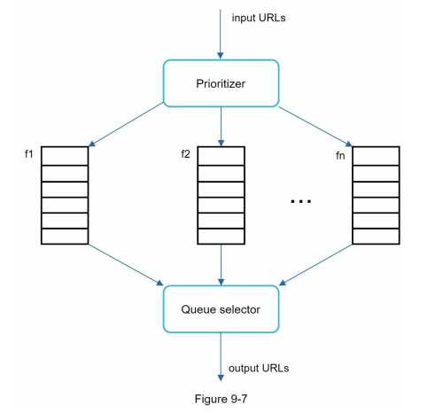

Figure 9-8 URL frontier design
```
• Front queues: manage prioritization
• Back queues: manage politeness
```

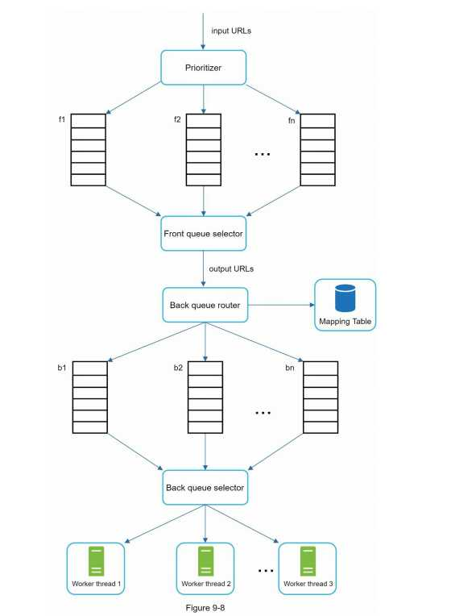


##### c. _Freshness_ of the URL frontier
```
Web pages are constantly being added, deleted, and edited.
A web crawler must periodically recrawl downloaded pages to keep our data set fresh.
But, Recrawl all the URLs is time-consuming and resource intensive.

Strategies for the freshness:
• Recrawl based on web pages’ update history.(변경 이력 활용)
• Prioritize URLs and recrawl important pages first and more frequently.(우선순위를 활용 - 해당건 자주 수집)
```


##### d. Storage for URL Frontier(미수집 URL저장소용 storage)
```
- The majority of URLs are stored on disk
- To reduce the cost of reading from the disk and writing to the disk, we maintain buffers in memory for enqueue/dequeue operations.
  Data in the buffer is periodically written to the disk.
```

### (3) HTML Downloader
```
The HTML Downloader downloads web pages from the internet using the HTTP protocol.
```

#### a. Robots.txt(Robots Exclusion Protocol)
```
Robots.txt(Robots Exclusion Protocol) is a standard to communicate with crawlers. (웹사이트-크롤러간 소통표준)
 - robots.txt file has a page list that crawlers are allowed to download.(파일내 크롤러 수집허용 페이지 목록)
 - To avoid repeat downloads of robots.txt file, we cache the results of the file.(파일 캐시보관하여 반복 다운로드 제거)

example) robots.txt file - https://www.amazon.com/robots.txt.
   Some of the directories like creatorhub are disallowed for Google bot.
   User-agent: Googlebot
   Disallow: /creatorhub/*
   Disallow: /rss/people/*/reviews
   Disallow: /gp/pdp/rss/*/reviews
   Disallow: /gp/cdp/member-reviews/
   Disallow: /gp/aw/cr/
```

#### b. Performance optimization
b-1. Distributed crawl(분산크롤링)
```
- To achieve high performance, crawl jobs are distributed into multiple servers (크롤링의 성능향상위한 서버분산방식)
- Each server runs multiple threads. (여러서버의 여러쓰레드 작업처리)
- The URL space is partitioned into smaller pieces; so, each downloader is responsible for a subset of the URLs.(URL space를 작은 단위화 후 각 서버가 담당)
Figure 9-9
```
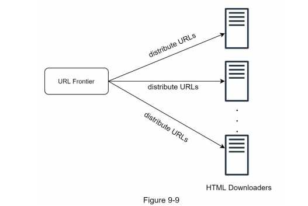

b-2. Cache DNS Resolver
```
Domain name 변환기의 요청/수령 동기화특성에 따른 bottleneck 문제를 DNS 조회를 통한 Domain name/ ip를 캐시에 보관하여 성능 up

DNS Resolver is a bottleneck for crawlers because DNS requests might take time due to the synchronous nature of many DNS interfaces.
DNS response time ranges from 10ms to 200ms.
Once a request to DNS is carried out by a crawler thread, other threads are blocked until the first request is completed.
Maintaining our DNS cache to avoid calling DNS frequently is an effective technique for speed optimization.
Our DNS cache keeps the domain name to IP address mapping and is updated periodically by cron jobs.
```

b-3. Locality
```
Distribute crawl servers geographically. ( 크롤링수행서버 지역별 분산화)
When crawl servers are closer to website hosts, crawlers experience faster download time.(crawl servers, cache, queue, storage, etc.)
```
b-4. Short timeout
```
- To avoid long wait time, a maximal wait time is specified. (타임아웃 대비, delay 허용시간setup 후 초과 시 다음 페이지)
  If a host does not respond within a predefined time, the crawler will stop the job and crawl some other pages.
```

### (4) Robustness(안정성)
```
• Consistent hashing:
   - To distribute loads among downloaders.(다운로더 서버부하 분산)
   A new downloader server can be added or removed using consistent hashing(Chapter 5).
• Save crawl states and data:
   To guard against failures, crawl states and data are written to a storage system. (장애복구 대비, 크롤링 상태/데이터 저장)
   A disrupted crawl can be restarted easily by loading saved states and data.
• Exception handling:
   The crawler must handle exceptions gracefully without crashing the system.(장애 시 정상동작)
• Data validation:
   This is an important measure to prevent system errors. (오류방지위한 데이터검증)
```

### (5) Extensibility
```
(신규 컨텐트 수용 가능토록 유연하게)
The system should be flexible enough to support new content types.
• PNG Downloader module is plugged-in to download PNG files.
• Web Monitor module is added to monitor the web and prevent copyright and trademark infringements.
```
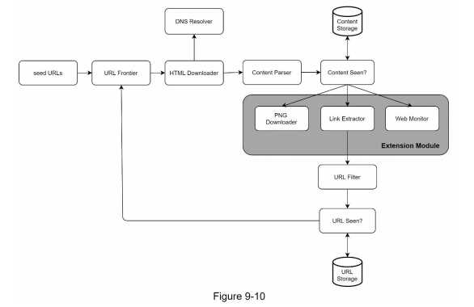


### (6) Detect and avoid problematic content 

```
1. Redundant content(중복컨텐츠 고려)
   As discussed previously, nearly 30% of the web pages are duplicates. Hashes or checksums help to detect duplication [11].
2. Spider traps (무한 루프 함정)
   A spider trap is a web page that causes a crawler in an infinite loop.
   example) www.spidertrapexample.com/foo/bar/foo/bar/foo/bar/…

   - Setting a maximal length for URLs. However, no 만능 솔루션
   - A user can manually verify and identify a spider trap, and either exclude those websites from the crawler or apply some customized URL filters.
3. Data noise
   No value 컨텐츠 제외 i.e. advertisements, code snippets, spam URLs, etc.
```
