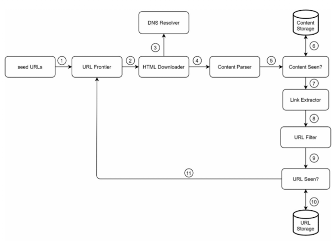
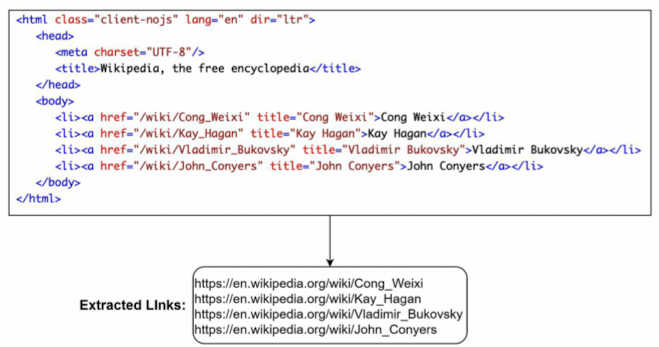
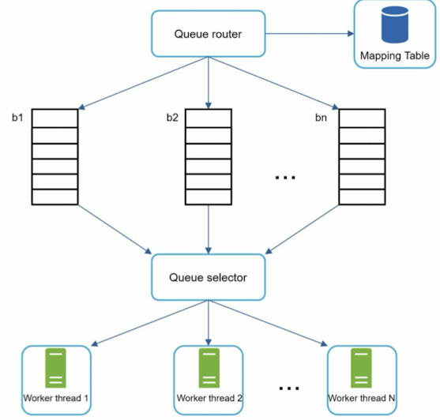
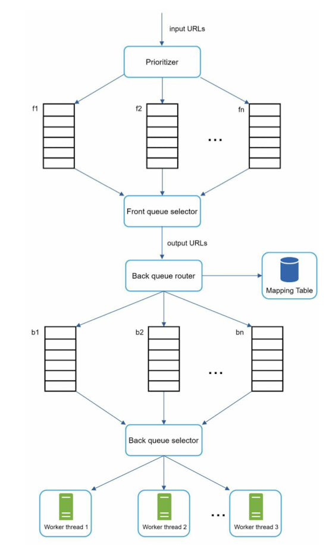

# Chapter 9. Design a web crawler.
- Crawler
    - Search engine indexing: A crawler collects web pages to create a local index for search engines. For example, Googlebot is the web crawler behind the Google search engine.
    - Web archiving
    - Web mining
    - Web monitoring

## Step 1. Understand the problem and establish design scope
- What is the main purpose of the crawler?
- How many web pages does the web crawler collect per month?
- What content types are included?
- Do we need to consider newly added or edited web pages?
- How do we handle web pages with duplicate content?

### Basic functionality
- Scaliability
- Robustness
- Politeness
- Extensibility

### Envelope estimation
- Assume 1 billion web pages are downloaded every month.
- Assume the average web page size is 500k.
- Query per second (QPS)
    ```
    1,000,000,000 / 30 days / 24 hours / 3,600 seconds = ~400 pages per sercond
    ```
- Peak QPS
    ```
    2 * QPS = 800
    ```
- Records: 
    ```
    1 billion page x 500k = 500 TB per month
    ```
- Storage:
    ```
    500 TB * 12 months * 5 yeras = 30 PB
    ```

## Step 2. Propose high-level design and get buy-in


### Components:
- Seed URLs
    - A web crawler uses seed URLs as a starting point.
    - Can be based on country or topic.

- URL Frontier
    - The component that stores URLs to be downloaded is called the URL Frontier.
    - FIFO queue

- DNS Resolver
    - www.wikipedia.org would be converted to IP address 198.35.26.96

- Content parser
    - After a web page is downloaded, it must be parsed and validated because malformed web pages could provoke problems and waste storage space.

- Content Sean?
    - Eliminate data redundancy and shorten processing time.

- Content Storage
    - Stores HTML content

- URL Extractor
    - Parses and extracts links from HTLM pages.
    

- URL Filter
    - Excludes certain content types.

- URL Seen?
    - Is a dta structure that keeps track of URLs that are visited before or already in the Frontier.
    - Bloom filter

- URL Storage

## Step 3. Design deep dive
### DFS vs BFS
- DFS is usually not a good choice because the depth of DFS can be very deep.
- BFS is commonly used by web crawler and is implemented by a FIFO queue.
    - It has two problems:\
        1. Most links from the same web page are linked back to the same host. And this is considered as "impolite".
        2. Standard BFS does not take the priority of a URL into consideration.

### URL Frontier
- The URL frontier is an importatn component to ensure politeness, URL prioritization, and freshness.

#### politeness

- The general idea of enforcing politeness is to download one page at a time from the same host. 
- A delay can be added between two download tasks.
- The politeness constraint is implemented by maintain a mapping from website hostnames to download(worker) threads. And each downloader thread has a separate FIFO queue and only downloads URLs obtained from that queue.

#### Priority
- Prioritize URLs based on usefulness, which can be measured by PageRank, website traffic, and update frequency.


#### Freshness
- Recrawl based on web pages' update history.
- Prioritize URLs and recrawl important pages first and more frequently.

### HTML downloader
- Downloads web pages from the internet using HTTP protocol.

#### Robots.txt
- It specifies what pages crawlers are allowed to download.

#### Performance optimization
1. Distributed crawl
2. Cache DNS resolver
    - DNS resolver is a bottleneck for crawler because DNS requests might take time due to the synchronous nature of many DNS interface. Maintaining our DNS cache to avoid calling DNS frequently is an effective technique for speed optimization.
3. Locality
4. Short timeout

#### Robustness
- Consistent hashing
- Save crawl states and data
- Exception handling
- Data validation

#### Extensibility
- PNG downloader
- Web monitor

#### Detect and avoid problematic content
1. Redundant content
2. Spider traps
    - A spider trap is a web page that causes a crawler in an infinite loop.
3. Data noise
