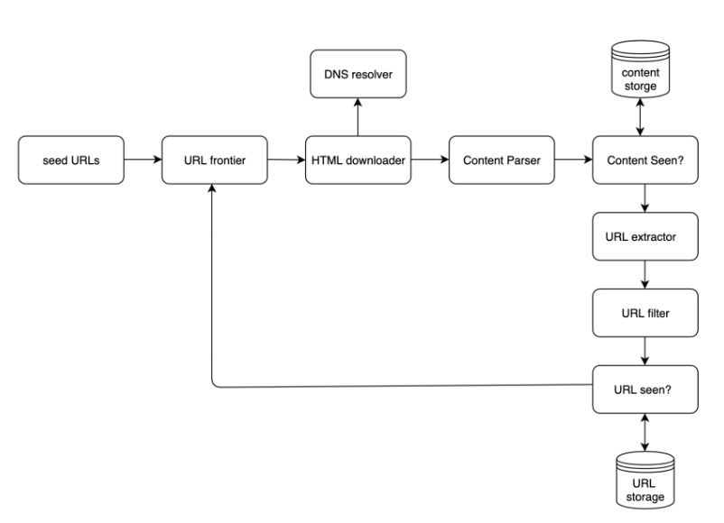
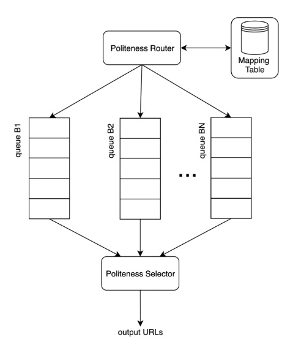
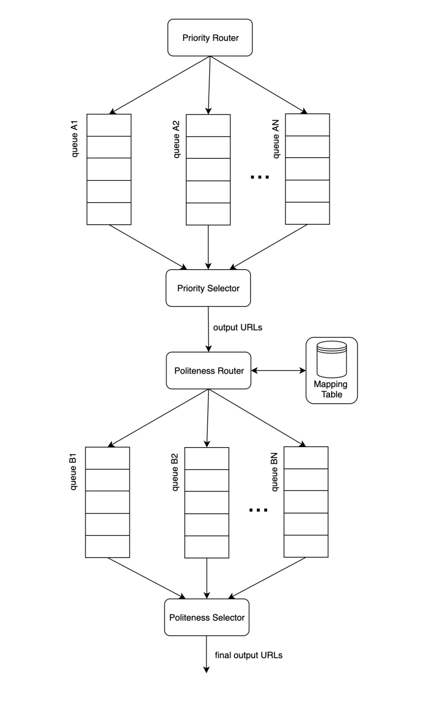

# 9. Design A Web Crawler

- A web crawler is known as a robot or spider.
- It is widely used by search engines to discover new or updated content on the web.
- A web crawler starts by collecting a few web pages and then follows links on those pages to collect new content.
- A crawler is used for many purposes.
  - Search engine indexing:
    - The most common use case
    - A crawler collects web pages to create a local index for search engines.
      - Ex. Googlebot is the web crawler behind the Google search engine.
  - Web archiving:
    - This is the process of collecting information from the web to preserve data for future uses.
    - Ex. Many national libraries run crawlers to archive web sites.
  - Web mining:
    - Web mining helps to discover useful knowledge from the internet.
    - Ex. Top financial firms use crawlers to download shareholder meetings and annual reports to learn key company initiatives.
  - Web monitoring:
    - The crawlers help to monitor copyright and trademark in infringements over the Internet.
    - Ex. Digimarc utilizes crawlers to discover pirated works and reports.

## Step 1. Understand the problem and establish design scope

- The basic algorithm of a web crawler
  1. Given a set of URLs, download all the web pages addressed by the URLs
  2. Extract URLs from these web pages
  3. Add new URLs to the list of URLs to be downloaded. Repeat these 3 steps.

- Design scope:
  - The main purpose of the crawler : Search engine indexing
  - How many web pages does the web crawler collect per month? 1 billion pages
  - What content types are included: HTML only
  - Shall we consider newly added or edited web pages?: Yes
  - Do we need to store HTML pages crawled from the web? Yes, up to 5 years
  - How do we handle web pages with duplicate content?  Duplicated pages should be ignored.

Characteristics of a good web crawler:

- Scalability:
  - There are billions of web pages out there. Web crawling should be extremely efficient using parallelization.
- Robustness:
  - The web is full of traps. The crawler must handle all those edge cases.
- Politeness:
  - The crawler should not make too many requests to a website within a short time interval.
- Extensibility:
  - The system is flexible so that minimal changes are needed to support new content types.

### Back of the envelope estimation

- Assume 1 billion web pages are downloaded every month
- QPS: 1,000,000,000/30 days / 24 hours/ 3600 seconds = ~ 400 pages per second
- Peak QPS = 2 * QPS = 800
- Assume the average web page size is 500k
- 1-billion-page x 500k = 500 TB storage per month
- Assuming data are stored for five years, 500 TB * 12 months * 5 years = 30 PB. A 30 PB storage is needed to store five-year content.

## Step 2. Propose high-level design and get buy-in

### 1. Seed URLs

- A web crawler uses seed URLs as a starting point for the crawl process.
- Seed URL section is an open-ended question. You are not expected to give the perfect answer.

### 2. URL Frontier

- Most modern web crawlers split the crawl state into two:
  - To be downloaded and already downloaded
- URL Frontier
  - The component that stores URLs to be downloaded.
  - First-in-First-out(FIFO) queue

### 3. HTML Downloader

- It downloads web pages from the internet.

### 4. DNS Resolver

- To download a web page, a URL must be translated into an IP address.
- The HTML Downloader calls the DNS REsolver to get the corresponding IP address for the URL

### 5. Content Parser

- After a web page is downloaded, it must be parsed and validated because malformed web pages could provoke problems and waste storage space.

### 6. Content Seen?

- According to online research, 29% of the web pages are duplicated contents.
- 'Content Seen' data structure helps to detect new content previously stored in the system.
- An efficient way to accomplish this task is to compare the hash value of the two web pages.

### 7. Content Storage

- It is a storage for storing HTML content.
- Both disk and memory are used.
  - Most of the content is stored on disk because the data set is too big to fit in memory.
  - Popular content is kept in memory to reduce latency.

### 8. URL Extractor

- URL Extractor parses and extracts links from HTML pages.

### 9. URL Filter

- It excludes certain content types, file extensions, error links and URLs in "blacklisted" sites.

### 10. URL Seen?

- "URL Seen?" is a data structure that keeps track of URLs that are visited before or already in the Frontier.
- Bloom filter and hash table are common techniques to implement the "URL Seen?" component.

### 11. URL Storage

- URL Storage stores already visited URLs

### 12. Web crawler workflow

Workflow step-by-step

- Step 1: Add seed URLs to the URL Frontier.
- Step 2: HTML Downloader fetches a list of URLs from URL Frontier.
- Step 3: HTML Downloader gets IP addresses of URLs from DNS resolver and starts downloading.
- Step 4: Content Parser parses HTML pages and checks if pages are malformed.
- Step 5: After content is parsed and validated, it is passed to the "Content Seen?" component.
- Step 6: "Content Seen" component checks if a HTML page is already in the storage.
- Step 7: Link extractor extracts links from HTML pages.
- Step 8: Extracted links are passed to the URL filter.
- Step 9: After links are filtered, they are passed to the "URL Seen?" component.
- Step 10: "URL Seen" component checks if a URL is already in the storage, if yes, it is processed before, and nothing needs to be done.
- Step 11: If a URL has not been processed before, it is added to the URL Frontier.

## Step 3. Design deep dive

### 1. DFS vs BFS

- DFS
  - It is usually not good choice because the depth of DFS an be very deep.
- BFS
  - It is Commonly used by web crawlers and is implemented by a FIFO queue.
    - In a FIFO queue, URLs are dequeued in the order they are enqueued.
  - It has 2 problems
    - **Impolite** problem
      - Most links from the same web page are linked back to the same host. 
      - Ex. When the crawler tries to download web pages in wikipedia.com in parallel, Wikipedia servers will be flooded with requests.  
    - **Priority** problem
      - Standard BFS does not take the priority of a URL into consideration.
      - We may want to prioritize URLs according to their page ranks, web traffic, update frequency, etc.

### 2. URL frontier

The URL frontier helps to address "Impolite" and "priority" problems.

#### 2.1. Politeness

- Sending too many requests is considered as "impolite".
- The general idea of enforcing politeness is to download one page at a time from the same host.
- 
  - The politeness constraint is implemented by maintain a mapping from website hostnames to download (worker) threads.
  - Each download thread has a separate FIFO queue and only downloads URLs obtained from that queue.
    - Queue router: It ensures that each queue (b1, b2, ..., bn) only contains URLs from the same host.
    - Mapping table: It maps each host to a queue.
    - FIFO queues b1,b2 to bn: Each queue contains URLs from the same host.
    - Queue selector: Each worker thread is mapped to a FIFO queue, and it only downloads URLs from that queue. The queue selection logic is done by the Queue selector.
    - Worker thread 1 to N: A worker thread downloads web pages one by one from the same host. A delay can be added between two download tasks.

#### 2.2. Priority

We prioritize URLs based on usefulness, which can be measured by PageRank, website traffic, update frequency, etc.

- "Prioritizer" is the component that handles URL prioritization.
  - It takes URLs as input and computes the priorities.
- Queue f1 to fn:
  - Queues with high priority are selected with higher probability
- Queue selector:
  - Randomly choose choose a queue with a bias towards queues with higher priority.
- 

#### 2.3. Freshness

- Web pages are constantly being added, deleted, and edited.
- A web crawler must periodically recrawl downloaded pages to keep our data set fresh.
  - Recrawl based on web pages' updates history
  - Prioritize URLs and recrawl important pages first and more frequently.

#### 2.4. Storage for URL Frontier

- The number of URLs in the frontier could be millions.
  - Putting everything in memory is neither durable nor scalable.
  - Keeping everything in the disk is undesirable.
- We adopted a hybrid approach. 
  - The majority of URLs are stored on disk, so the storage space is not a problem.
  - To reduce the cost of reading from the disk and writing to the disk, we maintain buffers in memory for enqueue/dequeue operations.

### 3.HTML Downloader

The HTML Downloader downloads web pages from the internet using the HTTP protocol.

- Robots.txt
  - Robots.txt called Robots Exclusion Protocol, is a standard used by websites to communicate with crawlers.
  - It specifies what pages crawlers are allowed to download.
- To avoid repeat downloads of robots.txt file, we cache the results of the file.
  - The file is downloaded and saved to cache periodically.

#### 3.1. Performance optimization

##### 3.3.1. Distributed crawl

- To achieve high performance
  - crawl jobs are distributed into multiple servers, and each server runs multiple threads.
  - The URL space is partitioned into smaller pieces; so, each downloader is responsible for a subset of the URLs.

##### 3.3.2. Cache DNS Resolver

- DNS Resolver is a bottleneck for crawlers because DNS requests might take time due to the synchronous nature of many DNS interfaces.
  - Once a request to DNS is carried out by a crawler thread, other threads are blocked until the first request is completed.
  - Maintaining our DNS cache to avoid calling DNS frequently is an effective technique for speed optimization.

##### 3.3.3. Locality

Distribute crawl servers geographically.

##### 3.3.4. Short timeout

- Some web servers respond slowly or may not respond at all.
  - To avoid long wait time, a maximal wait time is specified.
  - If a host does not respond within a predefined time, the crawler will stop the job and crawl some other pages.

#### 4. Robustness

- Consistent hashing
  - A new downloader server can be added or removed using consistent hashing.
- Save crawl states and data
  - To guard against failures, crawl states and data are written to a storage system.
- Exception handling
  - The crawler must handle exceptions gracefully without crashing the system.

#### 5. Extensibility

The crawler can be extended by plugging in new modules.

#### 6. Detect and avoid problematic content

##### 6.1. Redundant content

Hashes or checksums help to detect duplication

##### 6.2. Spider traps

A spider trap is a web page that causes a crawler in an infinite loop.

- Such spider traps can be avoided by setting a maximal length of URLs.
- A user can manually verify and identify a spider trap, and either exclude those websites from the crawler or apply some customized URL filters.

##### 6.3. Data noise

- Some of the contents have little or no value. THose contents are not useful for crawlers and should be excluded if possible.

## Step 4. Wrap Up

We still miss many relevant talking points:

- Server-side rendering:
  - If we download and parse web pages directly, we will not be able to retrieve dynamically generated links.
- Filter out unwanted pages:
  - With finite storage capacity and crawl resources, an anti-spam component is beneficial in filtering out low quality and spam pages.
- Database replication and sharding:
  - Techniques like replication and sharding are used to improve the data layer availability, scalability, and reliability.
- Horizontal scaling:
  - For large scale crawl, hundreds or even thousands of servers are needed to perform download tasks.
- Availability, consistency, and reliability:
  - These concepts are at the core of any large system's success.
- Analytics:
  - Collecting and analyzing data are important parts of any system because data is key ingredient for fine-tuning.
  