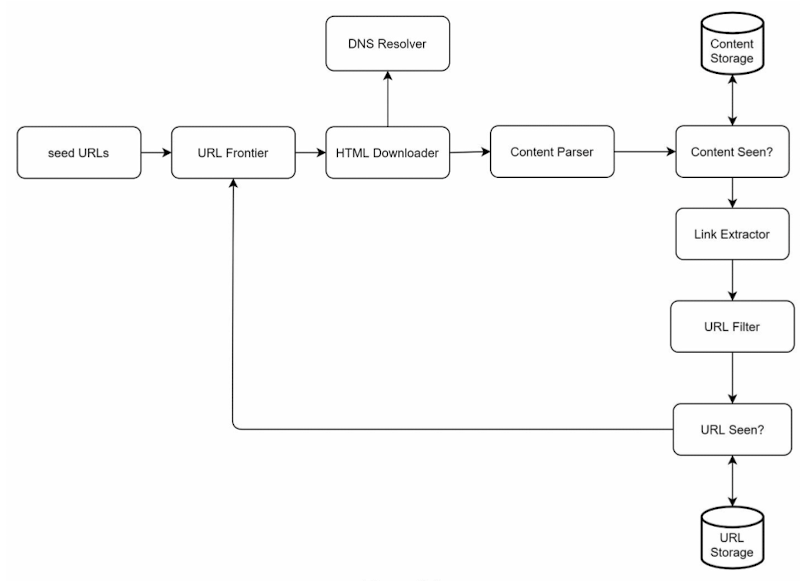
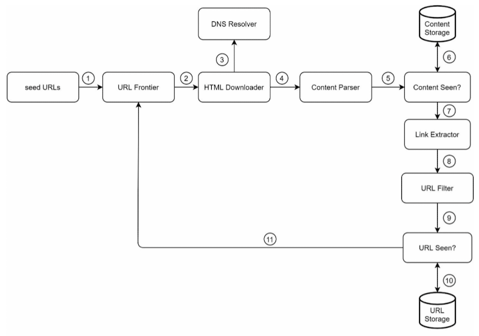
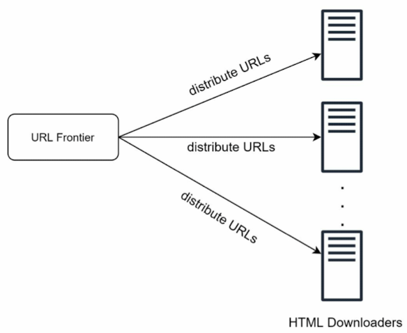
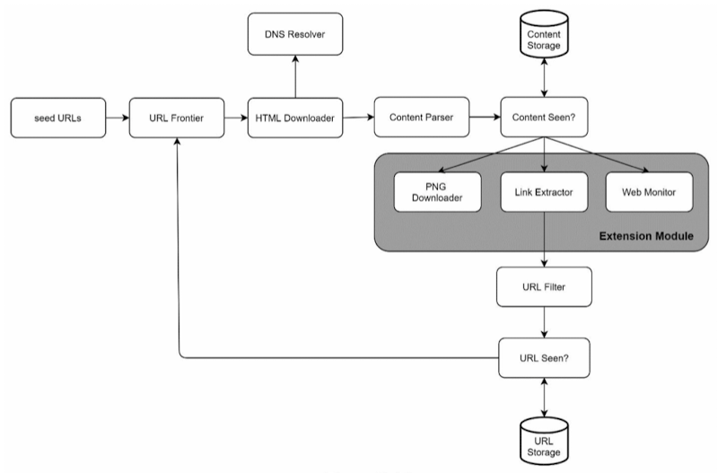

## Step 1 - Understand the problem and establish design scope

- Basic web crawler algorithm :
    1. 주어진 URL에서 web pages 다운로드
    2. 이 웹 페이지에서 URL 추출
    3. 새 URL을 다운로드할 URL 목록에 추가
- 요구사항과 디자인 범위를 이해하기 위해 질문을 던지고 명확히 함
- web crawler의 특성
    1. Scalability : web은 매우 크므로 web crawling은 병렬 처리를 사용하여 매우 효율적이어야 함
    2. Robustness : web은 다양한 문제를 포함하고 있으며, crawler는 이러한 edge cases를 처리해야 함
    3. Politeness
    4. Extensibility

## Back of the envelope estimation

- 월 1 billion의 웹 페이지가 다운로드 됨
- 평균 웹 페이지 크기가 500k
- 필요한 storage는 30PB

## Step 2 - Propose high-level design and get buy-in

### URL Extractor

### Web crawler workflow

## Step 3 - Design deep dive

### BFS vs BFS

- web : web pages와 연결하는 hyperlinks를 갖는 directed graph
- crawl process는 이 그래프를 순회
- DFS는 그 depth가 매우 깊을 수 있기 때문에 일반적으로 적합하지 않음
- BFS는 web crawlers에 의해 자주 사용되며, FIFO queue로 구현됨

### URL frontier

- 아직 다운로드되지 않은 URL을 저장하는 부분과 이미 다운로드된 URL 분리하여 관리

### HTML Downloader

1. Districuted crawl

2. Cache DNS Resolver
3. Locality
4. Short timeout

### Extensibility

## Step 4 - Wrap up

- Good crawler
    1. Scalability
    2. Politeness
    3. Extensibility
    4. Robustness
- Key points
    - Server-side rendering : to capture dynamically generated links, server-side rendering must be performed before page parsing
    - Filter out unwanted pages : essential for discarding low-quality and spam pages to manage storage and resource constraints effectively
    - Database replication and sharding : replication and sharding are crucial for improving the data layer's availability, scalability, and reliability
    - Horizontal scaling : necessary for large-scale crawls, requiring potentially hundreds or thousands of servers while maintaining statelessness
    - Analytics : collecting and analyzing data is a cornerstone for system fine-tuning and optimization
