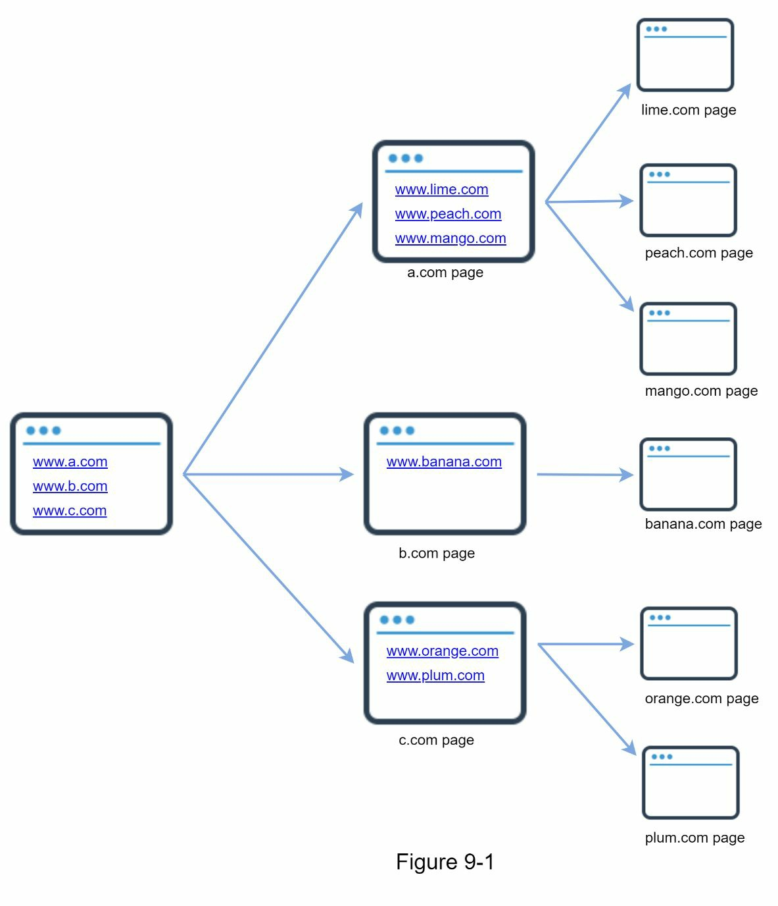
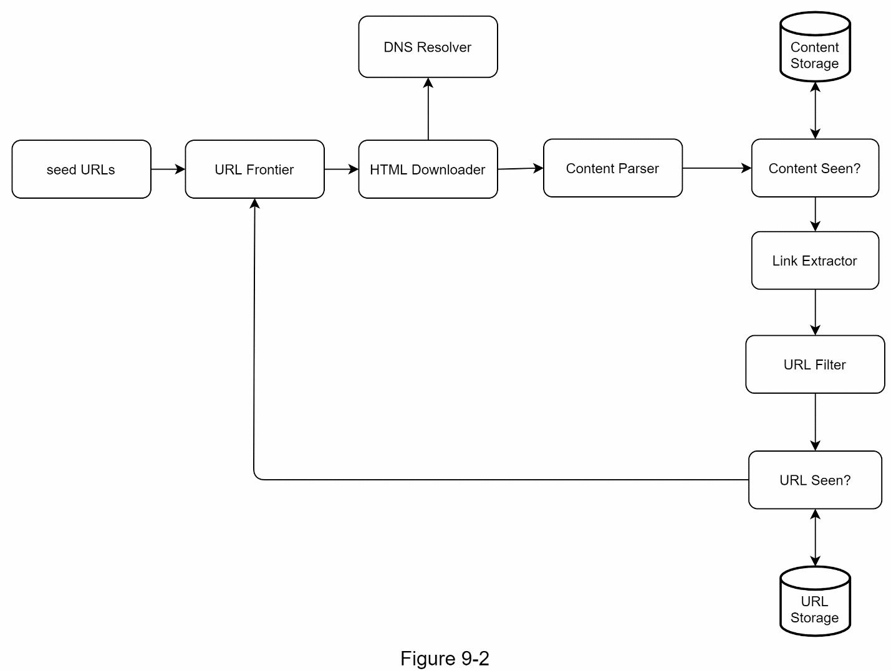
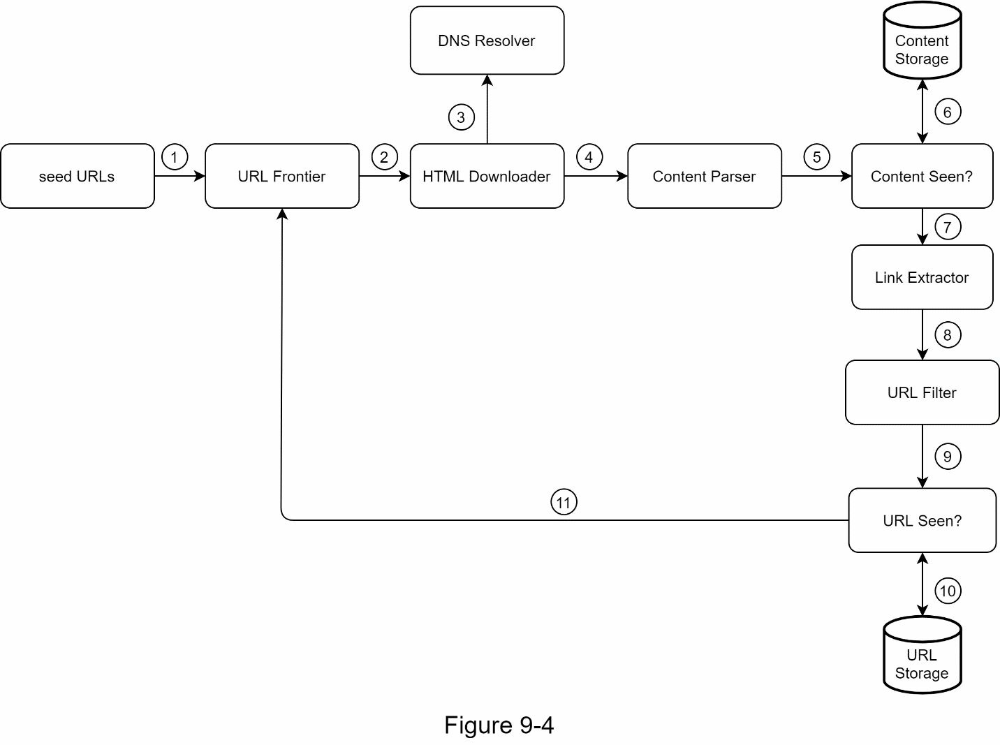
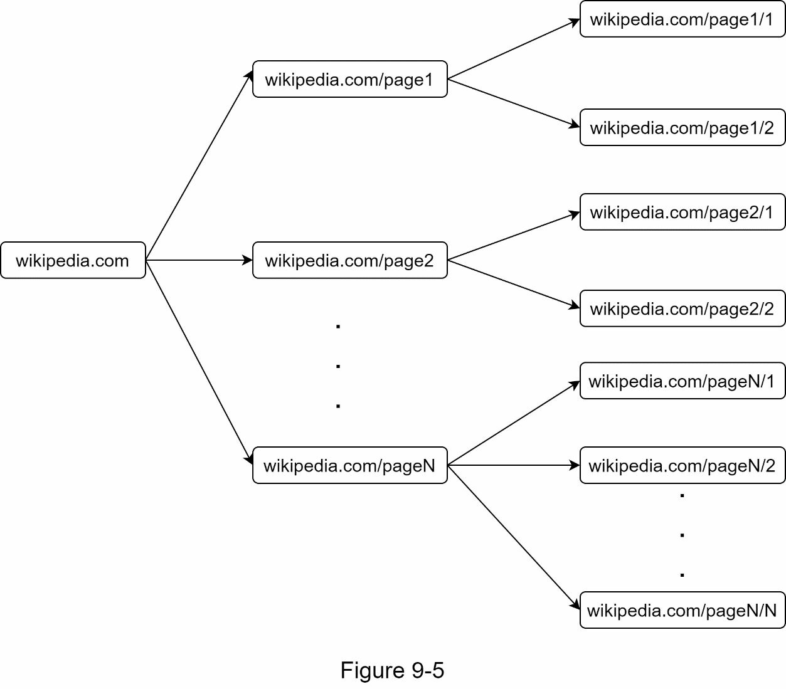
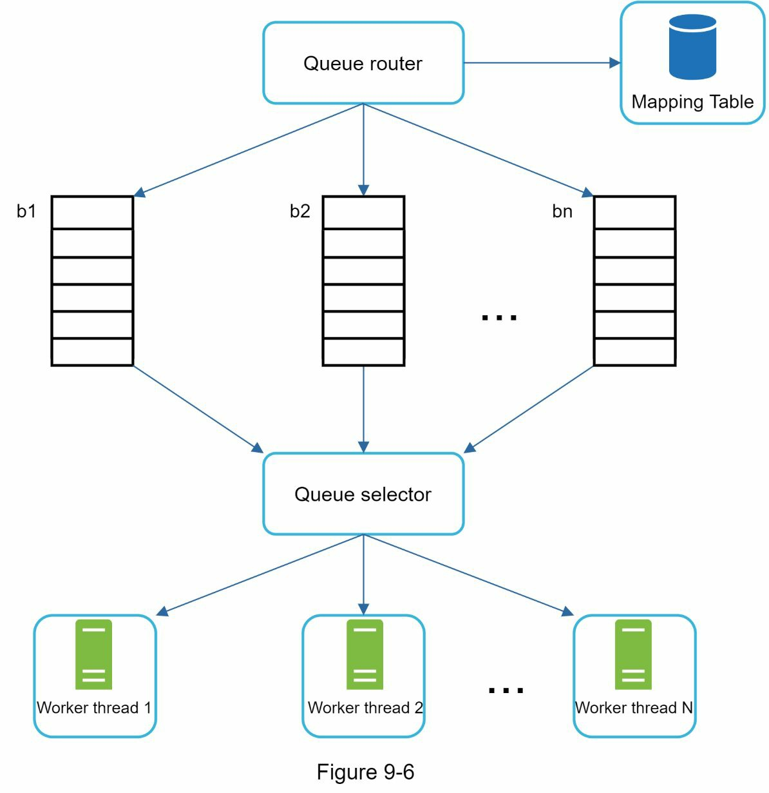
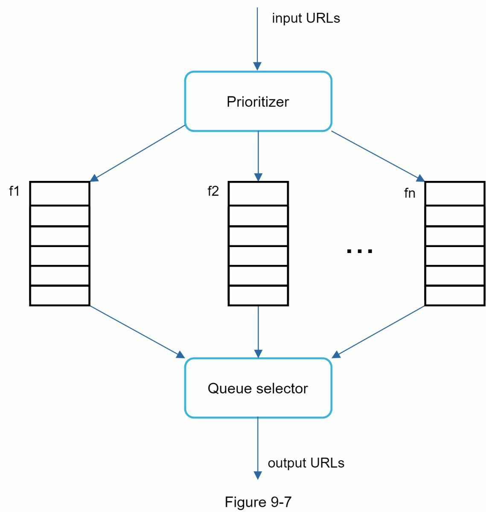
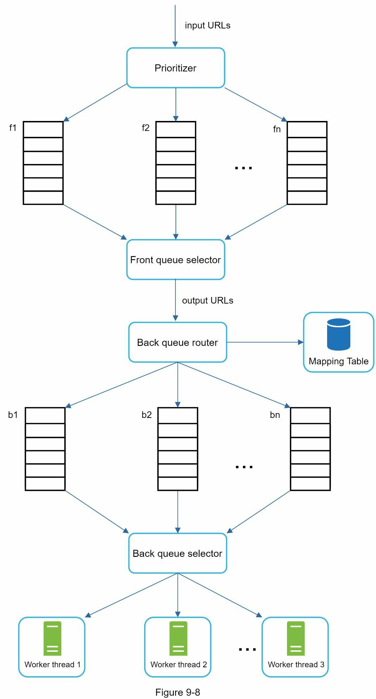
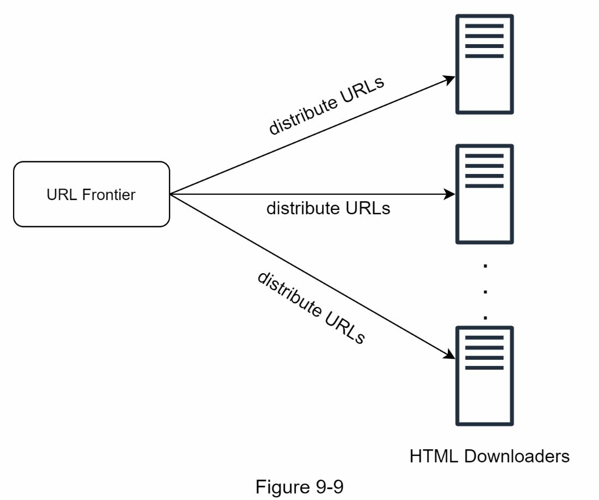
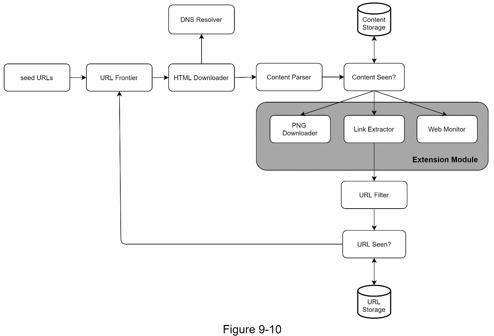

# CHAPTER 9: DESIGN A WEB CRAWLER

- A web crawler is known as a robot or spider. It is widely used by search engines to discover new or updated content on the web. 
- Content can be a web page, an image, a video, a PDF file, etc. 
- It starts by collecting a few web pages(seed URLs/list) and then follows links on those pages to discover new URLs to visit and collect new content.


A crawler is used for many purposes:
- Search engine indexing: The most common use case. A crawler collects web pages to create a local index for search engines. For example, Googlebot is the web crawler behind the Google search engine.
- Web archiving: This is the process of collecting information from the web to preserve data for future uses. For instance, many national libraries run crawlers to archive web sites. Notable examples are the US Library of Congress and the EU web archive.
- Web mining: The explosive growth of the web presents an unprecedented opportunity fordata mining. Web mining helps to discover useful knowledge from the internet. For example, top financial firms use crawlers to download shareholder meetings and annual reports to learn key company initiatives.
- Web monitoring. The crawlers help to monitor copyright and trademark infringements over the Internet. For example, Digimarc utilizes crawlers to discover pirated works and reports.

The complexity of developing a web crawler depends on the scale we intend to support. It could be either a small school project, which takes only a few hours to complete or a gigantic project that requires continuous improvement from a dedicated engineering team. Thus, we will explore the scale and features to support below.

## Step 1 - Understand the problem and establish design scope
The basic algorithm of a web crawler is simple:
1. Given a set of URLs, download all the web pages addressed by the URLs.
2. Extract URLs from these web pages
3. Add new URLs to the list of URLs to be downloaded. Repeat these 3 steps.

Designing a vastly scalable web crawler is an extremely complex task. It is unlikely for anyone to design a massive web crawler within the interview duration. Before jumping into the design, we must ask questions to understand the requirements and establish design scope:

Candidate: What is the **main purpose** of the crawler? Is it used for search engine indexing, data mining, or something else?\
Interviewer: Search engine indexing.\
Candidate: **How many web pages** does the web crawler collect **per month**?\
Interviewer: 1 billion pages.\
Candidate: **What content types** are included? HTML only or other content types such as PDFs and images as well?\
Interviewer: HTML only.\
Candidate: Shall we consider **newly added or edited** web pages?\
Interviewer: Yes, we should consider the newly added or edited web pages.\
Candidate: Do we need to **store HTML pages** crawled from the web?\
Interviewer: Yes, up to 5 years.\
Candidate: How do we **handle** web pages with **duplicate content**?\
Interviewer: Pages with duplicate content should be ignored.

It is important to understand the requirements and clarify ambiguities. Ensure you and your interviewer might not have the same assumptions

it is also important to note down the following characteristics of a good web crawler:
- Scalability: The web is very large. There are billions of web pages out there. Web crawling should be extremely efficient using **parallelization**.
  <details>
  <summary>Parallelization in Web Crawlers</summary>
  Parallelization means dividing the crawling process into multiple tasks that run simultaneously, instead of sequentially. This is essential because the web is vast, with billions of pages, and crawling them one at a time would take too long. By using multiple threads, processes, or machines, a crawler can fetch pages from different websites at the same time.
  </details>
- Robustness: The web is full of traps. Bad HTML, unresponsive servers, crashes, malicious links, etc. are all common. The crawler must handle all those edge cases.
  <details>
  <summary>Examples of Edge Cases for Web Crawlers</summary>

    1. Bad HTML:  
      Some web pages might have incomplete or poorly formatted HTML. The crawler needs to parse such pages without crashing.
    2. Dead Links:
      A hyperlink points to a page that no longer exists or a server that is permanently down. The crawler should recognize and log these errors.
    3. Circular Links:
      A page links to itself or to another page that links back, creating an infinite loop. The crawler must detect and break these loops.
    4. Rate-limited Servers:
      Some websites impose limits on how many requests they accept from a single client in a given time frame. The crawler must adapt its request frequency.
    5. Dynamic or JavaScript-heavy Content:
      Pages that rely on JavaScript to load content may not be fully accessible to basic crawlers.
    6. Malicious Links:
      Some links might direct to harmful content, phishing sites, or even trigger malicious scripts.
  </details>
- Politeness: The crawler should not make too many requests to a website within a short time interval.
  <details>
  <summary> Reasons for Politeness</summary>

  1. Avoiding Server Overload:
  Making too many requests in a short time can slow down or crash the server.
  2. Maintaining Reputation:
  Websites may block crawlers that behave aggressively, making it harder to gather data.
  3. Legal and Ethical Considerations:
  Adhering to politeness guidelines reflects responsible and ethical web crawling practices.
  </details>
- Extensibility: The system is flexible so that minimal changes are needed to support new content types. For example, if we want to crawl image files in the future, we should not need to redesign the entire system.

## Back of the envelope estimation
- Assume 1 billion web pages are downloaded every month.
- QPS: 1,000,000,000 / 30 days / 24 hours / 3600 seconds = ~400 pages per second.
- Peak QPS = 2 * QPS = 800
- Assume the average web page size is 500k.
- `1-billion-page x 500k = 500 TB` storage per month. If you are unclear about digital storage units, go through [“Power of 2” section in Chapter 2 again](../02-back-of-the-envelope-estimation/jun-ch02-back-of-the-envelope-estimation.md#power-of-two).
- Assuming data are stored for five years, `500 TB * 12 months * 5 years = 30 PB` ->  A 30 PB storage is needed to store five-year content.

## Step 2 - Propose high-level design and get buy-in


First, we explore each design component to understand their functionalities. Then, we
examine the crawler workflow step-by-step.

### Seed URLs
A web crawler uses seed URLs as a starting point for the crawl process.
e.g: seed URL can be the home(main) page of the website.
A good seed URL serves as a good starting point that a crawler can utilize to traverse as many links as possible.

1. Locality-Based Selection:

    **Concept:** Choose seeds that reflect popular sites in different geographic regions.
    **Why:** Different countries or regions have unique browsing habits, and their popular websites vary.
    <details>
    <summary>Example</summary>
    For the U.S., include google.com, wikipedia.org, and amazon.com.
    For India, include flipkart.com, irctc.co.in, and timesofindia.com.
    For China, include baidu.com and taobao.com.
    This strategy ensures the crawler accesses regionally significant content.
    </details>
    

2. Topic-Based Selection:

    Concept: Categorize the web into topics like shopping, sports, healthcare, news, and entertainment.
    Why: This helps focus the crawler’s initial exploration on specific domains based on purpose.
    <details>
    <summary>Example</summary>
    Shopping: amazon.com, ebay.com, aliexpress.com.
    Sports: espn.com, skysports.com, nba.com.
    Healthcare: webmd.com, nhs.uk, mayoclinic.org.
    </details>

3. Domain Popularity:

    Concept: Use global or local rankings (e.g., Alexa Top 500 Sites) to select seeds that attract the most traffic.
    Why: High-traffic sites often contain many links to other pages, making them excellent starting points.
    <details>
    <summary>Example</summary>
     Sites like google.com, facebook.com, and wikipedia.org are universally relevant.
    </details>


4. Combination of Strategies:

    Use a mix of locality-based and topic-based seeds to balance regional and subject-matter coverage.
    <details>
    <summary>Example</summary>
    For instance, include bbc.com (news), cnnturk.com (regional news), and espn.com (sports) to create a diversified seed list.
    </details>

### URL Frontier
Most modern web crawlers split the crawl state into two: 
1. to be downloaded: **the URL Frontier**
2. already downloaded.
You can refer to this as a First-in-First-out (FIFO) queue. For [detailed information about the URL Frontier]().

### HTML Downloader
The HTML downloader downloads web pages from the internet. Those URLs are provided by the URL Frontier.

### DNS Resolver
To download a web page, a URL must be translated into an **IP address**. The HTML Downloader calls the <span style="background-color: yellow; color: black">DNS Resolver to get the corresponding IP address for the URL</span>. For instance, URL www.wikipedia.org is converted to IP address 198.35.26.96 as of 3/5/2019.

### Content Parser
After a web page is downloaded, <span style="background-color: yellow; color: black">it must be parsed and validated because malformed web pages could provoke problems and waste storage space.</span> Implementing a content parser in a crawl server will slow down the crawling process. Thus, the content parser is a separate component.

### Content Seen?
Online research reveals that 29% of the web pages are duplicated contents, which may cause the same content to be stored multiple times. We introduce the **Content Seen?** data structure to <span style="background-color: yellow; color: black">eliminate data redundancy and shorten processing time.</span> It helps to detect new content previously stored in the system. An efficient way to accomplish this task is to **compare the hash values of the two web pages.**

### Content Storage
It is a storage system for **storing HTML content**. The choice of storage system depends on factors such as data type, data size, access frequency, life span, etc. Both disk and memory are used.
- Most of the content is **stored on disk** because the **data set is too big** to fit in memory.
- **Popular content** is kept in **memory** to reduce latency.

### URL Extractor
URL Extractor **parses and extracts links** from HTML pages.
```html
<html class="client-nojs" lang="en" dir="ltr">
<head>
  <meta charset="UTF-8" />
  <title>Wikipedia, the free encyclopedia</title>
</head>
<body>
  <li><a href="/wiki/Cong_Weixi" title="Cong Weixi">Cong Weixi</a></li>
  <li><a href="/wiki/Kay_Hagan" title="Kay Hagan">Kay Hagan</a></li>
  <li><a href="/wiki/Vladimir_Bukovsky" title="Vladimir Bukovsky">Vladimir Bukovsky</a></li>
  <li><a href="/wiki/John_Conyers" title="John Conyers">John Conyers</a></li>
</body>
</html>
```
Extracted Links:\
`https://en.wikipedia.org/wiki/Cong_Weixi\
https://en.wikipedia.org/wiki/Kay_Hagan\
https://en.wikipedia.org/wiki/Vladimir_Bukovsky\
https://en.wikipedia.org/wiki/John_Conyers`

Relative paths are converted to absolute URLs by adding the `https://en.wikipedia.org` prefix.

### URL Filter
The URL filter **excludes** certain content types, file extensions, error links and URLs in “blacklisted” sites.

### URL Seen?
“URL Seen?” is a data structure that keeps track of URLs that are visited before or already in the Frontier. “URL Seen?” helps to avoid adding the same URL multiple times as this can increase server load and cause potential infinite loops.
Bloom filter and hash table are common techniques to implement the “URL Seen?” component.

### URL Storage
URL Storage stores **already visited URLs**. 

Next, we put them together to explain the workflow.

### Web crawler workflow

Step 1: Add seed URLs to the URL Frontier\
Step 2: HTML Downloader fetches a list of URLs from URL Frontier.\
Step 3: HTML Downloader gets IP addresses of URLs from DNS resolver and starts downloading.\
Step 4: Content Parser parses HTML pages and checks if pages are malformed.\
Step 5: After content is parsed and validated, it is passed to the “Content Seen?” component.\
Step 6: “Content Seen” component checks if a HTML page is already in the storage.\
- If it is in the storage, this means the same content in a different URL has already been processed. In this case, the HTML page is discarded.
- If it is not in the storage, the system has not processed the same content before. The content is passed to Link Extractor.

Step 7: Link extractor extracts links from HTML pages.\
Step 8: Extracted links are passed to the URL filter.\
Step 9: After links are filtered, they are passed to the “URL Seen?” component.\
Step 10: “URL Seen” component checks if a URL is already in the storage, if yes, it is processed before, and nothing needs to be done.\
Step 11: If a URL has not been processed before, it is added to the URL Frontier.

## Step 3 - Design deep dive
Next, we will discuss the most important building components and techniques in depth:
- [Depth-first search (DFS) vs Breadth-first search (BFS)](#dfs-vs-bfs)
- [URL frontier](#url-frontier-1)
- [HTML Downloader](#html-downloader-1)
- [Robustness](#robustness)
- [Extensibility](#extensibility)
- [Detect and avoid problematic content](#detect-and-avoid-problematic-content)

### DFS vs BFS
Web crawling can be seen as traversing a graph where pages are nodes and links are edges. While DFS (Depth-First Search) dives deeply into one branch, it’s not ideal because the web’s depth can be excessive.

BFS (Breadth-First Search) is preferred and uses a FIFO queue to process URLs in the order they’re discovered. However, BFS has limitations:

1. Host Overloading: Many links from the same page often point to the same host, leading to excessive requests to one server
  
    <details>
    all the links point to pages within the same domain, wikipedia.com, meaning they are internal links (links leading to pages hosted on the same server. If the crawler follows these links without restrictions and attempts to fetch pages in parallel, it may send an overwhelming number of requests to Wikipedia’s servers within a short period.
    </details>
2. No Prioritization: Standard BFS treats all URLs equally, ignoring factors like page rank, traffic, or update frequency, which could help prioritize important pages.
### URL frontier
URL frontier helps to address these problems. A URL frontier is a data structure that stores URLs to be downloaded. The URL frontier is an important component to ensure politeness, URL prioritization, and freshness.
#### Politeness
Generally, a web crawler should avoid sending too many requests to the same hosting server within a short period.

1. To enforce politeness:
    - Each website hostname (like example.com or wikipedia.org) is assigned to a specific queue.
    - These queues are mapped to worker threads (programs that handle the downloading).

2. Each queue stores URLs (links) from a specific host. For example:
    - Queue b1 might handle `wikipedia.com`.
    - Queue b2 might handle `example.com`.

    This setup ensures that:

    URLs from the same host stay together in one queue.
    Only one worker thread processes a queue at a time, downloading URLs sequentially from the same host.


- Queue router: It ensures that each queue `(b1, b2, … bn)` only contains URLs from the **same host**.
- Mapping table: It maps each host to a queue.

  | Host           | Queue |
  |----------------|-------|
  | wikipedia.com  | b1    |
  | apple.com      | b2    |
  | ...            | ...   |
  | nike.com       | bn    |

- FIFO queues `b1`, `b2` to `bn`: Each queue contains URLs from the same host.
- Queue selector: Each worker thread is mapped to a FIFO queue, and it only downloads URLs from that queue. The queue selection logic is done by the Queue selector.
- Worker thread `1` to `N`. A worker thread downloads web pages one by one from the same host. A delay can be added between two download tasks.

#### Priority
Not all web pages are equally important when crawling them. For example:
- A post on a random forum discussing Apple is less important than the official Apple homepage.
- Even though both pages mention "Apple," the homepage is more relevant and should be crawled first.

To decide which URLs to prioritize, certain metrics are used, such as:

1. PageRank: A measure of a page's importance based on the number and quality of links to it.
2. Website Traffic: Pages with higher visitor counts are considered more useful.
3. Update Frequency: Pages updated regularly may be prioritized to ensure fresh content.

The **Prioritizer** is the system component responsible for ranking URLs by their importance or usefulness. This ensures that the crawler focuses on high-value pages first.


- Prioritizer: It takes URLs as input and computes the priorities.
- Queue f1 to fn: Each queue has an assigned priority. Queues with high priority are selected with higher probability.
- Queue selector: Randomly choose a queue with a bias towards queues with higher priority.

Figure 9-8 presents the URL frontier design, and it contains two modules:
1. Front queues: manage prioritization
2. Back queues: manage politeness



#### Freshness
Web pages are constantly being added, deleted, and edited. A web crawler must periodically
recrawl downloaded pages to keep our data set fresh. Recrawl all the URLs is time-
consuming and resource intensive. Few strategies to optimize freshness are listed as follows:
- Recrawl based on web pages’ update history.
- Prioritize URLs and recrawl important pages first and more frequently.

### HTML Downloader
The HTML Downloader downloads web pages from the internet using the HTTP protocol.

#### Robots.txt
It specifies what pages crawlers are allowed to download. Before attempting to crawl a web site, a crawler should check its corresponding robots.txt first and follow its rules.

To avoid repeat downloads of robots.txt file, we cache the results of the file. `https://www.amazon.com/robots.txt`. Some of the directories like creatorhub are disallowed for Google bot.
```
User-agent: Googlebot
Disallow: /creatorhub/*
Disallow: /rss/people/*/reviews
Disallow: /gp/pdp/rss/*/reviews
Disallow: /gp/cdp/mem
```
#### Performance optimization
Besides robots.txt, performance optimization is another important concept

1. **Distributed crawl**\
To achieve high performance, crawl jobs are distributed into multiple servers, and each server runs multiple threads. The URL space is partitioned into smaller pieces. For example, if there are 1 million URLs and 10 servers, each server might get 100,000 URLs.; so, each downloader is responsible for a subset of the URLs.
    <details>
      <summary>example</summary>
      Imagine you need to crawl 1 million web pages. Instead of one computer handling all of them, you divide the task among 10 servers, and each server processes 100,000 URLs using multiple threads simultaneously.
    </details>

    
2. **Cache DNS Resolver**
    1. What is DNS Resolver?\
    A DNS resolver translates a domain name (e.g., example.com) into an IP address (e.g., 192.168.1.1), which is required to connect to a website. This translation process involves sending a request to a DNS server, which takes some time to respond.

  2. Why is DNS a Bottleneck?
      - Each DNS request can take between 10ms to 200ms, depending on the server's response time and network latency.
      - Many DNS systems are synchronous, meaning only one DNS lookup can happen at a time. If a thread is waiting for a DNS response, other threads might be blocked, reducing the crawler's performance.

  3.  Solution: Use a DNS Cache
      - Instead of making a new DNS request for every domain name, the crawler maintains a local cache.
      - This cache stores previously resolved domain-to-IP mappings. For example:
        - If example.com was resolved to 192.168.1.1, this mapping is saved in the cache.
        - The next time example.com is needed, the crawler retrieves the IP from the cache instead of making a new DNS request.
      - This significantly reduces the time required for repeated DNS lookups.
3. **Locality**\
Distribute crawl servers geographically. When crawl servers are closer to website hosts,
crawlers experience faster download time. Design locality applies to most of the system
components: crawl servers, cache, queue, storage, etc.
4. **Short timeout**\
Some web servers respond slowly or may not respond at all. To avoid long wait time, a
maximal wait time is specified. If a host does not respond within a predefined time, the
crawler will stop the job and crawl some other pages.
### Robustness
Besides performance optimization, robustness is also an important consideration. We present a few approaches to improve the system robustness:
- Consistent hashing: This helps to distribute loads among downloaders. A new downloader server can be added or removed using consistent hashing. [Chapter 5: Design consistent hashing](../05-design-consistent-hashing/jun-ch05-design-consistent-hashing.md) for more details.
- Save crawl states and data: To guard against failures, crawl states and data are written to a storage system. A disrupted crawl can be restarted easily by loading saved states and data.
- Exception handling: Errors are inevitable and common in a large-scale system. Thecrawler must handle exceptions gracefully without crashing the system.
- Data validation: This is an important measure to prevent system errors.
### Extensibility
As almost every system evolves, one of the design goals is to make the system flexible enough to support new content types. The crawler can be extended by plugging in new modules.

- PNG Downloader module is plugged-in to download PNG files.
- Web Monitor module is added to monitor the web and prevent copyright and trademark infringements.
### Detect and avoid problematic content
The detection and prevention of redundant, meaningless, or harmful content.
#### 1. Redundant content
As discussed previously, nearly 30% of the web pages are duplicates. Hashes or checksums help to detect duplication.
#### 2. Spider traps
A spider trap is a web page that causes a crawler in an **infinite loop**. For instance, an infinite deep directory structure is listed as follows:
`www.spidertrapexample.com/foo/bar/foo/bar/foo/bar/…`
Such spider traps can be avoided by setting a maximal length for URLs. However, no one-size-fits-all solution exists to detect spider traps. Websites containing spider traps are easy to identify due to an unusually large number of web pages discovered on such websites. It is hard to develop automatic algorithms to avoid spider traps; however, a user can manually verify and identify a spider trap, and either exclude those websites from the crawler or apply some customized URL filters.
#### 3. Data noise
Some of the contents have little or no value, such as **advertisements**, **code snippets**, **spam URLs**, etc. Those contents are not useful for crawlers and should be excluded if possible.

## Step 4 - Wrap up
In this chapter, we first discussed the characteristics of a good crawler: scalability, politeness, extensibility, and robustness. Then, we proposed a design and discussed key components.
Building a scalable web crawler is not a trivial task because the web is enormously large and full of traps. Even though we have covered many topics, we still miss many relevant talking points:
- Server-side rendering: Numerous websites use scripts like JavaScript, AJAX, etc to generate links on the fly. If we download and parse web pages directly, we will not be able to retrieve dynamically generated links. To solve this problem, we perform server-side rendering (also called dynamic rendering) first before parsing a page.
- Filter out unwanted pages: With finite storage capacity and crawl resources, an anti-spam component is beneficial in filtering out low quality and spam pages.
- Database replication and sharding: Techniques like replication and sharding are used to improve the data layer availability, scalability, and reliability.
- Horizontal scaling: For large scale crawl, hundreds or even thousands of servers are needed to perform download tasks. The key is to keep servers stateless.
- Availability, consistency, and reliability: These concepts are at the core of any large system’s success. We discussed these concepts in detail in [Chapter 1](../01-scale-from-zero-to-millions-of-users/hyungjun-ch01-scale-from-zero-to-millions-of-users.md). Refresh your memory on these topics.
- Analytics: Collecting and analyzing data are important parts of any system because data is key ingredient for fine-tuning.