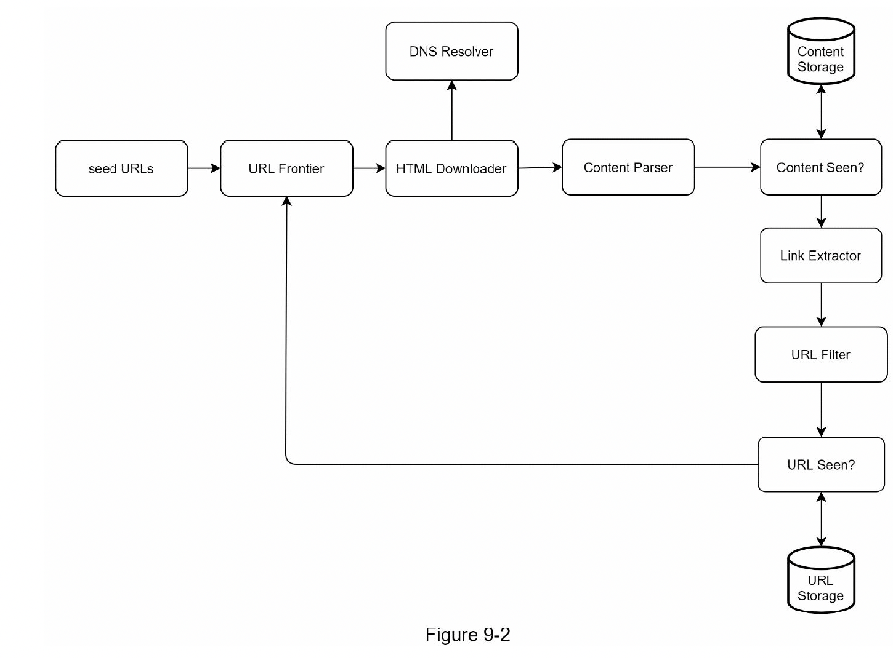
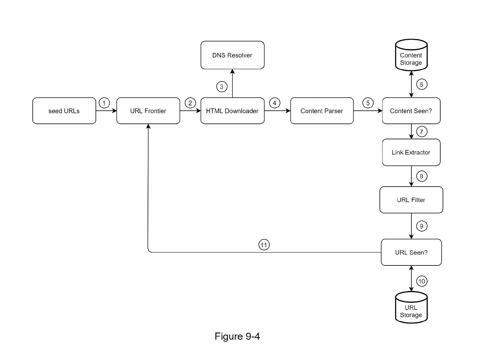
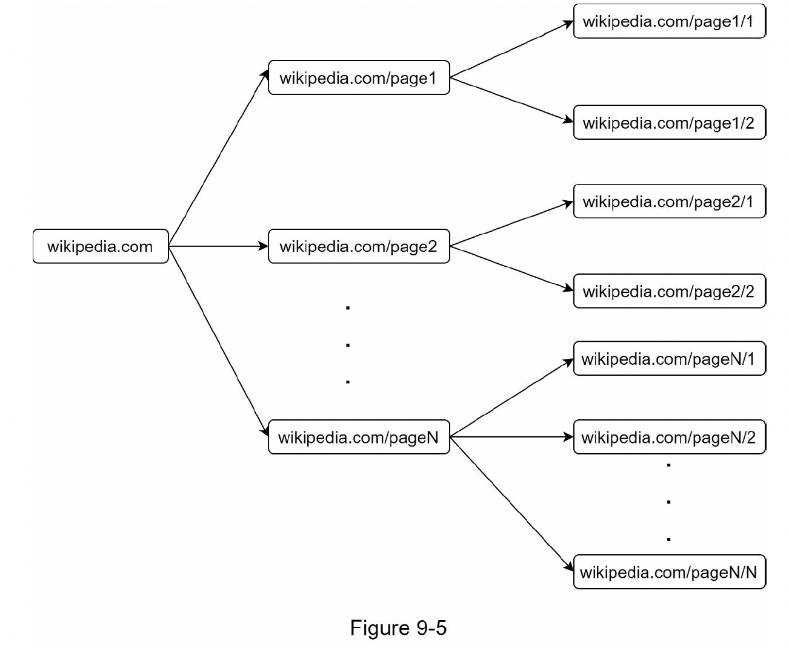

# Chapter 9 : DESIGN A WEB CRAWLER

## what is crawler?

#### 웹에 새로 올라오거나 갱신된 콘텐츠를 찾아내는 것이 주된 목적인 소프트웨어.

- Search engine indexing : 웹 페이지를 모아 search engine 을 위한 local index 를 만듬 (like GoogleBot, Naver)
- Web archiving : 웹에서 정보를 모음 for future uses
- Web mining : 인터넷에서 유용한 지식을 도출을 위해 (주주미팅이나 IR 자료 등등)
- Web monitoring : copyright, trademark infringements.

## Step 1 - Understand the problem and establish design scope

### 책에서 주어진 내용들

- URL 집합이 입력으로 주어지면, 해당 URL들이 가리키는 모든 웹 페이지를 다운로드한다.
- 다운받은 웹 페이지에서 URL들을 추출한다.
- 추출된 URL들을 다운로드할 URL 목록에 추가하고 위의 과정을 처음부터 반복한다.
- 웹 크롤러가 만족시켜야 할 속성들

### good web crawler 가 가지는 특성들 

- Scalability : 웹에는 수식업 개의 페이지가 존재한다. 따라서 병행성을 활용하면 보다 효과적으로 웹 크롤링을 할 수 있다.
- Robustness : 크롤러는 비정상적 입력이나 환경에 잘 대응할 수 있어야 한다.
- Politeness : 수집 대상 웹 사이트에 짧은 시간 동안 너무 많은 요청을 보내서는 안 된다.
- Extensibility : 새로운 형태의 콘텐츠를 지원하기가 쉬워야 한다.

### Back of the envelope estimation

- 매달 10억 개의 웹 페이지를 다운로드한다.
- QPS = 10억/30일/24시간/3600초 = 대략 400페이지/초
- 최대 QPS = 2 * QPS = 800
- 웹 페이지 크기 평균은 500k라고 가정
- 10억 페이지 * 500k = 500TB/월
- 1개월치 데이터를 보관하는 데는 500TB. 5년간 보관한다고 가정하면 500TB * 12개월 * 5년 = 30PB

## Step 2 - Propose high-level design and get buy-in

    

#### Seed URLs

- 크롤링 시작 지점
- 탐색할 곳이 많은 URL을 고르는 게 유리
- 일반적으로 entire url -> smaller one
- 정답은 정해져 있지 않다.

#### URL Frontier

##### Modern web crawlers 는 크롤링 상태를 두가지로 나눠서 관리한다.

1. 다운로드 할 URL (to be downloaded)
2. 다운로드된 URL (already downloaded)

- 1번을 저장 관리하는 컴포넌트를 URL Frontier 라고 부른다.(First-in-first-out)

#### HTML Downloader

- 말그대로 HTML 다운로드 하는 애. URL 은 Frontier 로부터 받는다

#### DNS Resolver

- URL 을 IP 로 바꿔야 다운로드가 되기 때문에 그것을 담당하는 애. 1장에서 DNS 생각하면 된다.

#### Content Parser

- 다운로드 한 것을 그대로 쓰는 것이 아니라 검증이 필요하다.
- 문제를 일으킬만한 페이지를 거르고, 또 괜히 쓸데없는걸 저장해서 리소스 낭비를 막기 위해
- 근데 여기서 파서를 만약에 크롤러 서버 안에 구현을 하게 되면 크롤러 자체가 느려 질 수 있으므로, 파서는 독립적으로 만든다.

#### Content Seen?

- 약 29% 가량의 웹 페이지 콘텐츠는 중복이라고 함.
- 이 단계를 도입해서 데이터 중복을 줄이고 데이터 처리에 소요되는 시간을 줄인다.
- HTML 문서를 비교하는 가장 단순하고 간단한 방법은 문자열을 직접 비교인데, 느리다.
- 효과적인 방법은 웹 페이지의 해시 값을 비교하는 것이 좀 더 쉬울 수 있음.

#### Content Storage

- HTML Storage 라고 말하자
- 디스크가 기본적으로 넣는데, 메모리의 경우 빠른 load 가 가능하니, 자주 쓰는 페이지의 경우 메모리로 넣자.
- 사실 책에서 추천한 내용이고 이건 뭐 설계하기 나름 일 것 같다.

#### URL Extractor

- HTML 페이지에서 Link 들을 추출하는 애.
- 추출해야 또 크롤링을 하니까.

#### URL Filter 

- 특정한 콘텐츠 타입이나 파일 확장자를 갖는 URL, 접속 시 오류가 발생하는 URL, blacklisted URL 들을 필터하는 역할

#### URL Seen?

- 위의 Content Seen? 처럼 이미 방문한 URL 을 굳이 또 크롤링하지 않게 해서 서버 리소스도 줄이고 그럴 수 있게..

#### URL Storage

- storage for visited URLs

#### 그래서 전체적인 순서를 본다면

    

1. seed URLs들을 URL Frontier 에 저장한다.
2. HTML Downloader는 URL Frontier에서 URL 목록을 가져온다.
3. HTML Downloader는 도메인 이름 변한기를 사용하여 URL의 IP주소를 알아내고, 해당 IP 주소로 접속하여 웹 페이지를 다운받는다.
4. Content parser는 다운된 HTML 페이지를 파싱하여 올바른 형식을 갖춘 페이지인지 검증한다.
5. Content parsing과 검증이 끝나면 중복 콘텐츠인지 확인하는 절차를 개시한다.
6. 중복 콘텐츠인지 확인하기 위해서, 해당 페이지가 이미 저장소에 있는지 본다.
- 이미 저장소에 있는 콘텐츠인 경우에는 처리하지 않고 버린다.
- 저장소에 없는 콘텐츠인 경우에는 저장소에 저장한 뒤 URL 추출기로 전달한다.
7. URL extractor 는 해당 HTML 페이지에서 링크를 골라낸다.
8. 골라낸 링크를 URL 필터로 전달한다. 
9. 필터링이 끝나고 남은 URL인 중복 URL 판별 단계로 전달한다. 
10. 이미 처리한 URL인지 확인하기 위하여, URL 저장소에 보관된 URL인지 살핀다. 이미 저장소에 있는 URL은 버린다. 
11. 저장소에 없는 URL은 URL 저장소에 저장할 뿐 아니라 마수집 URL 저장소에도 전달한다.

## STEP 3 - Design deep dive

### DFS vs BFS

- 웹은 directed graph 이다. Page 는 Node 이고, Hyperlink 는 Edge 라고 보자.
- 크롤링 프로세스는 이 directed graph를 에지를 따라 탐색하는 과정이다.
- 그러니까 DFS, BFS는 그래프 탐색에 널리 사용된다.
- DFS는 좋은 선택이 아닐 가능성이 높다. -> 깊이가 어느 정도로 될 지 예측하기가 힘드니까...
- BFS 를 보통 사용한다.

#### but,,,,, 여전히 두가지 문제가 있다.

1. 한 페이지에서 나오는 링크가 같은 서버로 돌아가는 경우들이 있다. 예를 들어 위키디피아 같은.. 그러면 결국 크롤러는 같은 호스트에 속한 많은 링크를 또 받고 받고 또 받는데, 이때 링크들을 병렬(parallel)로 요청을 계속 보내면 위키디피아로 보내는 요청이 장난이 아닐 거다. 이런 크롤러는 보통 '예의 없는'(impolite) 크롤러로 간주된다.

    

2. Standard BFS 알고리즘은 URL 간에 우선순위를 두지 않는 문제가 있다.
- but 생각해보면 모든 웹 페이지가 같은 수준의 품질, 같은 수준의 중요성을 갖지는 않으니까 페이지 순위, 사용자 트래픽의 양, 업데이트 빈도 등 여러 가지 척도에 비추어 처리 우선순위를 구별하는 것을 생각해 볼 수 있다.

### URL frontier

- 결국 이걸 잘 만들어서, 위와 같은 문제를 예방하자는 것이다.
- 우선순위와 크롤링하려는 페이지가 새로운 페이지인지 파악하는 그런 로직을 추가해보자는 것

  
#### Priority

- URL Priority 를 정하는 컴포넌트
- Prioritizer : URL을 입력으로 받아 우선순위를 계산한다.
- Queue : 우선순위별로 큐가 하나씩 할당한다. 우선순위가 높으면 선택될 확률도 올라간다.
- Queue selector : 임의 큐에서 처리할 URL을 꺼내는 역할을 담당한다.
  

#### Politeness

1. 동일 웹 사이트에 대해서는 한 번에 한 페이지만 요청한다는 것이다.
2. 같은 웹 사이트의 페이지를 다운받는 테스크는 시간차를 두고 실행하도록 한다.
3. 각 다운로드 스레드는 별도 FIFO 큐를 가지고 있어서, 해당 큐에서 꺼낸 URL만 다운로드 한다.

    

- Queue router : 같은 호스트에 속한 URL은 언제나 같은 큐로 가도록 보장하는 역할을 한다.
- Mapping table : 호스트 이름과 큐 사이의 관계를 보관하는 테이블이다.
- FIFO queues :  같은 호스트에 속한 URL은 언제나 같은 큐에 보관된다.
- Queue selector : 큐들을 순회하면서 큐에서 URL을 꺼내서 해당 큐에서 나온 URL을 다운로드하도록 지정된 작업 스레드에 전달하는 역할을 한다.
- Worker thread : 전달된 URL을 다운로드하는 작업을 수행한다.

#### 그래서 정리해 보자면

- Front queues : manage prioritization
- Back queues : manage politeness (예의.. 라고 하는데 음.. 그냥 크롤링 하는 서버에 부담을 안주게? 위에 위키디피아 예제처럼)

#### Freshness

- Web content 는 영원하지 않으니 데이터의 freshness 를 위해서 주기적으로 업데이트가 필요하다. (즉 크롤링을 다시 해줄 필요가 있다라는 것)
- but, 현실적으로 주기적으로 이걸 매번 똑같이 해주는 것은 불가능 할 수도 있다 (리소스가 어마어마 하게 든다, but..? 케바케라고 생각)
- 책에서는 아래 두가지 방식 제안
1. 웹 페이지의 변경 이력 활용
2. 우선순위를 활용하여 중요한 페이지는 좀 더 자주 재수집

#### Storage for URL Frontier

- 수백만 개에 달하는 URL 을 처리 해야한느데, 모든 것을 메모리에 저장하는 것은 신뢰성이나 확장성 면에서 적합하지 않음.
- 그렇다고 디스크에 저장하자니... 느림. 크롤링에 bottleneck 이 발생한다.
- 이에 hybrid 접근 방식으로 대부분 URL 은 디스크에 넣고, IO 을 담당하는 버퍼를 메모리에 위치시켜 비용을 줄인다.
- 버퍼의 데이터를 주기적으로 디스크로 기록하면 됨

### HTML Downloader

- HTML 다운로더는 HTTP 프로토콜을 사용하여 인터넷에서 웹 페이지를 다운로드한다.

#### Robots.txt

- Robots Exclusion Protocol(로봇 배제 프로토콜)
- 일명 Robots.txt는 웹 사이트가 크롤러와 통신하는 데 사용되는 표준. 
- 크롤러가 어떤 페이지를 다운로드할 수 있는지를 지정
- 웹 사이트를 크롤링하기 전에 크롤러는 해당하는 robots.txt 파일을 확인하고 규칙 따르게끔 함
- robots.txt 파일을 반복 다운로드하는 것을 피하기 위해 파일의 결과를 캐시에 저장합니다.
- 파일은 주기적으로 다운로드되어 캐시에 저장됩니다.
- 
#### Performance optimization

1. Distributed crawl

- 성능을 높이기 위해 크롤링 작업을 여러 서버에 분산하는 방법이다.
- 여러 서버는 여러 스레드를 돌려 다운로드 작업을 처리한다.
- 이 구성을 위해 URL 공간은 작은 단위로 분할하여, 각 서버는 그중 일부의 다운로드를 담당하도록 한다. 

2. Cache DNS Resolver

- 도메인 이름 변환기는 크롤러 성능의 병목 중 하나인데, 이는 DNS 요청을 보내고 결과를 받는 작업의 동기적(synchronous) 특성 때문이다.
- DNS 조회 결과로 얻어진 도메인 이름과 IP 주소 사이의 관계를 캐시에 보관해 놓고 크론 잡등을 돌려 주기적으로 갱신하도록 해 놓으면 성능을 효과적으로 높일 수 있다.

3. Locality

- 크롤링 작업을 수행하는 서버를 지역별로 분산하는 방법이다.

4. Short timeout

- 어떤 웹 서버는 응답이 느리거나 아예 응답하지 않는다. 이런 경우 대기 시간이 길어지면 좋지 않으므로, 최대 얼마나 기다릴지를 미리 정해두는 것이다.
- 이 시간 동안 서버가 응답하지 않으면 크롤러는 해당 페이지 다운로드를 중단하고 다음 페이지로 넘어간다.

#### Robustness

- Consistent hashing : 다운로더 서버들에 부하를 분산할 때 적용 가능한 기술이다. 이 기술을 이용하면 다운로더 서버를 쉽게 추가하고 삭제할 수 있다.
- Save crawl states and data : 장애가 발생한 경우에도 쉽게 복구할 수 있도록 크롤링 상태와 수집된 데이터를 지속적 저장장치에 기록해 두는 것이 좋다.
- Exception handling : 예외가 발생해도 전체 시스템이 중단되는 일 없이 그 작업을 웅하게 이어나갈 수 있어야 한다.
- Data validation : 시스템 오류를 방지하기 위한 주요 수단이다.

#### Extensibility

- 새로운 형태의 Content 도 크롤링이 가능하게끔 설계하자. 예를 들면 png 다운로더를 추가하거나 등등

#### Detect and avoid problematic content

1. Redundant content
- 거의 30% (책에서 29%라고 얘기했던거) 데이터가 중복된다.
- Hashes or checksums 을 쓰면 중복을 막는데 도움을 준다

2. Spider traps
- 가끔 크롤러를 무한루프에 빠뜨리듣 변태같은... 페이지가 있다
- www.spidertrapexample.com/foo/bar/foo/bar/foo/bar/…
- 완전한 해결책 혹은 알고리즘을 개발하는 것은 어렵지만, 수동으로 확인하면서 이걸 blacklist 에 추가하는 방식으로도 해결 가능 

3. Data noise
- 어떤 콘텐츠는 거의 가치가 없다. ex) 광고, 스크립트 코드, 스팸 URL
- 이런 콘텐츠는 크롤러에게 도움될 것이 없으므로 가능한 제외하자.
