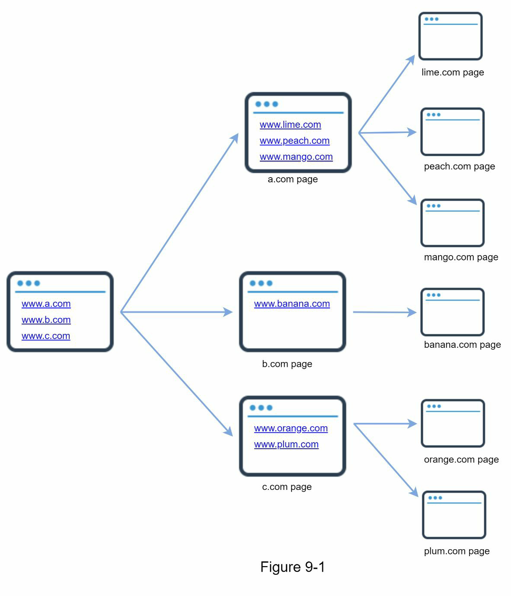
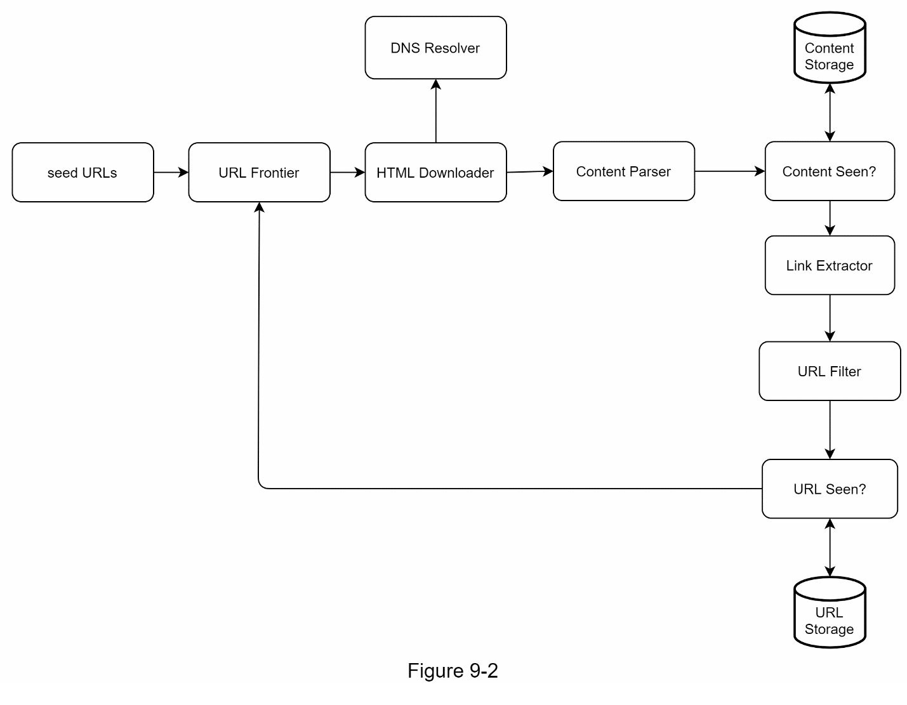
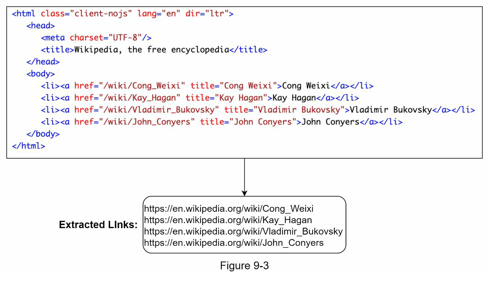
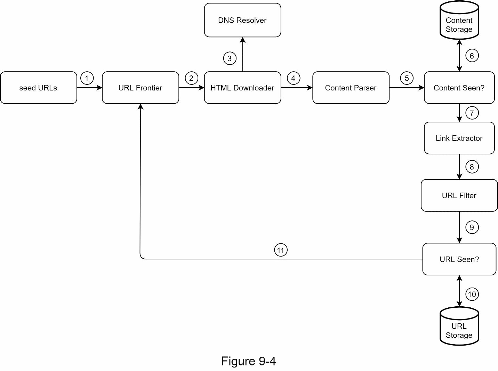
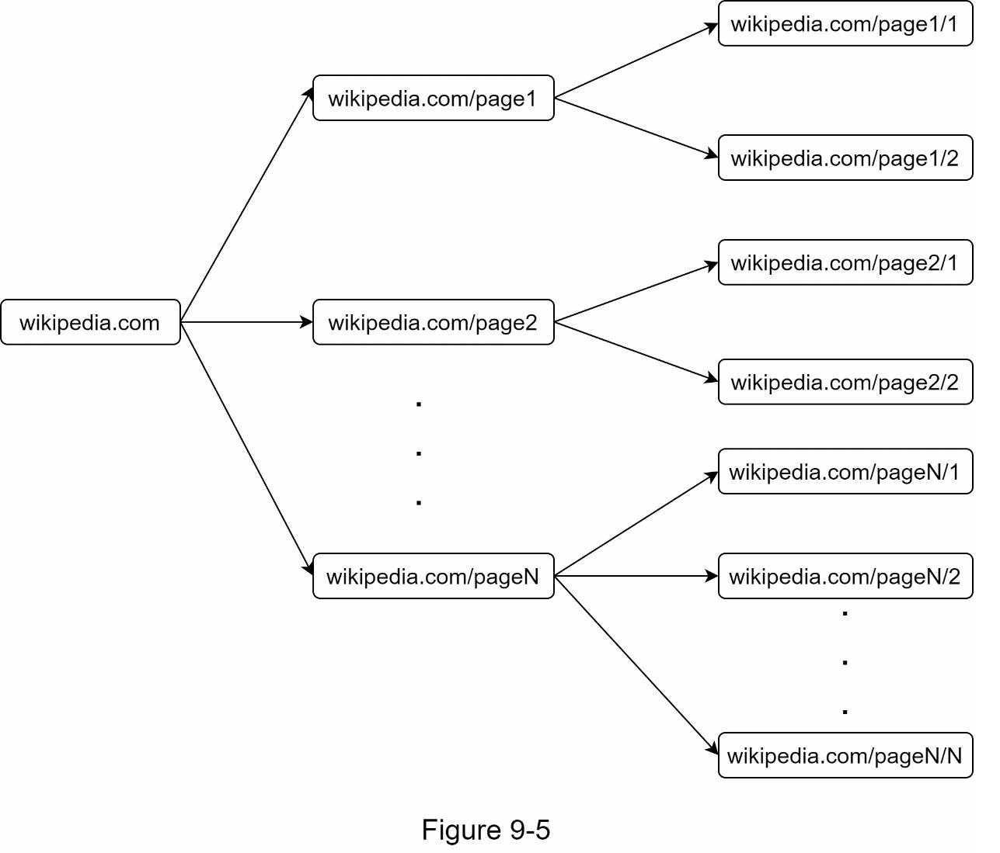
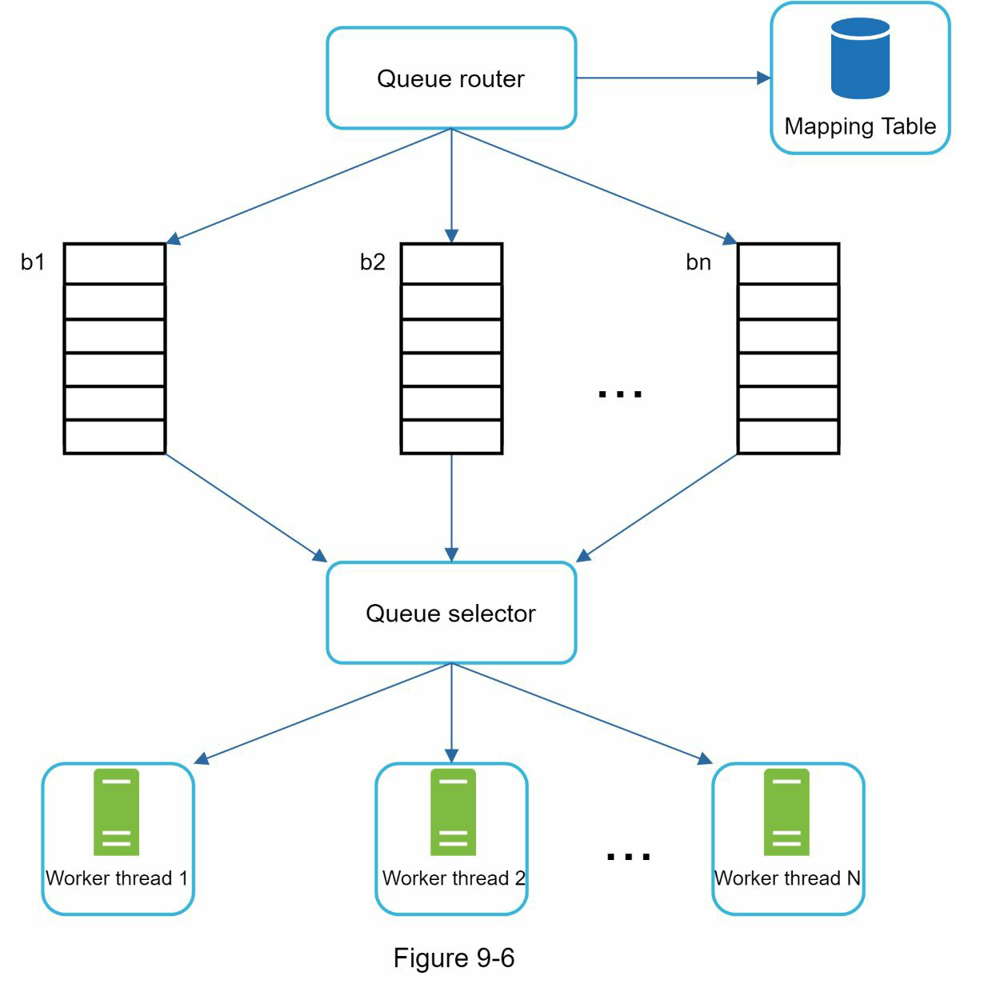
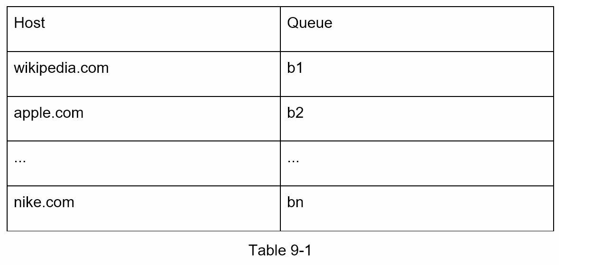
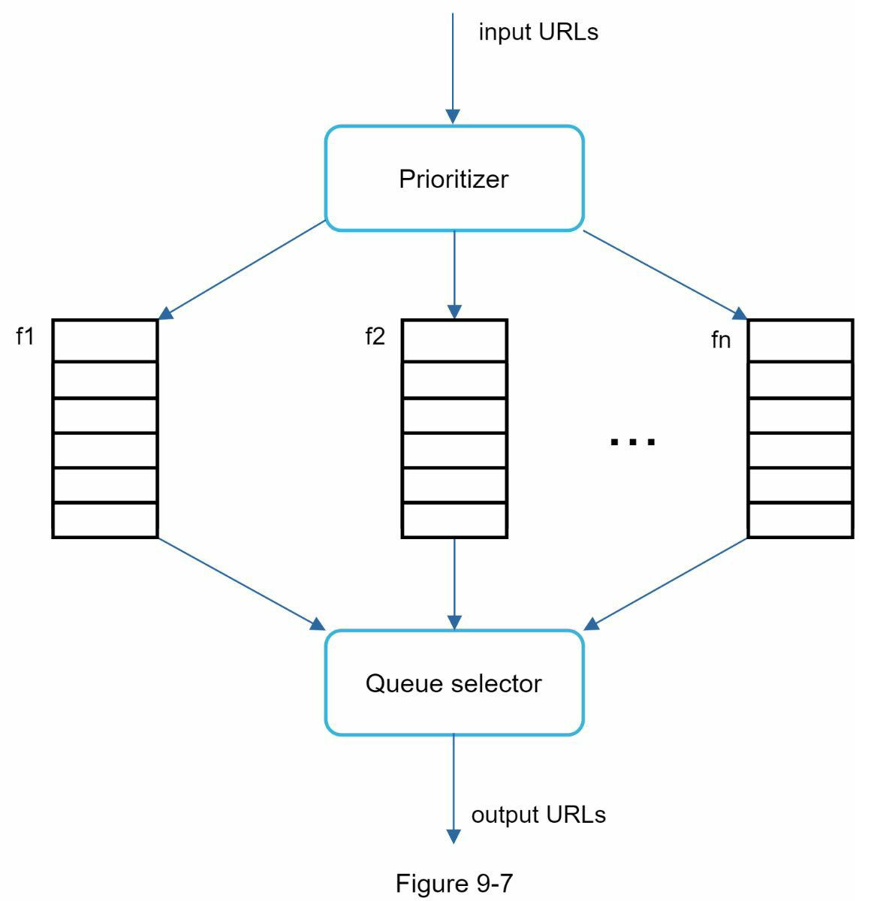
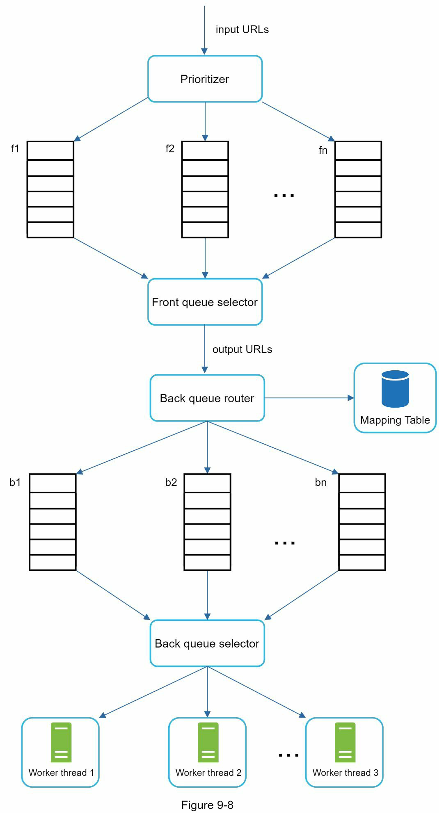
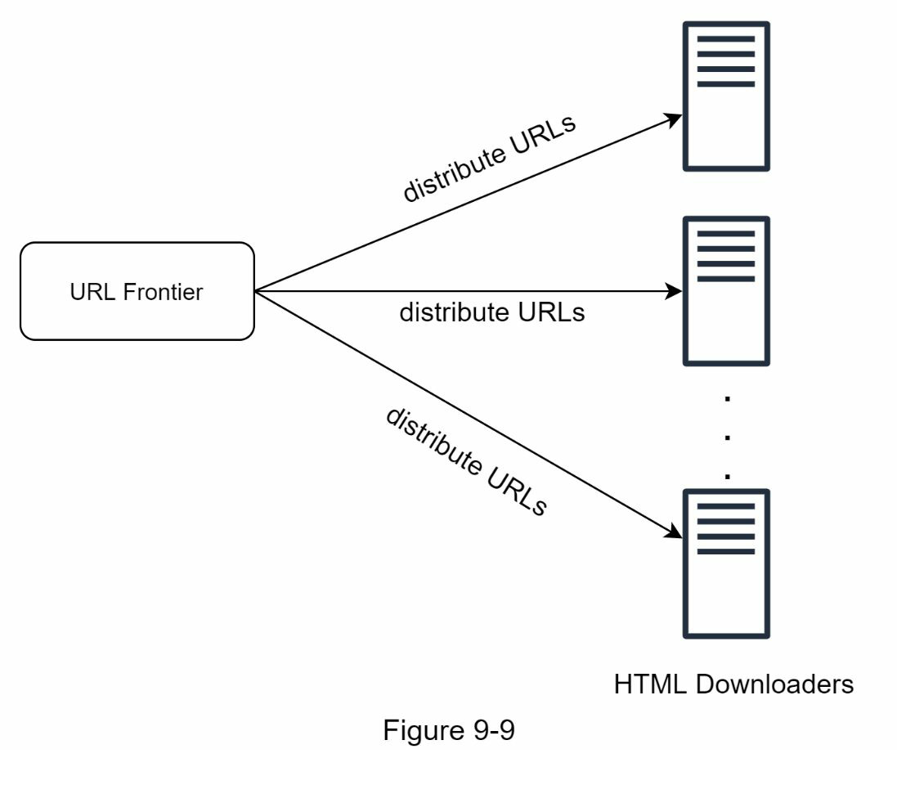

# Chapter 9: Design a web crawler
- A web crawler is widely used by search engines to discover new or updated content on the web
- Content
  - a web page/ an image/ a video, a PDF file, etc.
- A web crawler starts by collecting a few web pages and then follows links on those pages to collect new pages

- A crawler is used for many purpose
  - Search engine indexing : Collect web pages to create a local index for search engine.
  - Web archiving
  - Web mining : For data mining, helps to discover useful knowledge from internet.
  - Web monitoring

- Complexity of developing a web crawler depends on the scale we intend to support

## Step 1 - Understand the problem and establish design scope
### Algorithm for web crawler
- Given a set of URLs, download all the pages addressed 
- Extract URLs from downloaded web pages
- Add new URLs to the list of URLs to be downloaded. Repeat these 3 steps.

### Possible questions
- What is the main purpose of the crawler?
- How many web pages does the web crawler collect per month?
- What content types are included?
- Shall we consider newly added or edited web pages?
- Do we need to store HTML pages crawled from the web?
- How do we handle web pages with duplicate content?

### Good web crawler's characteristics
- Scalability
  - efficient using parallelization
- Robustness
  - Should consider, Bad HTMl, unresponsive servers, crashes, malicious links
- Politeness
- Extensibility
  - Support new type

### Back of the envelope estimation
- Assume 1 billion web pages are downloaded every month
- QPS: 1,000,000,000 / 30days / 24 hours/ 3600 seconds = ~400 pages per second
- Peak QPS = 2 * QPS = 800
- Assume the average web page size 500k
- 1-billion-page x 500 k = 500 TB storage per month. 
- Assume data are stored for five years, 500 TB * 12 months * 5 years = 30 PB. 

## Step 2 - Propose high-level design and get buy-in

### Seed URLs
- Starting point for the crawl process
- A good seed URL serves as a good starting point that crawler can utilize to traverse as mnay link as possible
- The general strategy is to divide the entire URL space into smaller ones.    
  - Based on locality as different countries may have different popular websites
  - Based on Topics
- Seed URL selection is an open-ended question

### URL Frontier
- Most modern web crawlers split the crawl state into two
  - To be downloaded -> URL Frontier : The component that store URLs to be downloaded 
    - FIFO queue
  - Already downloaded

### HTML Downloader
### DNS Resolver
- URL must be translated into an IP address
- The HTML downloader calls the DNS resolver to get the corresponding IP address for the URL

### Content Parser
- After web pages are downloaded, it must be parsed and validated because malformed web pages could provoke problems and waste storage space.
- Implementing a content parser in crawl server will slow down the crawling process. -> The content parser is a seperate component

### Content Seen?
- 29% of the web pages are duplicated contents, which may cause the same content to be stored multiple times. 
- Content Seen? data structure is to eliminate data redundancy and shorten processing time.
- Help to detect new content previously stored in the system.
- But takes lots of time to compare HTML document by character

### Content Storage
- The choice of storage system depends on factors such as data type, date size, access frequency, life span, etc.
- Disk or memory
  - Disk : most of the content
  - Memory: popular content is kept in memory to reduce latency

### URL Extractor
- Parse and extract links from HTML pages

### URL Filter
- Excludes certain content types, file extensions, error links and URLs in blacklisted sites

### URL Seen?
- Data structure that keeps track of URLs that are visited before or already in the Frontier
- Helps to avoid adding the same URL multiple times as this can increase server load and cause potential infinite loops
- Bloom filter and hash table are common techniques to implement
  
### URL Storage
- Stores already visited URLs

### Web crawler workflow

1. Add seed URLs to the URL Frontier
2. HTML Downloader fetches a list of URLs from URL Frontier
3. HTML Downloader gets IP address of URLs from DNS resolver and starts downloading
4. Content Parser parses HTML pages and checks if pages are malformed
5. After content is parsed and validated, it is passed to the "Content Seen?" 
6. "Content Seen?" checks if HTML page is already in the storage.  
    - if it is, discard
    - if it is not, pass to Link Extractor
7. Link extractor extracts links from HTML pages
8. Extracted LInks are passed to the URL filter
9. After links are filtered, they are passed to the "URL seen?"
10. URL seen check if a URL is already in the storage
11. If a URL has not been processed before, it is added to the URL Frontier

## Step 3 - Design deep dive

### DFS vs BFS
- The crawl process can be seen as traversing a directed graph from one web page to others
- Two common graph traversal algorithms are DFS and BFS
- DFS is usually not a good choice because the depth of DFS can be very deep
- BFS is commonly used by web crawlers and is implemented by FIFO queue
- Two problem using BFS
  - Most links from the same web pages are linked back to the same host

  - Standard BFS does not take the priority of a URL into consideration

### URL frontier
- URL frontier help to address above problems
- Data structure that store URLs to be downloaded
- Ensure politeness, prioritization, and freshness

#### Politeness
- Generally, a web crawler should avoid sending too many requests to the same hosting server within a short period
- Sending too many request is considered impolite, or even theated as DoS attack
- Basic idea
  - Download one page at a time from the same host
  - A delay can be added between two download task
  - Maintain a mapping from website hostname to download threads

- Compoenents
  - Queue router: It ensure that each queue(b1, b2, ... bn) only contains URLs from the same host
  - Mapping table: It maps each host to a queue 

  - FIFO queue b1, b2 to bn: Each queue contains URls from the same host
  - Queue selector: Each works thread is mapped to a FIFO queue, and it only downloads URLs from that queue. The queue selection logic is done by the Queue selector
  - Worker thread

#### Priority
- Prioritize URLs based on usefulness, which can be measure by PageRank, website traffic, update frequency

- Component
  - Prioritizer : Takes URLs as input and computes the priorities
  - Queue f1 to fn: Each queue has an assigned priority
  - Queue selector: Randomly choose a queue with a bias towards queues with higher priority

- Front queues: manage prioritization
- Back queues: manage politeness

#### Freshness
- Web pages are constantly being added, deleted, and edited. A web crawler must periodically recrawl downloaded pages to keep our data set fresh
- Strategies to optimize freshness
  - Recrawl based on the web pages' update history
  - Prioritize URLs and recrawl importatn pages first and more frequently

#### Storage for URL frontier
- Hybrid approach to store reall huge data. 
- The majority of URLs are stored on the disk
- To reduce the cost of reading from the disk and writing to the disk maintain buffers in memory for enqueue/dequeue operation. Data in the buffer is periodically writeen to the disk

### HTML Downloader
#### Robots.txt
- Robots Exlucsion Protocol, is standard used by websites to communicate with crawlers
- It specifies what pages crawlers are allowed to download

#### Performance optimization

##### 1. Distributed crawl
- To archieve high performance, crawl jobs are distributed into multiple servers and earch server runs multiple threads
- The URL space is partitioned into smaller pieces; so, each downloader is responsible for a subset of the URLs

##### 2. Cache DNS Resolver
- DNS Resolver is a bottleneck for crawlers because DNS requests might take time due to the synchronous nature of many DNS interface. 
- DSN response time ranges from 10ms to 200ms
- Once a request to DNS is carried out by a crawler thread, other threads are blocked until the first request is completed. 
- Maintaining our DNS cache to avoid calling DNS frequently is an effective technique for speed optimization

##### 3. Locality
- Distribute crawl servers geographically. 
- When crawl servers are closer to website hosts, crawlers experience faster download time

##### 4. Short timeout
- To avoid long wait time, maximal wait time is specified. 
- If a host does not respond within predefined time, the crawler will stop the job and crawl some other pages

### Robustness
- Consistent hashing: helps to distribute load among downloaders
- Save crawl states and data: To guard against failures, crawl states and data are writeen to a storage system
- Exception handling
- Data validation

### Extensibility
- Flexible enough to support new content types
- Crawler can be extended by plugging in new modules

  - PNG downloader module
  - Web monitor module

### Detect and avoid problematic content

#### 1. Redundant content
- 30% of the web pages are duplicates.
- Hashes or checksums help to detect duplication
  
#### 2. Spider traps
- A crawler in an infinite loop
- Such spider traps can be avoided by setting a maximal length for URLs

#### 3. Data noise
- No value
- An advertisements
- Code snippets
- Spam URL
- Thoese contents are not useful for crawlers and should be excluded if possible

## Step 4- Wrap up
- Addtional talking poitns
  - Server-side rendering
    - JavaScripts, AJAX, to generate links on the fly
    - Through Server-side rendering or dynamic rendering, dynamic data can be retrieved
  - Filter out unwanted pages
  - Datacase replication and sharding
    - To improve the data lyaer availability, scalability, and reliability
  - Horizontal Scaling
  - Availability, consistency, and reliability
  - Analytics