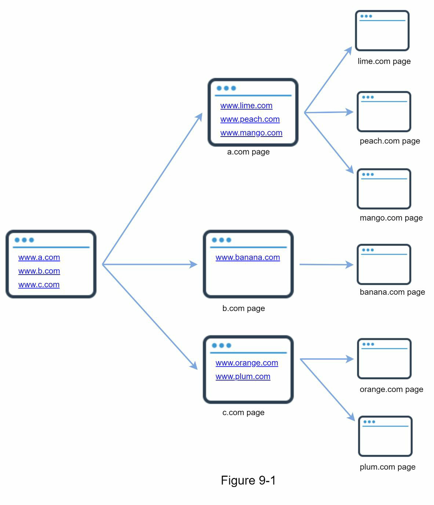
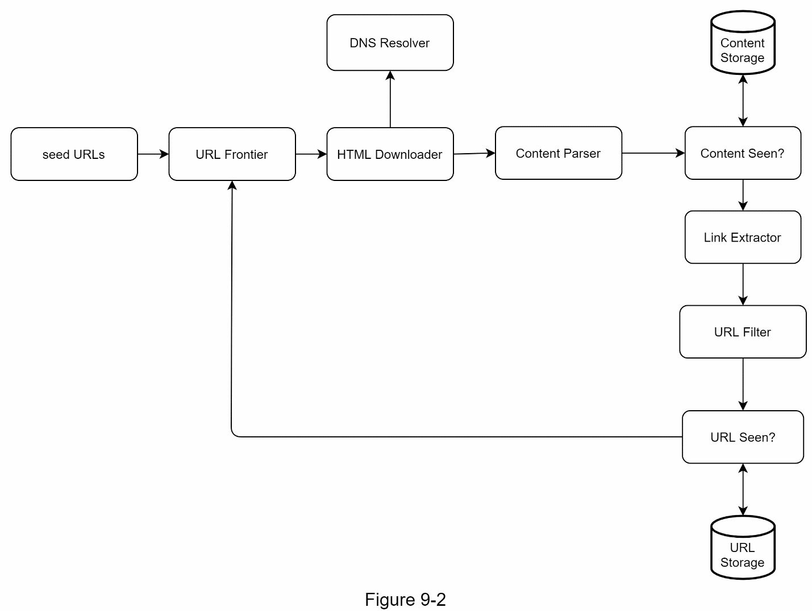
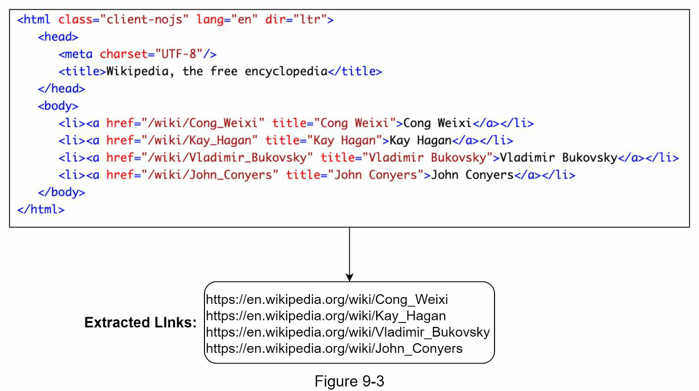
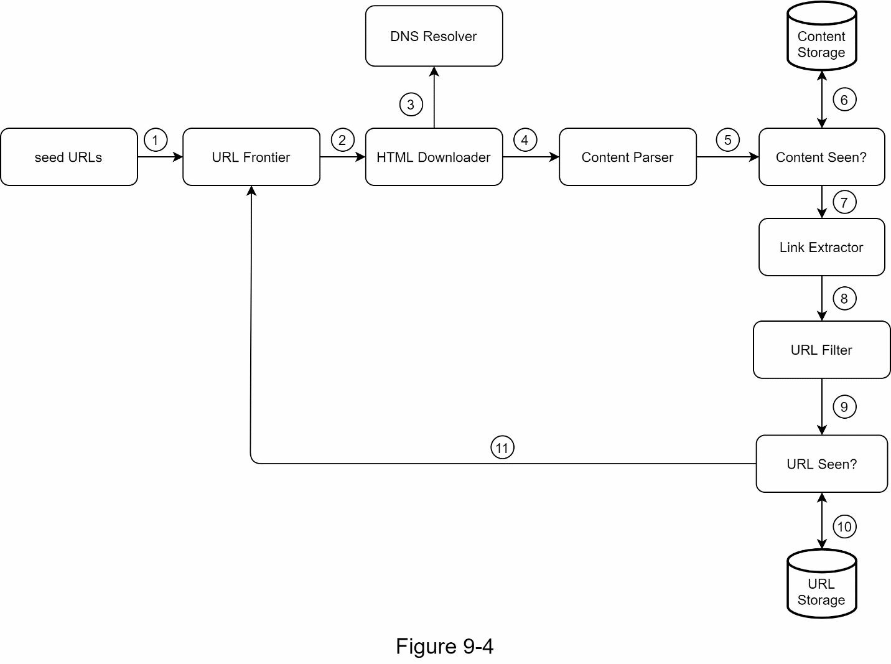
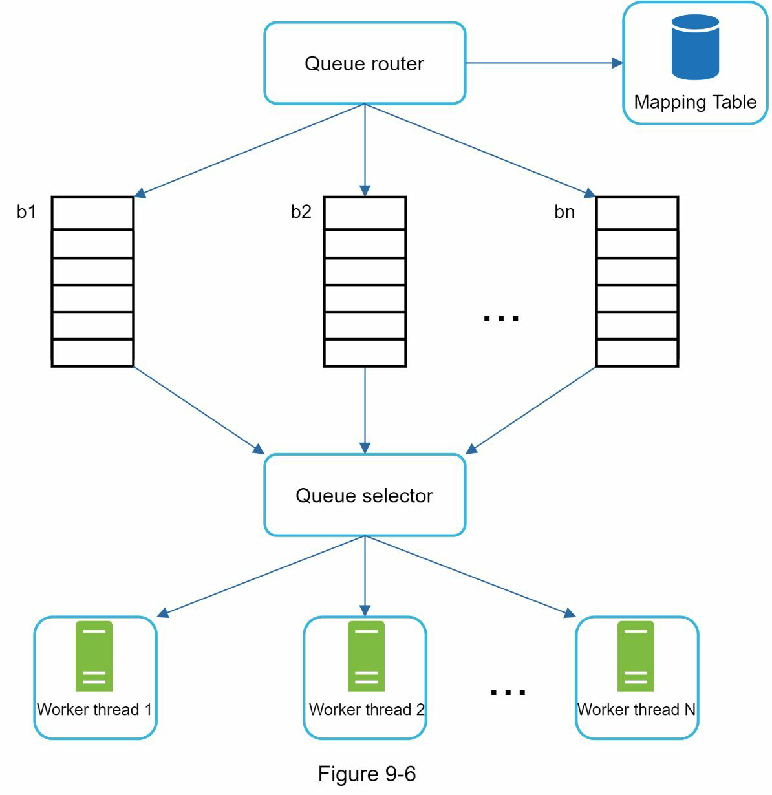
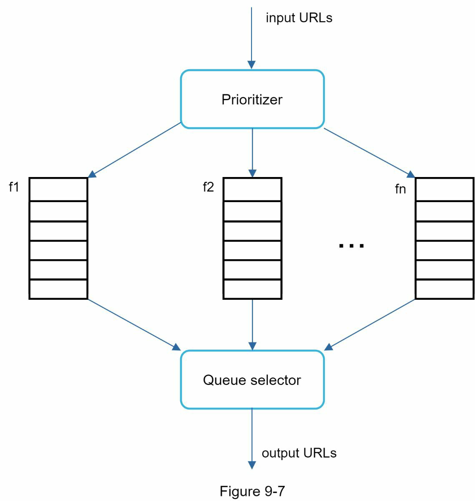
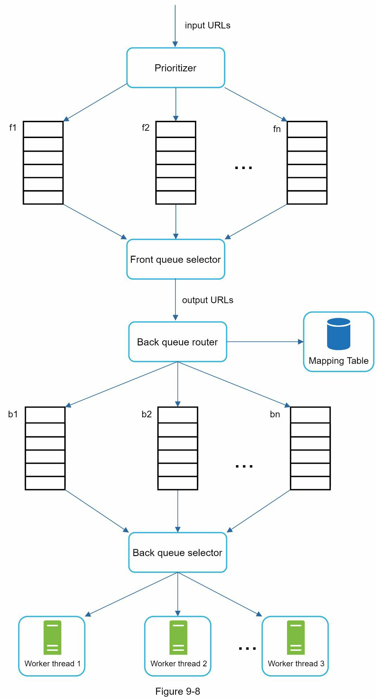
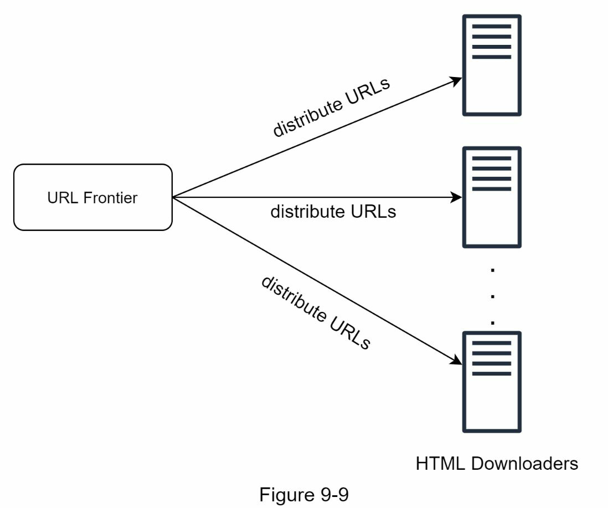
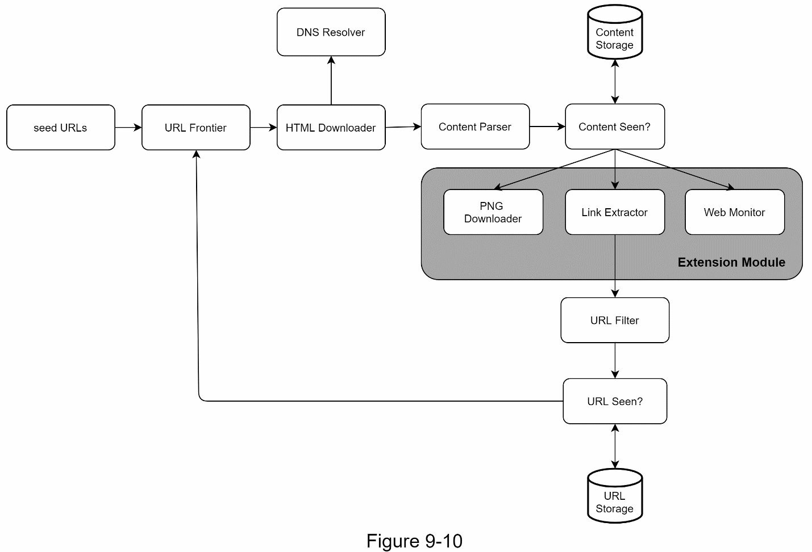

### CHAPTER 9: DESIGN A WEB CRAWLER

A crawler is used for many purposes
- Search engine indexing
- Web archiving
- Web mining
- Web monitoring

#### Step 1 - Understand the problem and establish design scope
#### Step 2 - Propose high-level design and get buy-in

##### Seed URLs
##### URL Frontier
##### HTML Downloader
##### DNS Resolver
##### Content Parser
##### Content Seen?
##### Content Storage
##### URL Extractor

##### URL Filter
##### URL Seen?
##### URL Storage
##### Web crawler workflow

#### Step 3 - Design deep dive
- Depth-first search (DFS) vs Breadth-first search (BFS)
- URL frontier
- HTML Downloader
- Robustness
- Extensibility
- Detect and avoid problematic content
##### DFS vs BFS
##### URL frontier
URL frontier is a data structure that stores URLs to be downloaded
###### Politeness

###### Priority

###### Freshness
Few strategies to optimize freshness are listed as follows:
- Recrawl based on web pages’ update history.
- Prioritize URLs and recrawl important pages first and more frequently.
###### Storage for URL Frontier

##### HTML Downloader
The HTML Downloader downloads web pages from the internet using the HTTP protocol.
Robots.txt, called Robots Exclusion Protocol, is a standard used by websites to communicate with crawlers. It specifies what pages crawlers are allowed to download. Before attempting to crawl a web site, a crawler should check its corresponding robots.txt first and follow its rules.
Performance optimization
1. Distributed crawl

2. Cache DNS Resolver
3. Locality
4. Short timeout

##### Robustness
- Consistent hashing: This helps to distribute loads among downloaders. A new
downloader server can be added or removed using consistent hashing. Refer to Chapter 5: Design consistent hashing for more details.
- Save crawl states and data: To guard against failures, crawl states and data are written to a storage system. A disrupted crawl can be restarted easily by loading saved states and data.
- Exception handling: Errors are inevitable and common in a large-scale system. The crawler must handle exceptions gracefully without crashing the system.
- Data validation: This is an important measure to prevent system errors

##### Extensibility

Detect and avoid problematic content
1. Redundant content
2. Spider traps
3. Data noise 

#### Step 4 - Wrap up
- Server-side rendering: Numerous websites use scripts like JavaScript, AJAX, etc to
generate links on the fly. If we download and parse web pages directly, we will not be able to retrieve dynamically generated links. To solve this problem, we perform server-side rendering (also called dynamic rendering) first before parsing a page [12].
- Filter out unwanted pages: With finite storage capacity and crawl resources, an anti-spam component is beneficial in filtering out low quality and spam pages [13] [14].
- Database replication and sharding: Techniques like replication and sharding are used to improve the data layer availability, scalability, and reliability.
- Horizontal scaling: For large scale crawl, hundreds or even thousands of servers are needed to perform download tasks. The key is to keep servers stateless.
- Availability, consistency, and reliability: These concepts are at the core of any large
system’s success. We discussed these concepts in detail in Chapter 1. Refresh your memory on these topics.
- Analytics: Collecting and analyzing data are important parts of any system because data is key ingredient for fine-tuning.