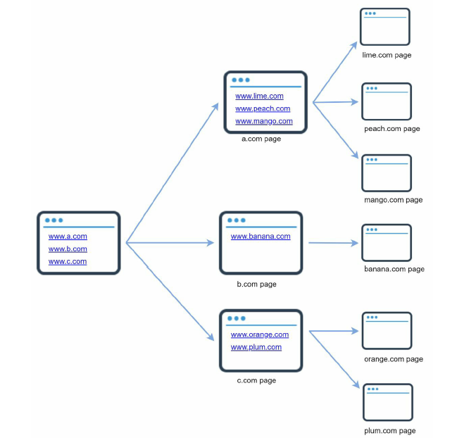
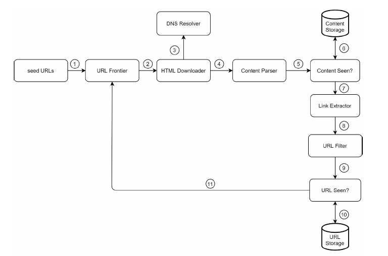
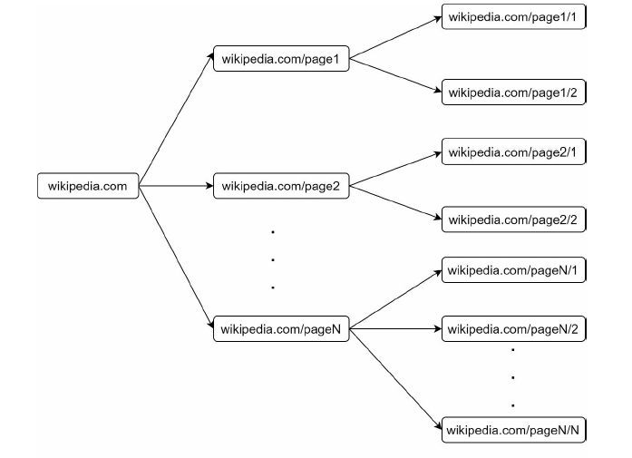
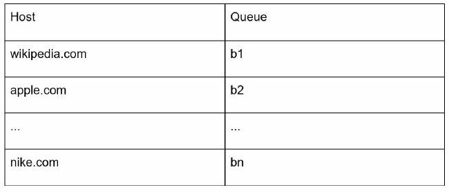
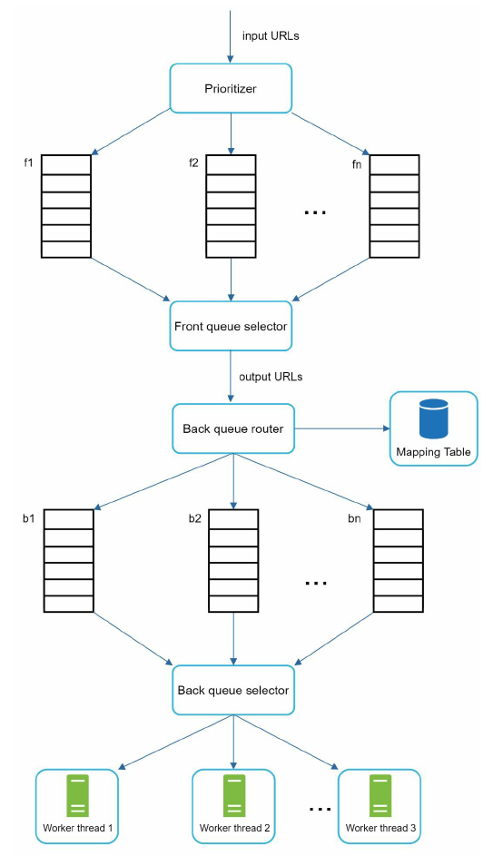
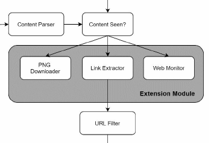

# Chapter 9: Design a Web Crawler

A web crawler is widely used by search engines to discover
new or updated content on the web. Content can be a web page, an image, a video, a PDF
file, etc. A web crawler starts by collecting a few web pages and then follows links on those
pages to collect new content.

## A crawler is used for many purposes:
• Search engine indexing: This is the most common use case. A crawler collects web
pages to create a local index for search engines. For example, Googlebot is the web
crawler behind the Google search engine.
• Web archiving: This is the process of collecting information from the web to preserve
data for future uses. For instance, many national libraries run crawlers to archive web
sites. Notable examples are the US Library of Congress [1] and the EU web archive [2].
• Web mining: The explosive growth of the web presents an unprecedented opportunity for
data mining. Web mining helps to discover useful knowledge from the internet. For
example, top financial firms use crawlers to download shareholder meetings and annual
reports to learn key company initiatives.
• Web monitoring. The crawlers help to monitor copyright and trademark infringements
over the Internet. For example, Digimarc [3] utilizes crawlers to discover pirated works
and reports.

## Step 1 - Understand the problem and establish design scope



### Basic Alrorithm
1. Given a set of URLs, download all the web pages addressed by the URLs.
2. Extract URLs from these web pages
3. Add new URLs to the list of URLs to be downloaded. Repeat these 3 steps.

Candidate: What is the main purpose of the crawler? Is it used for search engine indexing,
data mining, or something else? <br/>
Interviewer: Search engine indexing.<br/><br/>
Candidate: How many web pages does the web crawler collect per month?<br/>
Interviewer: 1 billion pages.<br/><br/>
Candidate: What content types are included? HTML only or other content types such as
PDFs and images as well?<br/>
Interviewer: HTML only.<br/><br/>
Candidate: Shall we consider newly added or edited web pages?<br/>
Interviewer: Yes, we should consider the newly added or edited web pages.<br/><br/>
Candidate: Do we need to store HTML pages crawled from the web?<br/>
Interviewer: Yes, up to 5 years<br/><br/>
Candidate: How do we handle web pages with duplicate content?<br/>
Interviewer: Pages with duplicate content should be ignored.<br/><br/>

• Scalability: The web is very large. There are billions of web pages out there. Web
crawling should be extremely efficient using parallelization.
• Robustness: The web is full of traps. Bad HTML, unresponsive servers, crashes,
malicious links, etc. are all common. The crawler must handle all those edge cases.
• Politeness: The crawler should not make too many requests to a website within a short
time interval.
• Extensibility: The system is flexible so that minimal changes are needed to support new
content types. For example, if we want to crawl image files in the future, we should not
need to redesign the entire system.

### Back of the envelope estimation
• Assume 1 billion web pages are downloaded every month.
• QPS: 1,000,000,000 / 30 days / 24 hours / 3600 seconds = ~400 pages per second.
• Peak QPS = 2 * QPS = 800
• Assume the average web page size is 500k.
• 1-billion-page x 500k = 500 TB storage per month.
• Assuming data are stored for five years, 500 TB * 12 months * 5 years = 30 PB. A 30 PB
storage is needed to store five-year content.

## Step 2 - Propose high-level design and get buy-in

- Seed URLs
  - domain name
- URL Frontier
  - First-in-First-out (FIFO) queue
- HTML Downloader
  - downloads web pages from the internet
- DNS Resolver
  - To download a web page, a URL must be translated into an IP address
- Content Parser
  - After a web page is downloaded, it must be parsed and validated because malformed web pages could provoke problems and waste storage space
- Content Seen?
  - compare the hash values
- Content Storage
  - Most of the content is stored on disk because the data set is too big to fit in memory.
  - Popular content is kept in memory to reduce latency
- URL Extractor
  - URL Extractor parses and extracts links from HTML pages
- URL Filter
  - The URL filter excludes certain content types, file extensions, error links and URLs in “blacklisted” sites
- URL Seen?
  - data structure that keeps track of URLs that are visited before or already in the Frontier
- URL Storage
  - URL Storage stores already visited URLs.

### Web crawler workflow


## Step 3 - Design deep dive
### DFS vs BFS


This is considered as “impolite”

Standard BFS does not take the priority of a URL into consideration. The web is large
and not every page has the same level of quality and importance. Therefore, we may want
to prioritize URLs according to their page ranks, web traffic, update frequency, etc.

### URL frontier
- Politeness

The general idea of enforcing politeness is to download one page at a time from the same
host.



- Priority


```
Prioritizer
    It takes URLs as input and computes the priorities.
Front queues
    Manage prioritization
Queue f1 to fn
    Each queue has an assigned priority. Queues with high priority are selected with higher probability.
Queue selector
    Randomly choose a queue with a bias towards queues with higher priority.
Back queues
    Manage politeness(b1, b2 to bn: Each queue contains URLs from the same host)
```

- Freshness
   - Recrawl based on web pages’ update history.
   - Prioritize URLs and recrawl important pages first and more frequently.
- Storage for URL Frontier
We adopted a hybrid approach. The majority of URLs are stored on disk, so the storage space
is not a problem. To reduce the cost of reading from the disk and writing to the disk, we
maintain buffers in memory for enqueue/dequeue operations.

### HTML Downloader
The HTML Downloader downloads web pages from the internet using the HTTP protocol.

#### Robots.txt
Robots.txt, called Robots Exclusion Protocol, is a standard used by websites to communicate
with crawlers. It specifies what pages crawlers are allowed to download.

#### Performance optimization
1. Distributed crawl
   - To achieve high performance, crawl jobs are distributed into multiple servers, and each server
runs multiple threads.
2. Cache DNS Resolver
   - DNS Resolver is a bottleneck for crawlers because DNS requests might take time due to the synchronous nature of many DNS interfaces. The DNS cache keeps the domain name to IP address mapping and is updated periodically by cron jobs.
3. Locality
   - Distribute crawl servers geographically. When crawl servers are closer to website hosts, crawlers experience faster download time.
4. Short timeout
   - Some web servers respond slowly or may not respond at all. To avoid long wait time, a maximal wait time is specified.

#### Robustness
   - Consistent hashing: This helps to distribute loads among downloaders. A new
downloader server can be added or removed using consistent hashing. Refer to Chapter 5:
Design consistent hashing for more details.
   - Save crawl states and data: To guard against failures, crawl states and data are written to
a storage system. A disrupted crawl can be restarted easily by loading saved states and
data.
   - Exception handling: Errors are inevitable and common in a large-scale system. The
crawler must handle exceptions gracefully without crashing the system.
   - Data validation: This is an important measure to prevent system errors.

#### Extensibility
As almost every system evolves, one of the design goals is to make the system flexible
enough to support new content types.


#### Detect and avoid problematic content
1. Redundant content

   - As discussed previously, nearly 30% of the web pages are duplicates. Hashes or checksums
help to detect duplication.

2. Spider traps

   - www.spidertrapexample.com/foo/bar/foo/bar/foo/bar/…

Such spider traps can be avoided by setting a maximal length for URLs or apply some customized URL filters.

3. Data noise

   - Some of the contents have little or no value, such as advertisements, code snippets, spam
   - URLs, etc. Those contents are not useful for crawlers and should be excluded if possible.