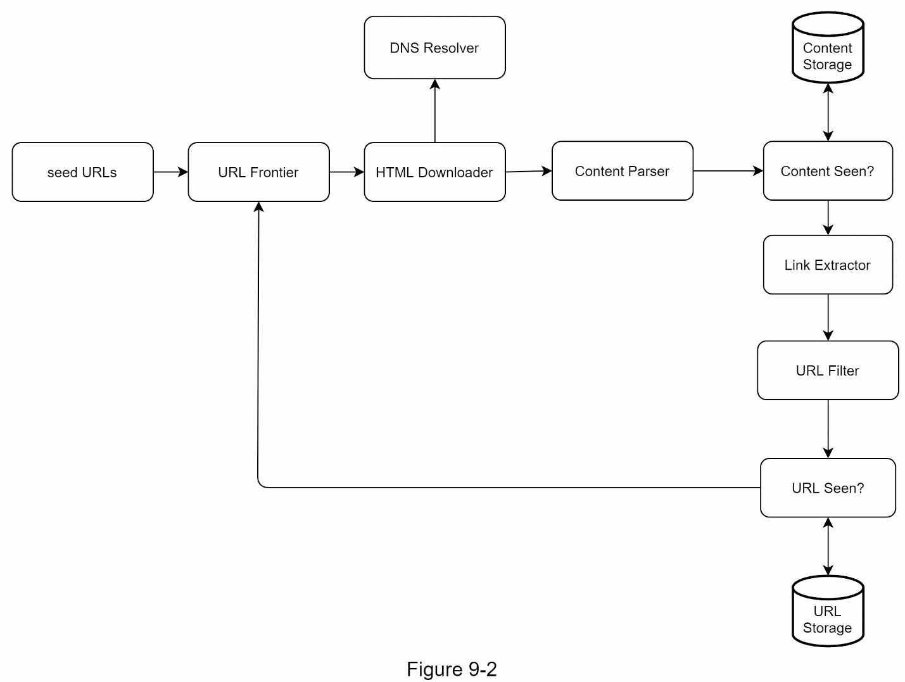
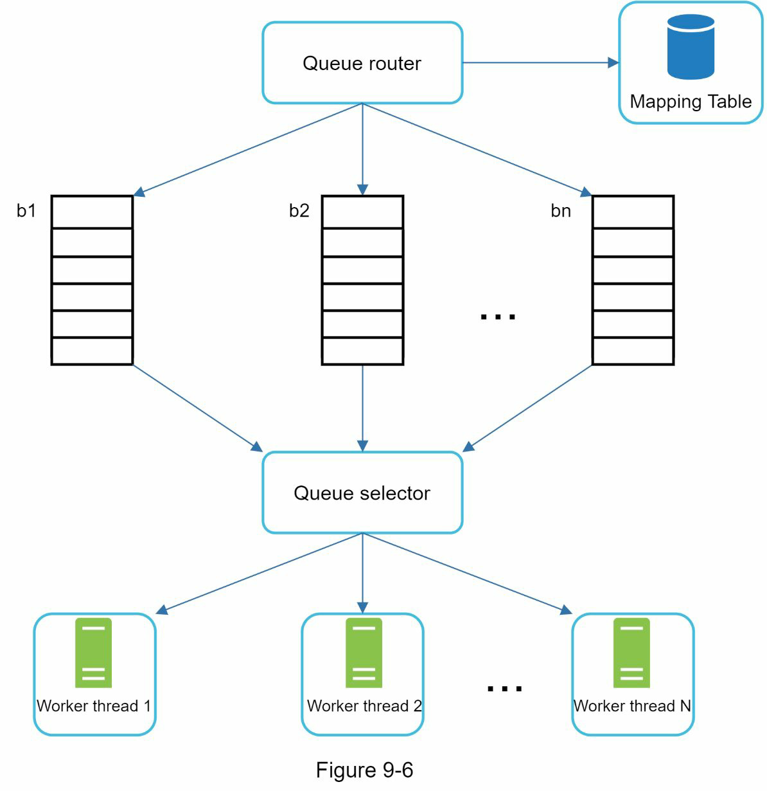
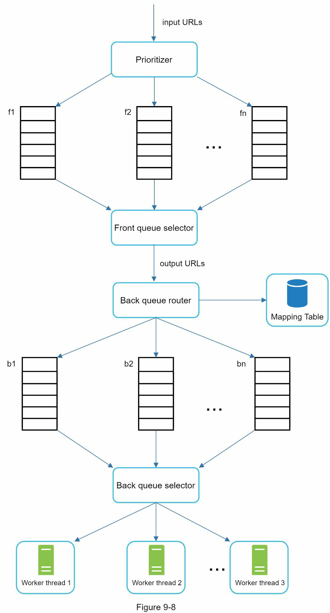
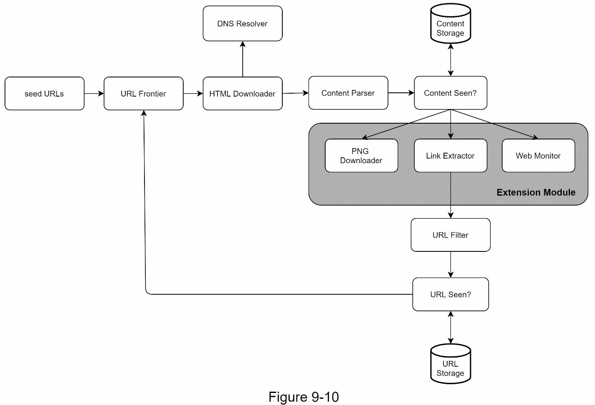

# Step 1 - Understand the problem and establish design scope

- The basic algorithm
1. Given a set of URLs, download all the web pages addressed by the URLs.
2. Extract URLs from these web pages
3. Add new URLs to the list of URLs to be downloaded. Repeat these 3 steps.

- The scope of the requirements
  - The main purpose
    - Search engine indexing.
  - How many web pages does it collect per month?
    - 1 billion pages
  - What content types are included?
    - HTML only
  - Do we need to store HTML pages crawled from the web?
    - Up to 5 years
  - Handling duplicate content?
    - Pages with duplicate content should be ignored
- Non-functional requirements
  - Scalability: parallel crawling
  - Robustness: the crawler must handle edge cases, bad content
  - Politeness: should not make too many requests
  - Extensibility: flexible to embrace additional requirements

## Back of the envelope estimation
- Assume 1 billion web pages are downloaded every month.
- QPS: 1,000,000,000 / 30 days / 24 hours / 3600 secs = ~400 pages per sec
- Peak QPS: 2 * QPS = 800
- Assume the average web page size is 500k
- 1 billion page * 500k = 500TB per month
- Assuming data are stored for 5 years, 500TB * 12 mon * 5 yrs = 30 PB

# Step2 - Propose high-level design and get buy-in

## Seed URLs
- Divide the entire URL space into smaller ones
- Choose seed URLs based on topics

## URL frontier
- Stores URLs to be downloaded

## HTML Downloader
- Downloads web pages from the internet

## DNS Resolver
- Translated into an IP address

## Content Parser
- Must be parsed and validated because malformed web pages could provoke problems and waste storage space

## Content seen?
- Compare the hash values of the two web pages

## Content storage
- Most of the content is stored on disk
- Popular content is kept in memory

## URL Extractor
- Parses and extracts links from HTML pages

## URL Filter
- Excludes certain content types, file extensions, error links and URLs in"blacklisted" sites.

# URL seen?
- Bloom filter and hash table are common techniques to implement it

# URL storage
- Stores already visited URLs.

## Step 3 - Design deep dive

### DFS vs BFS
- DFS can be too deep
- BFS is common approach
  - But parallel downloading is considered as impolite
  - Need to prioritize URLs based on page ranks, web traffic, update frequency

### URL frontier
- Ensure politeness, URL prioritization and freshness.
  - Politeness

    - Queue router: Ensures each queue only contains URLs from the same host
    - Mapping table: Maps each host to a queue
    - FIFO queues b1, b2 to bn: Each queue contains URLs from the same host
    - Queue selector: Each worker thread is mapped to a FIFO queue, and it only downloads URLs from that queue
    - Worker thread 1 to N. A worker thread downloads web pages one by one from the same host
  - Priority
      - Handles URL prioritization based on usefulness, which can be measured by PageRank [10], website traffic, update frequency, etc
      - Prioritizer: It takes URLs as input and computes the priorities.
      - Queue f1 to fn: Each queue has an assigned priority. Queues with high priority are selected with higher probability.
      - Queue selector: Randomly choose a queue with a bias towards queues with higher priority

      - Front queues: manage prioritization
      - Back queues: manage politeness

#### Freshness
- Recrawl based on web pages’ update history.
- Prioritize URLs and recrawl important pages first and more frequently.

#### Storage for URL Frontier
The majority of URLs are stored on disk, so the storage space is not a problem. 
To reduce the cost of reading from the disk and writing to the disk, we maintain buffers in memory for enqueue/dequeue operations. 
Data in the buffer is periodically written to the disk.

### HTML Downloader
- Robots.txt
  - A standard used by websites to communicate with crawlers. It specifies what pages crawlers are allowed to download. 
  - Before attempting to crawl a web site, a crawler should check its corresponding robots.txt first and follow its rules.

- Performance optimization
  - Distributed crawl
    - Distributed into multiple servers, and each server runs multiple threads. The URL space is partitioned into smaller pieces; so, each downloader is responsible for a subset of the URLs
  - Cache DNS resolver
    - Keeps the domain name to IP address mapping and is updated periodically by cron jobs
  - Locality
    - Distribute crawl servers geographically.
    - Design locality applies to most of the system components: crawl servers, cache, queue, storage, etc.
  - Short timeout

- Robustness
  - Consistent hashing: Distribute loads among downloaders
  - Save crawl states and data: To guard against failures, crawl states and data are written to a storage system. A disrupted crawl can be restarted easily by loading saved states
  - Errors are inevitable and common in a large-scale system. The crawler must handle exceptions gracefully without crashing the system.
  - Data validation: This is an important measure to prevent system errors.

- Extensibility

- Detect and avoid problematic content
  - Redundant content: Hashes or checksums help to detect duplication
  - Spider traps: Set a maximal length for URLs. Also manually validate
  - Data noise

# Step 4 - Wrap up
- Server side rendering
- Filtering out unwanted pages
- Database replication and sharding
- Horizontal scaling
- Availability, consistency, and reliability
- Analytics