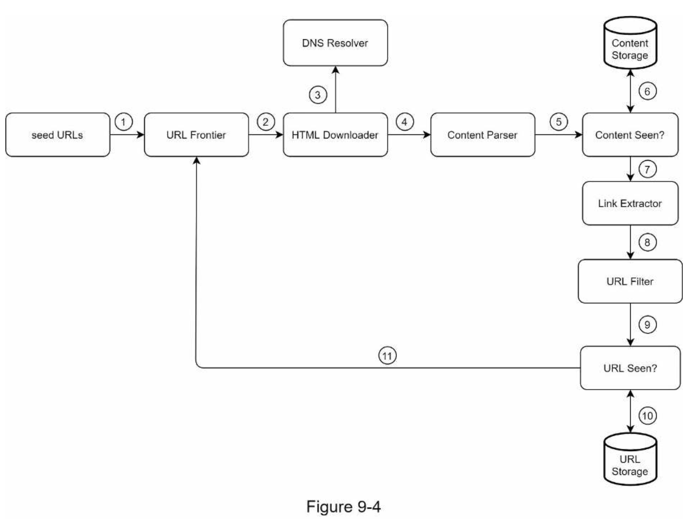
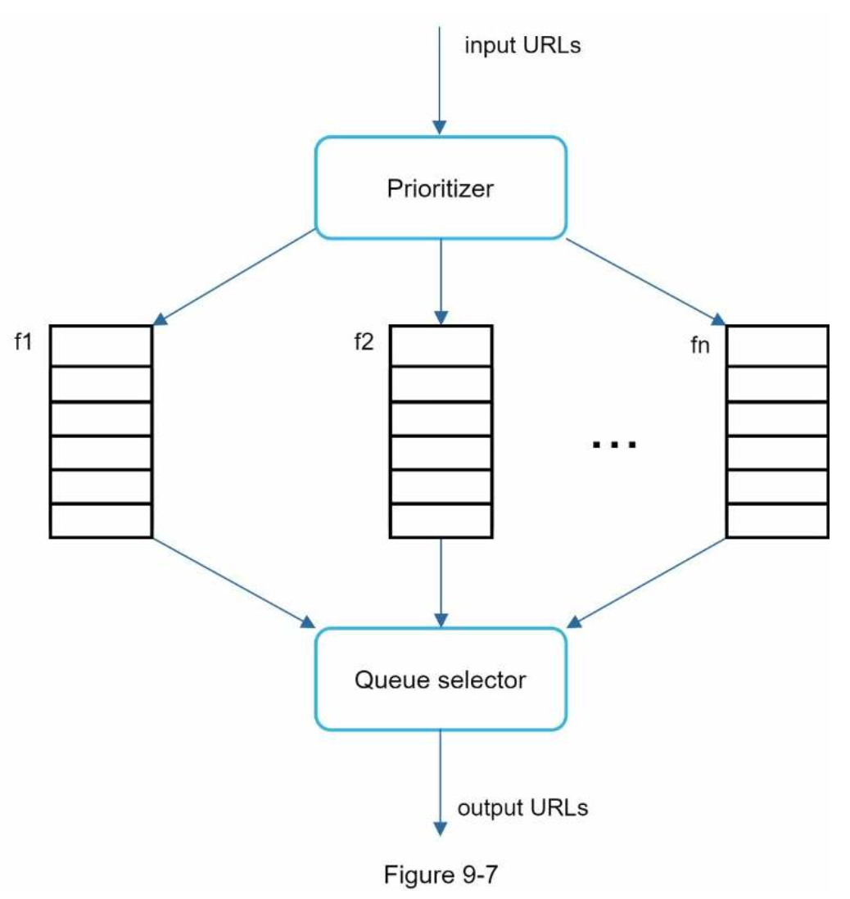
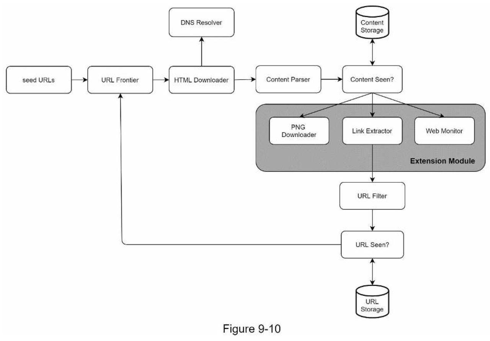

# 9. DESIGN A WEB CRAWLER
- A web crawler starts by collecting a few web pages and then follows links on those pages to collect new content.
- purposes:
    - Search engine indexing
    - Web archiving
    - Web mining
    - Web monitoring
- The complexity of developing a web crawler depends on the scale we intend to support.

### Step 1 - Understand the problem and establish design scope
---
1. Given a set of URLs, download all the web pages addressed by the URLs. 
2. Extract URLs from these web pages
3. Add new URLs to the list of URLs to be downloaded. Repeat these 3 steps.
- characteristics of a good web crawler
    - Scalability
    - Robustness
    - Politeness
    - Extensibility
###### Back of the envelope estimation
- Assume 1 billion web pages are downloaded every month.
- QPS: 1,000,000,000 / 30 days / 24 hours / 3600 seconds = ~400 pages per second.
- Peak QPS = 2 * QPS = 800
- Assume the average web page size is 500k.
- 1-billion-page x 500k = 500 TB storage per month. If you are unclear about digital storage units, go through “Power of 2” section in Chapter 2 again.
- Assuming data are stored for five years, 500 TB * 12 months * 5 years = 30 PB. A 30 PB storage is needed to store five-year content.

### Step 2 - Propose high-level design and get buy-in
---

##### Seed URLs
- starting point for the crawl process.
- A good seed URL serves as a good starting point that a crawler can utilize to traverse as many links as possible.
- The general strategy is to divide the entire URL space into smaller ones.

##### URL Frontier
- split the crawl state into two: to be downloaded and already downloaded.
- The component that stores URLs to be downloaded is called the URL Frontier.

##### HTML Downloader
- The HTML downloader downloads web pages from the internet.

##### DNS Resolver
- The HTML Downloader calls the DNS Resolver to get the corresponding IP address for the URL.

##### Content Parser
- After a web page is downloaded, it must be parsed and validated because malformed web pages could provoke problems and waste storage space.

##### Content Seen?
- We introduce the “Content Seen?” data structure to eliminate data redundancy and shorten processing time.
- An efficient way to accomplish this task is to compare the hash values of the two web pages.

##### Content Storage
- Most of the content is stored on disk because the data set is too big to fit in memory.
- Popular content is kept in memory to reduce latency.

##### URL Extractor
- URL Extractor parses and extracts links from HTML pages.

##### URL Filter
- The URL filter excludes certain content types, file extensions, error links and URLs in “blacklisted” sites.

##### URL Seen?
- Helps to avoid adding the same URL multiple times as this can increase server load and cause potential infinite loops.

##### URL Storage
- URL Storage stores already visited URLs.

##### Web crawler workflow


### Step 3 - Design deep dive
---
##### Depth-first search (DFS) vs Breadth-first search (BFS)
- DFS is usually not a good choice because the depth of DFS can be very deep.
- DFS:
    - When the crawler tries to download web pages in parallel, Wikipedia servers will be flooded with requests. This is considered as “impolite”.
- BFS: 
    - The web is large and not every page has the same level of quality and importance. Therefore, we may want to prioritize URLs according to their page ranks, web traffic, update frequency, etc.

##### URL frontier
###### Politeness
- Sending too many requests is considered as “impolite” or even treated as denial-of-service (DOS) attack.
- The general idea of enforcing politeness is to download one page at a time from the same host.


###### Priority
- A random post from a discussion forum about Apple products carries very different weight than posts on the Apple home page.


###### Freshness
- Recrawl based on web pages’ update history.
- Prioritize URLs and recrawl important pages first and more frequently.

###### Storage for URL Frontier
- The majority of URLs are stored on disk, so the storage space is not a problem. 
- To reduce the cost of reading from the disk and writing to the disk, we maintain buffers in memory for enqueue/dequeue operations. Data in the buffer is periodically written to the disk.

##### HTML Downloader
###### Robots.txt
- Robots.txt, called Robots Exclusion Protocol, is a standard used by websites to communicate with crawlers. 
- Before attempting to crawl a web site, a crawler should check its corresponding robots.txt first and follow its rules.
```
User-agent: Googlebot
Disallow: /creatorhub/*
Disallow: /rss/people/*/reviews
Disallow: /gp/pdp/rss/*/reviews 
Disallow: /gp/cdp/member-reviews/ 
Disallow: /gp/aw/cr/
```

###### Performance optimization
1. Distributed crawl
    - To achieve high performance, crawl jobs are distributed into multiple servers, and each server runs multiple threads.
2. Cache DNS Resolver
    - Maintaining our DNS cache to avoid calling DNS frequently is an effective technique for speed optimization.
3. Locality
    - When crawl servers are closer to website hosts, crawlers experience faster download time.
4. Short timeout
    - To avoid long wait time, a maximal wait time is specified.

##### Robustness
- Consistent hashing
- Save crawl states and data
- Exception handling
- Data validation

##### Extensibility
- As almost every system evolves, one of the design goals is to make the system flexible enough to support new content types.


##### Detect and avoid problematic content
1. Redundant content
    - nearly 30% of the web pages are duplicates.
    - Hashes or checksums help to detect duplication.
2. Spider traps
    - A spider trap is a web page that causes a crawler in an infinite loop.
    - It is hard to develop automatic algorithms to avoid spider traps; however, a user can manually verify and identify a spider trap, and either exclude those websites from the crawler or apply some customized URL filters.
3. Data noise
    - Some of the contents have little or no value, such as advertisements, code snippets, spam URLs, etc.

### Step 4 - Wrap up
- many relevant talking points:
    - Server-side rendering
    - Filter out unwanted pages
    - Database replication and sharding
    - Horizontal scaling
    - Availability, consistency, and reliability
    - Analytics