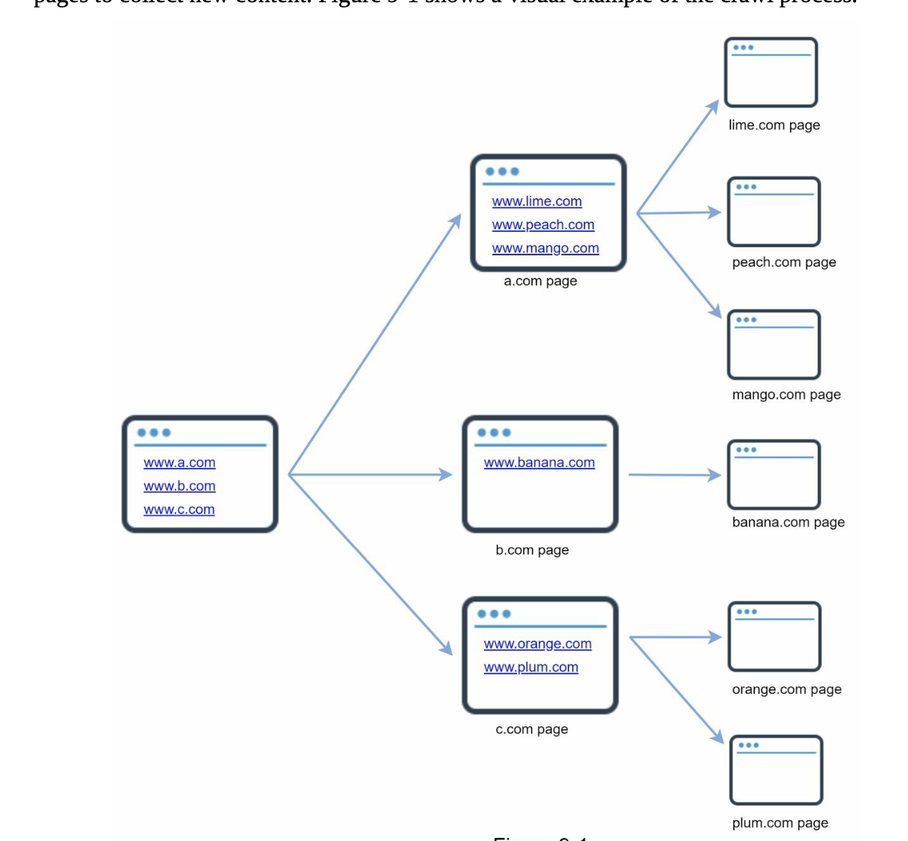
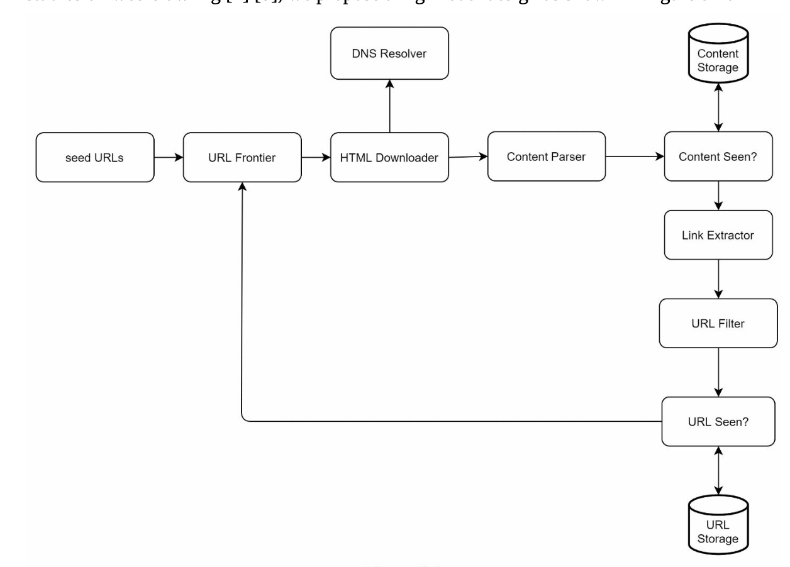
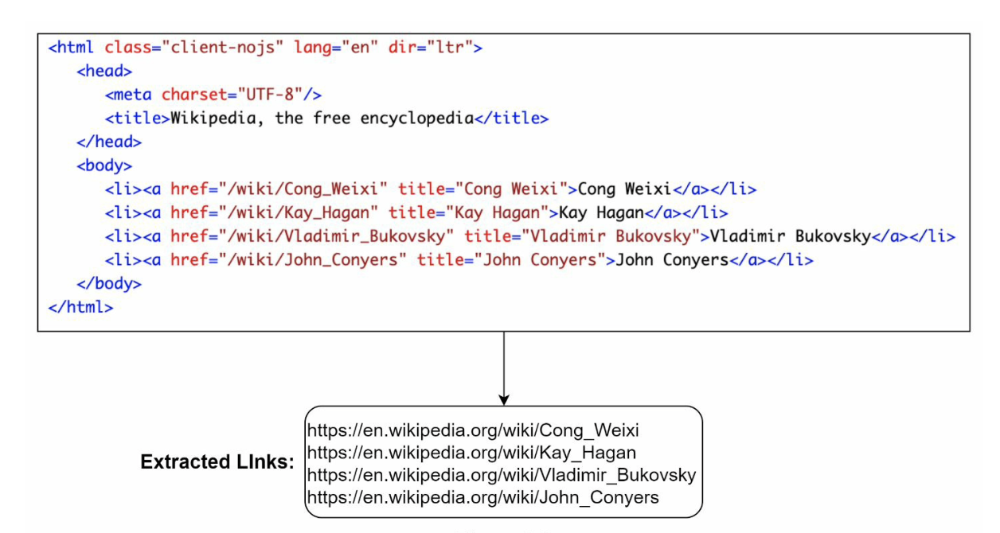
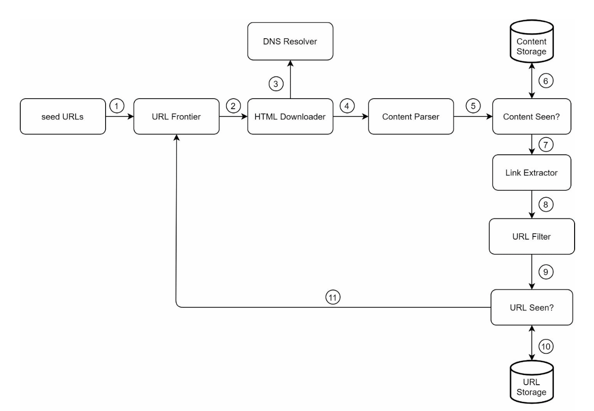

# Chapter 9: Design a Web Crawler

- Web crawler: known as a robot or spider
- Widely used by search engines to discover new or updated content on the web
    - content can be a web page, an image, video, PDF file, etc
- Starts by collecting a few web pages and then follows links on those pages to collect new content

- Visual example of the crawl process:

- A crawler is used for:
    - Search engine indexing
        - most common use case
        - a crawler collects web pages to create local index for search engines
        - i.e. Googlebot is the web crawler behind the Google search engine
    - Web archiving
        - the process of collecting info from the web to preserve data for future uses
        - i.e. national libraries run crawlers to archive websites (US Library of Congress, EU web archive)
    - Web mining
        - helps to discover useful knowledge from the internet
        - i.e. top financial firms use crawlers to download shareholder meetings and annual reports to learn key company initiatives
    - Web monitoring
        - monitor copyright and trademark infringements over the Internet.
        - i.e. Digimarc utilizes crawlers to discover pirated works and reports

- The complexity of developing a web crawler depends on the scale we intend to support.
    - must explore the scale and features to support one's requirements

## Step 1: Understand the Problem and Establish Design Scope

- Basic algorithm of a web crawler:
    1. Given a set of URLs, download all the web pages addressed by the URLs
    2. Extract URLs from these web pages
    3. Add new URLs to the list of URLs to be downloaded 
    (Repeat ^ three steps)

- Web crawlers don't exactly work as simple as the basic algorithm
- Designing a vastly scalable web crawler is an extremely complex task (unlikely for anyone to design a massive web crawler within the interview duration)

- Ask questions to understand the requirements and establish design scope:
    - Q: The main purpose of the crawler? Is it used for search engine indexing, data mining, or something else?
    - A: Search engine indexing

    - Q: How many web pages does the web crawler collect / month?
    - A: 1 billion pages

    - Q: What content types oare included? HTML only or other content types such as PDFs and images?
    - A: HTML only

    - Q: Shall we consider newly added or edited web pages?
    - A: Yes

    - Q: Do we need to store HTML pages crawled from the web?
    - A: yes, up to 5 years

    - Q: How do we handle web pages with duplicate content
    - A: should be ignored

- Ask questions to understand the requirements and clarify ambiguities

- Characteristics of a good web crawler:
    - Scalability: the web is very large. Web crawling should be extremely efficient using parallelization
    - Robustness: the web is full of traps (bad HTML, unresponsive servers, crashes, malicious links, etc). The crawler must handle those edge cases
    - Extensibility: The system is flexible so that minimal changes are needed to support new content types. (i.e. if we want to crawl image files in the future, we should not need to redesign the entire system)

### Back of the Envelope Estimation
- Very important to communicate your assumptions with your interviewer (make sure both are on the same page)
    - Assume 1 billion web pages are downloaded / month
    - QPS: 1,000,000,000 / 30 days / 24 hours / 3600 seconds = ~400 pages per second.
    - PeakQPS=2*QPS=800
    - Assume the average web page size is 500k.
    - 1-billion-page x 500k = 500 TB storage per month. If you are unclear about digital storage units, go through “Power of 2” section in Chapter 2 again.
    - Assuming data are stored for five years, 500 TB * 12 months * 5 years = 30 PB. A 30 PB storage is needed to store five-year content.

## Step 2: Propose High-Level Design and get Buy-In

### Seed URLs
- starting point for the crawl process
- i.e. to crawl all web pages from a university's website, an intuitive way to select seed URLs is to use the university's domain name

- To crawl the entire web, we need to be creative in selecting the seed URLs
    - A good seed url serves as a good starting point that a crawler can use to traverse as many links as possible
    - general strategy is to divide the entire URL space into smaller ones
        - first approach: based on locality as different countries may have different popular websites
        - second approach: choose based on topics
            - shopping, sports, healthcare, etc
    - seed url selection is an open-ended question (not expected to give the perfect answer, just think out loud)

### URL Frontier
- most modern web crawlers split the crawl state into two: 
    - to be downloaded (aka URL frontier)
        - FIFO queue
    - already downloaded

### HTML Downloader
- downloads web pages from the internet. Those URLs are provided by the URL frontier

### DNS Resolver
- a url must be translated into an IP address to download a web page
- the html downloader calls the dns resolver to get the corresponding IP address for the URL
    - i.e. www.wikipedia.org is converted to IP address 198.35.26.96 as of 3/5/2019

### Content Parser
- After a web page is downloaded, it must be parsed and validated (malformed web pages could provoke problems and waste storage space)
- implementing this in a crawl server will slow down the crawling process. Thus content parser is a separate component

### Content Seen?
- 29% of the web pages are duplicated contents -> same content to be stored multiple times
- Content Seen? data structure eliminates data redundancy and shorten processing time
- helps to detect new content previously stored in the system
    - HTML docs : can compare them char by char (slow & time consuming)
    - thus compare hash values of the two web pages is more efficient

### Content Storage
- Storage system for storing HTML content
- choice of storage system depends on data type, data size, access frequency, life span, etc
- both disk & memory used
    - most of the content is stored on disk because the data set is too big to fit in memory
    - popular content is kept in memory (reduce latency)

### URL Extractor
- parses and extracts links from HTML pages
- relative paths are converted to absolute URLs by adding the "https://en.wikipedia.org" prefix

### URL Filter
- excludes certain content types, file extensions, error links and URLs in "blacklisted" sites

### URL Seen?
- data structure that keeps track of URLs that are visited before or already in the Frontier
- helps avoid adding the same url multiple times (can increase server load and cause potential infinite loops)

- bloom filter and hash tables are common techniques to implement this component

### URL Storage
- stores already visited URLs

### Web Crawler Workflow (putting all ^ components together)

Step 1: Add seed URLs to the URL Frontier
Step 2: HTML Downloader fetches a list of URLs from URL Frontier.
Step 3: HTML Downloader gets IP addresses of URLs from DNS resolver and starts downloading.
Step 4: Content Parser parses HTML pages and checks if pages are malformed.
Step 5: After content is parsed and validated, it is passed to the “Content Seen?” component. Step 6: “Content Seen” component checks if a HTML page is already in the storage.
• If it is in the storage, this means the same content in a different URL has already been processed. In this case, the HTML page is discarded.
• If it is not in the storage, the system has not processed the same content before. The content is passed to Link Extractor.
Step 7: Link extractor extracts links from HTML pages.
Step 8: Extracted links are passed to the URL filter.
Step 9: After links are filtered, they are passed to the “URL Seen?” component.
Step 10: “URL Seen” component checks if a URL is already in the storage, if yes, it is processed before, and nothing needs to be done.
Step 11: If a URL has not been processed before, it is added to the URL Frontier.

## Step 3: Design Deep Dive
- most important building components and techniques:
    - DFS vs BFS
    - URL frontier
    - HTML downloader
    - Robustness
    - Extensibility
    - Detect and avoid problematic content

### DFS vs BFS
- think of the web as a directed graph where web pages serves as nodes and hyperlinks (URLs) as edges
- the crawl process can be seen as traversing a directed graph from one web page to others
- two common graph traversal alg : DFS and BFS
    - DFS is usually not a good choice because the depth of DFS can be very deep
    - BFS is commonly used by web crawlers and is implemented by FIFO queue.

