# Chapter 9. Design a web crawler

Web crawler collects a few web pages and then follows links on those pages to collect new content.

    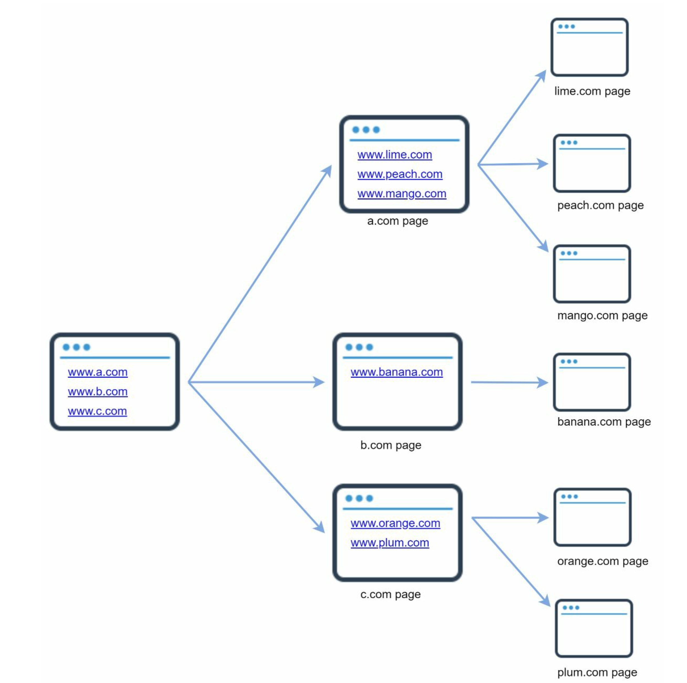

> Why do we use crawler?

- Search engine indexing: the most common use case. A crawler collects web pages to create a local index for search engines
- Web archiving: collecting information from web to preserve data for future uses. (e.g. national libraries run crawlers to archive web sites)
- Web mining: discovering useful knowledge from internet
- Web monitoring: monitoring copyright and trademark infringements over the internet

### Step 1 - Understand the problem and establish design scope

The basic algorithm of a web crawler:

1. Given a set of URLs, download all the web pages addressed by the URLs
2. Extract URLs from these web pages
3. Add new URLs to the list of URLs to be downloaded. Repeat these 3 steps

Characteristics good to note down from the conversation with interviewers:

- Scalability: The web is very large. Web crawling should be extremely efficient using parallelization
- Robustness: The web is full of traps. The crawler must handle all edge cases(e.g. Bad HTML, unresponsive servers, crashes, malicious links, etc.)
- Politeness: The crawler should not make too many requests to a website within a short time interval
- Extensibility: The system should be flexible so that minimal changes are needed to support new content types

#### Bank of the envelope estimation

Assumptions:

- 1 billion web pages are downloaded every month
- QPS: 1,000,000,000 / 30 days / 24 hours / 3600 seconds = ~400 pages/second
- Peak QPS = 2 \* QPS = 800 pages/sec
- The average web page size is 500k
- 1-billion-page \* 500k = 500 TB storage per month
- data is stored for 5 years, 500 TB _ 12 months _ 5 years = 30 PB

### Step 2 - Propose high-level design and get buy-in

High-level design:

    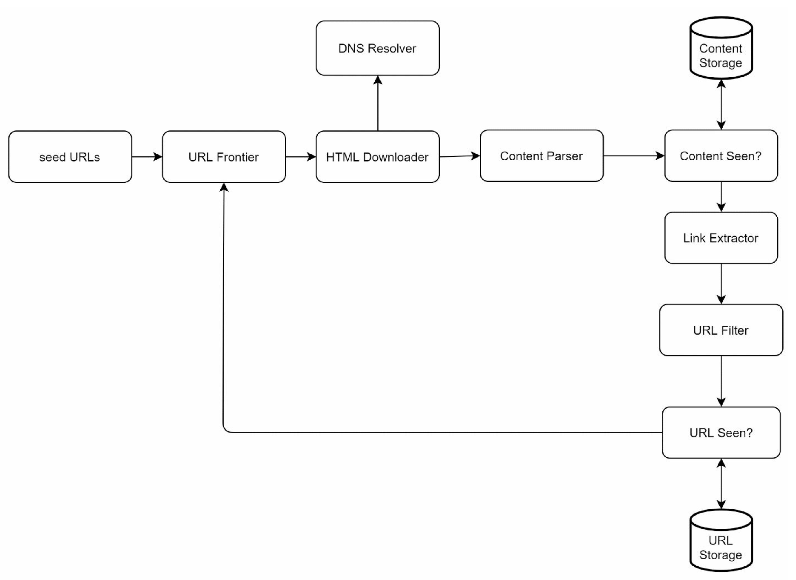

### Components

#### Seed URLs

A web crawler uses seed URLs as a starting point for the crawl process.

A good seed URL serves as a good starting point that a crawler can utilize to traverse as many links as possible. The general strategy is to divide the entire URL space into smaller ones.

1. dividing based on locality as different countries may have different popular websites
2. choosing seed URLs based on topics(e.g. shopping, sports, healthcare, etc)

**Seed URL selection is an open-ended question**

#### URL Frontier

Most modern web crawlers split the crawl state into two:

- to be downloaded
- already downloaded
  The component that stores URLs to be downloaded is called the **URL Frontier**.

#### HTML Downloader

downloads web pages given by URL Frontier

#### DNS Resolver

URL must be translated into an IP address. The HTML Downloader calls the DNS Resolver to get the corresponding IP address for the URL.

#### Content Parser

After a web page is downloaded, it must be parsed and validated because malformed web pages could provoke problems and waste storage space.

#### Content Seen?

To manage duplicated contents to eliminate data redundancy and shorten processing time. To compare two HTML documents, comparing the hash values of the two web pages is efficient.

#### Content Storage

Most of the content is stored on disk because the data set is too big to fit in memory. Popular content is kept in memory to reduce latency

#### URL Extractor

Parses and extracts links from HTML pages like below

    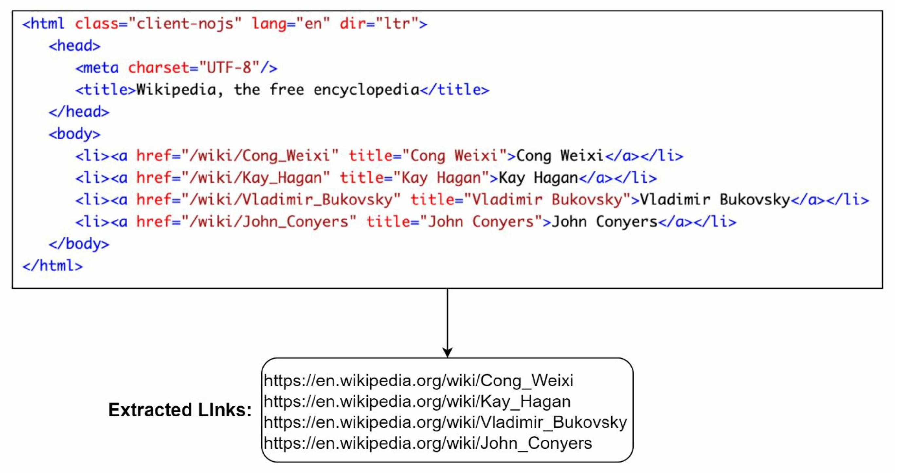

#### URL Filter

Excludes certain content types, file extensions, error links and URLS in blacklisted sites.

#### URL Seen?

Keeps track of URLs that are visited before or already in the Frontier. Bloom filter and hash table are common techniques to implement this component.

#### URL Storage

Stores already visited URLs.

---

### Workflows:

    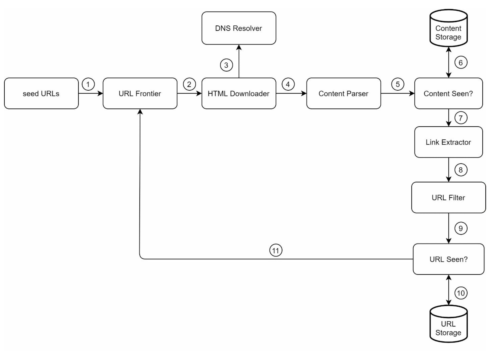

①: Add seed URLs to the URL Frontier
②: HTML Downloader fetches a list of URLs from URL Frontier
③: HTML Downloader gets IP addresses of URLs from DNS resolver and starts downloading
④: Content Parser parses HTML pages and checks if pages are malformed
⑤: After content is parsed and validated, it is passed to the "Content Seen?" component
⑥: "Content Seen" component checks if a HTML page is already in the storage
⑦: Link extractor extracts links from HTML pages
⓼: Extracted links are passed to URL filter
⑨: After links are filtered, they are passed to the "URL Seen?" component
10: "URL Seen" component checks if a URL is already in the storage, if it is, nothing needs to be done
11: If a URL has not been processed before, it is added to the URL Frontier

### Step 3 - Design deep dive

Important building components and techniques for web crawler:

- Depth-first search (DFS) vs Breath-first search (BFS)
- URL Frontier
- HTML Downloader
- Robustness
- Extensibility
- Detect and avoid problematic content

#### DFS vs BFS

The crawl process can be seen as traversing a directed graph from one web page to others. Two common graph traversal algorithms are DFS and BFS, but DFS is usually not a good choice because the depth of DFS can be very deep.

**BFS** is commonly used by web crawlers and is implemented by a first-in-first-out(FIFO) queue. In a FIFO queue, URLs are dequeued in the order they are enqueued, but this has two problems:

1. Most links from the same web page are linked back to the same host. For example, in a below figure, since all the links in wikipedia.com are internal links, when the crawler tries to download web pages in parallel, Wikipedia servers will be flooded with request. This is considered as **impolite**.
2. Standard BFS does not take the priority of a URL into consideration. The web is large and not every page has the same level of quality and importance. We may want to prioritize URLs according to their page ranks, web traffic, update frequency, etc.

    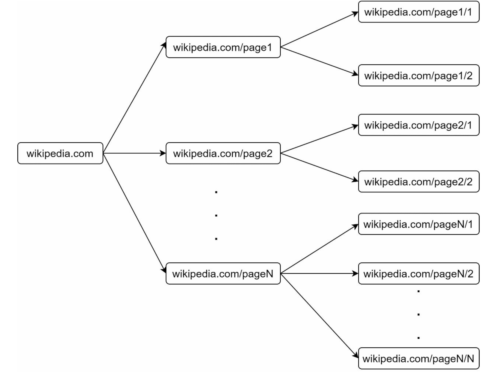

#### URL Frontier

URL frontier helps to address the above problems. It ensures politeness, URL prioritization, and freshness.

##### Politeness

A web crawler should avoid sending too many requests to the same hosting server within a short period. Sending too many requests is considered as impolite or even treated as denial-of-service(DOS) attack.

The idea is to download one page at a time from the same host. A delay can be added between two download tasks. The politeness constraint is implemented by maintaining a mapping from website hostnames to download(worker) threads. Each downloader thread has a separate FIFO queue and only downloads URLs obtained from that queue.

    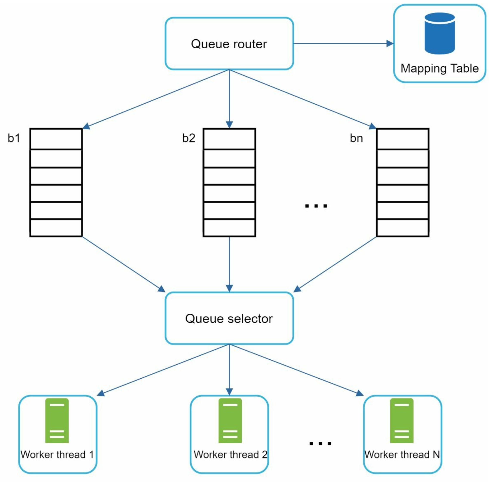

- Queue router: ensures that each queue(b1, b2,.., bn) only contains URLs from the same host
- Mapping table: maps each host to a queue

    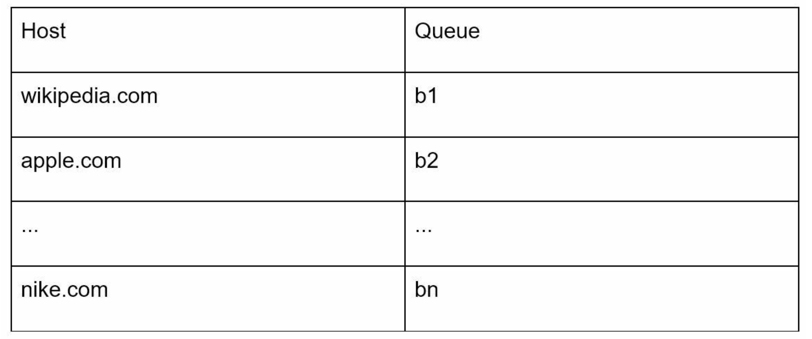

- FIFO queues(b1, b2 to bn): each queue contains URLs from the same host
- Queue selector: each worker thread is mapped to a FIFO queue, and it only downloads URLs from that queue. The queue selection logic is done by the Queue selector
- Worker thread 1 to N: A worker thread downloads web pages one by one from the same host. A delay can be added between two download tasks

##### Priority

We prioritize URLs based on usefulness, which can be measured by PageRank, website traffic, update frequency, etc. "Prioritizer" is the component that handles URL prioritization.

    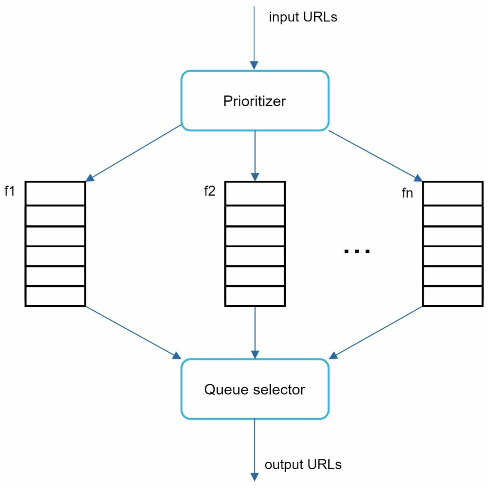

- Prioritizer: takes URLs as input and computes the priorities
- Queue f1 to fn: each queue has an assigned priority. QUeues with high priority are selected with higher probability
- Queue selector: Randomly choose a queue with a bias towards queues with higher priority

So, URL Frontier design looks like below containing two modules:

- Front queues: manage prioritization
- Back queues: manage politeness

    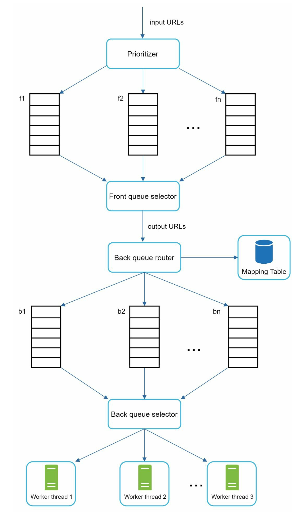

#### Freshness

A web crawler must periodically re-crawl downloaded pages to keep our data set fresh. A few strategies to optimize freshness are listed as follows:

- Re-crawl based on web pages' update history
- Prioritize URLs and re-crawl important pages first and more frequently

#### Storage for URL Frontier

In real-world crawl for search engines, putting everything in memory is neither durable nor scalable.

The majority of URLs are stored on disk, and to reduce the cost of reading from the disck and writing to the disck, we maintain buffers in memory for enqueue/dequeue operations. Data in the buffer is periodically written to the disck.

### HTML Downloader

#### Robots.txt

Robots.txt, called Robots Exclusion Protocol, is a standard used by websites to communicate with crawlers. It specifies what pages crawlers are allowed to download. Before attempting to crawl a web site, a crawler should check its corresponding robots.txt and follow its rules.

To avoid repeat downloads of robots.txt file, we cache the results of the file and it's downloaded and saved to cache periodically.

#### Performance optimization

**1. Distributed crawl**
Crawl jobs are distributed into multiple servers to achieve high performance, and each server runs multiple threads. The URL space is partitioned into smaller pieces; so, each downloader is responsible for a subset of the URLs.

    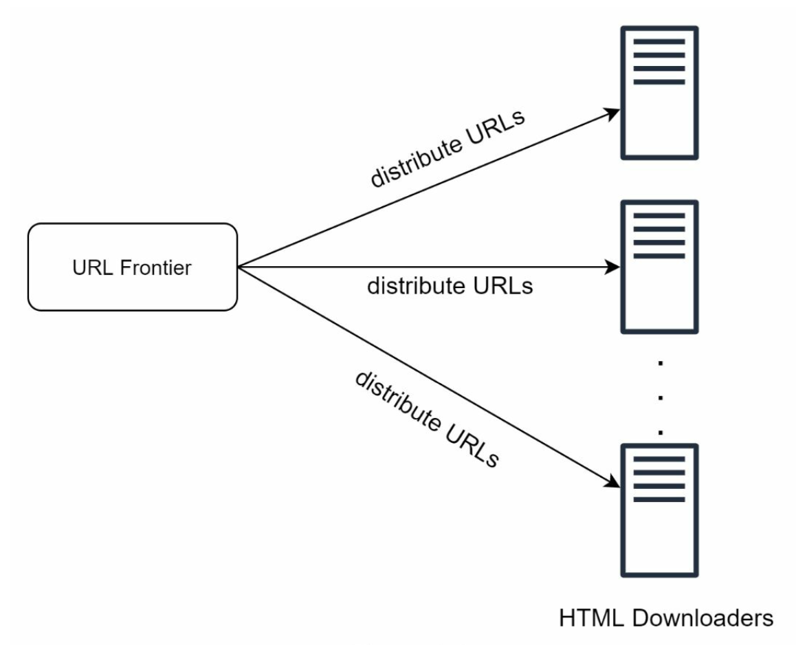

**2. Cache DNS Resolver**
DNS Resolver is a bottleneck for crawlers because DNS requests might take time due to the synchronous nature of many DNS interfaces. It usually ranges from 10ms to 200ms. Once a request to DNS is carried out by a crawler thread, other threads are blocked until the first request is completed. **DNS cache** keeps the domain name to IP address mapping and is updated periodically by cron jobs.

**3. Locality**
Distribute crawl servers geographically. When crawl servers are closer to website hosts, crawlers experience faster download time.

**4. Short timeout**
Some web servers respond slowly or may not respond at all. To avoid long wait time, a maximal wait time is specified. If a host does not respond within a predefined time, the crawler will stop teh job and crawl some other pages.

#### Robustness

A few approaches to improve system robustness:

- **Consistent hashing**: helps to distribute loads among downloaders. A new downloader server can be added or remove using consistent hashing
- **Save crawl states and data**: to guard against failures, crawl states and data are written to a storage system
- **Exception handling**: crawler must handle exceptions gracefully without crashing the system
- **Data validation**: to prevent system errors

#### Extensibility

Example of adding a new module:

    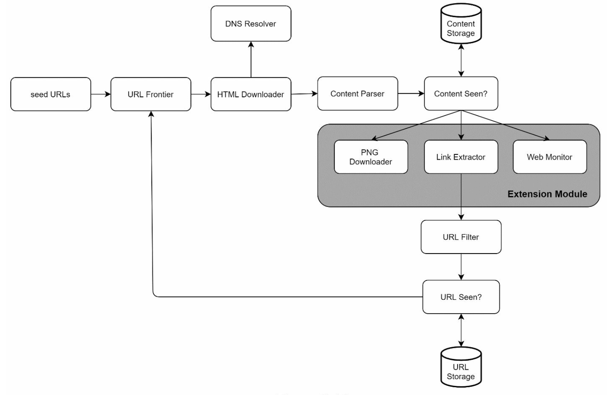

- PNG Downloader module is plugged-in to download PNG files
- Web Monitor module is added to monitor the web and prevent copyright and trademark infringements

#### Detect and avoid problematic content

1. Redundant content
   Nearly 30% of the web pages are duplicates. Hashes or checksums help to detect duplication

2. Spider traps
   A spider trap is a web page that causes a crawler in an infinite loop. It is hard to develop automatic algorithms to avoid spider traps; but a user can manually verify and identify a spider trap, and either exclude those websites from the crawler or apply some customized URL filters

3. Data noise
   Contents have little or no value, such as advertisements, code snippets, spam URLs, etc are not useful and should be excluded if possible.

### Step 4 - Wrap up

Talking points

- Server-side rendering: Many websites use scripts like JavaScript, AJAX, etc to generate links on the fly. We won't be able to retrieve dynamically generated links if we download and parse web pages directly. Server-side rendering(also called dynamic rendering) can solve this problem.
- Filter out unwanted pages: anti-spam component is beneficial in filtering out low quality and spam pages
- Database replication and sharding: improves data layer availability, scalability, and reliability
- Horizontal scaling
- Availability, consistency, and reliability
- Analytics
