# CHAPTER 10: DESIGN A NOTIFICATION SYSTEM

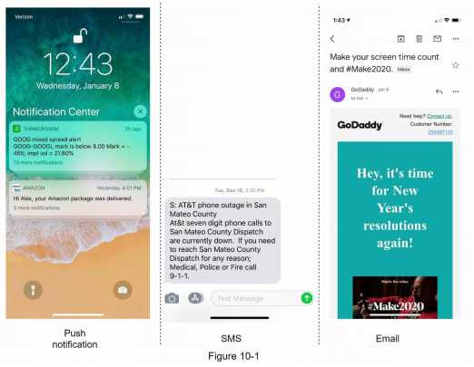


## Step 1 - Understand the problem and establish design scope
```
It requires a deep understanding of the notification ecosystem.
Candidate: What types of notifications does the system support? 
Interviewer: Push notification, SMS message, and email. 
Candidate: Is it a real-time system?
Interviewer: Let us say it is a soft real-time system. We want a user to receive notifications 
as soon as possible. However, if the system is under a high workload, a slight delay is acceptable.
Candidate: What are the supported devices?
Interviewer: iOS devices, android devices, and laptop/desktop. 
Candidate: What triggers notifications?
Interviewer: Notifications can be triggered by client applications. They can also be scheduled on the server-side.
Candidate: Will users be able to opt-out?
Interviewer: Yes, users who choose to opt-out will no longer receive notifications. 
Candidate: How many notifications are sent out each day?
Interviewer: 10 million mobile push notifications, 1 million SMS messages, and 5 million emails.
```

## Step 2 - Propose high-level design and get buy-in
This section shows the high-level design that supports various notification types: 

iOS push notification, Android push notification, SMS message, and Email. 

It is structured as follows:
- Different types of notifications
- Contact info gathering flow
- Notification sending/receiving flow

### Different types of notifications
[High level]

Three components to send an iOS push notification:
```
• Provider.
  A provider builds and sends notification requests to Apple Push Notification Service (APNS).
  To construct a push notification, the provider provides the following data:
    • Device token: This is a unique identifier used for sending push notifications.
    • Payload: This is a JSON dictionary that contains a notification’s payload. Here is an
      example:
```
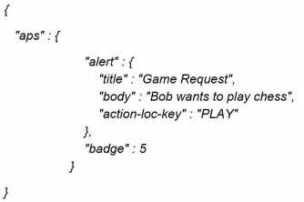
```
  • APNS: This is a remote service provided by Apple to propagate push notifications to iOS devices.
  • iOS Device: It is the end client, which receives push notifications.
```

#### a. iOS push notification

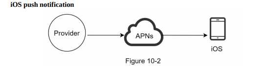

#### b. Android push notification

Android adopts a similar notification flow. 

Instead of using APNs, Firebase Cloud Messaging (FCM) is commonly used to send push notifications to android devices.

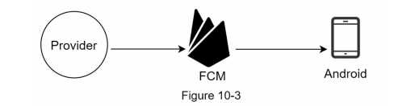


#### c. SMS message
For SMS messages, third party SMS services like Twilio [1], Nexmo [2], and many others are commonly used. 

Most of them are commercial services.

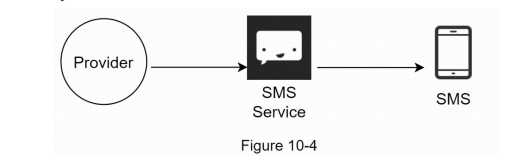

#### d. Email
Although companies can set up their own email servers, many of them opt for commercial email services. 

Sendgrid [3] and Mailchimp [4] are among the most popular email services, which offer a better delivery rate and data analytics.

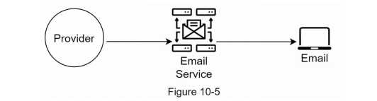

Design after including all the third-party services.

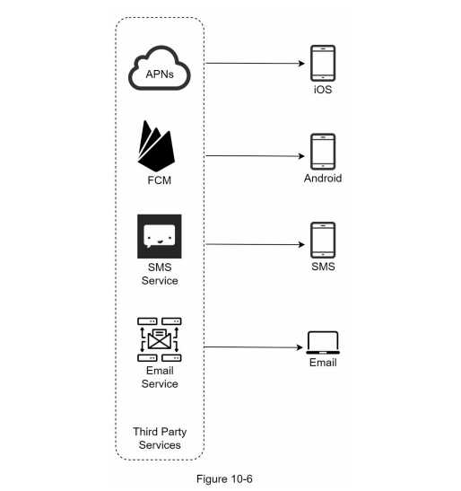


### Contact info gathering flow
To send notifications, we need to gather mobile device tokens, phone numbers, or email addresses. 

As shown in Figure 10-7, when a user installs our app or signs up for the first time, API servers collect user contact info and store it in the database.

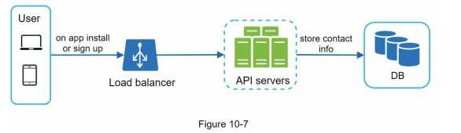

Figure 10-8 shows simplified database tables to store contact info. 

Email addresses and phone numbers are stored in the user table, whereas device tokens are stored in the device table. 

A user can have multiple devices, indicating that a push notification can be sent to all the user devices.

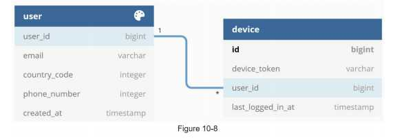

### Notification sending/receiving flow

Propose some optimizations.

#### High-level design
Design, and each system component (figure 10-9)

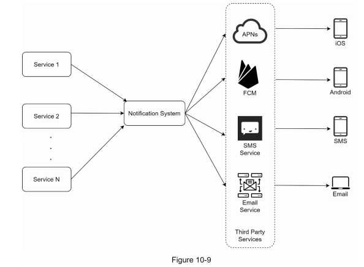

Service 1 to N: 
```
A service can be a micro-service, a cron job, or a distributed system that triggers notification sending events.
For example, a billing service sends emails to remind customers of their due payment or 
a shopping website tells customers that their packages will be delivered tomorrow via SMS messages.
```

Notification system:
```
The notification system is the centerpiece of sending/receiving notifications.
Starting with something simple, only one notification server is used.
It provides APIs for services 1 to N, and builds notification payloads for third party services.
```

Third-party services: 
```
Third party services are responsible for delivering notifications to users.
While integrating with third-party services, we need to pay extra attention to extensibility.
Good extensibility means a flexible system that can easily plugging or unplugging of a third-party service.
Another important consideration is that a third-party service might be unavailable in new markets or in the future.
For instance, FCM is unavailable in China.
Thus, alternative third-party services such as Jpush, PushY, etc are used there.
```

iOS, Android, SMS, Email: 
```
Users receive notifications on their devices.
```

Three problems 
```
• Single point of failure (SPOF): A single notification server means SPOF.
• Hard to scale: The notification system handles everything related to push notifications in one server.
                 It is challenging to scale databases, caches, and different notification processing components independently.
• Performance bottleneck: Processing and sending notifications can be resource intensive. 
                  For example, constructing HTML pages and waiting for responses from third party services could take time.
                  Handling everything in one system can result in the system overload, especially during peak hours.
```

High-level design (improved) figure10-10
```
After enumerating challenges in the initial design, we improve the design as listed below:
  • Move the database and cache out of the notification server.
  • Add more notification servers and set up automatic horizontal scaling.
  • Introduce message queues to decouple the system components.
```

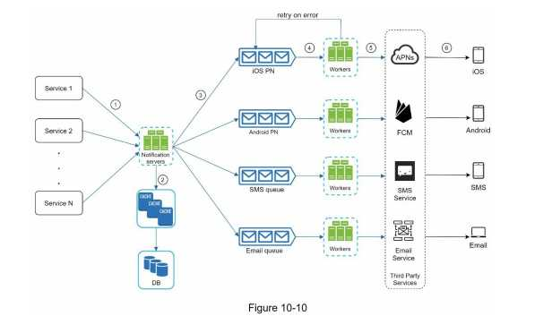

```
The best way to go through the above diagram is from left to right:
```

Service 1 to N: 
```
They represent different services that send notifications via APIs provided by notification servers.
```

Notification servers: 
```
They provide the following functionalities:
  • Provide APIs for services to send notifications. Those APIs are only accessible internally or by verified clients to prevent spams.
  • Carry out basic validations to verify emails, phone numbers, etc.
  • Query the database or cache to fetch data needed to render a notification.
  • Put notification data to message queues for parallel processing.
```

Example of the API to send an email:
```
POST https://api.example.com/v/sms/send 
Request body
```

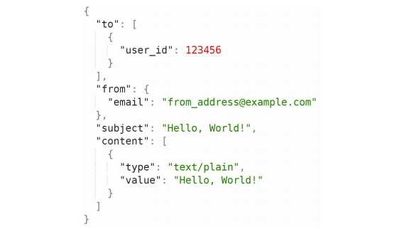

Cache: 
```
User info, device info, notification templates are cached.
```

DB: 
```
It stores data about user, notification, settings, etc.
```

Message queues: 
```
They remove dependencies between components.
Message queues serve as buffers when high volumes of notifications are to be sent out.
Each notification type is assigned with a distinct message queue
  so an outage in one third-party service will not affect other notification types.
```

Workers: 
```
Workers are a list of servers that pull notification events from message queues and send them to the corresponding third-party services.
```  

Third-party services: 
```
Already explained in the initial design. 
iOS, Android, SMS, Email: Already explained in the initial design.
```

Next, let us examine how every component works together to send a notification:
```
1. A service calls APIs provided by notification servers to send notifications.
2. Notification servers fetch metadata such as user info, device token, and notification setting from the cache or database.
3. A notification event is sent to the corresponding queue for processing. For instance, an iOS push notification event is sent to the iOS PN queue.
4. Workers pull notification events from message queues.
5. Workers send notifications to third party services.
6. Third-party services send notifications to user devices.
```

## Step 3 - Design deep dive
```
In the high-level design, we discussed different types of notifications, contact info gathering flow, and notification sending/receiving flow.

We will explore the following in deep dive:
  • Reliability.
  • Additional component and considerations:
        notification template, notification settings,
        rate limiting, retry mechanism, security in push notifications,
        monitor queued notifications and event tracking.
  • Updated design.
```

### Reliability

#### How to prevent data loss?
```
No lost data. 
Notifications can usually be delayed or re-ordered, but never lost.
To satisfy this requirement, the notification system persists notification data in a database and implements a retry mechanism.
The notification log database is included for data persistence. - Figure 10-11.
```

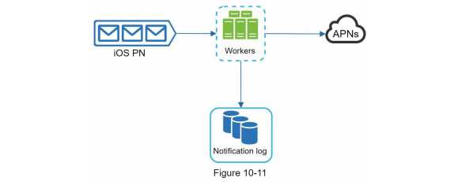

#### Will recipients receive a notification exactly once?
```
The short answer is no. Although notification is delivered exactly once most of the time, the distributed nature could result in duplicate notifications.
To reduce the duplication occurrence, we introduce a dedupe mechanism and handle each failure case carefully.
Here is a simple dedupe logic:
  When a notification event first arrives, we check if it is seen before by checking the event ID. 
  If it is seen before, it is discarded. Otherwise, we will send out the notification.
  For interested,
    readers to explore why we cannot have exactly once delivery, refer to the reference material
```

### Additional components and considerations
```
We have discussed how to collect user contact info, send, and receive a notification.
A notification system is a lot more than that.
Here we discuss additional components
  including template reusing, notification settings, event tracking, system monitoring, rate limiting, etc.
```


#### Notification template
```
A large notification system sends out millions of notifications per day, and many of these notifications follow a similar format.
Notification templates are introduced to avoid building every notification from scratch.
A notification template is a preformatted notification to create your unique notification by customizing parameters, styling, tracking links, etc.
Here is an example template of push notifications.
BODY:
  You dreamed of it. We dared it. [ITEM NAME] is back — only until [DATE]. 
CTA:
  Order Now. Or, Save My [ITEM NAME]
The benefits of using notification templates include maintaining a consistent format, reducing the margin error, and saving time.
```

#### Notification setting
```
Users generally receive way too many notifications daily and they can easily feel overwhelmed.
Thus, many websites and apps give users fine-grained control over notification settings.
This information is stored in the notification setting table, with the following fields:
  user_id   bigInt
  channel varchar   # push notification, email or SMS 
  opt_in   boolean    # opt-in to receive notification
Before any notification is sent to a user, we first check if a user is opted-in to receive this type of notification.
```


#### Rate limiting
```
To avoid overwhelming users with too many notifications, we can limit the number of notifications a user can receive.
This is important because receivers could turn off notifications completely if we send too often.
```

#### Retry mechanism
```
When a third-party service fails to send a notification, the notification will be added to the message queue for retrying.
If the problem persists, an alert will be sent out to developers.
```

#### Security in push notifications
```
For iOS or Android apps, appKey and appSecret are used to secure push notification APIs.
Only authenticated or verified clients are allowed to send push notifications using our APIs.
Interested users should refer to the reference material.
```

#### Monitor queued notifications
```
A key metric to monitor is the total number of queued notifications.
If the number is large, the notification events are not processed fast enough by workers.
To avoid delay in the notification delivery, more workers are needed.
Figure 10-12 (credit to [7]) shows an example of queued messages to be processed.
```

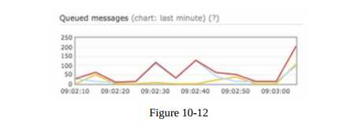

#### Events tracking
```
Notification metrics, such as open rate, click rate, and engagement are important in understanding customer behaviours.
Analytics service implements events tracking.
Integration between the notification system and the analytics service is usually required.
Figure 10-13 shows an example of events that might be tracked for analytics purposes.
```

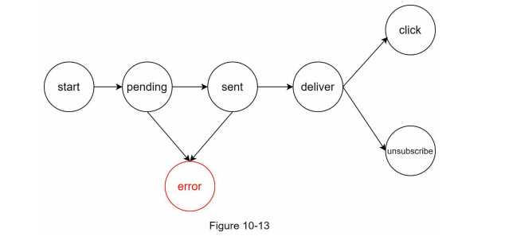

### Updated design

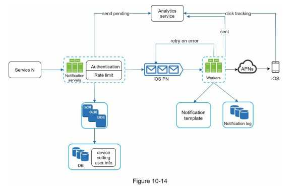
```

Putting everything together, Figure 10-14 shows the updated notification system design.
In this design, many new components are added in comparison with the previous design.
  • The notification servers are equipped with two more critical features: authentication and rate-limiting.
  • We also add a retry mechanism to handle notification failures.
    If the system fails to send notifications, they are put back in the messaging queue and the workers will retry for a predefined number of times.
  • Furthermore, notification templates provide a consistent and efficient notification   creation process.
  • Finally, monitoring and tracking systems are added for system health checks and future   improvements.
```

## Step 4 - Wrap up
```
Notifications are indispensable because they keep us posted with important information.
It could be a push notification about your favorite movie on Netflix, an email about discounts on new products, or a message about your online shopping payment confirmation.
In this chapter, we described the design of a scalable notification system that supports multiple notification formats:
push notification, SMS message, and email.
We adopted message queues to decouple system components.
Besides the high-level design, we dug deep into more components and optimizations.
  • Reliability: We proposed a robust retry mechanism to minimize the failure rate.
  • Security: AppKey/appSecret pair is used to ensure only verified clients can send notifications.
  • Tracking and monitoring: These are implemented in any stage of a notification flow to capture important stats.
  • Respect user settings: Users may opt-out of receiving notifications.
    Our system checks user settings first before sending notifications.
  • Rate limiting: Users will appreciate a frequency capping on the number of notifications they receive.
```
