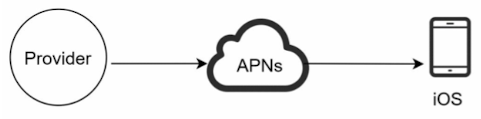
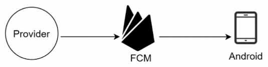
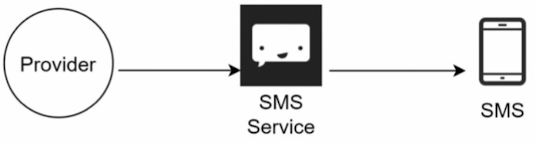
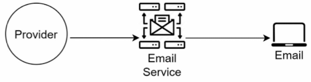
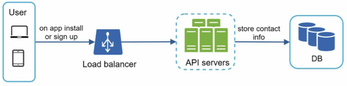
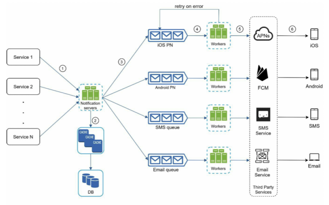
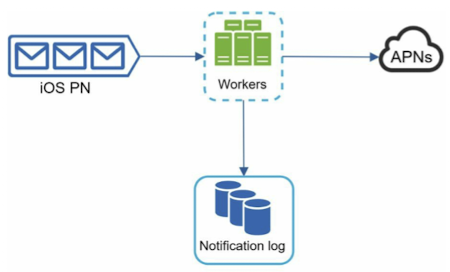
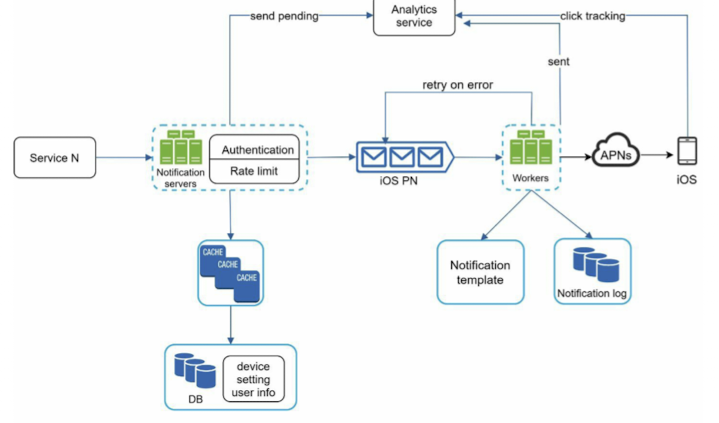

# Chapter 10. Design a notification system

## Step 1. Understand the problem and establish design scope
- What types of notifications does that system support?
- Is it a real-time system?
- What are the supported devices?
- What triggers notifications?
- Will uses be able to opt-out?
- How many nofications are sent out each day?

## Step 2. Propose high-level design and get buy-in

### Different types of notifications
#### iOS push notification
- Apple Push Notification Service (APNS)\

#### Andriod push notification
- FCM\

#### SMS message

#### Email

### Contact info gathering flow
- User information\

### Notification sending/receiving flow

- Service 1 to N:
  * A service can be a micro-service, a cron job, or a distributed system.
- Notification system:
  * Provide APIs for services to send notifications. Those APIs are only accessible internally or by verified clients to prevent spams.
  * Carry out basic validations to verify emails, phone numbers.
  * Query the database or cache to fetch data needed to render a notification.
  * Put notification data to message queues for parallel processing.
- Cache:
  * User info, device info, notification templates are cached.
- Database:
  * It stores data about user, notification, settings.
- Message queues:
* They remove dependencies between components. Message queues serve as buffers when high volumes of notifications are to be sent out. Each notification type is assigned with a distinct message queue so an outage in one third-party service will not affect other notification types.
- Third-party services
  * Third party services are responsible for delivering notifications to users.

## Step 3. Design deep dive
### Reliability
- How to prevent data loss?\
  Notifications can usually be delayed or re-ordered, but never lost. The notification system persists notification data in a database and implements a retry mechanism.

- Will recipients receive a notification exactly once?
  No. To reduce the deplication occurrence, we can use a dedupe mechanism. When a notification event first arrives, we check if it is seen before by checking the event ID. If it is seen before, it is descarded. Otherwise, we will send out the notification.

### Additional components and considerations
- Notification template
  Notification templates are introduced to avoid building every notification from scratch. A notification template is a preformatted notificiation to create your unique notification by customizing parameters, styling, tracking links.
- Notification setting
  Befor sending any notification, the system first check if a user is opted-in to receive this type of notification.
- Rate limiting
- Retry mechanism
- Security in push notifications
- Monitor queued notifications
- Events tracking

### Updated design

- The notification servers are equipped with authentication and rate-limiting.
