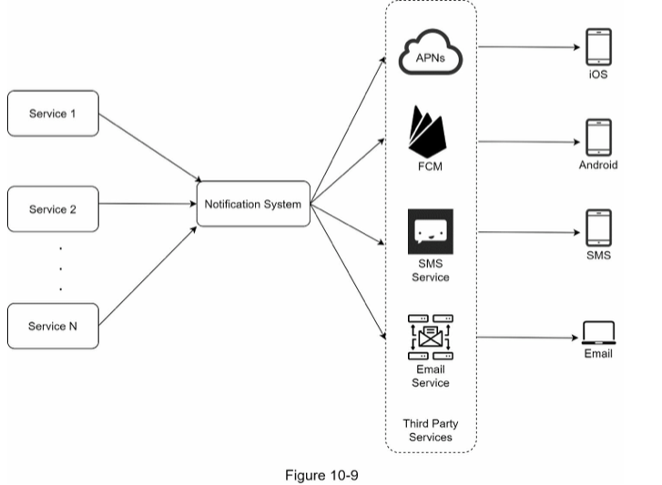
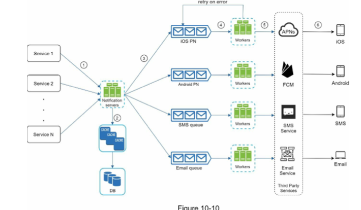

# CHAPTER 10: DESIGN A NOTIFICATION SYSTEM

- push notification, SMS message, and Email

## Step 1 - Understand the problem and establish design scope

- type of notification: push notification, SMS message, and Email
- real time?
- devices to support
- triggeres
- opt out
- max number per day

## Step 2 - Propose high-level design and get buy-in

### iOS push notification

- provider: build and send notification to APN
  - require: device token, payload
- APNS: remote service to send notifications to apple devices
- ios Debvice: end client

### Android push notification

- instead of APNS, FCM (Firebase Cloud Messaging)

### SMS message

- Twilio, Nexmo

### Email

- Sendgrid, Mailchimp

### Contact info gathering flow

- store user info in user and device info in devices

### Notification sending/receiving flow

#### High level design

- a service can be corn job, a distributed system that triggers notification sending event
- notification system: centerpiece of sending/receiving notification
- third party services: responsible for delivering actual notification
- iOS, Android, SMS, Email: devices that user receive notification
- problems with one server design
  - single point of failure
  - hard to scale
  - performance bottleneck

#### High level design (improved)

- Move the database and cache out of the notification server
- Add more notification servers and set up automatic horizontal scaling
- Introduce message queues to decouple the system components

- Notificaiton servers: provide api for services, carry out validaitons on contact info, query database/cache, put notification in message queue
- DB: stores data about user, notificaiton, settings
- Message queue: decouples componenets so that they can scale independently
- Workers: list of servers that pulls events from message queue and send them to notification 3rd party services

## Step 3 - Design deep dive

### Reliability

- How to prevent data loss?
  - persists notification data in a database and implements a retry mechanism
- Will recipients receive a notification exactly once?
  - dedupe mechanism
  - check if event is seen before and discard

### Notification template

- reusable template for notification message with some parameters

### Notification setting

- give users options to opt out

### Rate limitting

- limit number of notifications user can receive

### Retry mechanism

- retry to send, send an alert if keeps failing

### Security in push notifications

- only authenticated clients can send push notofication

### Monitor queued notifications

- adjust number of workers

### Event tracking

- understand user behaviour
