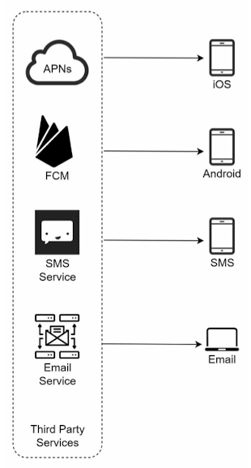
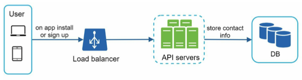
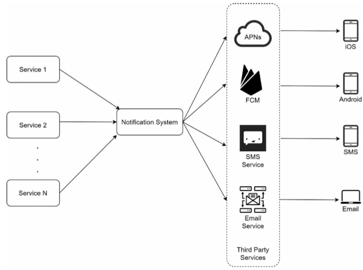
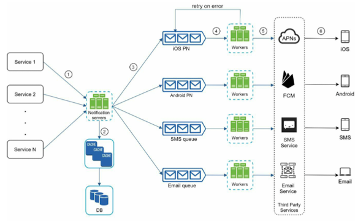
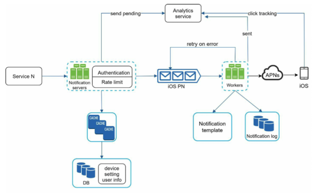

# Chapter 10 : Design A Notification System

## Step 1 - Understand the problem and establish design scope

- Ask questions to clarify the requirements
    - What types of notifications does the system support?
    - Real-time system?
    - Supported devices?
    - What triggers notifications?
    - Will users be able to opt-out?
    - How many notifications are sent out each day?

## Step 2 - Propose high-level design and get buy-in

### Different types of notifications

1. iOS push notification
- Provider : Apple Push Notification Service(APNS)에 알림 요청 보냄
    - Device token : push notifications를 보내는 데 사용되는 unique identifier
    - Payload : notification의 내용을 다모 있는 JSON dictionary
    ```{
        "aps": {
            "alert": {
            "title": "Game Request",
            "body": "Bob wants to play chess",
            "action-loc-key": "PLAY"
            },
            "badge": 5
            }
        }
    - APNS : iOS 기기에 push notifications를 전파하는 remote service
    - iOS Device : 알림을 받는 end client

2. Android push notification
- APNs 대신 Firebase Cloud Messaging(FCM) 사용

3. SMS message
- Twilio, Nexmo 등과 같은 third party SMS 서비스가 사용됨 (대부분 상업 서비스)

4. Email
- 회사들은 더 나은 전송률과 데이터 분석을 제공하는 상업 이메일 서비스 선택 (Sendgrid, Mailchimp)



### Contact info gathering flow



### Notification sending/receiving flow

#### High-level design



1. Service 1 to N
- micro-service, a cron job, 알림 전송 event를 trigger하는 분산 시스템

2. Notification system
- notifications를 sending/receiving 하는 데 필수
- 하나의 알림 서버를 사용하여 모든 알림 서비스 제공

3. Third-party services
- 사용자에게 알림을 전달하는 역할 (특정 third-party service가 새로운 시장이나 미래에 사용할 수 없을 수도 있음)

4. iOS, Android, SMS, Email
- 3 problems
1. Single point of failure
2. Hard to scale
3. Performance bottleneck

#### High-level design (improved)

- Notification server의 database와 cache를 분리함
- Automatic horizontal scaling을 지원
- 시스템 구성 요소들을 분리하기 위해 message queues 도입


- Service 1 to N
- Notification servers
- Cache
- DB
- Message queues
- Workers
- Third-party services
- iOS, Android, SMS, Email

## Step 3 - Design deep dive

### Reliability

- How to prevent data loss?
- Will recipients receive a notification exactly once?

### Additional components and considerations

- Notification template
- Notification setting
- Rate limiting
- Retry mechanism
- Security in push notifications
- Monitor queued notifications
- Events tracking

### Updated design



## Step 4 - Wrap up

- 여러 알림 유형 (push notification, SMS message, email)을 지원하는 scalable notification system의 design
    - Reliability : failure rate을 최소화하기 위한 retry mechanism 제안
    - Security : AppKey/appSecret 쌍을 사용하여 검증된 clients만이 알림을 전송할 수 있도록 보장
    - Tracking and monitoring : notification flow의 any stage에서 구현할 수 있으며 중요한 통계를 capture
    - Respect user settings : 사용자가 알림 수신을 거부할 수 있음
    - Rate limiting : 사용자들은 받는 알림의 수에 대한 빈도 제한을 선호함