# Chapter 10: Design a notification system
- Notification System 
  - Very popular feature for many application in recent years
    - Breaking news
    - Product updates
    - Event
    - Offering
- A notification is more than just mobile push notification
  - Mobile push notification
  - SMS message
  - Email
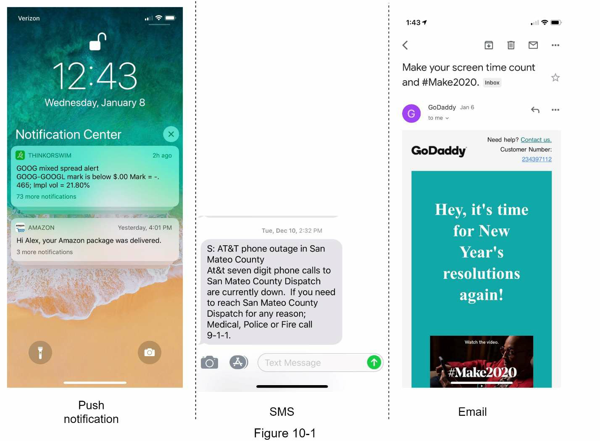

## Step 1 - Understand the problem and establish design scope
- Building a scalable system that sends out millions of notification a day
- Requires a deep understanding of the notification ecosystem

### Possible questions
- What types of notifications does the system support?
- Is it a real-time system
- What are the supported devices?
- What triggers notification
- Will users be able to opt-out?
- How many notifications are sent out each day?

### System requirements
- Support 3 types: Push notification, SMS message, and email 
- User should be received notifications as soon as possible, but slight daly is acceptable
- Support 3 type devices : iOS, Android, laptop/desktop
- Client application trigger notifications, also support scheduled sending
- User can choose to opt-out
- Notificatoin system support 10 million mobile push notifications, 1 million SMS message, and 5 million emails a day

## Step 2 - Propose high-level design and get buy-in
- High level design that supports various notification types: iOS / Android push notification, SMS messag and email.
- Structured as follows
  - Different types of notifications
  - Contact info gathering flow
  - Notification sending / receiving flow

### Different types of notifications
- How each notification type works at a high level
#### iOS push notification
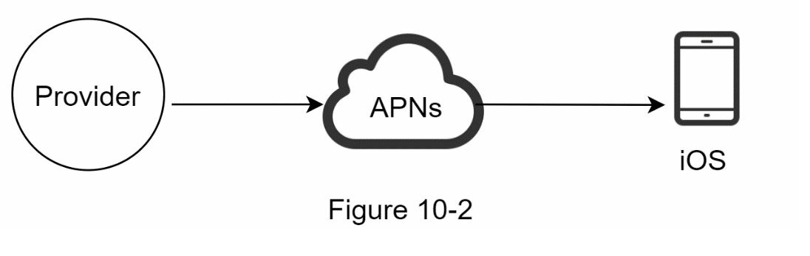
- Three components to send an iOS push notificaiton
  - Provider
    - Builds and sends notification requests to Apple Push Notification Service(APNS)
    - Provier provides the following data to construct a push notification
      - Device token: Unique identifier used for sending push notification
      - Payload: Json dictionary that contains a notification's payload
        ```
        { 
            "aps" : {
                "alert" : {
                    "title": "Game request",
                    "body" : "Bob wants to play chess",
                    "action-loc-key": "PLAY"
                },
                "badge" : 5
            }
        }
        ```
  - APNS
    - Remove service provided by Apple to propagate push notificaitons to iOS device
  - iOS device
    - The end client
    - Receives push notifications

#### Android push notification
- Similar nofiticatoin flow with APNS
- Instead of using APNs, Firebase Cloud Messaging (FCM) is commonly used to send push notification to android device
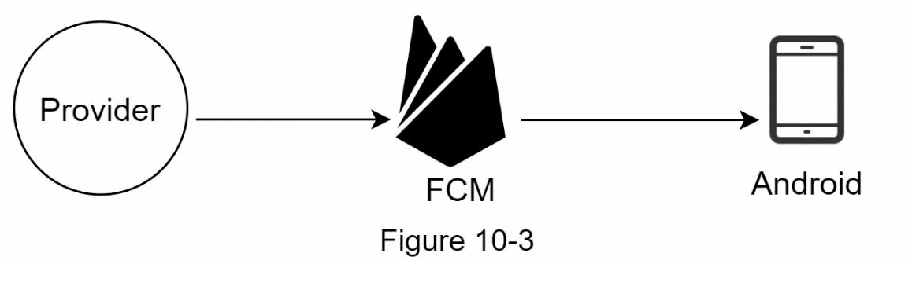

#### SMS message
- Third party SMS services like Twilio, Nexmo, and many others are commonly used. 
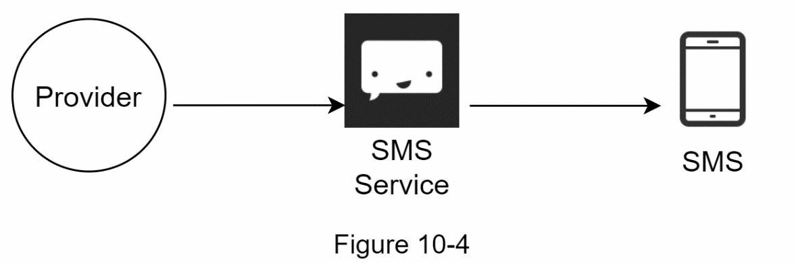

#### Email 
- Although companies can set up their own email servers, many of them opt for commercial email services
- Sendgrid / Mailchimp
  - Better delivery rate
  - Data analytics
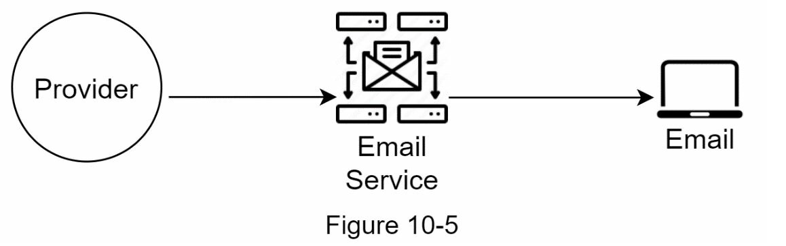
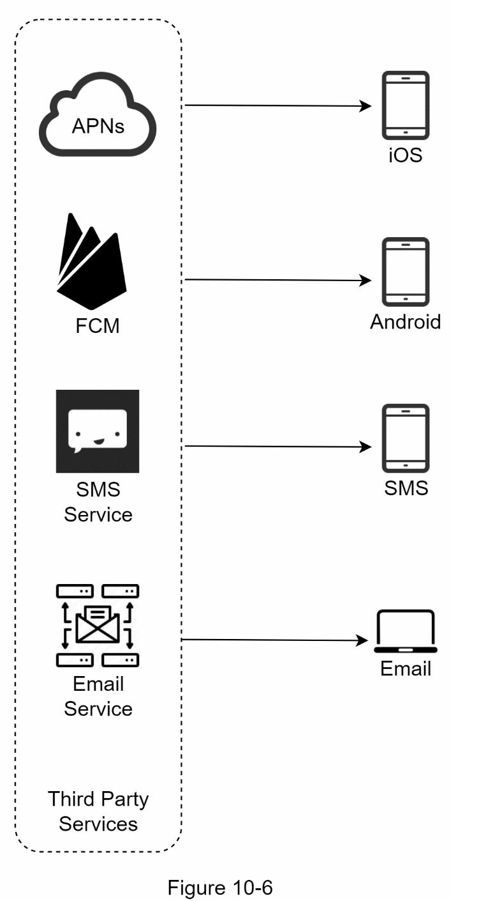

### Contact info gathering flow
- To send notification, we need to gather mobile device tokens, phone numbers, or email address
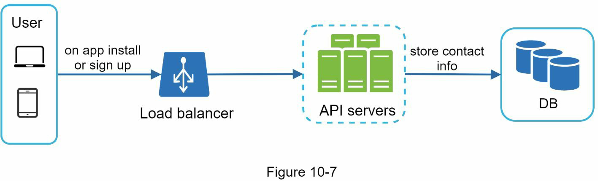
- A user installs our app or signs up for the first time
- API servers collect user contact info and store it in the database. 
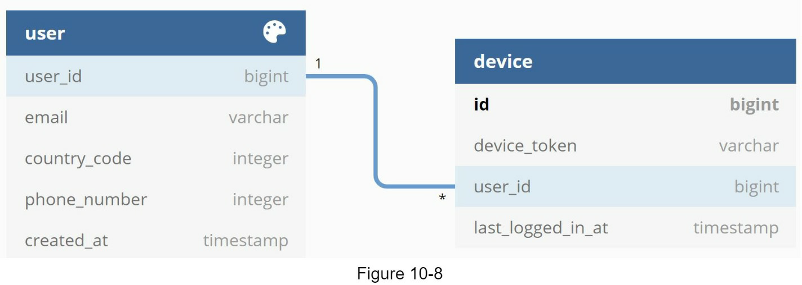
- Simple database tables to store contact info
  - User table
    - Email addresses and phone numbers
  - Device table
    - Device tokens
- User can have multiple devices
  - Push notification can be sent to all the user device

### Notification sending/receiving flow
#### High-level design
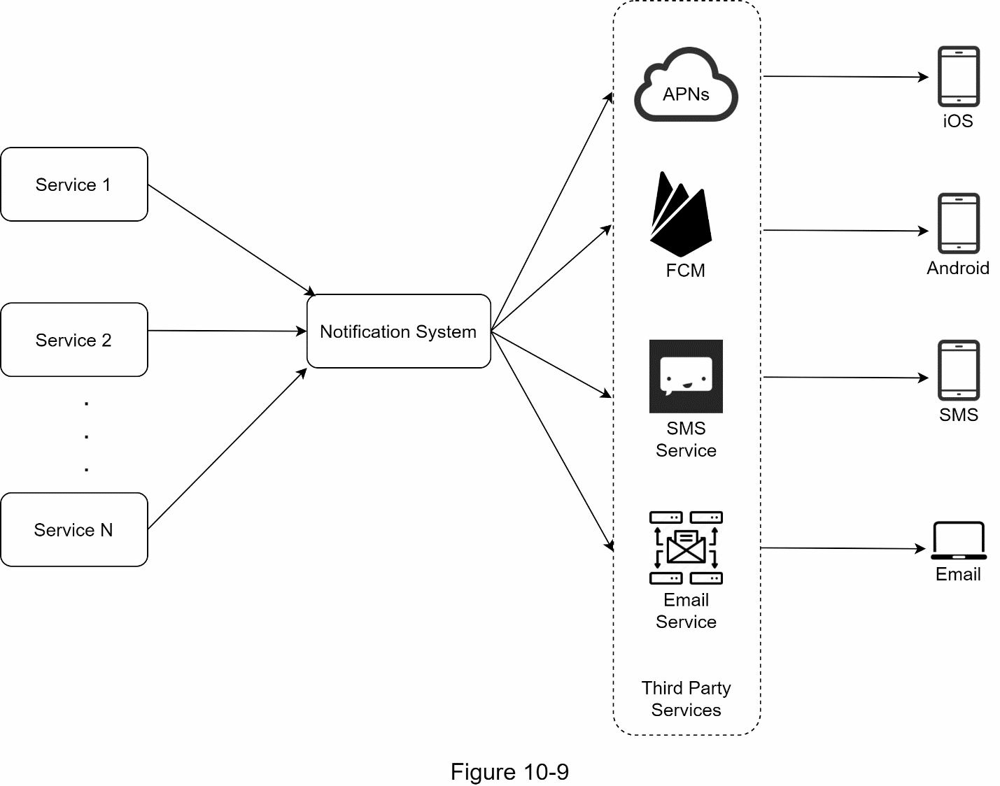
##### Service 1 to N
- A service can be a micro-service / a cron job / a distributed system that tiggers notification sending events
- Billing service

##### Notification system
- Centerpriece of sending/receiving notification
- Starting with something simple, only one notification server is used
- APIs for service 1 to N
- Build notification payload for third party services.

##### Third-party services
- Responsbile for delivering notifications to users
- Extensibility
  - Flexible system that can easily plugging or unplugging of a third-party service

##### iOS, android, SMS, email
- Users receive notifications on their devices
- Three problems 
  - Single Point of Failure (SPOF) - single notification server
  - Hard to scale
    - Notification system handle everything related to push notification in one server
    - Challenging to scale database / caches / different notification processing components independently
  - Performance bottleneck
    - Handling everyting in one system can result in the system overload, especially during peak hours

#### High-level design (imporved)
- After enumerating challenges in the initial design, improve the design as listed below
  - Move the database and cache out of the notification server
  - Add more notification servers and set up automatic horizontal scaling
  - Introduce message queues to decouple the system components
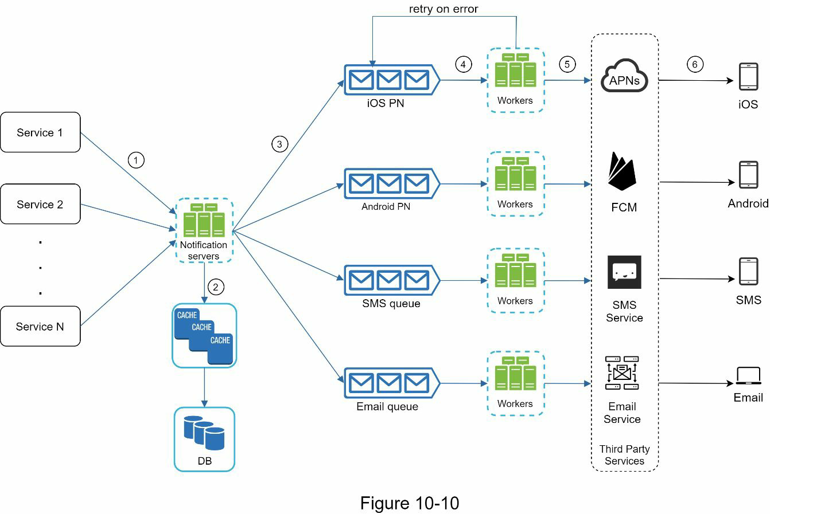

##### Service 1 to N
- Represent different services that send notifications via APIs provided by notification servers
##### Notification servers
- Provide APIs for services to send notifications. 
- APIs are only accessible internally or by verified clients to prevent spams
- Carry out basic validations to verify emails, phone numbers
- Query the database or cache to fetch data needed to erender a notification
- Put notificatoin data to message queue for parallel processing

###### Example of the API to send email
```
POST https://api.example/com/v/sms/send
```
###### Request Body
```
{
  "to" : [
    {
        "user_id" : 123456
    }
  ],
  "from" : {
    "email" : "from_address@example.com"
  },
  "subject" : "hello, world!", 
  "content" : [
    {
        "type": "text/plain",
        "value" : "hello, world!"
    }
  ]
}
```
##### Cache
- User info, device info, notification templates are cached
##### DB
- Sotres data about user, notification, settings
##### Message queues
- Remove dependencies bewteen components
- Message queues serve as buffers when high volumes of notifications are to be send out. 
- Each notification type is assigned with a distinct message queue so an outage in one thrid-party service will not affect other notification types. 
##### Workers
- Pull notification event from message queues and send them to the corresponding third-party services. 
##### How every component works together to send a notification
1. A service calls APIs provided by notification servers to send notifications
2. Notification servers fetch metadata such as user info, device token, and notification setting from the cache or database
3. A notification event is sent to the corresponding queue for processing. 
4. Workers pull notification events from emssage queues.
5. Workers send notifications to thrid party services
6. Third-party services send notification to user devices

## Step 3 - Design deep dive
- Explore the following in deep dive
  - Reliability
  - Additional component and considersations: notification template, notification setting, rate limiting, retry mechanism, security in push notification, monitor queued notifications and event tracking
  - Updated design

### Reliability
- Important reliability points when design a notification system in distributed environments

#### How to prevent data loss?
- One of the most important requirement in a notification system is that it cannot lost data
- Can deleyed or re-ordered but never lost
- So how?
  - Notification system persists notification data in a database and implements a retry mechanism
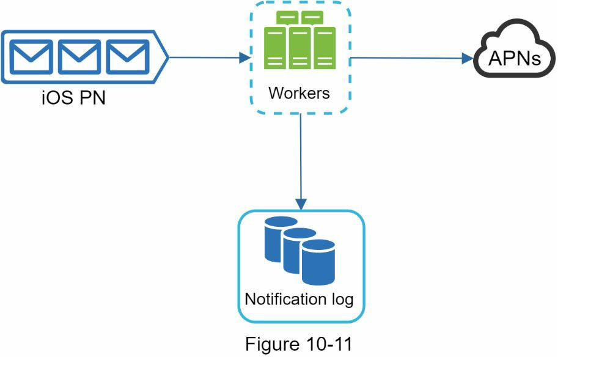

#### Will recipients receive a notification exactly once?
- No
- Distributed nature could result in duplicate notifications
- To reduce duplication occurence, dedupe mechanism is used
  - When a notification event first arrives, we check if it is seen before by checking the event ID
  - If it is seen before, it is discarded

### Additional components and considerations
- Until now, discussed how to collect user contact info, send, and receive a notification
- A notification system is a lot more than that

#### Notification template
- Notification templates are introduced to avoid building every notification from scratch
```
Body
Your dreamed of it. We dared it. [ITEM NAME] is back - only until [DATE].

CTA:
Order Now, Or, Save My [ITEM NAME]
```
- The benefits of using notification templates include maintaining a consistent format, reducing margin error, saving time

#### Notification setting
- Too many notifications can easily feel overwhelmed.
- Find-grained control over notification setting is needed
- This information is sotred in the notification setting table
```
user_id bigInt
chanel varchar  #push notification, email or SMS
opt_in boolean #opt-in to receive notification
```
- Before any notification is sent to a user, we first check if a user is opted-in

#### Rate limiting
- To avoid overwhelming users with too many notifications, we can limit the number of notifications a user can receive.
- This is important because receivers could turn off notifications completely if we send too often

#### Retry mechanism
- When a third-party service fail to send a notification, the notification will be added to the message queue for retrying. 
- If the problem persists, an alert will be sent out to developers

#### Security in push notifications
- For iOS or Android apps, appKey and appSecret are used to secure push notification APIs

#### Monitor queued notifications
- A key metric to monitor is the total number of queued notification. 
- If the nubmer is large, the notification events are not processed fast enough by workers
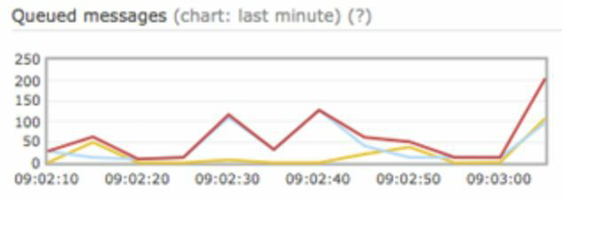

#### Events tracking
- Notification metrics, such as open rate, click rate, and engagement are important in understanding customer behavior
- Analytics service implements events tracking. 
- Integration between the notification system and the analytics service is usually required. 
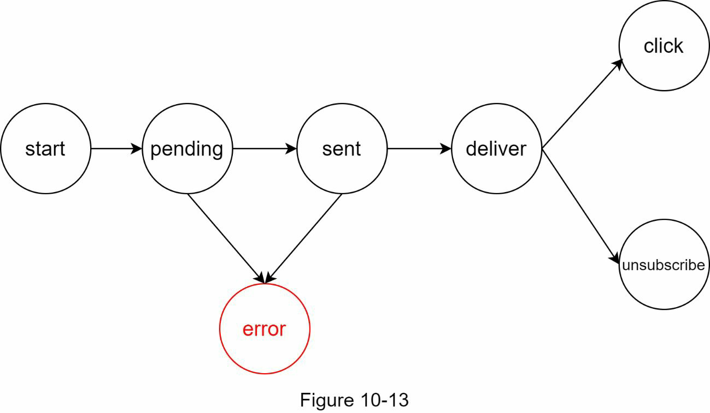

### Updated design
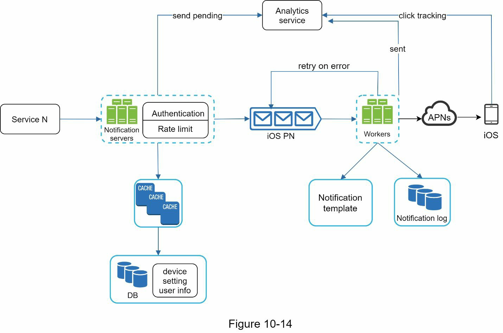
- This new design, many new components are added.
  - The notification servers are equipped with two more critical features
    - Authentication and rate-limiting
  - Add a retry mechanism to handle notification failures
  - Notification tempaltes provide a consistent and efficient notification creation process
  - Monitoring and tracking systems are added for system health check and future improvements

## Step 4 - Wrap up
- Notification are indeispensable because they keep us posted with important information. 
- Beyond the high-level design, below features are important
  - Reliability
  - Security
  - Tracking and monitoring
  - Respect user setting
  - Rate limiting
