## CHAPTER 10: DESIGN A NOTIFICATION SYSTEM
A notification is more than just mobile push notification. Three types of notification formats are: mobile push notification, SMS message, and Email. 
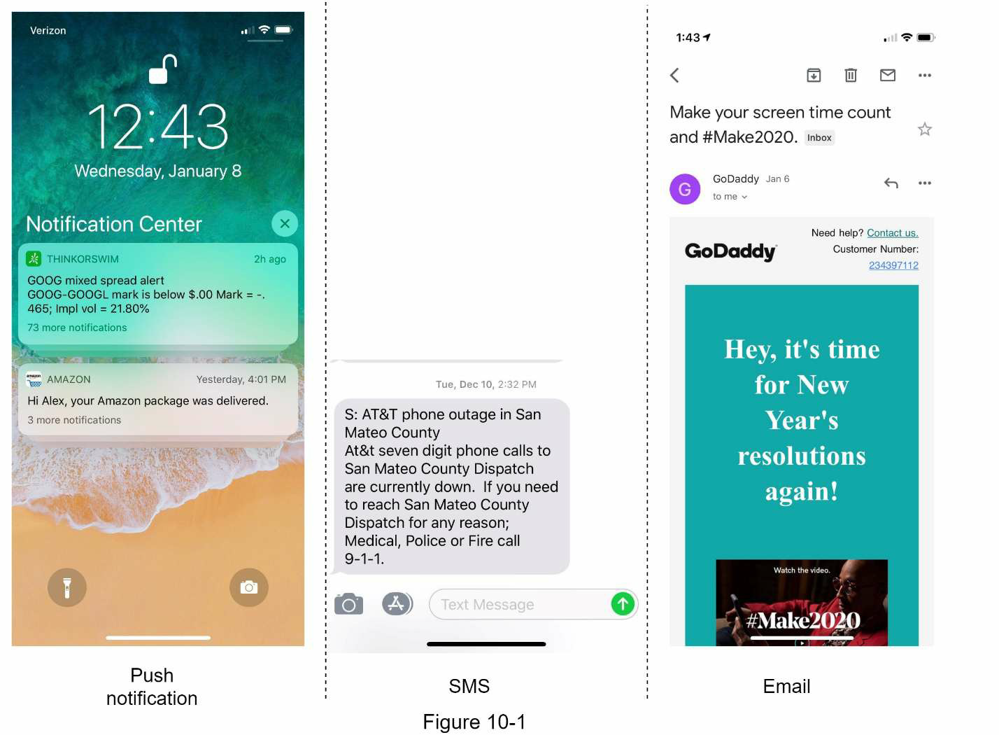

### Step 1 - Understand the problem and establish design scope
Candidate: What types of notifications does the system support?
Interviewer: Push notification, SMS message, and email.

Candidate: Is it a real-time system?
Interviewer: User to receive notifications as soon as possible. However, if the system is under a high workload, a slight delay is acceptable. (soft real-time system)

Candidate: What are the supported devices?
Interviewer: iOS devices, android devices, and laptop/desktop.

Candidate: What triggers notifications?
Interviewer: Client applications and be scheduled on the server-side.

Candidate: Opt-out support?
Interviewer: Yes

Candidate: How many notifications are sent out each day?
Interviewer: 10 million mobile push notifications, 1 million SMS messages, and 5 million emails.

### Step 2 - Propose high-level design and get buy-in.

- Different types of notifications
- Contact info gathering flow
- Notification sending/receiving flow

#### Different types of notifications
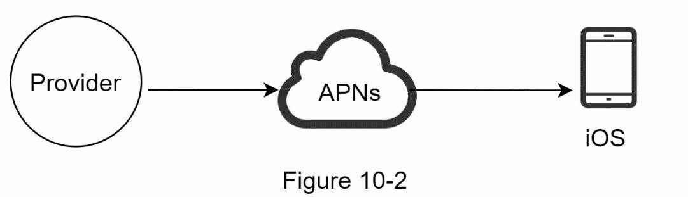

##### iOS push notification
- Provider. A provider builds and sends notification requests to Apple Push Notification Service (APNS).
• Device token: This is a unique identifier used for sending push notifications.
• Payload: This is a JSON dictionary that contains a notification’s payload. Here is an example:
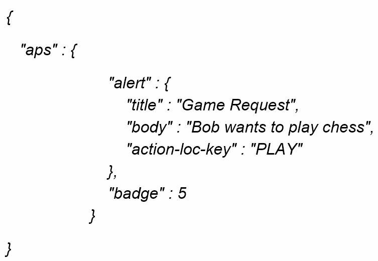
- APNS
- iOS Device

##### Android push notification
Android adopts a similar notification flow. Instead of using APNs, Firebase Cloud Messaging (FCM) is commonly used to send push notifications to android devices.
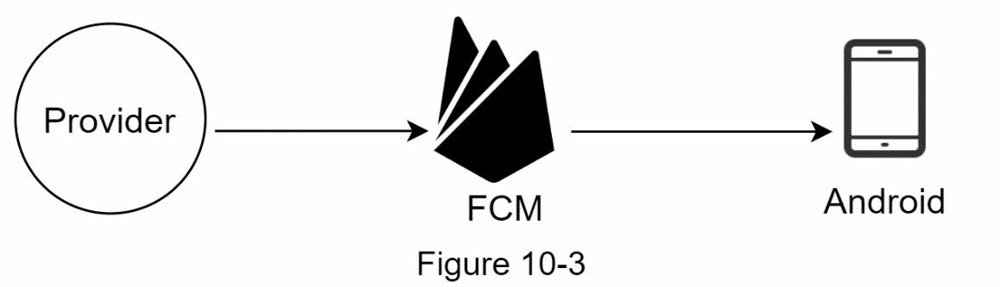

##### SMS message
For SMS messages, third party SMS services like Twilio, Nexmo, and many others are commonly used. Most of them are commercial services.
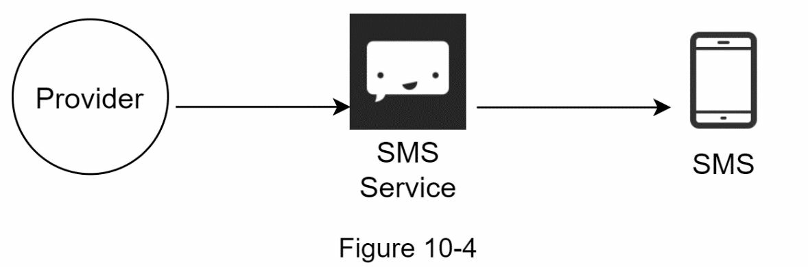

##### Email
Although companies can set up their own email servers, many of them opt for commercial email services. Sendgrid and Mailchimp are among the most popular email services,
which offer a better delivery rate and data analytics.
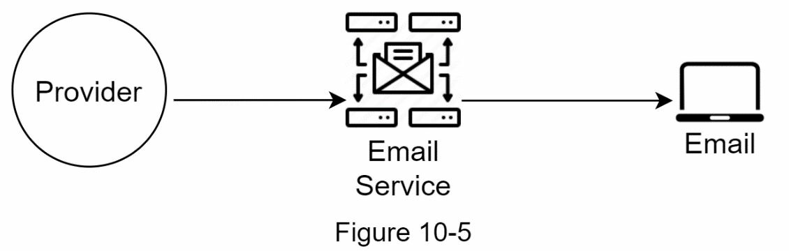

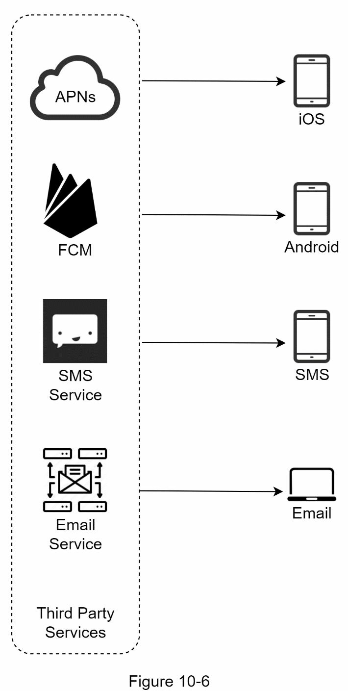

#### Contact info gathering flow
To send notifications, we need to gather mobile device tokens, phone numbers, or email addresses. As shown in Figure 10-7, when a user installs our app or signs up for the first time,
API servers collect user contact info and store it in the database.
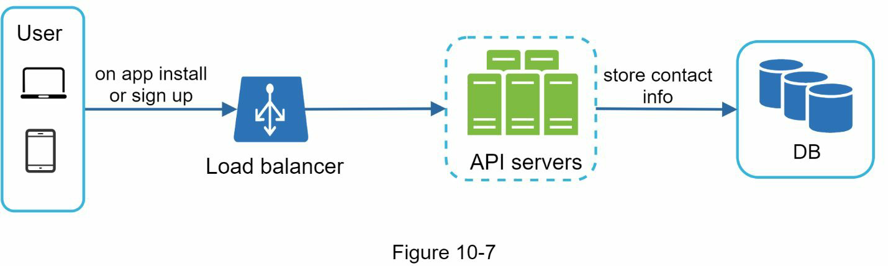
Email addresses and phone
numbers are stored in the user table, whereas device tokens are stored in the device table. A user can have multiple devices, indicating that a push notification can be sent to all the user
devices.
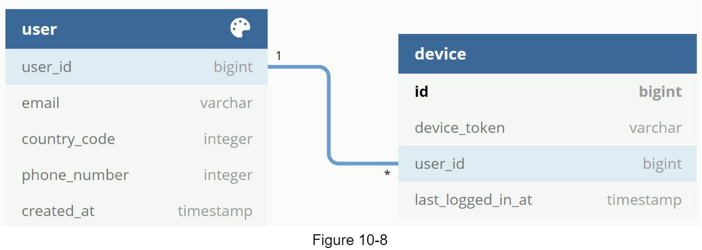

#### Notification sending/receiving flow

##### High-level design
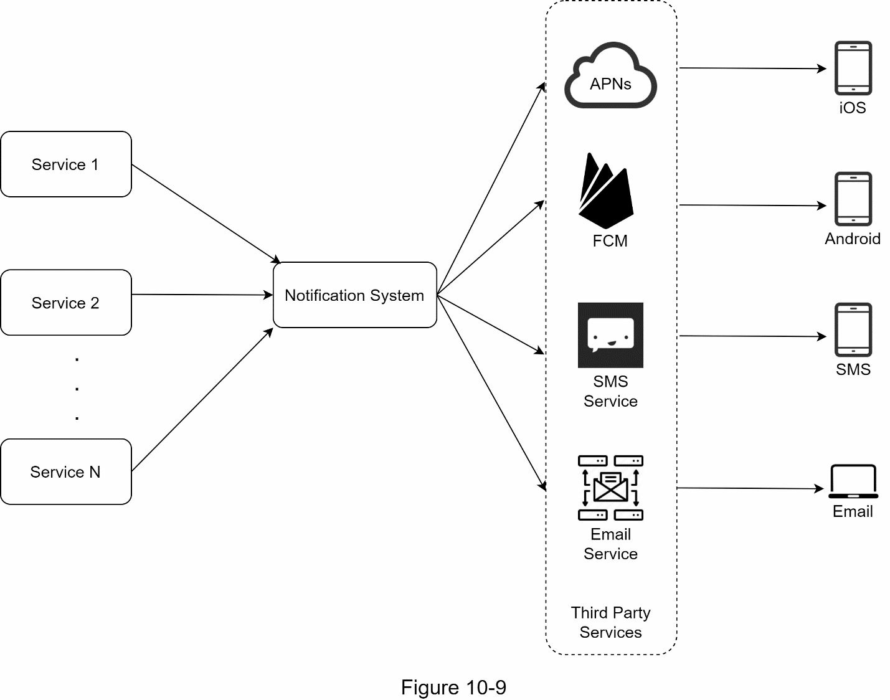

Three problems are identified in this design:
- Single point of failure (SPOF): A single notification server means SPOF.
- Hard to scale: The notification system handles everything related to push notifications in one server. It is challenging to scale databases, caches, and different notification processing components independently.
- Performance bottleneck: Processing and sending notifications can be resource intensive. For example, constructing HTML pages and waiting for responses from third party services could take time. Handling everything in one system can result in the system overload, especially during peak hours.

##### High-level design (improved)
- Move the database and cache out of the notification server.
- Add more notification servers and set up automatic horizontal scaling.
- Introduce message queues to decouple the system components.
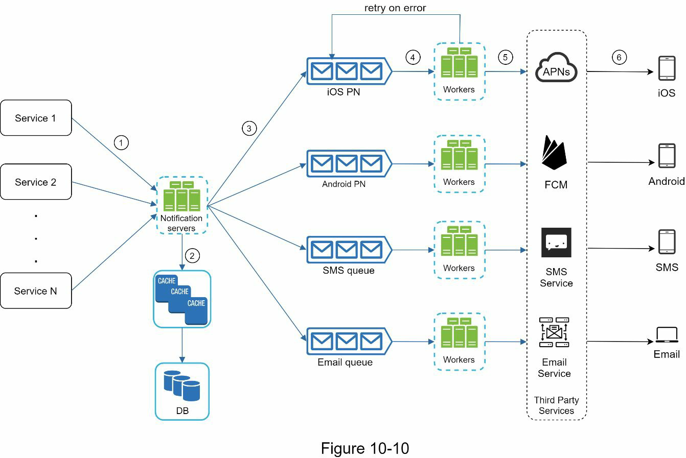
Next, let us examine how every component works together to send a notification:
1. A service calls APIs provided by notification servers to send notifications.
2. Notification servers fetch metadata such as user info, device token, and notification
setting from the cache or database.
3. A notification event is sent to the corresponding queue for processing. For instance, an
iOS push notification event is sent to the iOS PN queue.
4. Workers pull notification events from message queues.
5. Workers send notifications to third party services.
6. Third-party services send notifications to user devices.

### Step 3 - Design deep dive
#### Reliability

##### How to prevent data loss?
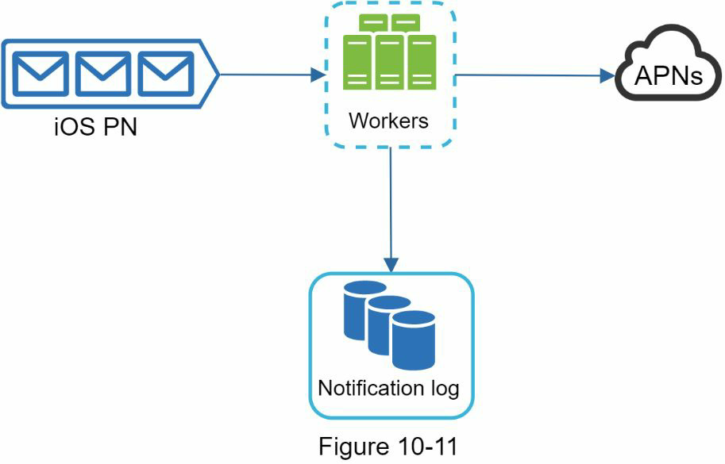

##### Will recipients receive a notification exactly once?
The short answer is no. Although notification is delivered exactly once most of the time, the distributed nature could result in duplicate notifications. To reduce the duplication occurrence, we introduce a dedupe mechanism and handle each failure case carefully. Here is a simple dedupe logic:
When a notification event first arrives, we check if it is seen before by checking the event ID. If it is seen before, it is discarded. Otherwise, we will send out the notification.

#### Additional components and considerations

##### Notification template
A large notification system sends out millions of notifications per day, and many of these notifications follow a similar format. Notification templates are introduced to avoid building
every notification from scratch.
##### Notification setting
Users generally receive way too many notifications daily and they can easily feel overwhelmed. Thus, many websites and apps give users fine-grained control over notification
settings.
##### Rate limiting
##### Retry mechanism
##### Security in push notifications
##### Monitor queued notifications
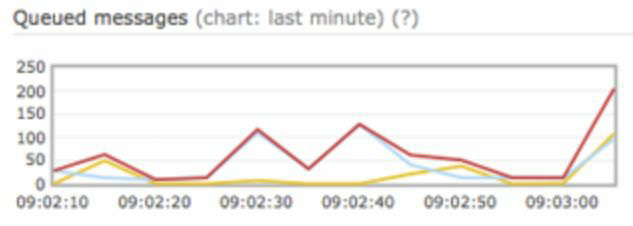
##### Events tracking
Notification metrics, such as open rate, click rate, and engagement are important in understanding customer behaviors.
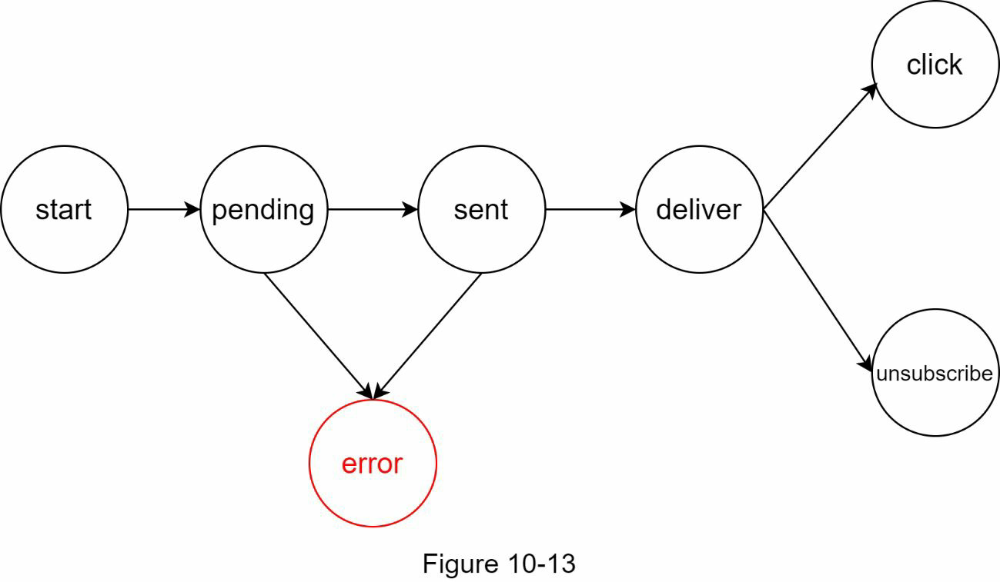

#### Updated design
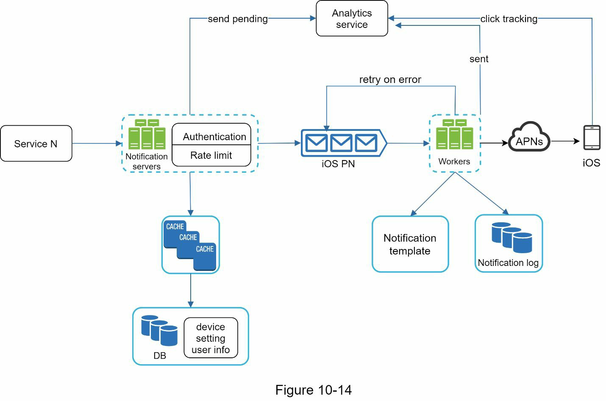
- The notification servers are equipped with two more critical features: authentication and rate-limiting.
- We also add a retry mechanism to handle notification failures. If the system fails to send notifications, they are put back in the messaging queue and the workers will retry for a
predefined number of times.
- Furthermore, notification templates provide a consistent and efficient notification creation process.
- Finally, monitoring and tracking systems are added for system health checks and future improvements.

### Step 4 - Wrap up
- Reliability: We proposed a robust retry mechanism to minimize the failure rate.
- Security: AppKey/appSecret pair is used to ensure only verified clients can send
notifications.
- Tracking and monitoring: These are implemented in any stage of a notification flow to
capture important stats.
- Respect user settings: Users may opt-out of receiving notifications. Our system checks
user settings first before sending notifications.
- Rate limiting: Users will appreciate a frequency capping on the number of notifications
they receive.