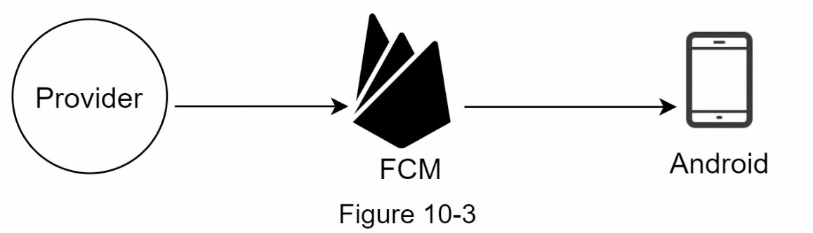
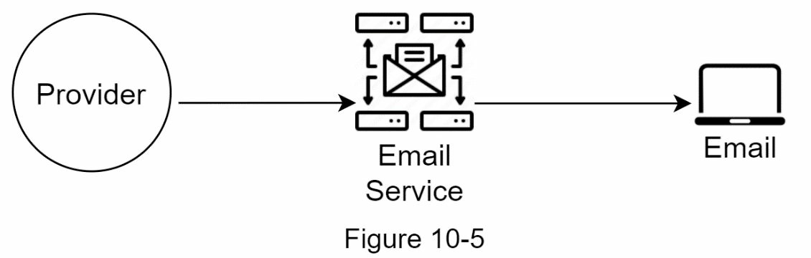
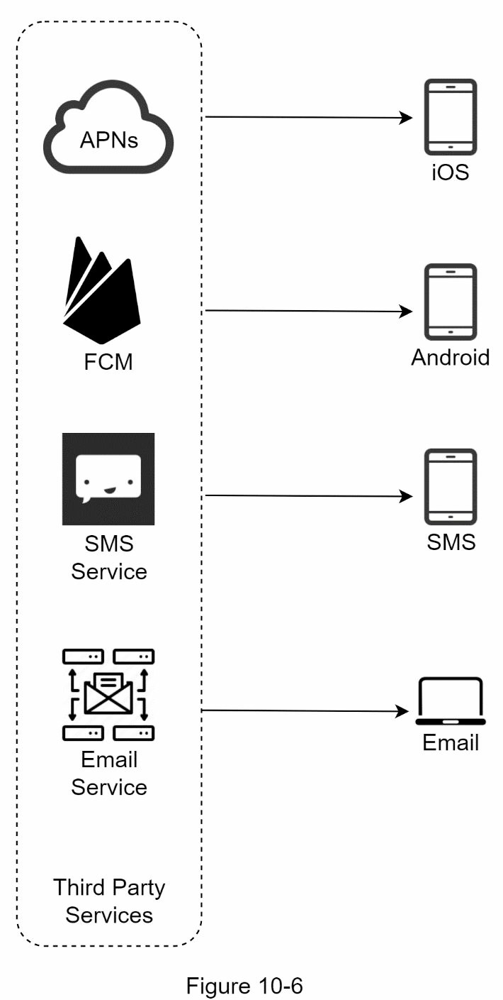
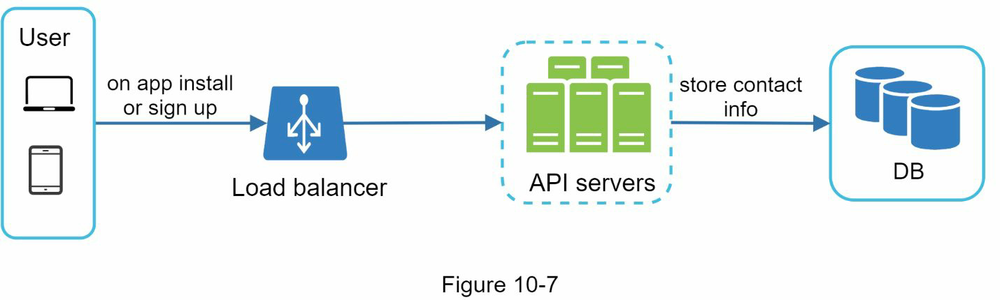
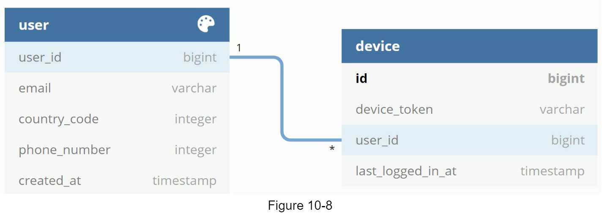
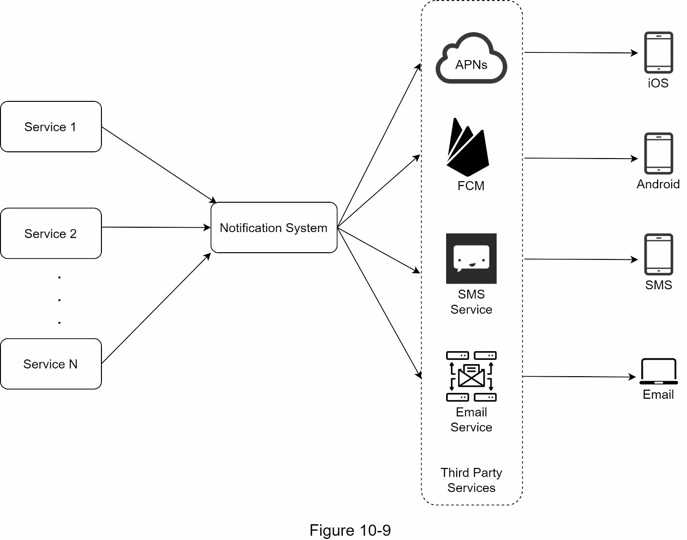
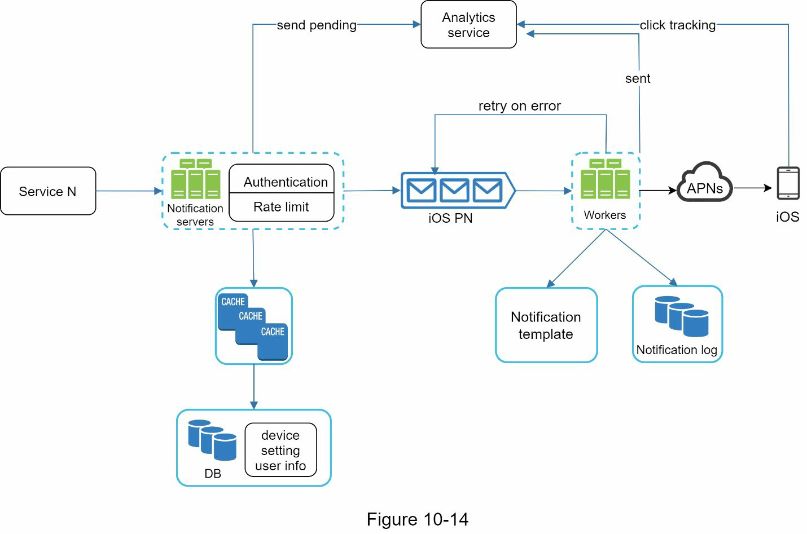

# Step 1 - Understand the problem and establish design scope

- Types of notifications
  - Push noti, SMS, email
- Real time?
  - Soft real-time. Slight delay is acceptable
- Supported device
  - iOS, android, laptop/desktop
- What triggers noti?
  - Triggered by client app. Can be also scheduled on the server-side
- Will users be able to opt out?
  - Users who choose to opt-out will no longer receive notifications
- How many notifications are sent out each day
  - 10 million mobile push notifications, 1 million SMS messages, and 5 million emails

# Step 2 - Propose high-level design and get buy-in

## Different types of notifications

### iOS push notification

- Three primary components to send iOS push noti
  - Provider provides the following data
    - Device token
    - Payload
    - APNS
    - iOS device

## Android push notification

Instead of using APNs, Firebase Cloud Messaging (FCM) is commonly used to send push notifications to android devices.

## SMS message

Third party SMS services like Twilio, Nexmo, and many others are commonly used. Most of them are commercial services.

## Email

Sendgrid [3] and Mailchimp [4] are among the most popular email services

## Contact info gathering flow

## Notification sending/receiving flow

### High level design

- Service 1 to N: A service can be a micro-service, a cron job, or a distributed system that triggers notification sending events.
- Notification system: The notification system is the centerpiece of sending/receiving notifications.
- Third-party services: Third party services are responsible for delivering notifications to users.
- iOS, Android, SMS, Email: Users receive notifications on their devices.

#### Three problems to solve
- SPOF
- Hard to scale
- Performance bottleneck

### High leve design (improved)
- Move the database and cache out of the notification server.
- Add more notification servers and set up automatic horizontal scaling.
- Introduce message queues to decouple the system components.

- Primary components
  - Service 1 to N
  - Noti servers
    - Provide APIs for services to send notifications. Those APIs are only accessible internally or by verified clients to prevent spams.
    - Carry out basic validations to verify emails, phone numbers, etc.
    - Query the database or cache to fetch data needed to render a notification.
    - Put notification data to message queues for parallel processing
  - Cache: User info, device info, notification templates are cached
  - DB: It stores data about user, notification, settings, etc.
  - Message queues: They remove dependencies between components. Message queues serve as buffers when high volumes of notifications are to be sent out.
  - Workers: Workers are a list of servers that pull notification events from message queues and send them to the corresponding third-party services.
  - Third-party services: Already explained in the initial design.
  - iOS, Android, SMS, Email: Already explained in the initial design.

# Step 3 - Design deep dive

## Reliability

- How to prevent data loss?
  - persists notification data in a database and implements a retry mechanism
  - The notification log database is included for data persistence
- Will recipients receive a notification exactly once?
  - No. Dedupe mechanism and handle each failure case carefully is necessary

## Additional components and considerations
- Notification template
- Notification setting
- Rate limiting
- Retry mechanism
- Security in push notifications
- Monitor queued notifications
- Events tracking

## Updated desgin

- The notification servers: authentication and rate-limiting.
- Retry mechanism to handle notification failures. If the system fails to send notifications, they are put back in the messaging queue and the workers will retry for a predefined number of times.
- Notification templates provide a consistent and efficient notification creation process.
- Monitoring and tracking systems are added for system health checks and future improvements.

# Step 4 - Wrap up

- Reliability: Robust retry mechanism to minimize the failure rate.
- Security: AppKey/appSecret pair is used to ensure only verified clients can send notifications.
- Tracking and monitoring: These are implemented in any stage of a notification flow to capture important stats.
- Respect user settings: Users may opt-out of receiving notifications. Our system checks user settings first before sending notifications.
- Rate limiting: Users will appreciate a frequency capping on the number of notifications they receive.
