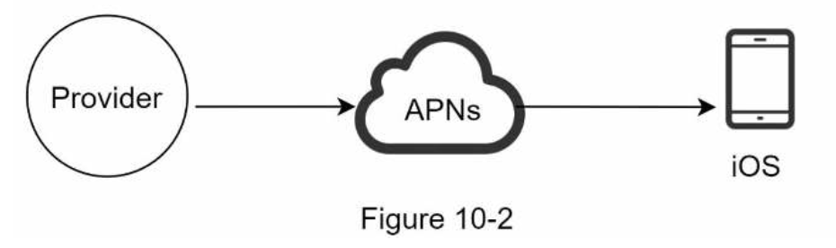
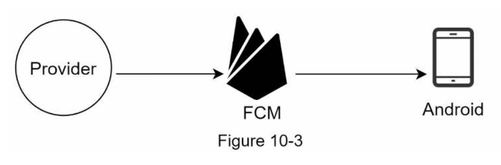
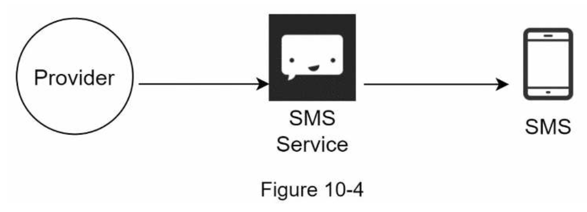
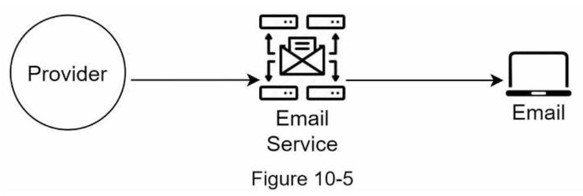
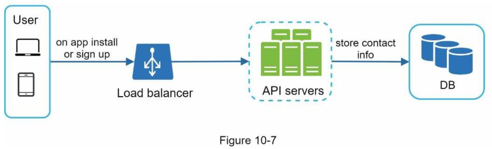
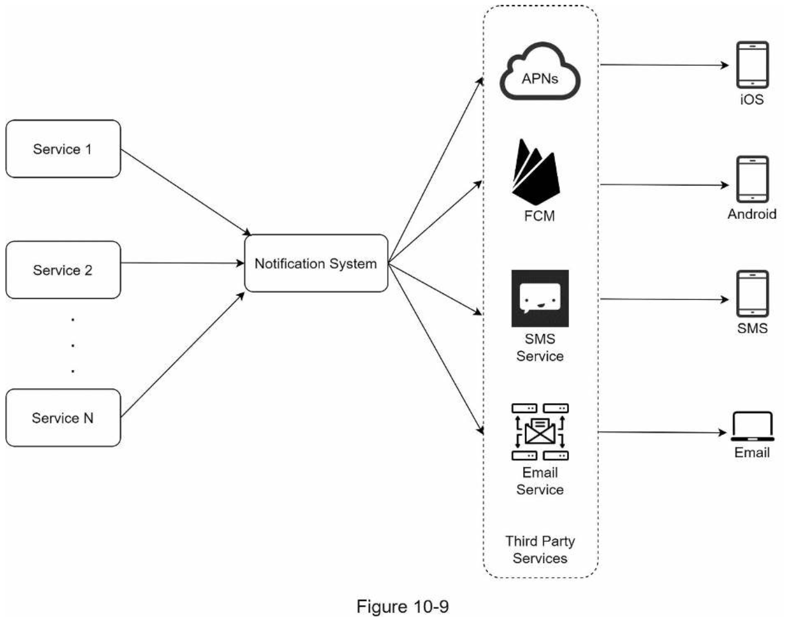
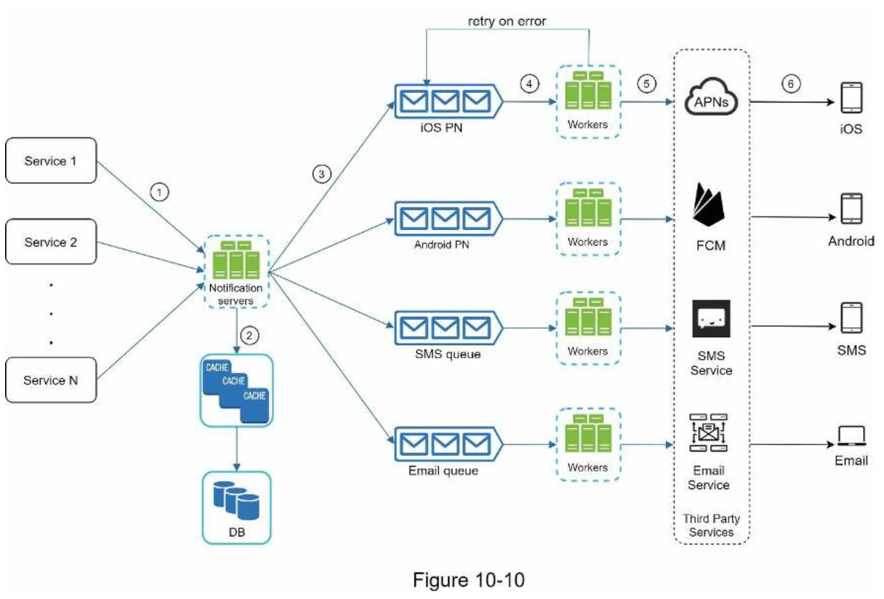
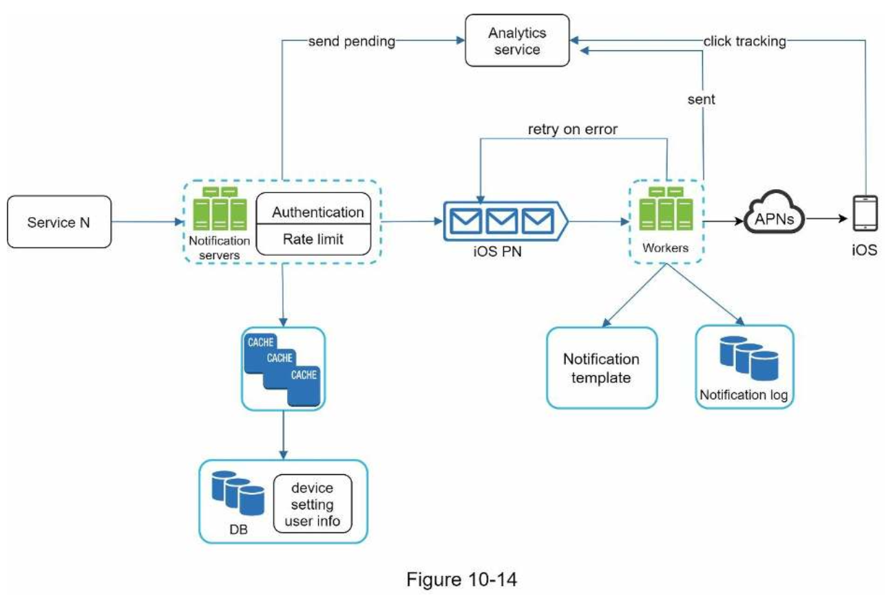

# 10. DESIGN A NOTIFICATION SYSTEM
###### Three types of notification formats
- mobile push notification
- SMS message
- Email

### Step 1 - Understand the problem and establish design scope
---
- Push notification, SMS message, and email.
- soft real-time system.
- iOS devices, android devices, and laptop/desktop.
- triggered by client applications.
- scheduled on the server-side.
- choose to opt-out.
- 10 million mobile push notifications, 1 million SMS messages, and 5 million emails.

### Step 2 - Propose high-level design and get buy-in
---
#### Different types of notifications
###### iOS push notification

- Provider: A provider builds and sends notification requests to Apple Push Notification Service (APNS).
    - Device token
    - Payload
    ```
    {
        "aps": {
            "alert": {
                "title": "Game Request",
                "body": "Bob wants to play Chess",
                "action-loc-key": "PLAY"
            },
            "badge": 5
        }
    }
    ```
- APNS: This is a remote service provided by Apple to propagate push notifications to iOS devices.
- iOS Device: It is the end client, which receives push notifications.

###### Android push notification


###### SMS message

- Third party SMS services: Twilio, Nexmo

###### Email

- Sendgrid and Mailchimp

#### Contact info gathering flow

- When a user installs our app or signs up for the first time, API servers collect user contact info and store it in the database.
- Email addresses and phone numbers are stored in the _user_ table, whereas device tokens are stored in the _device_ table.
- A user can have multiple devices, indicating that a push notification can be sent to all the user devices.

#### Notification sending/receiving flow
###### High-level design

- **Service 1 to N**: A service can be a micro-service, a cron job, or a distributed system that triggers notification sending events.
- **Notification system**: It provides APIs for services 1 to N, and builds notification payloads for third party services.
- **Third-party services**: Third party services are responsible for delivering notifications to users.
    - FCM is unavailable in China. Thus, alternative third-party services such as Jpush, PushY, etc are used there.
- **iOS, Android, SMS, Email**: Users receive notifications on their devices.
- Three problems:
    - Single point of failure (SPOF)
    - Hard to scale
    - Performance bottleneck

###### High-level design (improved)

- **Notification servers**: 
    - Provide APIs for services to send notifications. Those APIs are only accessible internally or by verified clients to prevent spams.
    - Carry out basic validations to verify emails, phone numbers, etc.
    - Query the database or cache to fetch data needed to render a notification.
    - Put notification data to message queues for parallel processing.
- **Cache**: User info, device info, notification templates are cached.
- **DB**: It stores data about user, notification, settings, etc.
- **Message queues**: Message queues serve as buffers when high volumes of notifications are to be sent out.
- **Workers**: Workers are a list of servers that pull notification events from message queues and send them to the corresponding third-party services.

###### Flow
1. A service calls APIs provided by notification servers to send notifications.
2. Notification servers fetch metadata such as user info, device token, and notification setting from the cache or database.
3. A notification event is sent to the corresponding queue for processing. For instance, an iOS push notification event is sent to the iOS PN queue.
4. Workers pull notification events from message queues. 
5. Workers send notifications to third party services.
6. Third-party services send notifications to user devices.

### Step 3 - Design deep dive
---
#### Reliability
###### How to prevent data loss?
- The notification log database is included for data persistence.
###### Will recipients receive a notification exactly once?
- No. Although notification is delivered exactly once most of the time, the distributed nature could result in duplicate notifications.

#### Additional components and considerations
###### Notification template
- The benefits of using notification templates include maintaining a consistent format, reducing the margin error, and saving time.
```
BODY:
You dreamed of it. We dared it. [ITEM NAME] is back — only until [DATE]. 
CTA:
Order Now. Or, Save My [ITEM NAME]
```

###### Notification setting
- Before any notification is sent to a user, we first check if a user is opted-in to receive this type of notification.

###### Rate limiting
- To avoid overwhelming users with too many notifications, we can limit the number of notifications a user can receive.

###### Retry mechanism
- When a third-party service fails to send a notification, the notification will be added to the message queue for retrying.

###### Security in push notifications
- `appKey` and `appSecret` are used to secure push notification APIs

###### Monitor queued notifications
- A key metric to monitor is the total number of queued notifications.

###### Events tracking
- Notification metrics, such as `open rate`, `click rate`, and `engagement` are important in understanding customer behaviors.

#### Updated design


### Step 4 - Wrap up
---
#### Considerations
- **Reliability**: We proposed a robust retry mechanism to minimize the failure rate.
- **Security**: AppKey/appSecret pair is used to ensure only verified clients can send notifications.
- **Tracking and monitoring**: These are implemented in any stage of a notification flow to capture important stats.
- **Respect user settings**: Users may opt-out of receiving notifications. Our system checks user settings first before sending notifications.
- **Rate limiting**: Users will appreciate a frequency capping on the number of notifications they receive.
