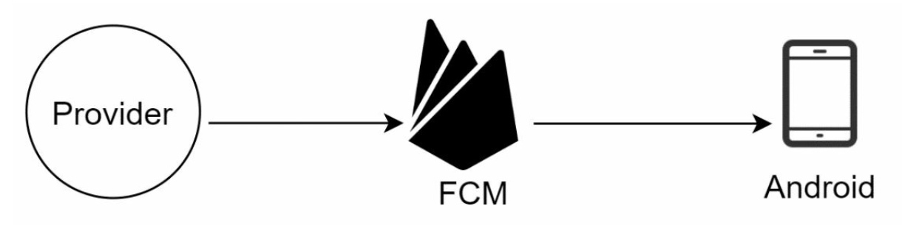
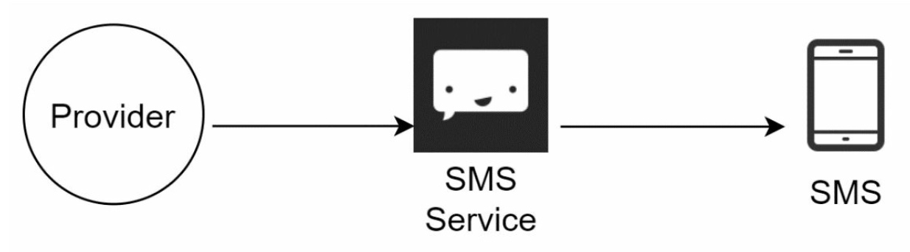
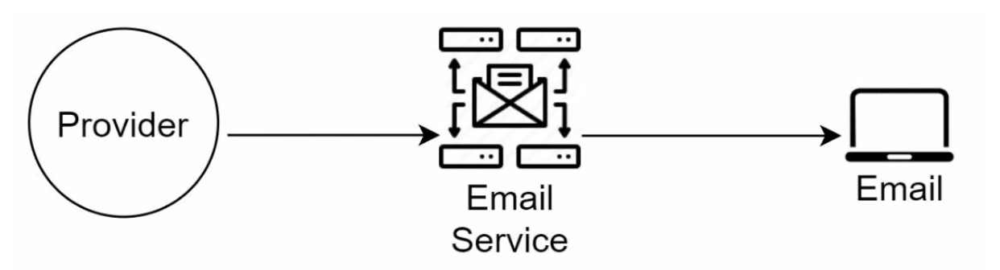
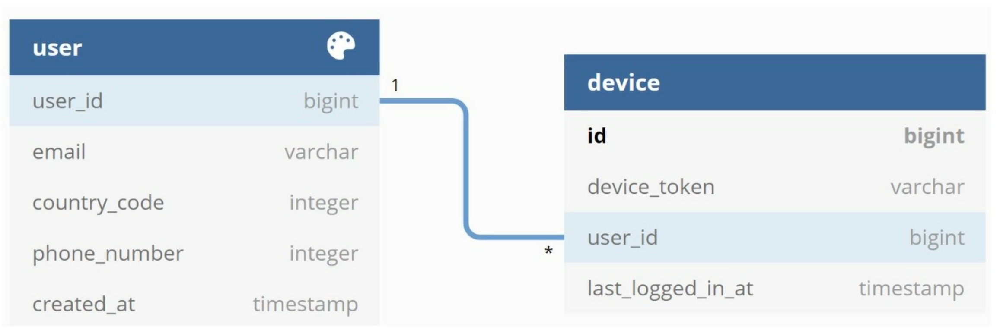
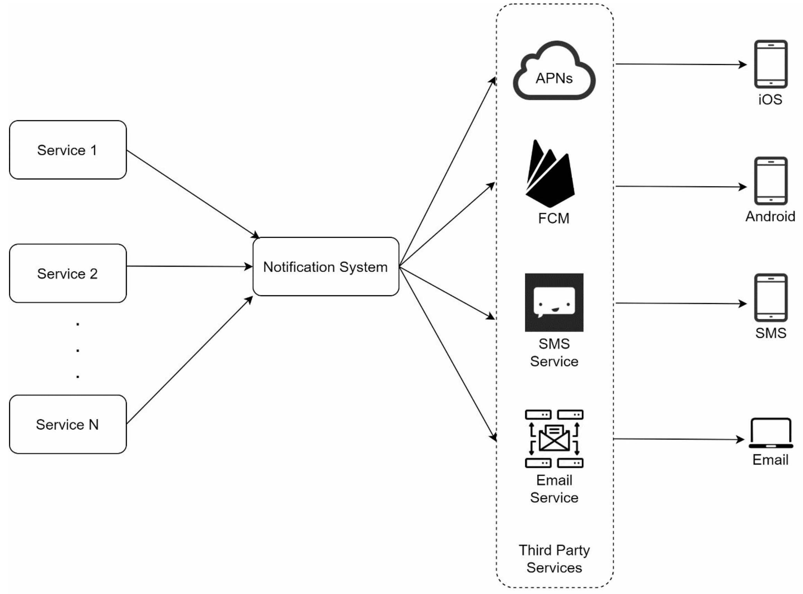
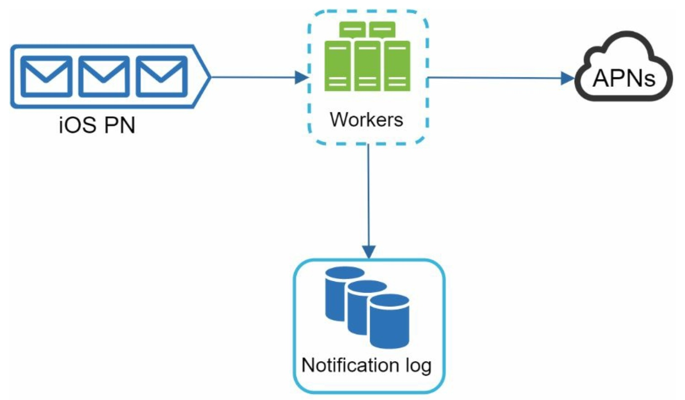
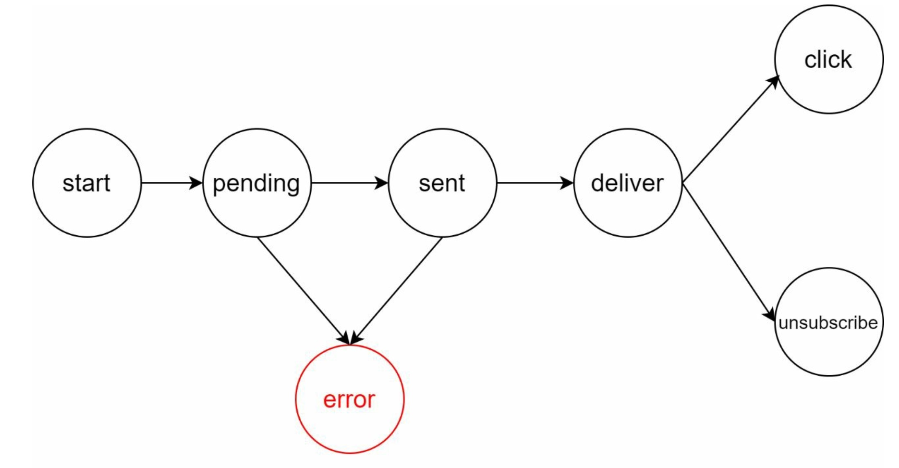

# Chapter 10. Design a notification system

**Three different types of notification:**
- Mobile push notifications
- SMS message
- Email

### Step 1 - Understand the problem and establish design scope

Requirements:
- Soft real-time system - user receives notifications as soon as possible, slight dealy is acceptable
- Supported devices: iOS devices, andriod devices, and laptop/desktop
- Notifications are triggered by client applications, can also be scheduled on the server-side
- Users can opt-out
- 10 million mobile push notifications, 1 million SMS messages, and 5 million emails

### Step 2 - Propose high-level design and get buy-in
High level design that support various notification types is structured as follows:
- Different types of notifications
- Contact info gathering flow
- Notification sending/receiving flow

#### 2-1. Different types of notifications
- iOS push notification
<p align="center">
    
</p>

Three required components to send an iOS push notification
1. Provider: 
    - builds and sends notification requests to Apple Push Notification Service (APNS)
    - provides the following data to construct a push notfiication:
        ```json
            {
                "aps": {
                    "alert": {
                        "title": "Game Request",
                        "body": "Bob wants to play chess",
                        "action-loc-key": "PLAY"
                    },
                    "badge": 5
                }
            }
        ```
2. APNS: A remote service provided by Apple to propagate push notifications to iOS devices
3. iOS device: End client, that receives push notifications

- Android push notification
<p align="center">
    
</p>

**SMS message**
Third party SMS services are commonly used
<p align="center">
    
</p>

**Email**
<p align="center">
    
</p>

Below shows the design after including all third-party services
<p align="center">
    
</p>


#### 2-2. Contact info gathering flow
To send notifications, we need some informations:
- mobiel device tokens
- phone numbers or email address
<div align="center">
    
    <p>API servers that collects user contact info and stores it in database</p>
</div>

<div align="center">
    
    <p>Simplified DB tables to store contact info</p>
</div>

#### 2-3. Notification sending/receiving flow
##### High-level design

<div align="center">
    
</div>

**Services**: A service can be a micro-service, a cron job, or a distributed system that triggers notifcation sending events
**Notification system**: A system sending/receiving notifications. It provides APIs for services and builds notification payloads for third party services
**Third-party services**: Responsible for delivering notifications to users. Third-party service should have good extensibility meaning a flexible system that can easily plugging or unplugging.
**iOS, Android, SMS, Email**: Devices users receive notifications on

>Three problems identified in the high level design
1. Single point of failure(SPOF): A single notification server
2. Scalability: THe notification system handles everything releated to push notifications in one server. Hence, it's challenging to scale databases, caches, and different notification processing components independently
3. Performance bottleneck: Processing and sending notifications can be resource intensive

##### High-level design(improved)
- Moved the database and cache out of the notification server
- Added more notification servers and set up automatic horizontal scaling
- Introduced message queues to decouple the system components
<div align="center">
    
</div>

**Notification Servers**: 
- Provide APIs for services to send notifications. Its APIs are only accessible internally or by verified clients to prevent spams
- Carry out basic validations to verify emails, phone numbers, etc
- Query the database or cache to fetch data needed to render a notification
- Put notification data to message queues for parallel processing

**Cache**: User info, device info, notification templates are cached
**DB**: It stores data about user, notification, settings, etc
**Message queues**: Serve as buffers when high volumes of notifications are to be sent out. Each notification type is assigned with a distinct message queue so an outage in on third-party service will not affect other notification types
**Workers**: A list of servers that pull notification events from message queues and send them to the corresponding third-party services

> How every component works together to send a notification
1. A service calls APIs provided by notification servers to send notifications
2. Notification servers fetch metadata such as user info, device token, and notification setting from the cache or database
3. A notification event is sent to the corresponding queue for processing
4. Workers pull notification events from message queues
5. Workers send notifications to third party services
6. Third-party services send notifications to user devices

### Step 3 - Design deep dive
- Reliability
- Additional component and considerations: notification template, notification settings, rate limiting, retry mechanism, security in push notifications, monitor queued notifications and event tracking
- Updated design

#### 3-1. Reliability
> How to prevent data loss?

Notifications can usually be delayed or re-ordered, but never lost. To satisfy this requirement, the notification system persists notification data in a database and implemetns a retry mechanism
<div align="center">
    
    <p>Notification log database is included for data persistence</p>
</div>

> Will recipients recieve a notification exactly once?

Although notification is delivered exactly once most of the time, the distributed nature could result in duplicate notifications. Dedupe mechanism can handle each failure case carefully.
**How dedupe mechanism works**: When a notification event first arrives, we check if it is seen before by checking the event ID. If it is seen before, it is discarded. Otherwise, we will send out the notification.

#### 3-2. Additional components and considrations
##### Notification template
To avoid building every notification from scratch. A notification template is a preformatted notification to create our unique notification by customzing parameters, styling, tracking links, etc.

##### Notification setting
Many websites and apps give users fine-grained control over notification serttings. Before any notification is sent to a user, we first check if a suer is opted-in to receive this type of notification.

##### Rate limiting
We can limit th enumber of notifications a suer can receive. It's important because receivers could turn off notifications completely if we send too often.

##### Retry mechanism
When a third-party service fails to send a notification, the notification will be added to the message queue for retrying. If the problem persists, an alert will be sent out to developers.

##### Security in push notifications
Only authenticated or verified clients by appKey(iOS) or appSecret(Android) are allowed to send push notifications using our APIs

##### Monitor queued notifications
A key metric to monitor is the total number of queued notifications. If the nubmer is large, the notification events are not processed fast enough by workers. To avoid delay in the notification delivery, more workers are needed

##### Events tracking
Integration between the notification system and the analytics service is usually required

<div align="center">
    
    <p>Events that might be tracked for analytics purposes</p>
</div>

#### 3-3. Updated design
<div align="center">
    
</div>

- The notification servers are equipped with **authentication** and **rate-limiting**
- Added a **retry mechanism** to handle notification failures
- **Notification templates** are provided
- **Monitoring** and **tracking systems** are added for system health checks and future improvements
