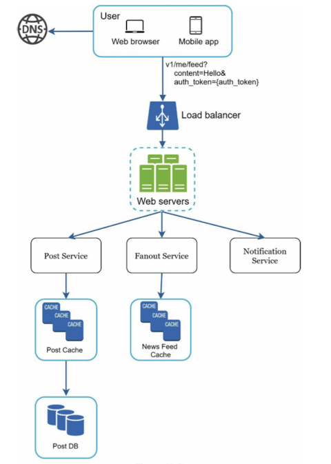
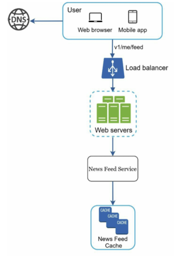
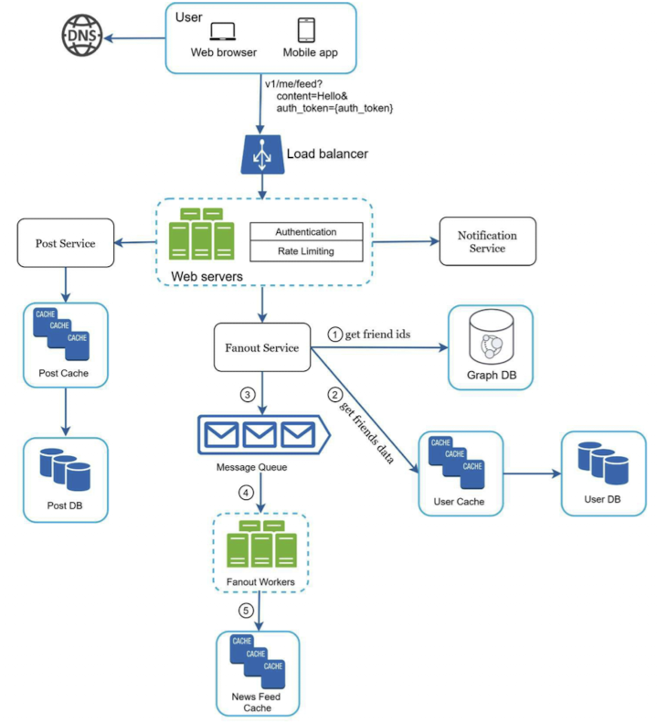
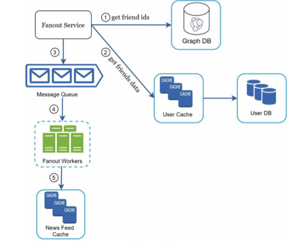
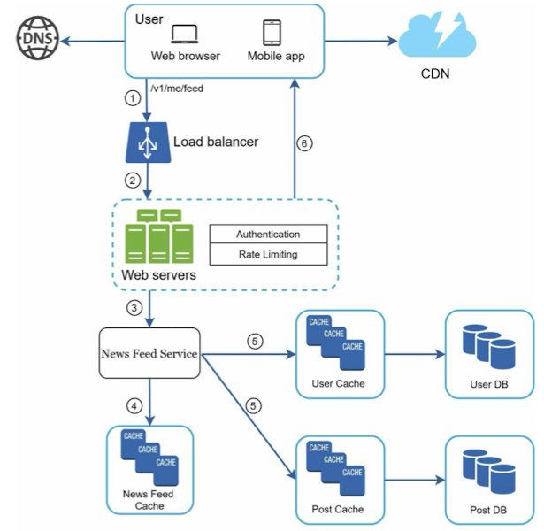
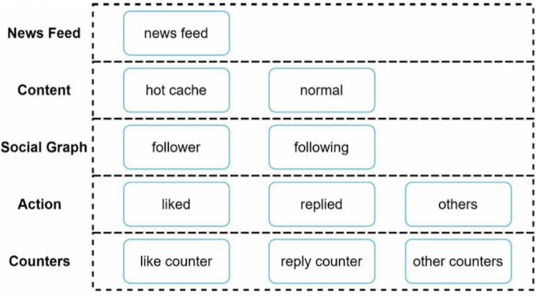

# Chapter 11. Design a news feed system

## Step 1. Understand the problem and establish design scope
- Is this a mobile app? Or a web app? Or both?
- What are the important features?
- Is the news feed sorted by revers chronological order or nay particular order such as topic scores?
- How many friend can a user have?
- What is the traffic volume?
- Can feed contain images, videos, or just text?

## Step 2. Propose high-level design and get buy-in
- Feed publishing
- Newfeed building

### Newsfeed APIs
- The news feed APIs are the primary ways for clients to communicate with servers.

#### Feed publishing API
```
POST /v1/me/feed
Params:
    - Content: content is the text of the post.
    - auth_token: it is used to authenticate API requests.
```

#### Newsfeed retrieval API
```
GET /v1/me/feed
Params:
    - auth_token: it is used to authenticate API requests.
```

### Feed publishing
- 

### Newsfeed publishing
- 

## Step 3. Design deep dive
### Feed publishing deep dive
- 
- Web servers
  - Only users signed in with valid auth_token are allowed to make posts. The system limits the number of posts a user can make within a certain period, vital to prevent spam and abusive content.
- Fanout service
  - Fanout is the process of delivering a post to all friends.
  - Fanout on wirte (push model)
    - News feed is pre-computed during write time. A new post is delivered to friends' cache immediately after it is published.
    - Pros:
      - The news feed is generated in real-time and can be pushed to friends immediately.
      - Fetching news feed is fast because the news feed is pre-computed during write time.
    - Cons:
      - If a user has many friends, fetching the friend list and generating news feeds for all of them are slow and time consuming. It is called hotkey problem.
      - For inative users or those rarely log in, pre-computing news feeds waster computing resources.
  - Fanout on read (pull model)
    - The news feed is generated during read time. This is an on-demand model. REcent posts are pulled when a user loads her home page.
    - Pros:
      - For inative users or those who rarely log in, fanout on read works better because it will not waster computing resources on them.
      - Data is not pushed to friends so there is no hotkey problem.
    - Cons:
      - Fetching the news feed is slow as the news feed os not pre-computed
  - Hybrid
    - Use a push model for the majority of users. For celebrities or users who have many friends/followers, we let followers pull news content on-demand to avoid system overload. Consistent hashing is a useful technique to mitagate the hotkey problem as it helps to distribute requests/data more evenly.
  - The fanout service works as follow:
    
    1. Fetch friend IDs from the graph database. Graph databases are suited for managing friend relationship and friend recommendataions.
    2. Get friends info from the user cache.
    3. Send friends list and new post ID to the message queue.
    4. Fanout workers fetch data from the message queue and store news feed data in the news feed cache.
    5. Store data in news feed cache

### Newsfeed retrieval deep dive

1. A user sends a request to retrieve her news feed.
2. The load balancer redistributes requests to web servers.
3. Web servers call the news feed service to fetch news feeds.
4. News feed service gets a list post IDs from the news feed cache.
5. A user's news feed is more than just a list of feed IDs.
6. The fully hydrated news feed is returned in JSON format back to the client for rendering.

### Cache architechture

- News Feed: It stores IDs of news feeds.
- Content: It stores every post data. Popular content is stored in hot cache.
- Social Graph: It stores user relationship data.
- Action: It stores info about whether a user liked a post, replied a post, or took other actions on a post.
- Counters: It stores counters for like, reply, follower, following.
