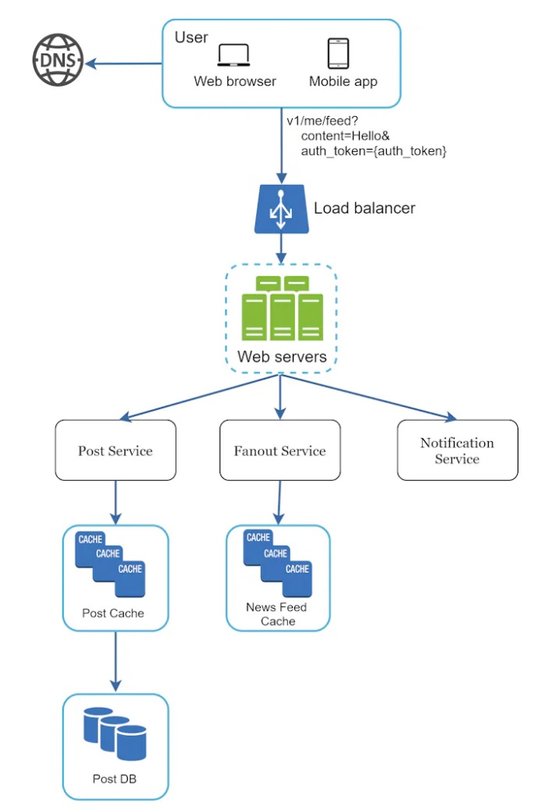
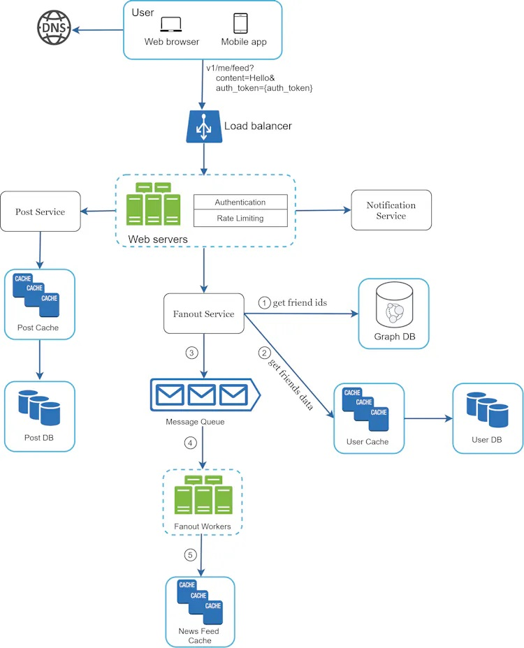
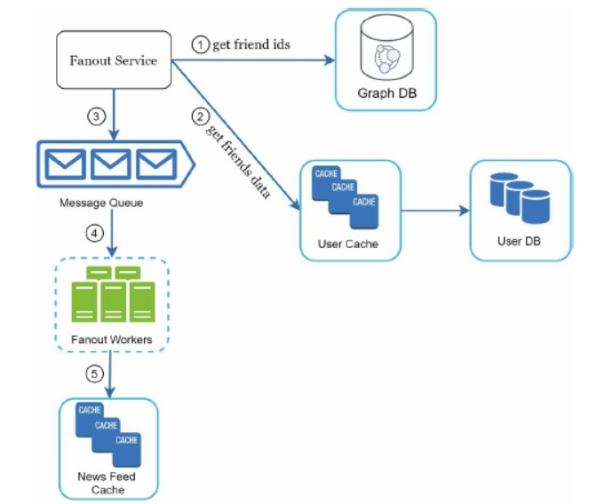
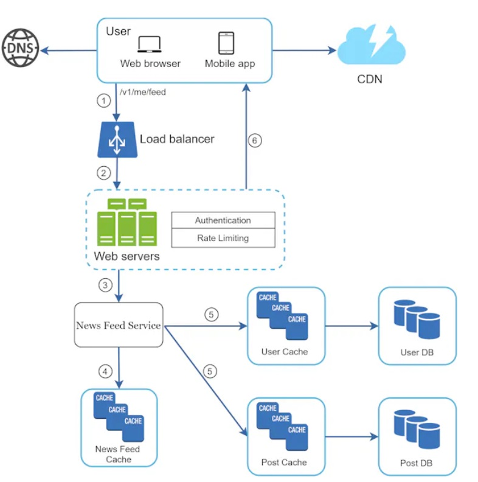
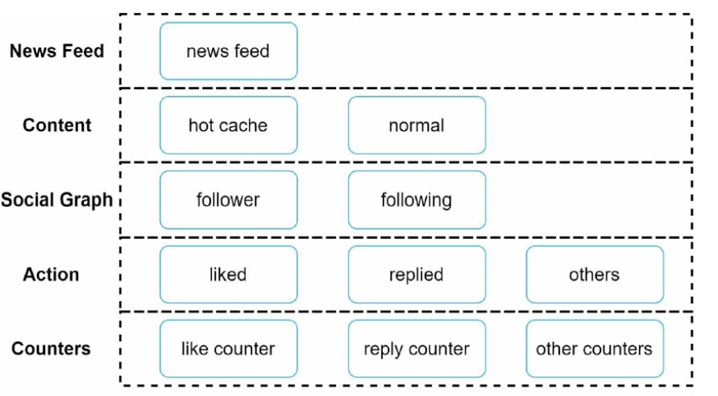

# 11. Design A News Feed System

- What is news feed? According to the Facebook help page,
  - News feed is the constantly updating list of stories in the middle of  your home page.
  - News feed includes status updates, photos, videos, links, app activity, and likes from people, pages, and groups that you follow on Facebook.

## Step 1. Understanding the problem and establish design scope

- Requirement
  - It should support both a mobile app and a web app.
  - Important feature
    - A user can publish a post
    - A user can see her friends' posts
  - The news feed order? Sorted by reverse chronological order
  - A user can have 5000 friends.
  - The traffic volume: 10 million DAU
  - The feed can contain images and videos.

## Step 2. Propose high-level design and get buy-in

- The design is divided into 2 flows:
  - Feed publishing:
    - When a user publishes a post, corresponding data is written into cache and database.
    - A post is populated to her friends' news feed.
  - Newsfeed building:
    - Assume the news feed is built by aggregating friends' posts in reverse chronological order.

### 2.1. Newsfeed APIs

- Newsfeed APIs are the primary ways for clients to communicate with servers.
- They are HTTP based.
- Two most important APIs
  - Feed publishing API
  - News feed retrieval API

#### 2.1.1. Feed publishing API

- To publish a post, a HTTP POST request will be sent to the server.
  ```
  POST /v1/me/feed
  params:
  - content: content is the text of the post
  - auth_token: it is used to authenticate API requests
  ```

#### 2.1.2. Newfeed retrieval API

```
GET /v1/me/feed
Param:
- auth_token: it is used to authenticate API requests.
```

### 2.2. Feed publishing



- User
  - A user can view news feeds on a browse or mobile app.
  - A user makes a post with content through API.
    - /v1/me/feed?content=Hello&auth_token={auth_token}
- Load balancer
  - Distribute traffic to web servers
- Web servers
  - Web servers redirect traffic to different internal services.
- Post service
  - Persist post in the database and cache
- Fanout Service
  - PUsh new content to friends' news feed
- Notification service:
  - Inform friends that new content is available and send out push notification.

### 2.3. Newsfeed building


- User:
  - A user send a request to retrieve her news feed.
- Load balancer:
  - redirects traffic to web servers.
- Web servers:
  - Web servers route requests to newsfeed service
- Newsfeed Service:
  - News feed service fetches news feed from the cache.
- Newsfeed cache:
  - store news feed IDs needed to render the news feed.

## Step 3. Design deep dive

### 3.1. Feed publishing deep dive



#### 3.1.1. Web servers

- Web servers enforce authentication and rate-limiting.
- Only uses signed in with valid auth_token are allowed to make posts
- The system limits the number of posts to prevent spam and abusive content.

#### 3.1.2. Fanout service

- Fanout is the process of delivering a post to all friends. There are 2 types.
  - Fanout on write ( Push model )
    - News feed is pre-computed during write time.
    - A new post is delivered to friends' cache immediately after it is publish.
    - Pros:
      - The news feed is generated in real-time.
      - It can be pushed to friends immediately
    - Cons:
      - Hotkey problem
        - If a user has many friends, fetching the friend list and generating news feeds for all of them are slow and time consuming
      - For inactive users or those rarely log in, pre-computing news feeds waste computing resources.
  - Fanout on read ( Pull model )
    - The news feed is generated during read time. (On-demand model)
    - Recent posts are pulled when a user loads her home page.
    - Pros:
      - For inactive users or those who rarely log in, this model works better.
      - No hotkey problem.
    - Cons:
      - Fetching the news feed is slow as the news feed is not pre-computed.
  - We adopt a hybrid approach.
    - We use a push model for the majority of users.
    - Use a pull model for celebrities or users who have many friends/followers.
    - Consistent hashing is a useful technique to mitigate the hotkey problem as it helps to distribute requests/data more evenly.
    - 
    - The fanout service works as follows:
      - (1) Fetch friend IDs from the graph database.
      - (2) Get friends info from the user cache. Then, filters out friends based on user settings.
      - (3) Send friends list and new post ID to the message queue.
      - (4) Fanout workers fetch data from the message queue and store news feed data in the news feed cache.
        - The memory consumption can become very large if we store the entire user and post objects in the cache. Thus, only IDs are stored.
        - Most uses are only interested in the latest content, so the cache miss rate is low.
      - (5) Store <post_id, user_id> in news feed cache.

### 3.2. Newfeed retrieval deep dive



- (1) A user sends a request to retrieve her news feed.
- (2) The load balancer redistributes requests to web servers.
- (3) Web servers call the news feed service to fetch news feeds.
- (4) News feed service gets a list post IDs from the news feed cache.
- (5) The news feed service fetches the complete user and post objects from caches ( user cache and post cache) to construct the fully hydrated news feed
- (6) The fully hydrated news feed is returned in JSON format back to the client for rendering.

### 3.3. Cache architecture



Cache is extremely important for a news feed system. We divide the cache tier into 5 layers.

- (1) News feed: It stores IDs of news feeds.
- (2) Content: It stores every post data.
- (3) Social Graph: It stores user relationship data.
- (4) Action: It stores info about whether a user liked a post, replied a post, or took other actions on a post.
- (5) Counters: It stores counters for like, reply, follower, followings, etc.

## Step 4. Wrap up

- In this chapter, we designed a news feed system. Our design contains two flows: feed publishing and news feed retrieval.
- You can talk about scalability issues more. 
  - Scaling the database:
    - Vertical scaling vs Horizontal scaling
    - SQL vs NoSQL
    - Master-slave replication
    - Read replicas
    - Consistency models
    - Database sharding
  - Other talking points:
    - Keep web tier stateless
    - Cache data as much as you can
    - Support multiple data centers
    - Lose couple components with message queues
    - Monitor key metrics.
