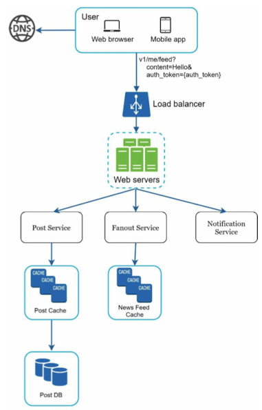
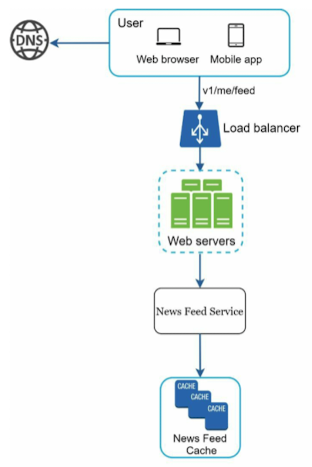
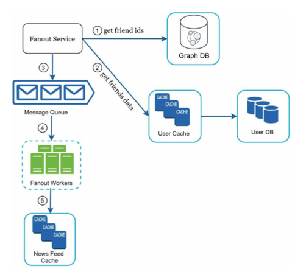
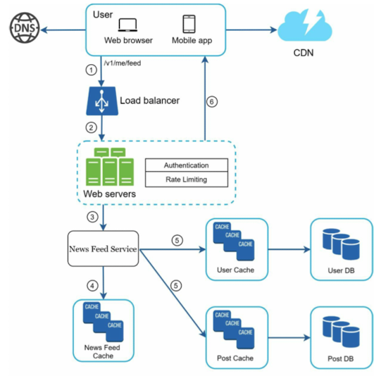
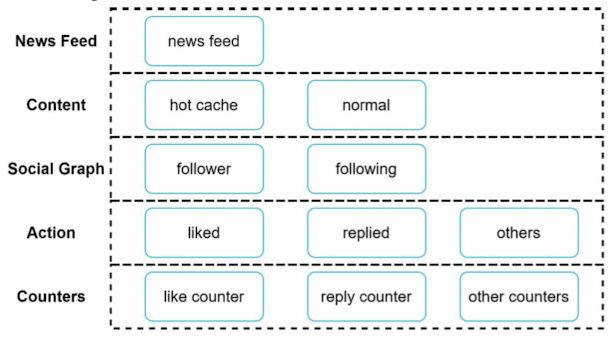

# Chapter 11 : Design A News Feed System

## Step 1 - Understand the problem and establish design scope

- Understand what the interviewer has in mind
- Figure out what features to support
    - Is this a mobile app / web app / both?
    - What are the important features?
    - News feed sorted by reverse chronological order / any particular order?
    - How many friends can a user have?
    - What is the traffic volume?
    - Feed contain images, videos, or just text?

## Step 2 - Propose high-level design and get buy-in

### Feed publishing

### Newsfeed building

## Step 3 - Design deep dive

1. Feed publishing deep dive

- Web servers
    - clients와의 통신뿐만 아니라 인증과 rate-limiting을 강제

- Fanout service : 사용자가 게시물을 게시했을 때 모든 친구들에게 전달하는 과정
    1. Fanout on write : 사용자가 게시물을 게시하는 즉시 news feed가 pre-computed 되어 친구들의 cache에 즉각적으로 전달됨
        - Pros : news feed가 실시간으로 생성되며 친구들에게 즉시 push 될 수 있음
        - Cons : 많은 친구를 가진 사용자의 경우, 친구 목록을 가져오고 news feed를 생성하는 과정이 느리고 시간이 많이 소요됨 (hotkey problem)

    2. Fanout on read : 사용자가 홈페이지를 로드할 때 뉴스 피드가 요청에 따라 생성됨
        - Pros : 활동이 적은 사용자의 경우 리소스 낭비 없이 뉴스 피드를 제공할 수 있음
        - Cons : news feed를 가져오는 속도가 느림 (사전에 계산되지 않기 때문)

The fanout service works as follows:
- Graph DB에서 친구 ID 가져오기
- User cache에서 친구 정보 가져오기
- Message queue로 친구 목록과 새로운 게시물 ID 전송하기
- Fanout workers
- <post_id, user_id>를 cache에 저장

2. Newsfeed retrieval deep dive

### Cache architecture

## Step 4 - Wrap up

Designed a news feed system
1. Feed publishing
2. News feed retrieval

- System design에는 완벽한 방법이 없음
- 각 회사는 unique constraints를 가지고 있어 이에 맞춰 시스템을 설계해야 함
- Design과 technology choices에 있어서의 tradeoffs를 이해하는 것이 중요

- Scaling the database:
    - Vertical scaling vs Horizontal scaling
    - SQL vs NoSQL
    - Master-slave replication
    - Read replicas
    - Consistency models
    - Database sharding

- Other talking points:
    - Keep web tier stateless
    - Cache data as much as you can
    - Support multiple data centers
    - Lose couple components with message queues
    - Monitor key metrics