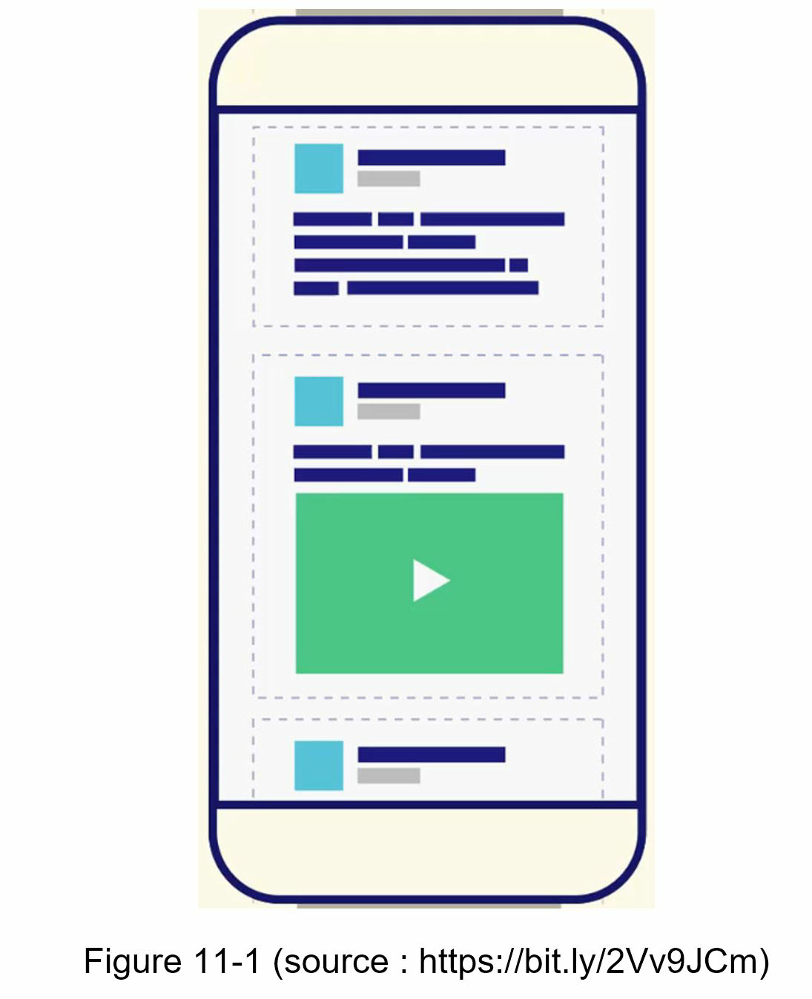
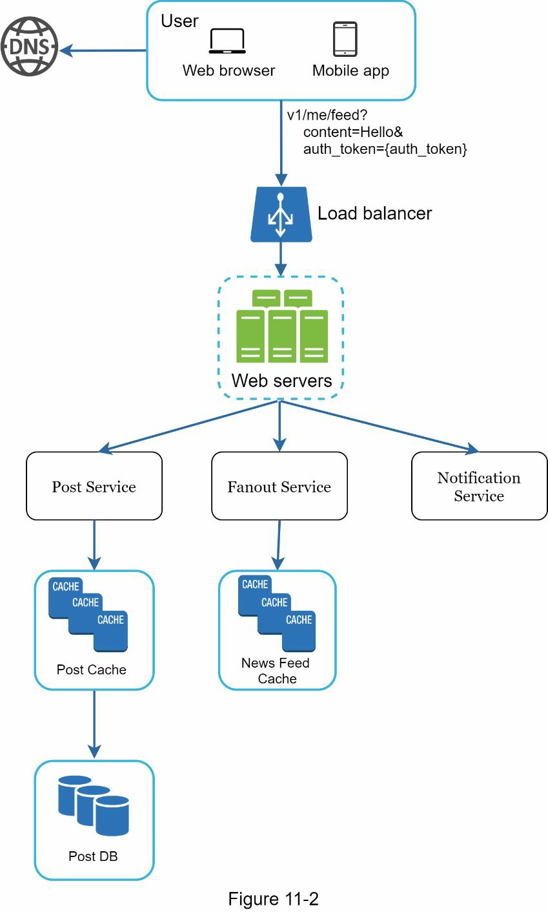
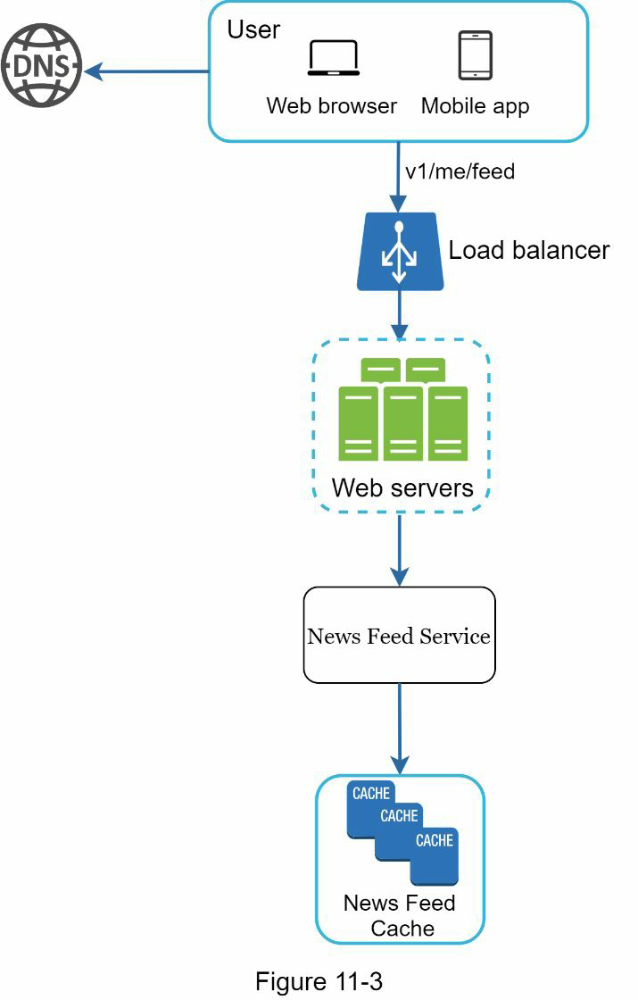
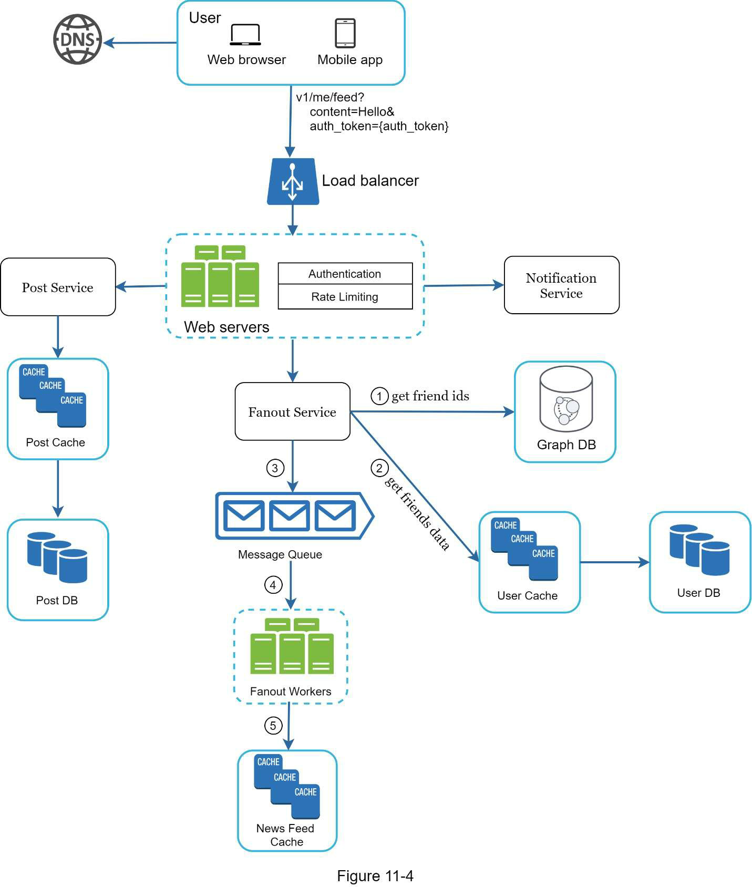
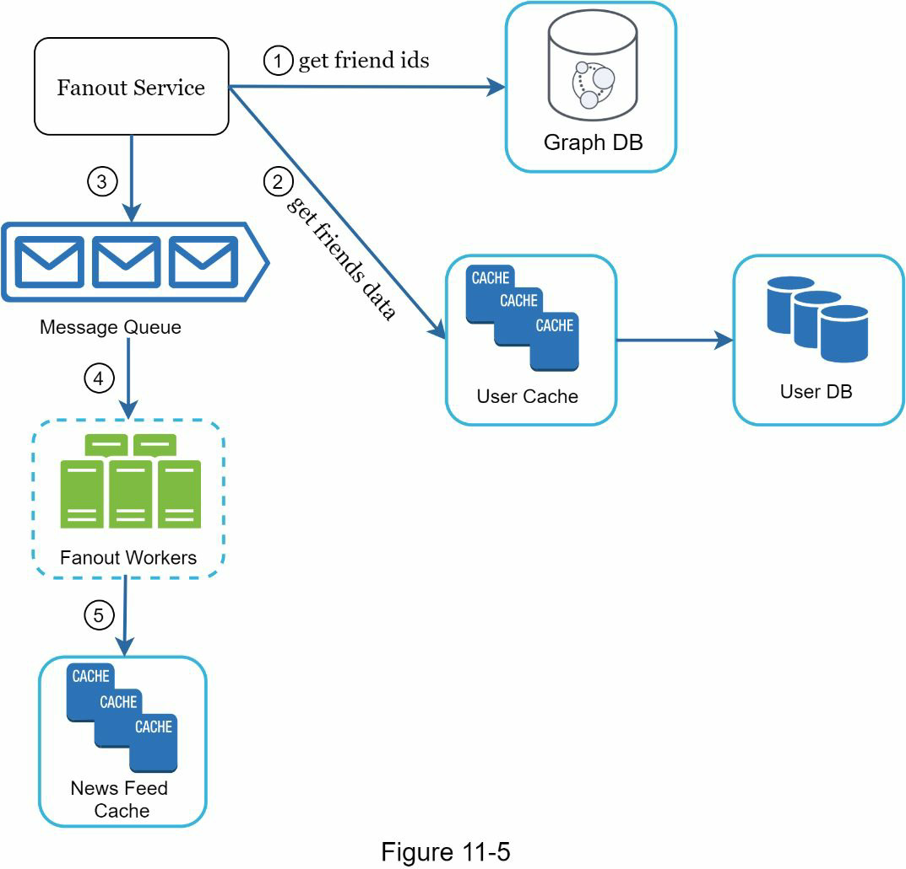
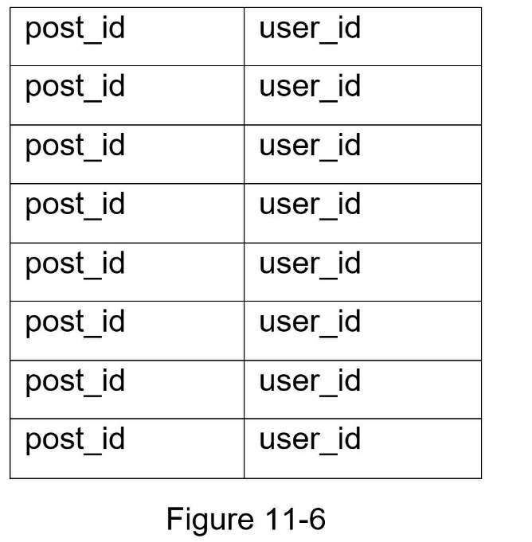
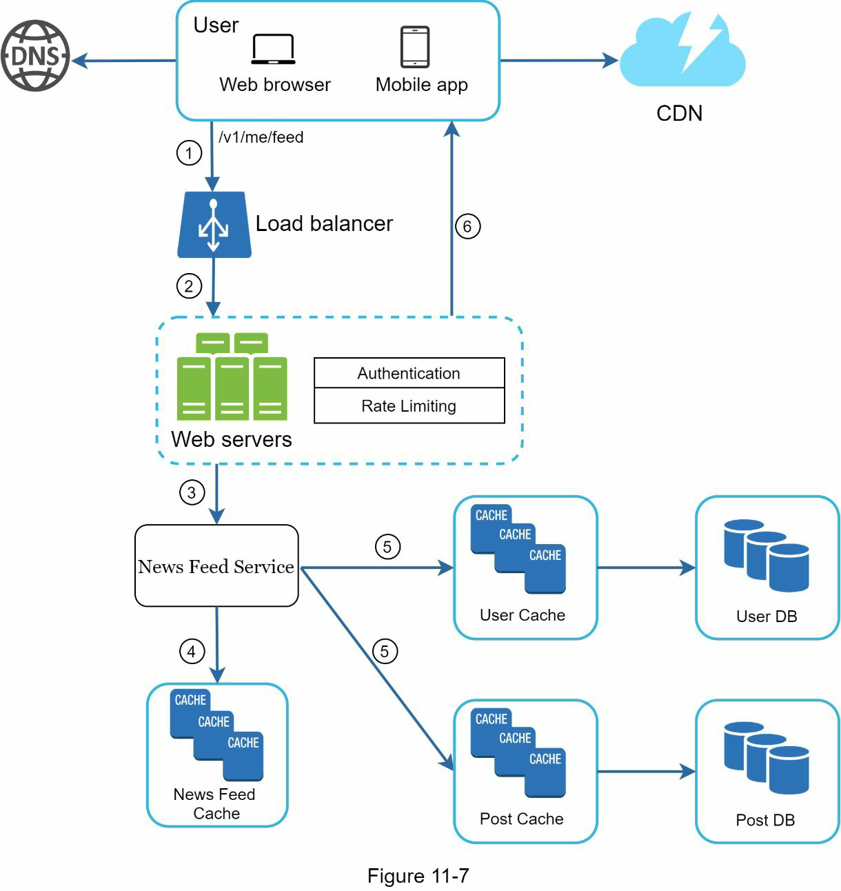
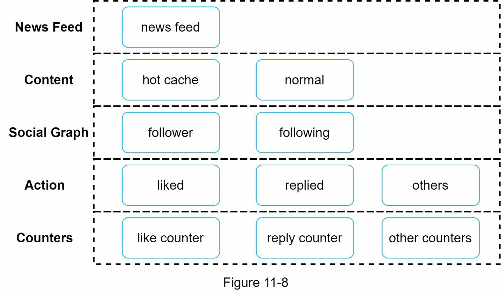

# Chapter 11: Design a news feed system
- Design a news feed system
- What is news feed? (according to the Facebook help page)
  - "News feed is the constantly updating list of stories in the middle of your home page"
  - "News feed includes status updates, photos, videos, links, app activity and likes from people, pages and groups that you follow on Facebook"



## Step 1 - Understand the problem and establish design scope
### Possible questions
- Is that a mobile app? or a web app? or both?
- What are the important features?
- Is the news feed sorted by reverse chronological order or any particular order such as topic scores?
- How many friends can a user have?
- What is the traffic volume?
- Can feed contain images, vidoes, or just text?

### Possbile requirements
- For Mobile and Web app
- User can publish a post and see her friends's posts on the news feed page
- To keep things simple, assume the feed is sorted by reverse chronological order
- User can have 5000 friends
- 10 million DAU
- This can contains media files, including both images and videos
  
## Step 2 - Propose high-level design and get buy-in
- The design is divided into two flows : feed publishing and news feed buliding
  - Feed publishing 
    - When a user publishes a post, corresponding data is written into cache and database
    - A post is popluated to her friends' news feed
  - Newsfeed building
    - For simplicity, assume the news feed is built by aggregating friends' posts in reverse chronological order
  
### NewsFeed APIs
- Primary ways for clients to communicate with servers
- HTTP based
- Allow client to perform actions
  - Posting a status
  - Retrieving news feed
  - Adding friends
- Discuss two most important APIs
  - feed publishing
  - news freed retrieve

#### Feed publishing API
- To publish a post
- HTTP POST request will be sent to the server
```
POST /v/me/feed
param
    - content
    - auth_token : it is used to authenticate API request
```
#### Newsfeed retrieval API
```
GET /v/me/feed
param
    - auth_token
```
### Feed publishing

- Users
  - A user can view news feed on a browser or mobile app
  - A user makes a post with content "Hello" through API
  ```
  /v/1/me/feed?content=Hello&auth_token={auth_token}
  ```
- Load balancer: distribute traffic to web servers
- Web servers: redirect traffic to different internal services
- Post services: persist post in the database and cache
- Fanout services
  - Push new content to friends' news feed
  - Newsfeed data is stored in the cache for fast retrieval
- notification service
  - Inform friends that new content is available and send out push nofitications

#### Newsfeed building

- User
  - A user ends a request to retrieve her news feed
  - The request looks like this : /v1/me/feed
- Load balancer
  - Load balancer redirects traffic to web servers
- Web servers
  - Web servers route requests to newfeed service
- Newsfeed service
  - News feed service fetches news feed from the cache
- Newsfeed Cache
  - Store news feed IDs needed to render the news feed

## Step 3 - Design deep dive
### Feed publishing deep dive



#### Web servers
- Enforce authentication and rate-limiting
- Ony users signed in with valid auth-token are allowed to make posts
- The system limit the number of posts a user can make within a certain period

#### Fanout service
- The process of delivering a post to all friends
- Two types of fanout models
  - Fanout on write (also called push model)
  - Foutout on read (also called pull model)

#### Fanout on write
- News feed is pre-computed during write time
- A new post is delivered to friends' cache immediately after it is publihsed
- Pros
  - The new feed is generated in real-time and can be pushed to friends immediately
  - Fetching news feed is fast because the news feed is pre-computed during wrtie time
- Cons
  - If a user has many friends, fetching the friend list and generating news feeds for all of them are slow and time consuming. Hotkey problem
  - For inactive users or those rarely log in, pre-computing news feeds waste computing resources.

#### Fanout on read
- The news feed is generated during read time
- On-demand model
- Recent posts are pulled when a user loads her home page
- Pros
  - For inactive users or those who rarely log in, fanout on read works better because it will not waste computing resources on them
  - Data is not pushed to friends so there is no hotkey problem
- Cons
  - Fetching the news feed is slow as the news feed is not pre-computed

#### Design 
- Adopt a hybrid approach to get benefits of both
- Use a push model for the majority of users
- Users who have many friends/floowers, let followers pull news content on-demand to avoid system overload
- Consistent hashing is a useful technique to mitigate the hotkey problem as it helps to distribute request/data more evenly.
  
#### Fanout service workflow

1. Fetch friends IDs from the graph database
2. Get friends info from the user cache
    - Filter out friends based on user setting like inactive user
3. Send friends list and new post ID to the message queue
4. Fanout workers fetch data from the message queue and store news feed data in the news feed cache
    - Whenever a new post is made, it will be appended to the news feed table
    - The memory comsumption can bbecome very large if we store the entire user and post objects in the cache
    - Only IDs are stored
5. Store <post_id, user_id> in news feed cache


### Newfeed retrieval deep dive

1. A user sends a request to retrieve her news feed , like /v1/me/feed
2. The load balancer redistributes requests to web server
3. Web servers call the news feed service to fetch news feeds
4. News feed service get a list post IDs from the news feed cache
5. A users' news feed is more than just a list of feed IDs
    - Contains username, profile picture, post content, post image
    - The news feed service fetches the complete user and post objects from caches to construct the fully hydrated news feed
6. The fully hydrated news feed is returned in JSON format back to the client for rendering

### Cache architecture
- Cache is extremely important for a news feed system

- News feed: Stores IDs of news feeds
- Content: Stores every post data, Popular content is stored in hot cache
- Social Graph: Stores user relationship data
- Action: Sotres info about whether a user liked a post, replied a post, took other actions on a post
- Counters : Stores counters for like, reply , follwers, following, etc

## Step 4 - Wrap up
- Addtional issue
  - Scalability
- Scaling the database
  - Vertical scaling vs Horizontal scaling
  - SQL vs NOSQL
  - Master-salve replication
  - Read replicas
  - Consistency method
  - Database scaling
- Other talking points
  - Keep web tier stateless
  - Cache data as much as you can
  - Support multiple database centers
  - Lose couple components with message queues
  - Monitor key metric