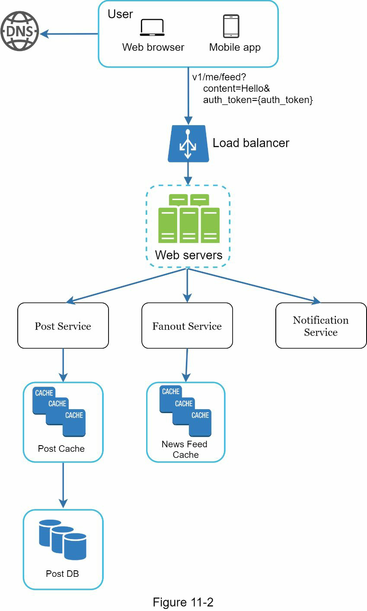
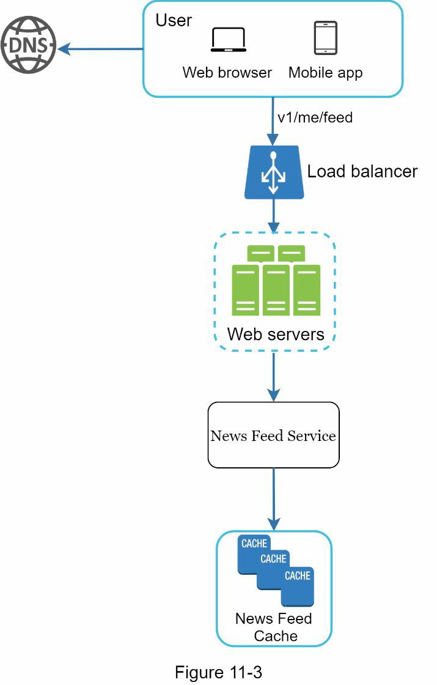
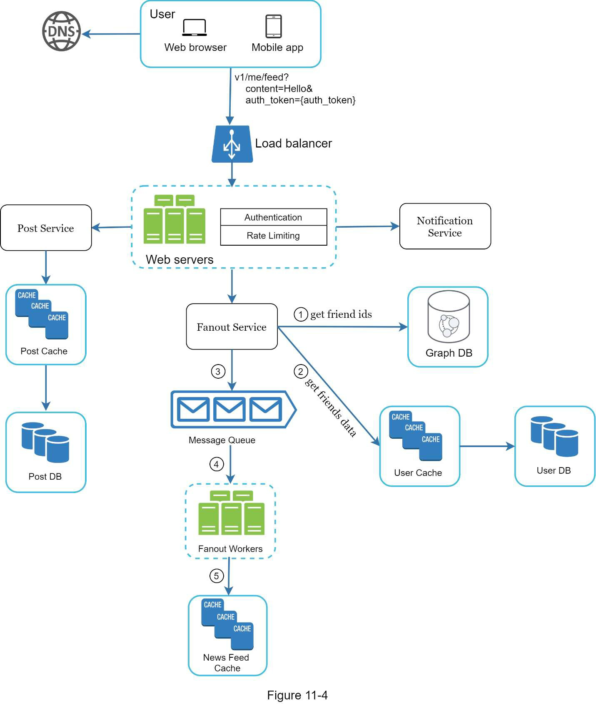
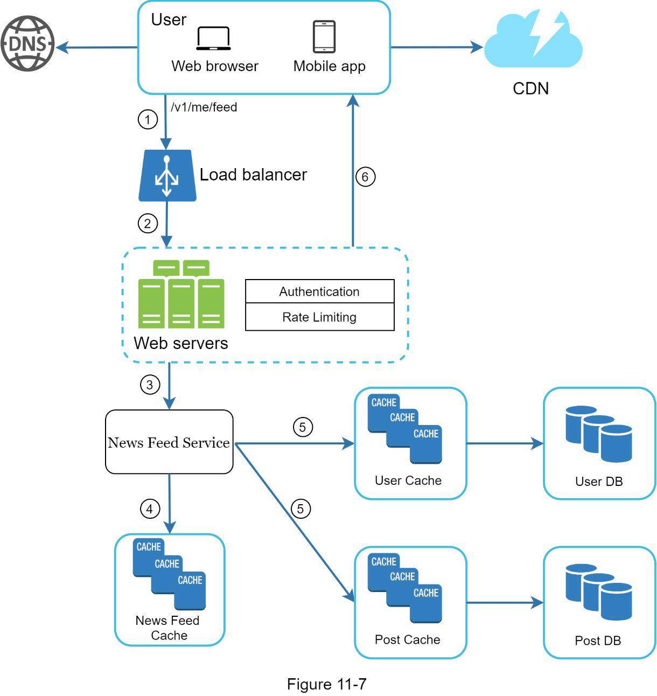
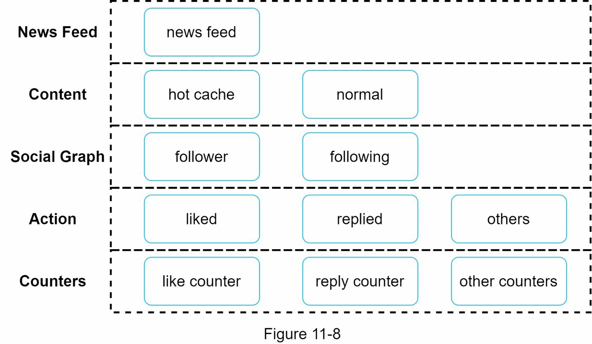

# Step 1 - Understand the problem and establish design scope

- Target environment?
  - Mobile and web
- Major features
  - Publish a post and see her friends’ posts on the news feed page.
- Sorting order
  - Reverse chronological order
- Max friends a user can have
  - 5000
- Traffic volume
  - 10 mil DAU
- Can feed contain images, videos, or just text?
  - Can contain media files, including both images and videos

# Step 2 - Propose high level design and get buy-in
- Two flows
  - Feed publishing: when a user publishes a post, corresponding data is written into cache and database. A post is populated to her friends’ news feed.
  - Newsfeed building: for simplicity, let us assume the news feed is built by aggregating friends’ posts in reverse chronological order.

- Two most important APIS
  - Feed publishing API
    - POST /v1/me/feed
    - Params:
      - content: content is the text of the post.
      - auth_token: it is used to authenticate API requests.
  - Newsfeed retrieval API
    - GET /v1/me/feed
    - Params:
      - auth_token: it is used to authenticate API requests.
  
## Feed publishing

## Newsfeed building

# Step 3 - Design deep dive

## Feed publishing deep dive

- Notes.
  - IDs are stored in graph db
  - User details are stored in RDBMS
- Fanout is the proces of delivering a post to all friends
  - Fanout on write
    - Pros
      - generated in real-time and can be pushed to friends immediately.
      - fast because the news feed is pre-computed
    - Cons
      - hotkey problem
      - pre-computing news feeds waste computing resources for inactive users
  - Fanout on read
    - Pros
      - not waste computing resources
      - not pushed to friends so there is no hotkey problem
    - Cons
      - Fetching is slow as the news feed is not pre-computed
- How fanout service works?
  1. Fetch friend IDs from the graph database. Graph databases are suited for managing friend relationship and friend recommendations.
  2. Get friends info from the user cache. The system then filters out friends based on user settings.
  3. Send friends list and new post ID to the message queue.
  4. Fanout workers fetch data from the message queue and store news feed data in the news feed cache.
  5. Store <post_id, user_id > in news feed cache. 

## Newsfeed retrieval deep dive

1. A user sends a request to retrieve her news feed. The request looks like this: /v1/me/feed
2. The load balancer redistributes requests to web servers.
3. Web servers call the news feed service to fetch news feeds.
4. News feed service gets a list post IDs from the news feed cache.
5. A user’s news feed is more than just a list of feed IDs. It contains username, profile
   picture, post content, post image, etc. Thus, the news feed service fetches the complete
   user and post objects from caches (user cache and post cache) to construct the fully
   hydrated news feed.
6. The fully hydrated news feed is returned in JSON format back to the client for
   rendering.

## Cache architecture

# Step 4 - Wrap up

Scaling the database:
- Vertical scaling vs Horizontal scaling
- SQL vs NoSQL
- Master-slave replication
- Read replicas
- Consistency models
- Database sharding

Other talking points:
- Keep web tier stateless
- Cache data as much as you can
- Support multiple data centers
- Lose couple components with message queues
- Monitor key metrics.

