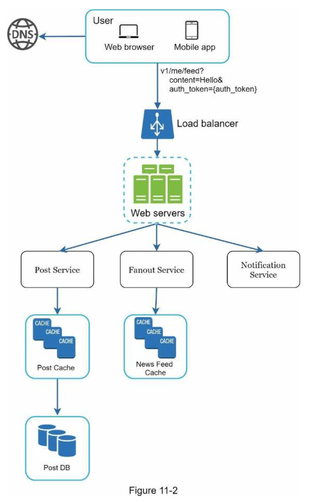
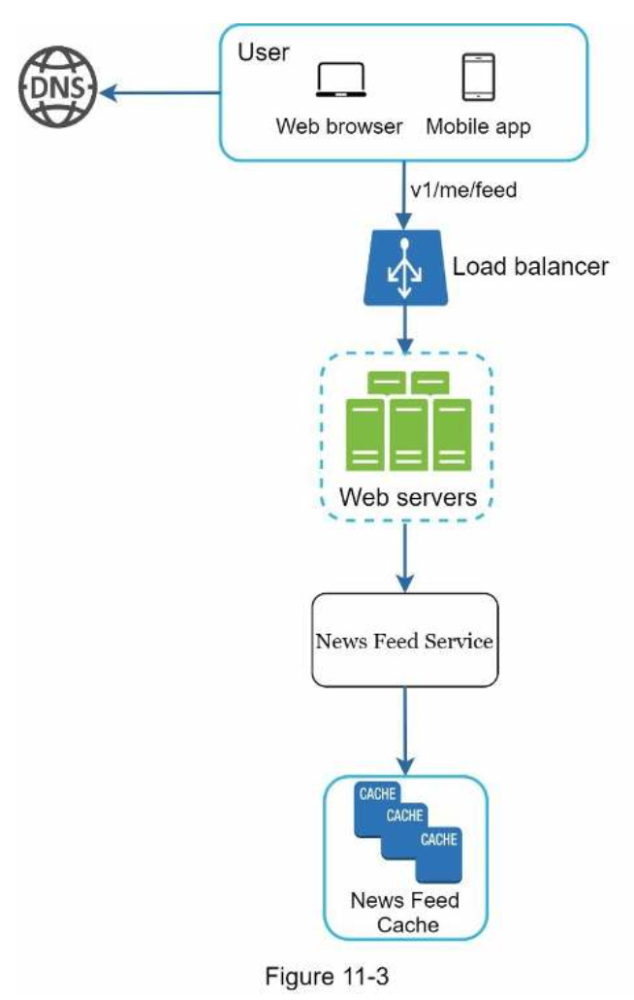
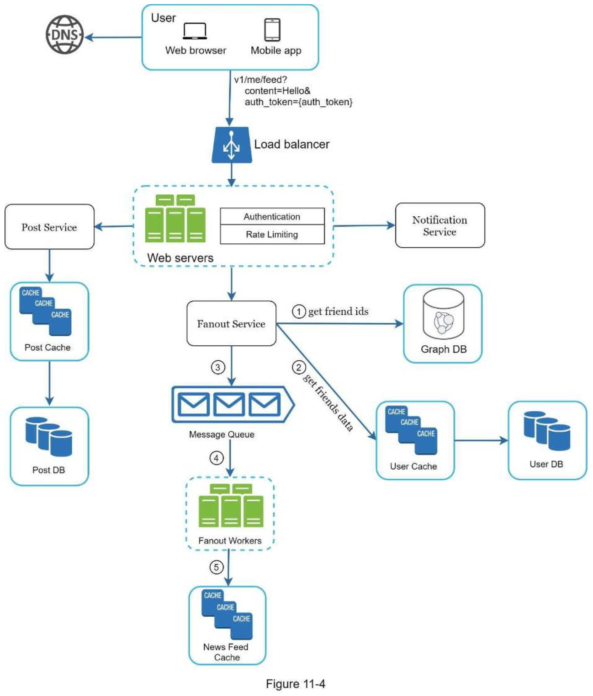
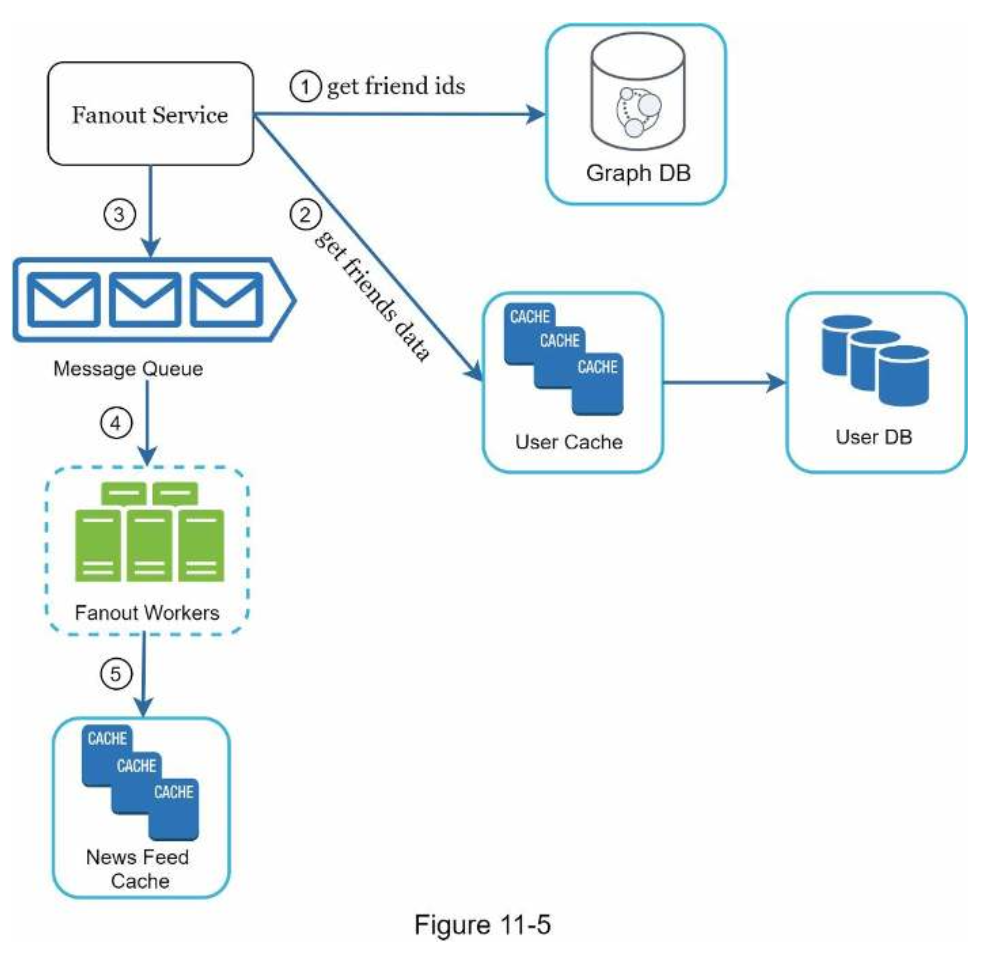
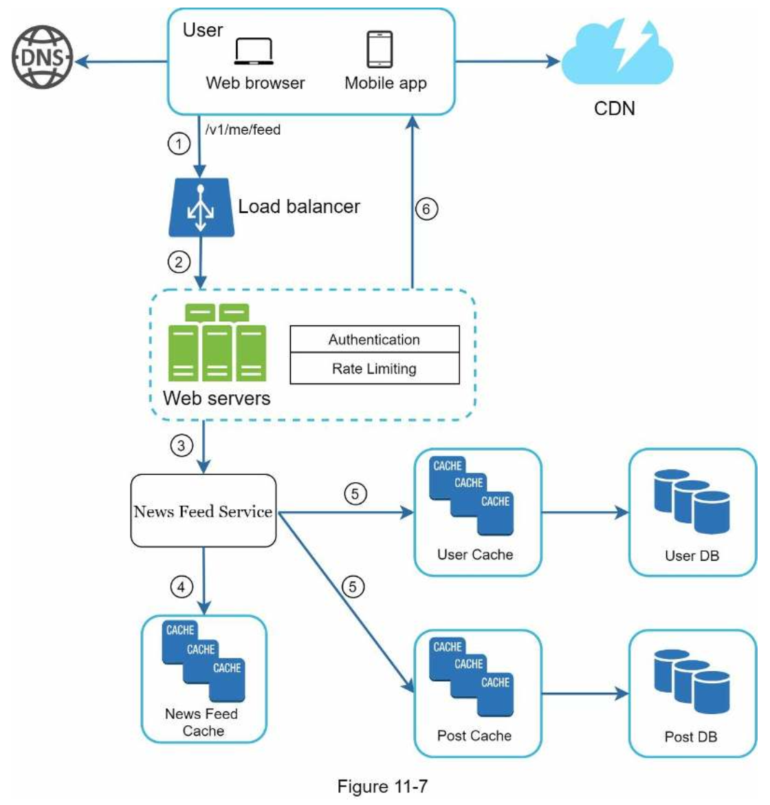
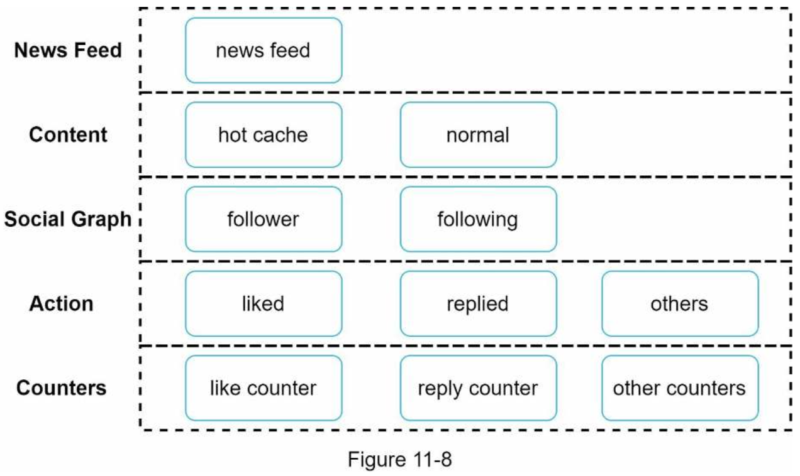

# 11. DESIGN A NEWS FEED SYSTEM
### Step 1 - Understand the problem and establish design scope
---
#### Requirements
- mobile app and web app
- A user can publish a post and see her friends’ posts on the news feed page.
- the feed is sorted by reverse chronological order.
- 5000 friends
- 10 million DAU
- contains media files, including both images and videos.

### Step 2 - Propose high-level design and get buy-in
---
#### Newsfeed APIs
###### Feed publishing API
- To publish a post, a HTTP POST request will be sent to the server.
```
POST /v1/me/feed
Params:
• content: content is the text of the post.
• auth_token: it is used to authenticate API requests.
```
###### Newsfeed retrieval API
```
GET /v1/me/feed
Params:
• auth_token: it is used to authenticate API requests.
```

#### Feed publishing

- When a user publishes a post, corresponding data is written into cache and database. A post is populated to her friends’ news feed.
- **Post service**: persist post in the database and cache.
- **Fanout service**: push new content to friends’ news feed. Newsfeed data is stored in the cache for fast retrieval.
- **Notification service**: inform friends that new content is available and send out push notifications.

#### Newsfeed building

- For simplicity, let us assume the news feed is built by aggregating friends’ posts in reverse chronological order.
Newsfeed APIs.
- **Newsfeed service**: news feed service fetches news feed from the cache.
- **Newsfeed cache**: store news feed IDs needed to render the news feed.

### Step 3 - Design deep dive
---
#### Feed publishing deep dive

###### Web servers
- Besides communicating with clients, web servers enforce authentication and rate-limiting.

###### Fanout service
- **Fanout on write**: A new post is delivered to friends’ cache immediately after it is published.
    - Pros:
        1. The news feed is generated in real-time and can be pushed to friends immediately.
        2. Fetching news feed is fast because the news feed is pre-computed during write time.
    - Cons:
        1. If a user has many friends, fetching the friend list and generating news feeds for all of them are slow and time consuming. It is called hotkey problem.
        2. For inactive users or those rarely log in, pre-computing news feeds waste computing resources.
- **Fanout on read**: Recent posts are pulled when a user loads her home page.
    - Pros:
        1. For inactive users or those who rarely log in, fanout on read works better because it will not waste computing resources on them.
        2. Data is not pushed to friends so there is no hotkey problem.
    - Cons:
        1. Fetching the news feed is slow as the news feed is not pre-computed.
- **Hybrid approach**: For celebrities or users who have many friends/followers, we let followers pull news content on-demand to avoid system overload.
- Consistent hashing is a useful technique to mitigate the hotkey problem as it helps to distribute requests/data more evenly.


#### Newsfeed retrieval deep dive


#### Cache architecture

- **News Feed**: It stores IDs of news feeds.
- **Content**: It stores every post data. Popular content is stored in hot cache.
- **Social Graph**: It stores user relationship data.
- **Action**: It stores info about whether a user liked a post, replied a post, or took other actions on a post.
- **Counters**: It stores counters for like, reply, follower, following, etc.

### Step 4 - Wrap up
---
###### Scaling the database:
- Vertical scaling vs Horizontal scaling • SQL vs NoSQL
- Master-slave replication
- Read replicas
- Consistency models
- Database sharding

###### Other talking points:
- Keep web tier stateless
- Cache data as much as you can
- Support multiple data centers
- Lose couple components with message queues
- Monitor key metrics. For instance, QPS during peak hours and latency while users refreshing their news feed are interesting to monitor.
