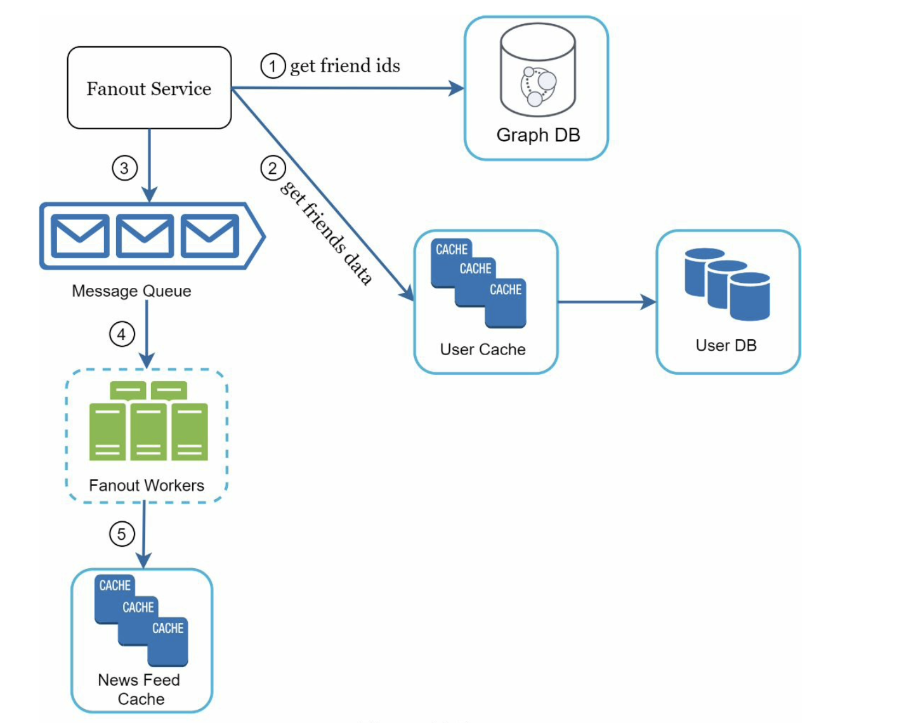
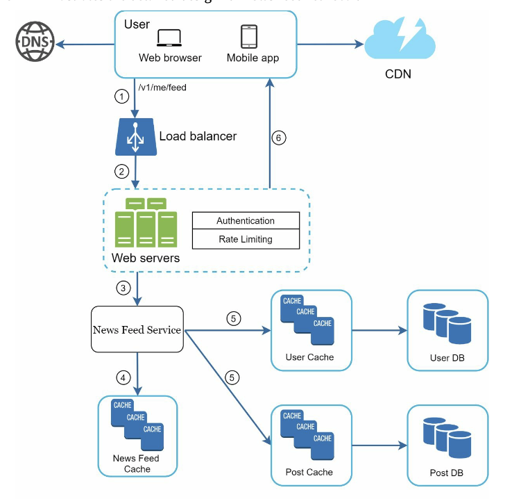
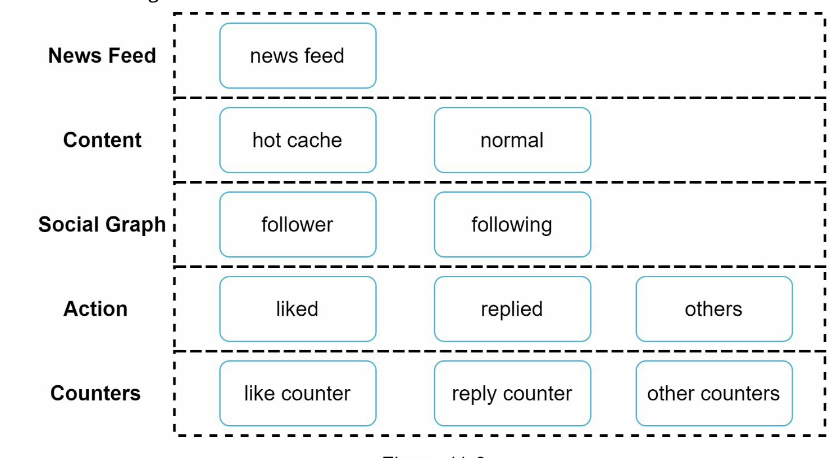

# Chapter 11: Design a News Feed System
- News Feed: the constantly updating list of stories in the middle of your home page
    - status updates, photos, videos, links, app activity, likes from people/pages/groups that you follow (i.e. on Facebook)
- Similar questions: design a Facebook news feed, Instagram feed, Twitter timeline, etc

## Step 1: Understand the Problem and Establish Design Scope
- clarification questions:
    - understand what the interviewer has in mind when they asks you to design a news feed system
    - what features to support

- Q: Is this a mobile app? or web app? both
- A: both

- Q: What are the important features?
- A: user can publish a post and see her friends' posts on the news feed page

- Q: Is the news feed sorted by reverse chronological order or any particular order such as topic scores? (i.e. posts from your close friends have higher scores)
- A: to keep it simple, reverse chronological order

- Q: How many friends can a user have?
- A: 5000

- Q: What is the traffic volume?
- A: 10 million DAU

- Q: Can feed contain images, videos, or just text?
- A: Can contain media files, including both images and videos

## Step 2: Propose High-Level Design and get Buy-In
- Two flows: 
    - Feed publishing: when a user publishes a post, corresponding data is written into cache and db. A post is populated to her friends' news feed
    - Feed building: (for simplicity) built by aggregating friends' posts in reverse chronological order

    ### News Feed APIs
    - primary ways for clients to communicate with servers
    - HTTP based
    
    #### Feed publishing API
    - POST /v1/me/feed
    - Params:
        - content: text of the post
        - auth_token: authenticate API requests
    
    #### Newsfeed retrieval API
    - GET /v1/me/feed
    - Params:
        - auth_token: authenticate API requests
    
    ### Feed Publishing
    - User: user can view news feeds on a browser or mobile app. Makes a post with content "Hello":
        - /v1/me/feed?content=Hello&auth_token={auth_token}
    - Load Balancer: distributes traffic to web servers
    - Web servers: redirect traffic to different internal services
    - Post service: persists post in the db and cache
    - Fanout service: push new content to friends' news feed. Newsfeed data is stored in the cache for fast retrieval
    - Notification service: inform friends that new content is available and send out push notis

    ### Newsfeed Building
    - How news feed is built behind the scenes
    - User: sends a request to retrieve her news feed. 
        - /v1/me/feed
    - Load Balancer: redirects traffic to web servers
    - Web servers: route requests to newsfeed service
    - Newsfeed service: fetches news feed from the cache
    - Newsfeed cache: store news feed IDs needed to render the news feed

    ## Step 3: Design Deep Dive
    ### Feed Publishing Deep Dive
    #### Web servers
    - Communicates with clients
    - Enforce authentication and rate-limiting
        - Only users signed with valid auth_token are allowed to make posts
        - Limits the number of posts a user can make within a certain period (prevent spam and abusive content)

    #### Fanout Service
    - Process of delivering a post to all friends
    - Two types:
        - Fanout on write (aka push model)
        - Fanout on read (aka pull model)

    #### Fanout on Write
    - News feed is pre-computed during write time
    - A new post is delivered to friends' cache immediately after it is published
    - Pros:
        - news feed is generated in real-time and can be pushed to friends immediately
        - fetching news feed is fast (pre-computed)
    - Cons:
        - If user has many friends, fetching the friend list and generating news feeds for all of them are slow and time consuming (aka hotkey problem)
        - For inactive users or those rarely log in, pre-computing news feed waste computing resources

    #### Fanout on Read
    - Generated during read time (on-demand model)
    - Recent posts are pulled when a user loads her home page
    - Pros:
        - For inactive users or who rarely log in, this works better because it will not waste computing resources on them
        - Data not pushed to friends so there is no hotkey problem
    - Cons:
        - fetching the news feed is slow (not pre-computed)

    - Thus we adopt a hybrid approach to get benefits of both and avoid pitfalls
        - We use a push model for the majority of users (fetching news feed fast is crucial)
        - For celebrities or users who have many friends/followers, we let followers pull news content on-demand to avoid system overload (Consistent hashing is a useful technique to mitigate the hotkey problem as it helps to distribute requests/data more evenly)
    
    

    ### Newsfeed Retrieval Deep Dive

    

    ### Cache Architecture

    

    - News Feed: stores IDs of news feeds
    - Content: stores every post data. popular content is stored in hot cache
    - Social Graph: stores relationship data
    - Action: stores info about whether a user liked a post, replied a post, or took other actions on a post
    - Counters: stores counters for like, reply, follower, following, etc

    ## Step 4: Wrap Up
    - Two flows: feed publishing and news feed retrieval
    - There is no perfect way to design a system
        - Every company has its own constraints - must design accordingly
    - Understand the tradeoffs of your design and technology choices
    - Can talk about scalability issues
        - Vertical scaling vs Horizontal scaling
        - SQL vs NoSQL
        - Master-slave replication
        - Read replicas
        - Consistency models
        - Db sharing
    
    - Other talking points:
        - Keep web tier stateless
        - Cache data as much as you can
        - Support multiple data centers
        - Lose couple components w/. message queues
        - Monitor key metrics
            - i.e. QPS during peak hours and latency while users refreshing their news feed are interesting to monitor

