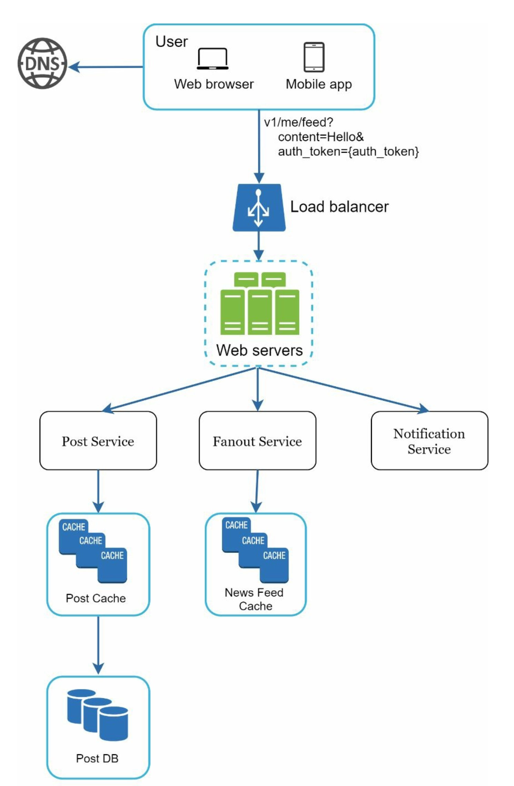
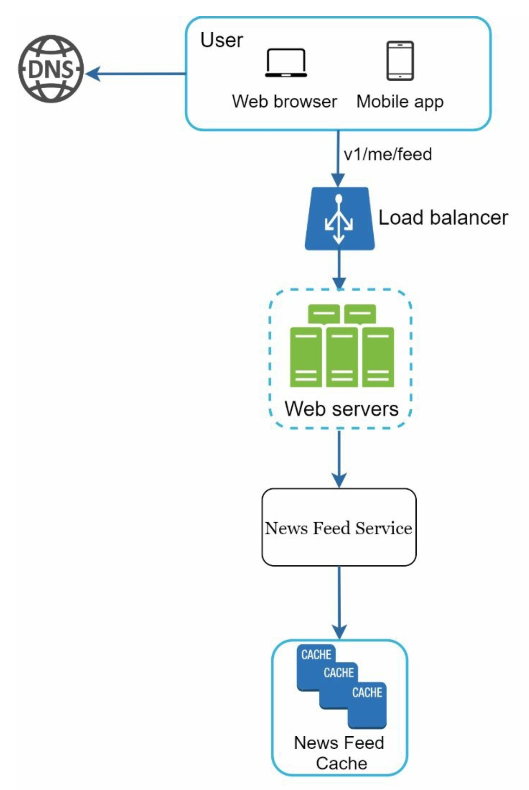
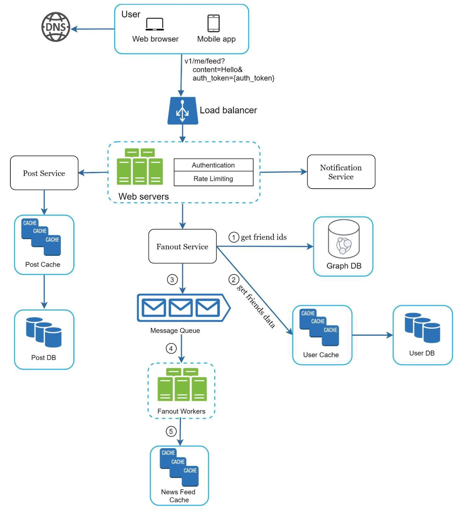
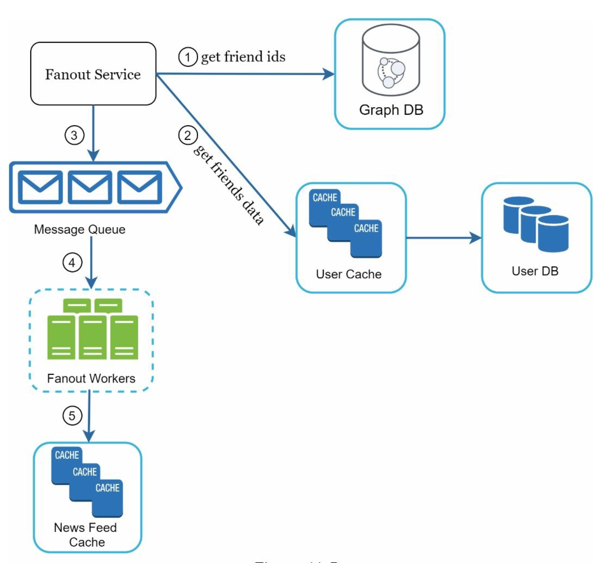
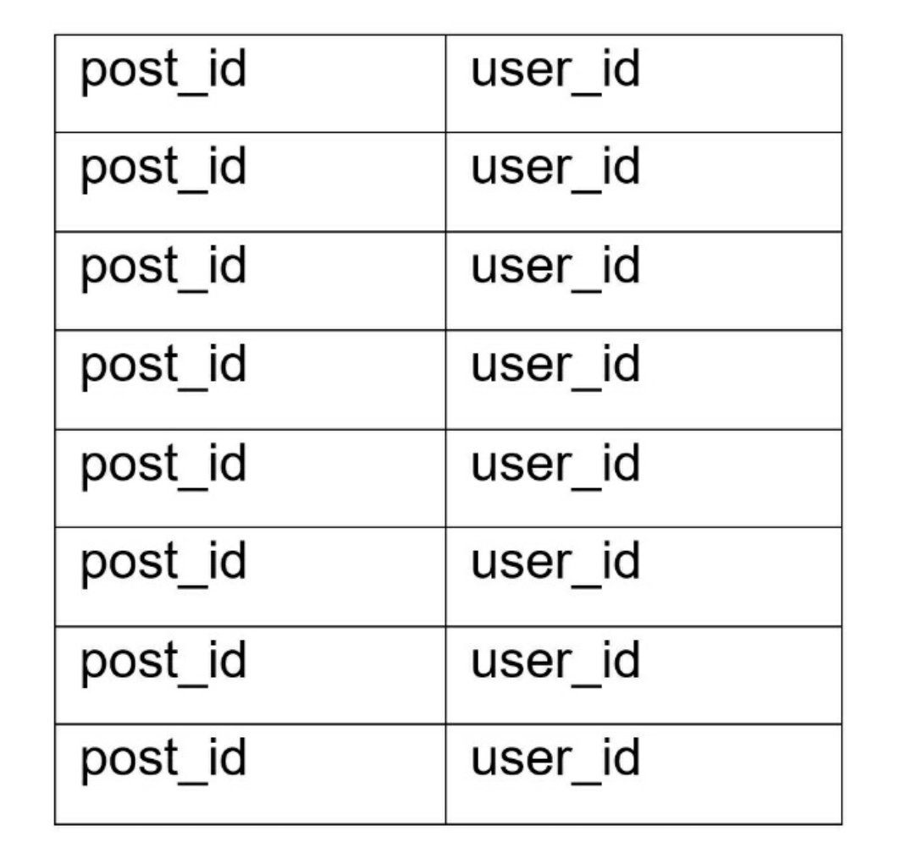
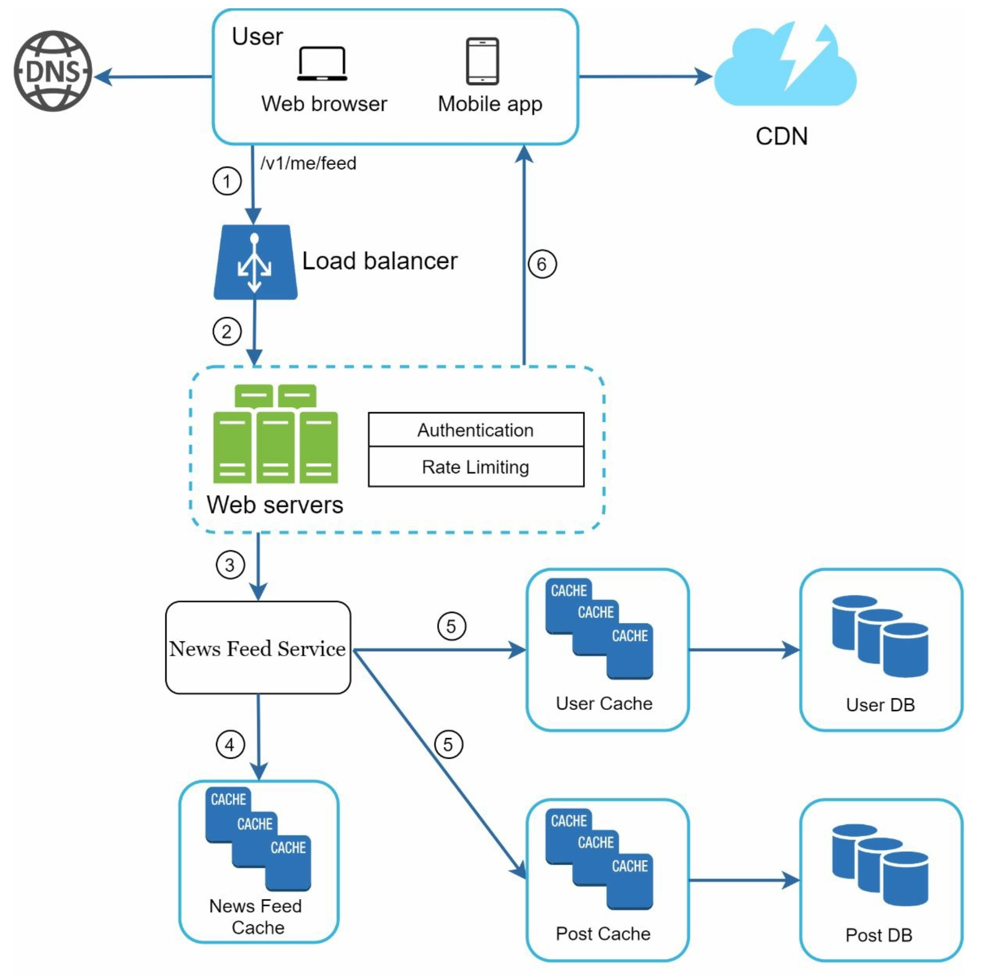
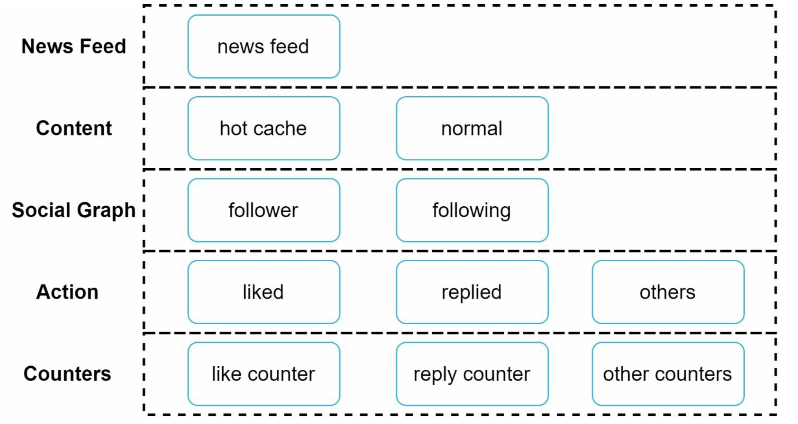

# Chapter 11. Design a news feed system
> News feed is the constantly updating list of stories in the middle of your home page. News Feed includes status updates, photos, videos, links, app activity, and likes from people, pages, and groups that you follow on Facebook **by Facebook help page**

Commonly asked questions: design
- Facebook news feed
- Instagram feed
- Twitter timeline

### Step 1 - Understand the problem and establish design scope
Requirements:
- Both mobile app and web app 
- Important features: a user can publish a post and see her friends' posts on the news feed page
- The feed is sorted by reverse chronological order
- A user can have 5,000 friends
- 10 million DAU(Daily Active User)
- Feed can contain media fiels, including both images and videos

### Step 2 - Propose high-level design and get buy-in
The design is divided into two flows:
**1. Feed publishing**: When a user publishes a post, corresponding data is written into cache and atabase. A post is populated ot her friends' news feed
**2. News feed building**: Let us assume the news feed is build by aggregating friends' posts in reverse chronological order

#### 2-1. Newsfeed APIs
Primary ways for clients to communicate with servers. It's HTTP based that allow clients to perform actions, which include posting a status, retrieving news feed, adding friends, etc. 
Two most important APIs:
- **Feed publishing API**: HTTP POST request sent to the server
    *POST /v1/me/feed*
    Params:
        - content: text of the post
        - auth_token: used to authenticate API requests
    
- **News feed retrieval API**: GET request that retrieves news feed
    *GET /v1/me/feed*
    Params:
        - auth_token: used to authenticate API requests

#### 2-2. Feed publishing
High level design

    

- **User**: can view news feeds on a browser or mobile app. Also makes a post with content through API
- **Load balancer**: distribute traffic to web servers
- **Web servers**: redirect traffic to different internal services
- **Post service**: persist post in the database and cache
- **Fanout service**: push new content to friends' news feed. Newsfeed data is stored in the cache for fast retrieval
- **Notification service**: inform friends that new content is available and send out push notifications

#### 2-3. Newsfeed building
High level design

    

- **User**: sends a request to retrieve her news feed
- **Load balancer**: redirects traffic to web servers
- **Web servers**: route requests to newsfeed service
- **Newsfeed service**: fetches news feed from the cache
- **Newsfeed cache**: store news feed IDs needed to render the news feed

### Step 3 - Design deep dive

    

##### Web servers 
In addition to communicating with clients, web servers enforce authentication and rate-limiting. Only users signed in with valid auth_token are allowed to make posts. The system limits the number of posts a user can make with in a certian period.

##### Fanout service
Process of delivering a post to all friends. Two types of fanout models are: **fanout on write**(also called push model) and **fanout on read**(also called pull model)

> **Fanout on write**

News feed is pre-computed during write time. A new post is delivered to friends' cache immediately after it is published

**Pros**: 
- The news feed is generated in real-time and can be pushed to friends immediately
- Fetching news feed is fast because the news feed is pre-computed during write time

**Cons**:
- If a user has many friends, fetching the friend list and generating news feeds for all of them are slow and time consuming. It is called **hotkey problem**
- For inactive users, or those rarely log in, pre-computing news feeds waste computing resources

> **Fanout on read**

The news feed is generated during read time. This is an on-demand model. Recent posts are pulled when a user loads her home page.

**Pros**:
- For inactive users or those who rarely log in, fanout on read works better because it will not wast computing resources on them
- Data is not pushed to friends so there is no hotkey problem

**Cons**:
- Fetching the news feed is slow as the news feed is not pre-computed

To get benefits of both approaches and avoid pitfalls in them, we can adopt a hybrid approach.
Since fetching the news feed fast is crucial, we use a push model for the majority of users. For celebrities or users who have many friends/followers, we let followers pull news content on-demand to avoid system overload. Consistent hashing is a useful technique to mitigate the hotkey problem as it helps to distribute requests/data more evenly.

    

> How it works
1. Fetch friend IDs from the graph database
2. Get friends info from the user cache. The system then filters out friends base don user settings
3. Send friends list and new post ID to the message queue
4. Fanout workers fetch data from the message queue and store news feed data in the news feed cache. Whenever a new post is made, it will be appended to the news feed table like below. To keep the memory size small, we set a configurable limit. Since most users are only interested in the latest content, the cache miss rate is low.

    

5. Store <post_id, user_id> in news feed cache

#### 3-1. Newsfeed retrieval deep dive

    
    
Media content are stored in CDN for fast retrieval

> How it works
1. A user sends a request to retrieve her news feed
2. The load balancer redistributes requests to web servers
3. Web servers call the news feed service to fetch news feeds
4. News feed service gets a list post IDs from the news feed cache
5. A user's news feed is more than just a list of feed IDs. It contains username, profile, picture, post content, post images, etc. Thus, the news feed service fetches the complete user and post objects from caches(user cache and post cache) to construct the fully hydrated news feed
6. The fully hydrated news feed is returned in JSON format back to the client for rendering

#### 3-2. Cache architecture
Cache is extremely important for a news feed system.

    

- **News feed**: stores IDs of news feeds
- **Content**: stores every post data. Popular content is stored in [hot cache](https://www.baeldung.com/cs/caching-cold-cache-vs-warm-cache)
- **Social Graph**: stores user relationship data
- **Action**: stores info about whether a suer liked a post, replied a post, or took other actions on a post
- **Counters**: stores counters for like, reply, follower, following, etc.

### Step 4 - Wrap up

Few high-level talking points about scalability issues:
1. Scaling the database
    - Vercial scaling vs Horizontal scaling
    - SQL vs NoSQL
    - Master-slave replication
    - Read replicas
    - Consistency models
    - Database sharding
2. Other talking points
    - Keep web tier stateless
    - Cache data as much as you can
    - Supoprt multiple data centers
    - Lose couple components with message queues
    - Monitor key metrics. (e.g. QPS during peak hours and latency while users refreshing thier news feed are interesting to monitor)
