# CHAPTER 13: DESIGN A SEARCH AUTOCOMPLETE SYSTEM

**The design of a chat system**

## Step 1 - Understand the problem and establish design scope

Clarification Questions 
```
Candidate: What kind of chat app shall we design? 1 on 1 or group based?
Interviewer: It should support both 1 on 1 and group chat. 
Candidate: Is this a mobile app? Or a web app? Or both? 
Interviewer: Both.
Candidate: What is the scale of this app? A startup app or massive scale? 
Interviewer: It should support 50 million daily active users (DAU). 
Candidate: For group chat, what is the group member limit?
Interviewer: A maximum of 100 people
Candidate: What features are important for the chat app? Can it support attachment? 
Interviewer: 1 on 1 chat, group chat, online indicator. The system only supports text messages.
Candidate: Is there a message size limit?
Interviewer: Yes, text length should be less than 100,000 characters long. 
Candidate: Is end-to-end encryption required?
Interviewer: Not required for now but we will discuss that if time allows. 
Candidate: How long shall we store the chat history?
Interviewer: Forever.
```

Chat App with the following features
```
• A one-on-one chat with low delivery latency
• Small group chat (max of 100 people)
• Online presence
• Multiple device support. The same account can be logged in to multiple accounts at the same time.
• Push notifications
```

## Step 2 - Propose high-level design and get buy-in
```
Each client connects to a chat service, which supports all the features mentioned above.
Let us focus on fundamental operations. The chat service must support the following functions:
```

Relationships between clients (sender and receiver) and the chat service.

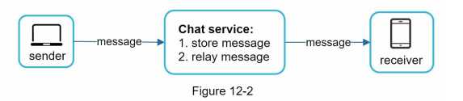

```
When a client intends to start a chat, it connects the chats service using one or more network protocols.
For a chat service, the choice of network protocols is important. Let us discuss this with the interviewer.
Requests are initiated by the client for most client/server applications.
This is also true for the sender side of a chat application.
In Figure 12-2, when the sender sends a message to the receiver via the chat service,
it uses the time-tested HTTP protocol, which is the most common web protocol.
In this scenario, the client opens a HTTP connection with the chat service and sends the message, informing the service to send the message to the receiver.
The keep-alive is efficient for this because the keep-alive header allows a client to maintain a persistent connection with the chat service.
It also reduces the number of TCP handshakes. 
HTTP is a fine option on the sender side, and many popular chat applications such as Facebook [1] used HTTP initially to send messages.
However, the receiver side is a bit more complicated.
Since HTTP is client-initiated, it is not trivial to send messages from the server.
Over the years, many techniques are used to simulate a server-initiated connection: polling, long polling, and WebSocket.
Those are important techniques widely used in system design interviews so let us examine each of them.
```

### Polling
```
As shown in Figure 12-3, polling is a technique that the client periodically asks the server if there are messages available.
Depending on polling frequency, polling could be costly.
It could consume precious server resources to answer a question that offers no as an answer most of the time.
```

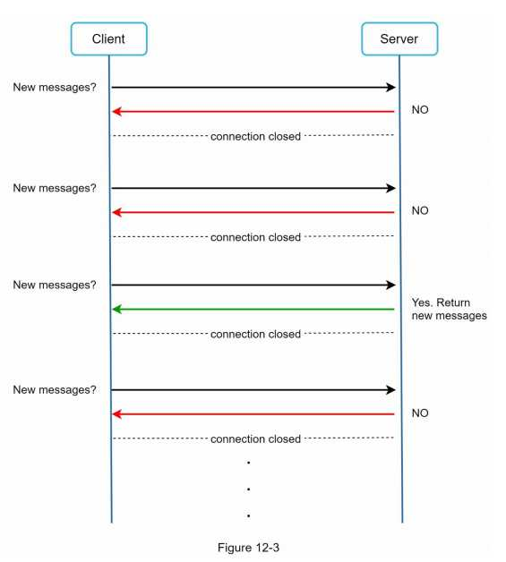

### Long polling

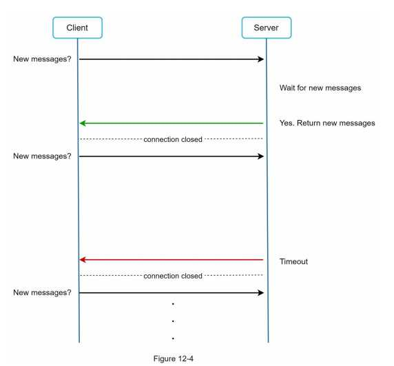
```
In long polling, a client holds the connection open until there are actually new messages available or a timeout threshold has been reached.
Once the client receives new messages, it immediately sends another request to the server, restarting the process.

Long polling has a few drawbacks:
  • Sender and receiver may not connect to the same chat server.
    HTTP based servers are usually stateless.
    If you use round robin for load balancing,
    the server that receives the message might not have a long-polling connection with the client who receives the message.
  • A server has no good way to tell if a client is disconnected.
  • It is inefficient. If a user does not chat much, long polling still makes periodic connections after timeouts.
```

### WebSocket
WebSocket is the most common solution for sending asynchronous updates from server to client. 

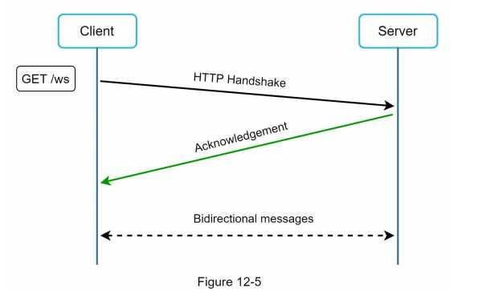

```
WebSocket connection is initiated by the client. It is bi-directional and persistent.
It starts its life as a HTTP connection and could be “upgraded” via some well-defined handshake to a WebSocket connection.
Through this persistent connection, a server could send updates to a client. WebSocket connections generally work even if a firewall is in place.
This is because they use port 80 or 443 which are also used by HTTP/HTTPS connections.
Earlier we said that on the sender side HTTP is a fine protocol to use, but since WebSocket is bidirectional,
there is no strong technical reason not to use it also for sending.
Figure 12-6 shows how WebSockets (ws) is used for both sender and receiver sides.
```

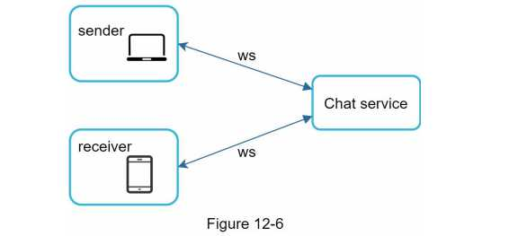

```
By using WebSocket for both sending and receiving, it simplifies the design and makes implementation on both client and server more straightforward.
Since WebSocket connections are persistent, efficient connection management is critical on the server-side.
```

### High-level design
```
ust now we mentioned that WebSocket was chosen as the main communication protocol 
between the client and server for its bidirectional communication, it is important to note that 
everything else does not have to be WebSocket. In fact, most features (sign up, login, user 
profile, etc) of a chat application could use the traditional request/response method over 
HTTP. Let us drill in a bit and look at the high-level components of the system.
As shown in Figure 12-7, the chat system is broken down into three major categories: 
stateless services, stateful services, and third-party integration.
```

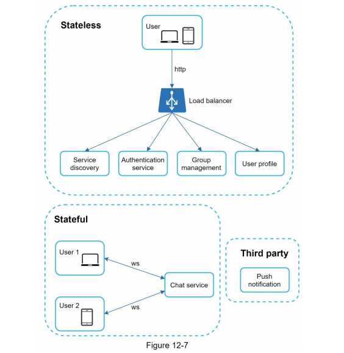

#### (1) Stateless Services
```
Stateless services are traditional public-facing request/response services, used to manage the login, signup, user profile, etc.
These are common features among many websites and apps. 
Stateless services sit behind a load balancer whose job is to route requests to the correctservices based on the request paths.
These services can be monolithic or individual microservices.
We do not need to build many of these stateless services by ourselves as there are services in the market that can be integrated easily.
The one service that we will discuss more in deep dive is the service discovery.
Its primary job is to give the client a list of DNS host names of chat servers that the client could connect to.
```

#### (2) Stateful Service
```
The only stateful service is the chat service.
The service is stateful because each client maintains a persistent network connection to a chat server.
In this service, a client normally does not switch to another chat server as long as the server is still available.
The service discovery coordinates closely with the chat service to avoid server overloading.
We will go into detail in deep dive.
```

#### (3) Third-party integration
```
For a chat app, push notification is the most important third-party integration.
It is a way to inform users when new messages have arrived, even when the app is not running.
Proper integration of push notification is crucial.
Refer to Chapter 10 Design a notification system for more information.
```

#### (4) Scalability
```
On a small scale, all services listed above could fit in one server.
Even at the scale we design for, it is in theory possible to fit all user connections in one modern cloud server.
The number of concurrent connections that a server can handle will most likely be the limiting factor.
In our scenario, at 1M concurrent users, assuming each user connection needs 10K of memory on the server (this is a very rough figure and very dependent on the language choice),
it only needs about 10GB of memory to hold all the connections on one box.
If we propose a design where everything fits in one server, this may raise a big red flag in the interviewer’s mind.
No technologist would design such a scale in a single server.
Single server design is a deal breaker due to many factors. The single point of failure is the biggest among them.
However, it is perfectly fine to start with a single server design.
Just make sure the interviewer knows this is a starting point.
Putting everything we mentioned together, Figure 12-8 shows the adjusted high-level design.
```

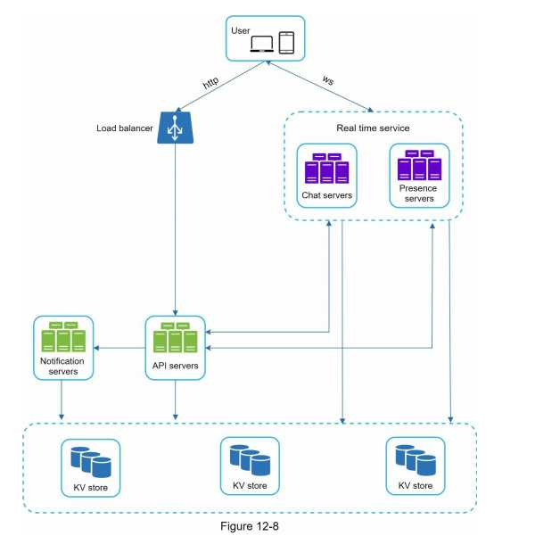

```
In Figure 12-8, the client maintains a persistent WebSocket connection to a chat server for real-time messaging.
  • Chat servers facilitate message sending/receiving.
  • Presence servers manage online/offline status.
  • API servers handle everything including user login, signup, change profile, etc.
  • Notification servers send push notifications.
  • Finally, the key-value store is used to store chat history. When an offline user comes online, she will see all her previous chat history.
```

#### (5) Storage
```
At this point, we have servers ready, services up running and third-party integrations complete.
Deep down the technical stack is the data layer. Data layer usually requires some effort to get it correct.
An important decision we must make is to decide on the right type of database to use: relational databases or NoSQL databases?
To make an informed decision, we will examine the data types and read/write patterns.
Two types of data exist in a typical chat system.
The first is generic data, such as user profile, setting, user friends list.
These data are stored in robust and reliable relational databases. 
Replication and sharding are common techniques to satisfy availability and scalability requirements.

The second is unique to chat systems: chat history data. It is important to understand the read/write pattern.
  • The amount of data is enormous for chat systems. A previous study [2] reveals that   Facebook messenger and Whatsapp process 60 billion messages a day.
  • Only recent chats are accessed frequently. Users do not usually look up for old chats.
  • Although very recent chat history is viewed in most cases, users might use features that require random access of data,
    such as search, view your mentions, jump to specific messages, etc. These cases should be supported by the data access layer.
  • The read to write ratio is about 1:1 for 1 on 1 chat apps.

Selecting the correct storage system that supports all of our use cases is crucial. We recommend key-value stores for the following reasons:
  • Key-value stores allow easy horizontal scaling.
  • Key-value stores provide very low latency to access data.
  • Relational databases do not handle long tail [3] of data well. When the indexes grow   large, random access is expensive.
  • Key-value stores are adopted by other proven reliable chat applications. For example, both Facebook messenger and Discord use key-value stores.
      Facebook messenger uses HBase [4], and Discord uses Cassandra [5].
```


### Data models
Just now, we talked about using key-value stores as our storage layer. The most important data is message data. Let us take a close look.

**- Message table for 1 on 1 chat -**
```
Figure 12-9 shows the message table for 1 on 1 chat.
The primary key is message_id, which helps to decide message sequence.
We cannot rely on created_at to decide the message sequence because two messages can be created at the same time.
```

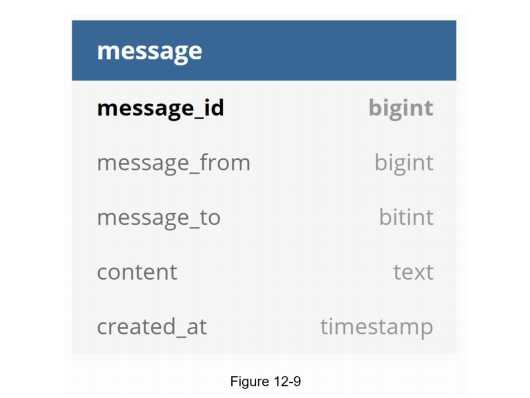

**- Message table for group chat -**
```
Figure 12-10 shows the message table for group chat.
The composite primary key is (channel_id, message_id).
Channel and group represent the same meaning here.
'channel_id' is the partition key because all queries in a group chat operate in a channel.
```
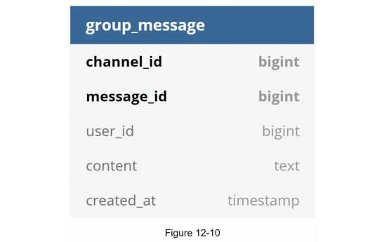

**- Message ID -**
```
How to generate message_id is an interesting topic worth exploring. Message_id carries the 
responsibility of ensuring the order of messages. To ascertain the order of messages, 
message_id must satisfy the following two requirements:
  • IDs must be unique.
  • IDs should be sortable by time, meaning new rows have higher IDs than old ones. 
How can we achieve those two guarantees? The first idea that comes to mind is the
“auto_increment” keyword in MySql. However, NoSQL databases usually do not provide 
such a feature.
The second approach is to use a global 64-bit sequence number generator like Snowflake [6]. 
This is discussed in “Chapter 7: Design a unique ID generator in a distributed system”. 
The final approach is to use local sequence number generator. Local means IDs are only 
unique within a group. The reason why local IDs work is that maintaining message sequence 
within one-on-one channel or a group channel is sufficient. This approach is easier to 
implement in comparison to the global ID implementation.
```

## Step 3 - Design deep dive
- Service discovery
- Messaging flows
- Online/offline indicators

### Service discovery
```
The primary role of service discovery is to recommend the best chat server for a client based on the criteria like geographical location, server capacity, etc.
Apache Zookeeper [7] is a popular open-source solution for service discovery.
It registers all the available chat servers and picks the best chat server for a client based on predefined criteria.
Figure 12-11 shows how service discovery (Zookeeper) works.
```

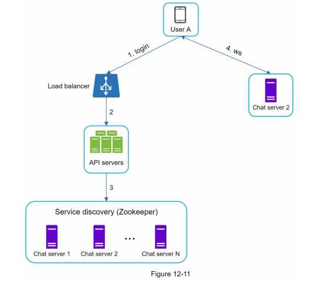

```
  1. User A tries to log in to the app.
  2. The load balancer sends the login request to API servers.
  3. After the backend authenticates the user, service discovery finds the best chat server for User A.
      In this example, server 2 is chosen and the server info is returned back to User A.
  4. User A connects to chat server 2 through WebSocket.
```
### Messaging flows
```
It is interesting to understand the end-to-end flow of a chat system. In this section, we will
explore 1 on 1 chat flow, message synchronization across multiple devices and group chat 
flow.
```

#### 1 on 1 chat flow

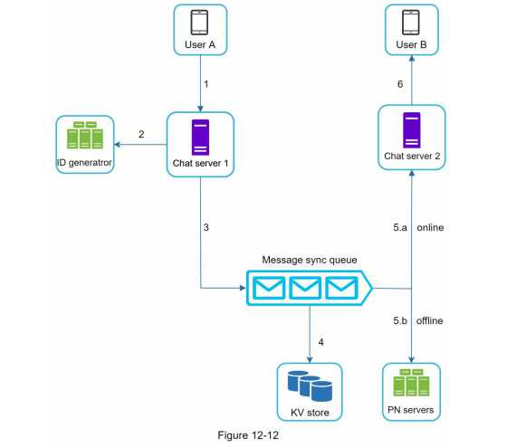

```
Figure 12-12 explains what happens when User A sends a message to User B.
  1. User A sends a chat message to Chat server 1.
  2. Chat server 1 obtains a message ID from the ID generator.
  3. Chat server 1 sends the message to the message sync queue.
  4. The message is stored in a key-value store.
  5.a. If User B is online, the message is forwarded to Chat server 2 where User B is 
  connected.
  5.b. If User B is offline, a push notification is sent from push notification (PN) servers.
  6. Chat server 2 forwards the message to User B. There is a persistent WebSocket 
  connection between User B and Chat server 2.
```
#### Message synchronization across multiple devices

```
Many users have multiple devices. We will explain how to sync messages across multiple devices.
Figure 12-13 shows an example of message synchronization.
```

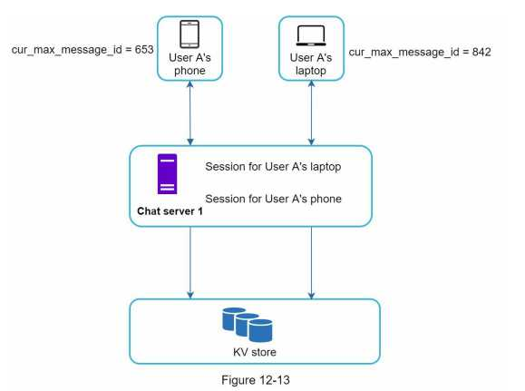

```
In Figure 12-13, user A has two devices: a phone and a laptop. When User A logs in to the 
chat app with her phone, it establishes a WebSocket connection with Chat server 1. Similarly, 
there is a connection between the laptop and Chat server 1.

Each device maintains a variable called cur_max_message_id, which keeps track of the latest 
message ID on the device. Messages that satisfy the following two conditions are considered 
as news messages:
  • The recipient ID is equal to the currently logged-in user ID.
  • Message ID in the key-value store is larger than cur_max_message_id .
With distinct cur_max_message_id on each device, message synchronization is easy as each 
device can get new messages from the KV store.
```

#### Small group chat flow
```
n comparison to the one-on-one chat, the logic of group chat is more complicated. Figures 12-14 and 12-15 explain the flow.
```


```
Figure 12-14 explains what happens when User A sends a message in a group chat. Assume 
there are 3 members in the group (User A, User B and user C). First, the message from User 
A is copied to each group member’s message sync queue: one for User B and the second for 
User C. You can think of the message sync queue as an inbox for a recipient. This design 
choice is good for small group chat because:
  • it simplifies message sync flow as each client only needs to check its own inbox to get 
  new messages.
  • when the group number is small, storing a copy in each recipient’s inbox is not too 
  expensive.
WeChat uses a similar approach, and it limits a group to 500 members [8]. However, for 
groups with a lot of users, storing a message copy for each member is not acceptable.
On the recipient side, a recipient can receive messages from multiple users. Each recipient 
has an inbox (message sync queue) which contains messages from different senders. Figure 
12-15 illustrates the design.
```

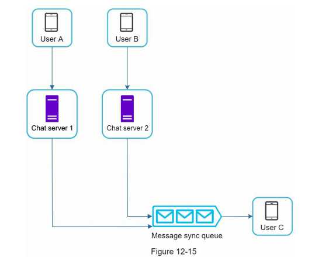

### Online/offline indicators


```
An online presence indicator is an essential feature of many chat applications. Usually, you 
can see a green dot next to a user’s profile picture or username. This section explains what 
happens behind the scenes.
In the high-level design, presence servers are responsible for managing online status and 
communicating with clients through WebSocket. There are a few flows that will trigger 
online status change. Let us examine each of them.

```

#### User login
```
The user login flow is explained in the “Service Discovery” section. After a WebSocket 
connection is built between the client and the real-time service, user A’s online status and 
last_active_at timestamp are saved in the KV store. Presence indicator shows the user is 
online after she logs in.
```


#### User logout
```
When a user logs out, it goes through the user logout flow as shown in Figure 12-17. The 
online status is changed to offline in the KV store. The presence indicator shows a user is 
offline.
```

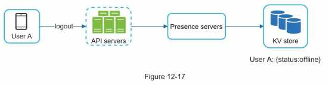

#### User disconnection
```
We all wish our internet connection is consistent and reliable. However, that is not always the 
case; thus, we must address this issue in our design. When a user disconnects from the 
internet, the persistent connection between the client and server is lost. A naive way to handle 
user disconnection is to mark the user as offline and change the status to online when the 
connection re-establishes. However, this approach has a major flaw. It is common for users to 
disconnect and reconnect to the internet frequently in a short time. For example, network 
connections can be on and off while a user goes through a tunnel. Updating online status on 
every disconnect/reconnect would make the presence indicator change too often, resulting in 
poor user experience.

We introduce a heartbeat mechanism to solve this problem. Periodically, an online client 
sends a heartbeat event to presence servers. If presence servers receive a heartbeat event 
within a certain time, say x seconds from the client, a user is considered as online. Otherwise, 
it is offline.
   
In Figure 12-18, the client sends a heartbeat event to the server every 5 seconds. After 
sending 3 heartbeat events, the client is disconnected and does not reconnect within x = 30 
seconds (This number is arbitrarily chosen to demonstrate the logic). The online status is 
changed to offline.
```

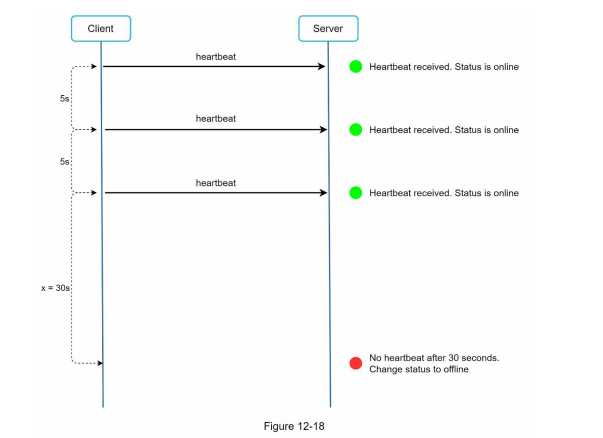

#### Online status fanout
```
How do user A’s friends know about the status changes? Figure 12-19 explains how it works. 
Presence servers use a publish-subscribe model, in which each friend pair maintains a 
channel. When User A’s online status changes, it publishes the event to three channels, 
channel A-B, A-C, and A-D. Those three channels are subscribed by User B, C, and D, 
respectively. Thus, it is easy for friends to get online status updates. The communication 
between clients and servers is through real-time WebSocket.
```

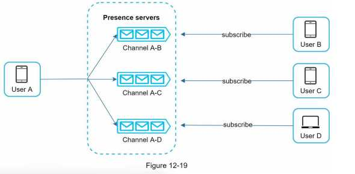

```
The above design is effective for a small user group. For instance, WeChat uses a similar 
approach because its user group is capped to 500. For larger groups, informing all members 
about online status is expensive and time consuming. Assume a group has 100,000 members. 
Each status change will generate 100,000 events. To solve the performance bottleneck, a 
possible solution is to fetch online status only when a user enters a group or manually 
refreshes the friend list.
```


## Step 4 - Wrap up
```

Additional talking points:
• Extend the chat app to support media files such as photos and videos. Media files are 
significantly larger than text in size. Compression, cloud storage, and thumbnails are 
interesting topics to talk about.
• End-to-end encryption. Whatsapp supports end-to-end encryption for messages. Only the 
sender and the recipient can read messages. Interested readers should refer to the article in 
the reference materials [9].
• Caching messages on the client-side is effective to reduce the data transfer between the 
client and server.
• Improve load time. Slack built a geographically distributed network to cache users’ data, 
channels, etc. for better load time [10].
• Error handling.
    • The chat server error. There might be hundreds of thousands, or even more persistent 
    connections to a chat server. If a chat server goes offline, service discovery 
    (Zookeeper) will provide a new chat server for clients to establish new connections 
    with.
    • Message resent mechanism. Retry and queueing are common techniques for 
    resending messages.
```
