# Chapter 12. Design a news chat system

## Step 1. Understand the problem and establish design scope
- What kind of chat app shall we design? 1 on 1 or group based?
- Is this a mobile app? Or a web app? Or both?
- What is the scale of this app?
- What is the group member limit?
- What features are important for the chat app? Can it support attachement?
- Is there a message size limit?
- Is end-to-end encryption required?
- How long shall we store the chat history?

### Requirements
- Small group chat (max of 100 people)
- Online presence
- Multiple device support.
- Supports 50 million DAU.
- A one-on-one chat with low delivery latency.

## Step 2. Propose high-level design and get buy-in
- The relationship between clients
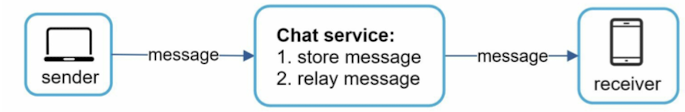

### Polling
- It could consume server resources to answer a questions that offers no as an answer most of the time.
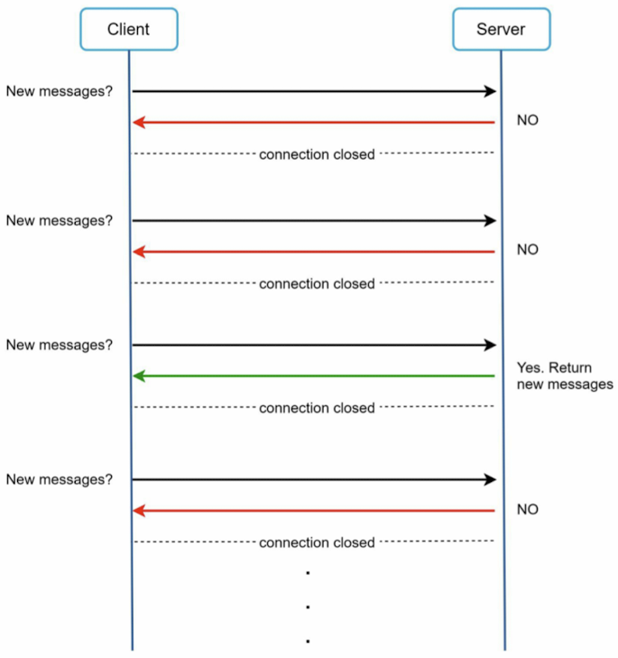

### Long polling
- In long polling, a client holds the connection open until there are actually new messages available or a timeout threshold has been reached.
- Drawbacks
  1. Sender and receiver may not connect to the same chat server. HTTP based servers are usually statless. If you use round robin for load balancing, the server that receives the message might not have a long-polling connection with the client who receives the message.
  2. A server has no good way to tell if a client is disconnected.
  3. It is inefficient. If a user does not chat much, long polling still amkes periodic connections after timeout.
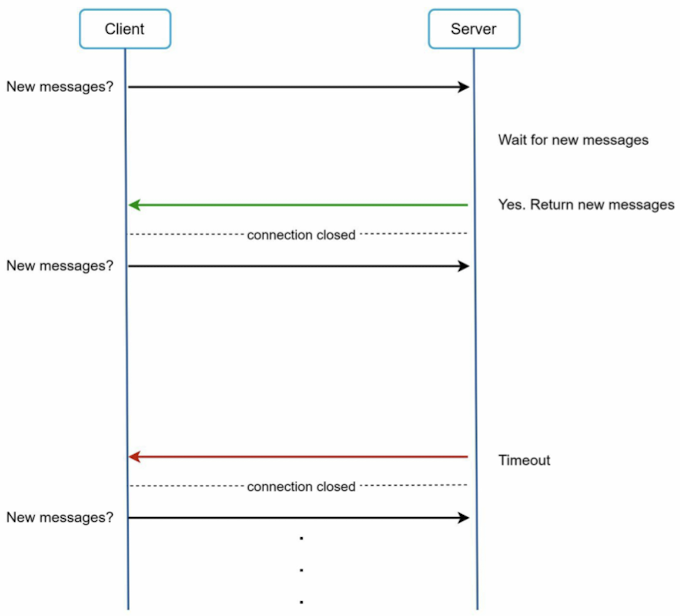

### WebSocket
- The most common soultion for sending asynchronous updates from server to client.
- WebSocket connection is initiated by the client. It is ***bi-directional and persistent***.
- WebSocket connections generally work even if a firewall is in place. This is because they use port 80 or 443 which are also used by HTTP/HTTPS connections.

### High-level design
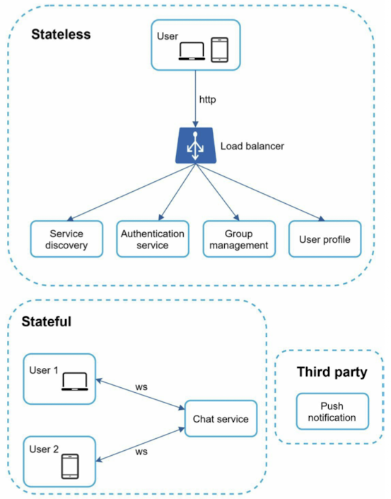

#### Stateless Services
- Stateless services are traditional public-facing request/response services, used to manage the login, signup, user profile, etc.
- Stateless services sit behind a load balancer whose job is to route requests to the correct services based on the request paths.

#### Stateful Service
- The chat service is stateful because each client maintains a persistent network connetion to a chat server.

#### Third-party integration
- Push notification

#### Scalability
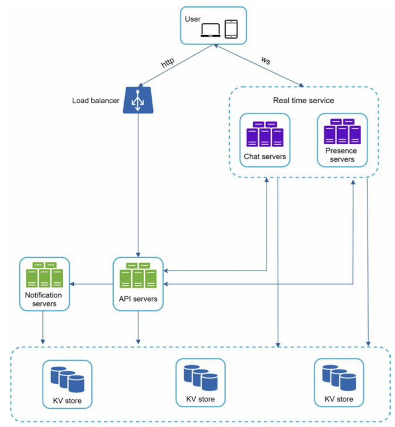
- Chat servers facilitate message sending/receiving.
- Presence servers manage online/offline status.
- API servers handle everything including user login, signup, chage profile, etc.
- Notification servers send push notifications.
- Key-value store is used to store chat history.

#### Storage
- Generic data: Such as user profile, setting, user friends list. These data are stored in robust and reliable relational databases. Replication and sharding are common techniques to satisfy availability and scalability requirements.
- Chat systesm: chat history.
  - The amount of data is enormous for chat systems.
  - Only recent chats are accessed frequently. Users do not usually look up for old chats.
  - Although very recent chat history is viewed in most cases, users might use features that require random access of data, such as search, view your mentions, jump to specific messages, etc. These cases should be supported by the data access layer.
  - The read to write ratio is about 1:1 for 1 on 1 chat apps.
- Key-value stores
  - Key-value stores allow easy horizontal scaling.
  - Key-value sotres provide very low latency to access data.
  - Relational databases do not handle long tail of data well. When the indexes grow large, random access is expensive.
  - Key-value stores are adopted by other proven reliable chat applications.

#### Data models
##### Message table for 1 on 1 chat
- The primary key is message_id, which helps to decide message sequence. We cannot rely on created_at to decide the message sequence because two messages can be created at the same time.

##### Message table for group chat
- The composite primary key is (channel_id, message_id). Channel and group represent the same meaning here. channel_id is the partition key because all queries in a group chat operate in a channel.

##### Message ID
- To ascertain the order of messages, message_id must satisfy the following two requirments:
    - IDs must be unique.
    - IDs should be sortable by time, meaning new rows have higher IDs than old ones.
- auto_increment, but NoSQL databases usually do not provide such a feature.
- use a global 64-bit sequence number generator like Snowflake

## Step 3. Design deep dive
### Service discovery
- Apache Zookeeper is a popular open-source solution for service discovery. It registers all the available chat servers and picks the best chat server for a client based on predefined criteria.
- 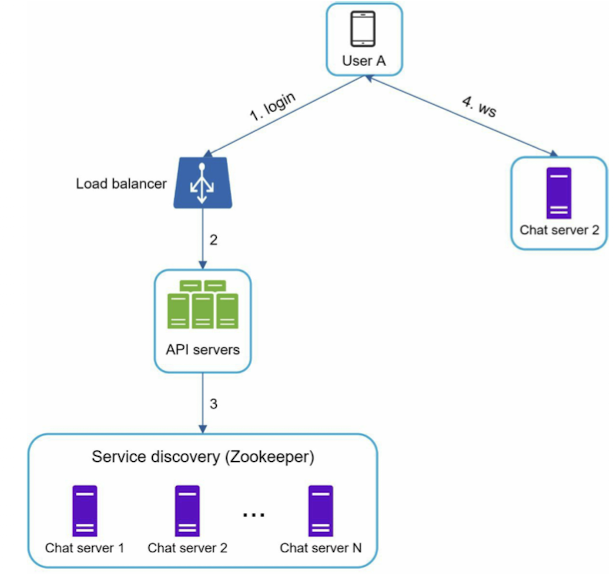

### Message flows
#### 1 on 1 chat flow
- 

#### Message synchronization across multiple devices
- 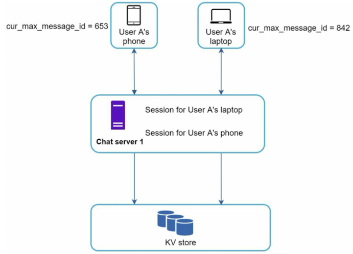
- Each device maintains a variable called cur_max_message_id, which keeps track of the latest message ID on the device. Messages that satisfy the following two conditions are considered as news messages:
  - The recipient ID is equal to the currently logged-in user ID.
  - Message ID in the key-value store is larger than cur_max_message_id.
- With distinct cur_max_message_id on each device, message synchronization is easy as each device can get new messages from the KV store.

#### Small group chat flow
- When User A sends message in a group chat:
  - 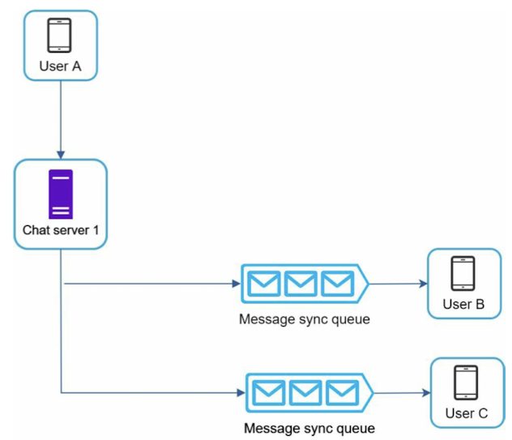
  - This design choice is good for small group chat because it simplifies message sync flow as each client only needs to check its own inbox to get new messages.
  - When the group number is small, storing a copy in each recipient's inbox is not too expensive.
  - In the recipient side,
    - 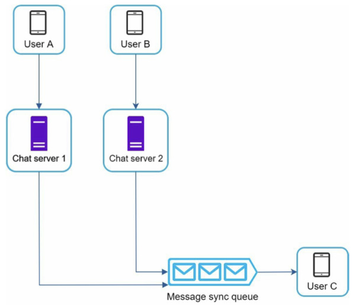

### Online presence
#### User login
- After a WebSocket connection is built between the client and the real-time service, user A's online status and last_active_at timestamp are saved in the KV store.
- 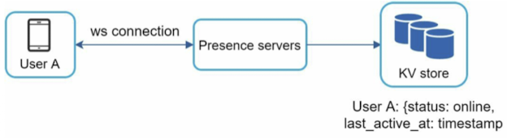

#### User logout
- 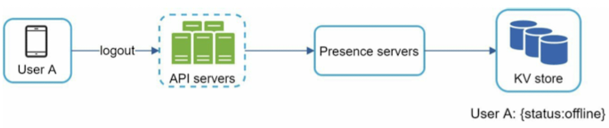

#### User disconnection
- When a user disconnects from the internet, the persistent connection between the client and server is lost. A naive way to handle user disconnection is to mark the user as offline and change the status to online when the connection re-establishes. However, it results in poor user experience.
- Heartbeat mechanism to solve this problem. Periodically, an online client sends a heartbeat event to resence servers. If presence servers receive a heartbeat event within a certain time, say x seoncds from the client, a user is considred as online. Otherwise, it is offline.
- 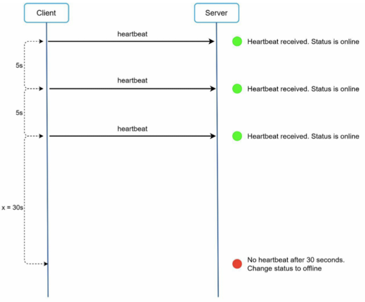

#### Online status fanout
- 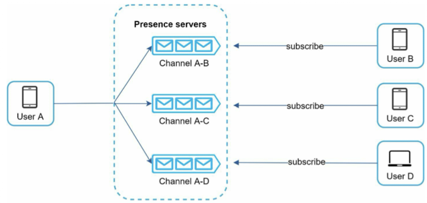
- How do user A's friends know about the status changes?
  - Presence servers use a publish-subscribe model, in which each friend pari maintains a channel. When User A's online status changes, it published the event to three channels. Those three channels are subscribed by User B, C, and D, respectively.Thus, it is easy for friends to get online satus updates. The communication betwen clients and servers is through real-time WebSocket.

## Step 4. Wrap up
- End-to-end encryption
- Caching messages on the client-side is effective to reduce the data transfer between the client and server.
