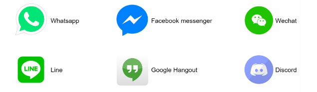
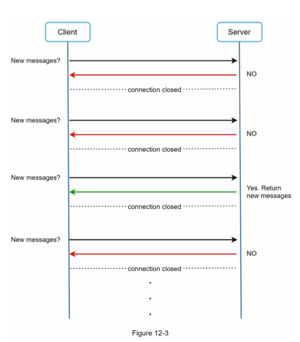
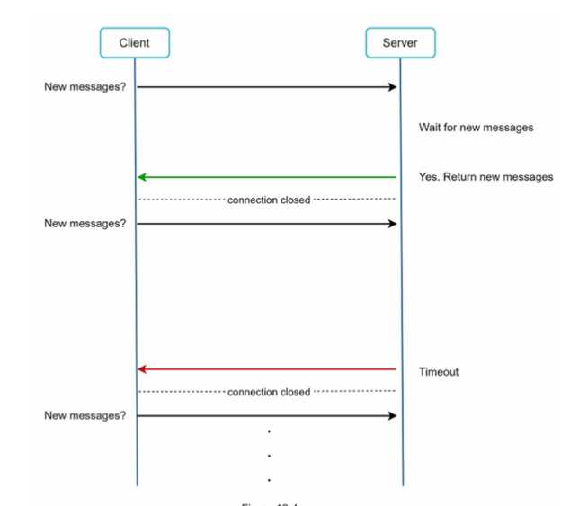
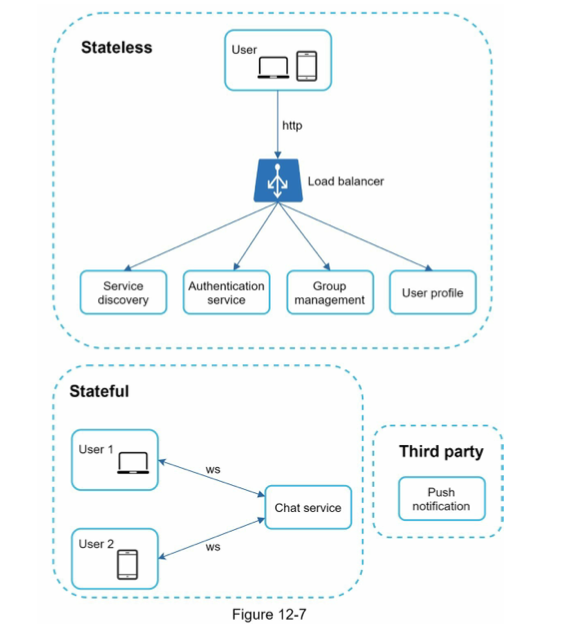
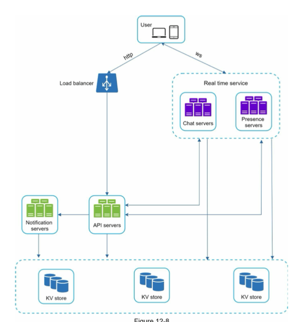
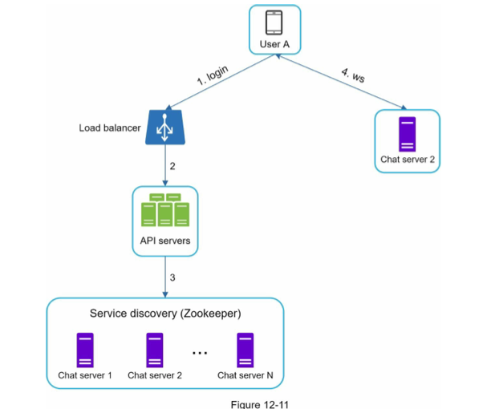
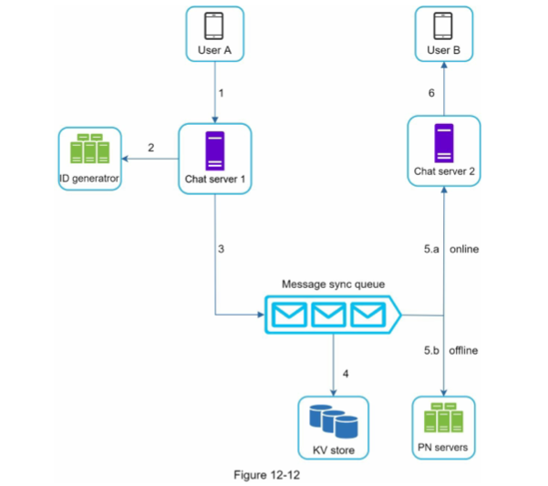
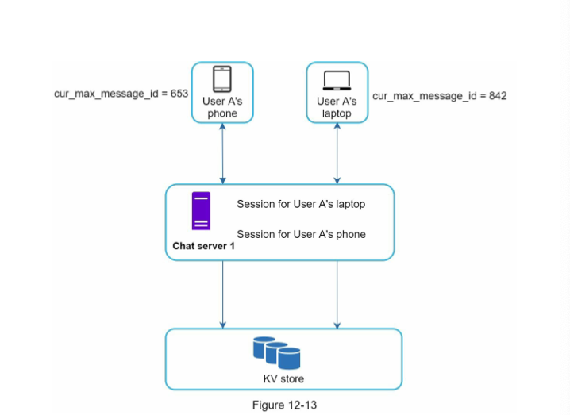
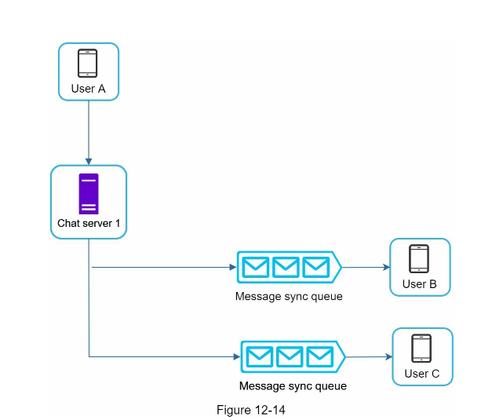
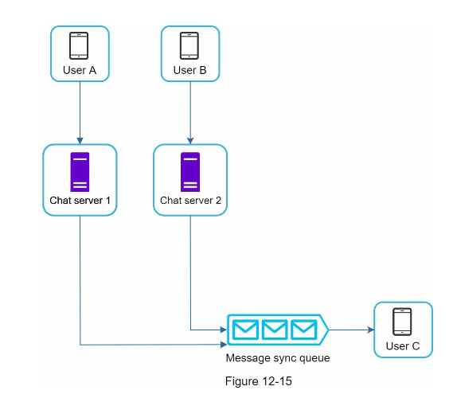

# CHAPTER 12: DESIGN A CHAT SYSTEM

## Step 1 - Understand the problem and establish design scope

### Type of chat app

- One on one focused: Facebook messanger, WeChat, WhatsApp
- Group chat focused: Slack, Discord
- Voice & Video calls
- Latency
- Mobile vs web
- Scale
- Max group chat limit
- Media content
- Message size limit
- End to end encription required -
- Expiration on chat history => could affect the size of the DB and how to cache on FE
- Other requirements like presence, multiple device support, notification

#### For the example

- A one-on-one chat with low delivery latency
- Small group chat (max of 100 people)
- Online presence
- Multiple device support. The same account can be logged in to multiple accounts at the same time.
- Push notifications

## Step 2 - Propose high-level design and get buy-in

- how clients and server communicate?
- clients do not communicate directlt with each other
- each client connects to a chat service which is packed with all required features to send and receive chat

### HTTP protocol

- requets are initialied by the clients (both receiver and sender)
- client opens an HTTP connection with the chat service to request to send a message
- keep-alive header allows a client to maintain a persistent connection with the chat serivice
- reduce the number of TCP handshakes
- limitation: HTTP is client-initiated so servers cannot send messages to clients when there are messages for them to receive
- following are the techniques using HTTP to simulate server initiated connection

### Polling

- Periodically asks the server if there messages available to receive
- Limitations:
- Can be costly to keep sending frequent requests
- Can be wastful requests when there are no messages most of the time

### Long polling

- solve the inefficiency problem
- holds the connection open until new messages are available or timeout
- once receive a new message, immeidately sends another request and hold
- Limitations:
- sender and receiver may not connect to the same server when using load balancer
- sever does not know if the client is disconnected
- still inefficient if chat is not frequent

### WebSocket

- connection is initiated by clients as a HTTP connection
- then it is bi-directional and persistent (stateful)
- server can send updates to the client
- works with firewall
- use port 80/443 also used by HTTP/HTTPS
- efficient use of transactions

## High-level design

- not everything other than communication protocol needs to use WebSocket
- other non communication features can use traditional request/response method such as sign up login, profile, friends list

### Stateless services

- traditional request/response services
- sit behind load balancer among many other services
- these microservices could be 3rd party

### Statefull service

- chat service
- stateful because the connection is persistent
- client do not switch between chat services

### third party integration

- push notification (firebase, APNS)

### Scalability

- The number of concurrent connections that a server can handle will most likely be the limiting factor
- 1M concurrent users => 10GB memory
- Could potentially be handled by a single server but not ideal SPOF

- Chat servers: for messaging
- Presernce server: for presence status
- API server: handles everything else
- Notification server
- Key value store to store chat history

### Storage

- relational databsde or no sql
- examine read/write patterns
- two types of data

1. Generic data: user, settings, friends

   - Relational database
   - Replication and sharding to handle scalabiity

2. Chat history data
   - large in side (Facebook messenger and Whatsapp process 60 billion messages a day)
   - only recent chats are frequently accessed
   - use search for old chats, mentions
   - read:write is 1:1 on one on one chat apps

- Key value store
  - easy horizontal scaling
  - low latency
  - relational database do not handle long tail of data (those that are infrequently accessed) because they are not either indexed or large number of indexes can be expensive
  - well proven its effectiveness by Facbook and Discord

### Data models

- message table for 1 on 1 chat
- use incremental primary key to decide the message sequence
- for group message table we can use a composite primary key (channe_id_message_id)
- auto-increment? no sql does not support it
- snowflake?
- local sequence number generator (message ids only unique in group chat becuase channel id itself is unique)

## Step 3 - Design deep dive

### Service discovery

- recommend best chat server based on geographcial location, capacity (Apache Zookeeper)

1. User A tries to log in to the app.
2. The load balancer sends the login request to API servers.
3. After the backend authenticates the user, service discovery finds the best chat server for User A. In this example, server 2 is chosen and the server info is returned back to User A.
4. User A connects to chat server 2 through WebSocket.

### Service flows

#### 1 on 1 chat flow

1. User A sends a message to chat server 1
2. Chat server 1 gets a new id from id generator
3. Sends message to the message sync queue
4. Message is stored in KV store
5. If User B is online, message is forwarded to Chat server 2 which User B is connected
6. if offline, a push notification is sent from PN server
7. Chat server 2 forwards the message to User B

#### Message synchronization across multiple devices

- both devices get connected to the same WS
- each device maintains `cur_max_message_id` to keep track of the latest message
- new messages have logged-in-user-id as recipient-id
- message id in the KV store is larger than cur_max_message_id

#### Small group chat flow

- messages are copied for each member
- the put in the message sync queue for each
- only need to check its own sync queue (inbox)
- but when group size increases making copies can be expensive

#### Online presence

- User login: After a WS connection, user A’s online status and last_active_at timestamp are saved in the KV store
- User logout: Go through API and mark user as offline in KV store
- User disconnection
  - Mark user offline if WS connection is lost?
  - but it is common for user to disconnect and connect back for a short period of time
  - heartbeat mechanism to solve it by having online client sends heartbeat to presence server
  - no heartbeat for 30 seconds => offline

#### Online status fanout

- how do user friends know their friends' status change?
- Pub Sub
- Each friend pair maintains a channel
- if too many friends, only update status when they enter a group or manually refresh

## Step 4 - Wrap up

- Extend the chat app to support media files such as photos and videos (Compression, cloud storage, and thumbnails are interesting topics to talk about)
- End-to-end encryption. Whatsapp supports end-to-end encryption for messages. Only the sender and the recipient can read messages.
- Caching messages on the client-side is effective to reduce the data transfer between the client and server.
- Improve load time. Slack built a geographically distributed network to cache users’ data, channels, etc.
- Error handling.
- The chat server error. There might be hundreds of thousands, or even more persistent connections to a chat server.
- Message resent mechanism. Retry and queueing are common techniques for resending messages.
