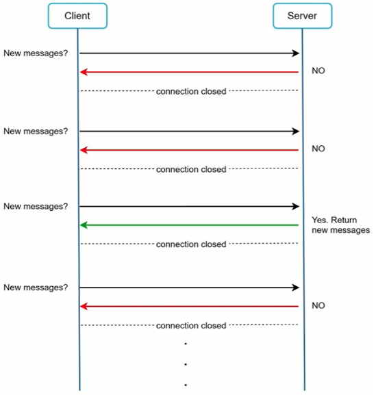
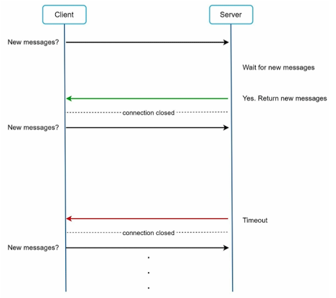
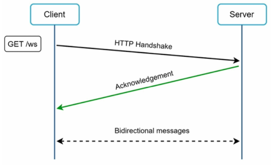
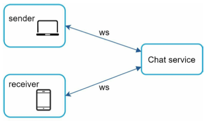
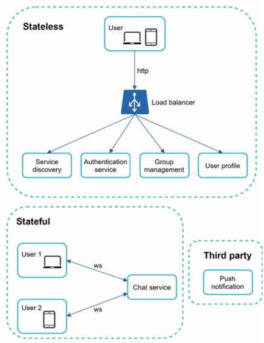
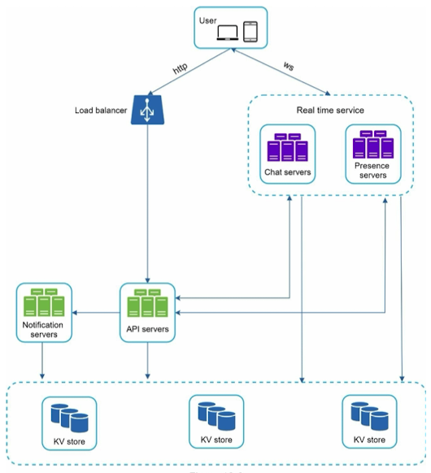
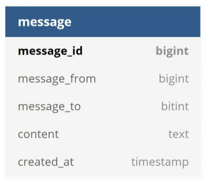
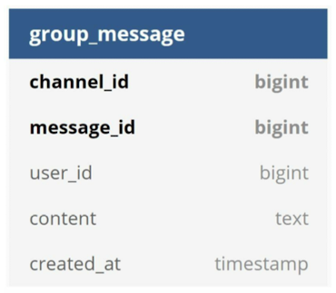
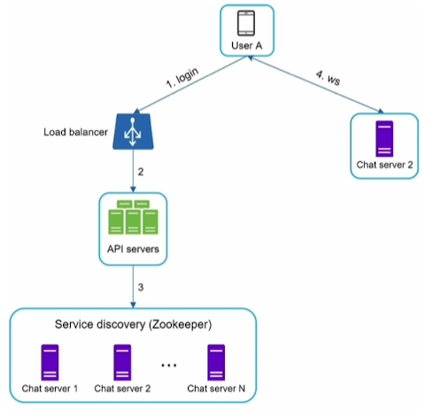
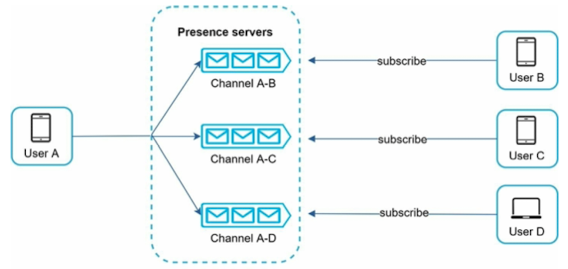

# Chapter 12 : Design A Chat System

## Step 1 - Understand the problem and establish design scope

- 채팅 앱의 유형
    - One-on-one chat apps
    - Group chat
    - Large group interaction + low voice chat latency

- Both 1 on 1 + group chat
- Mobile app + web app
- 50 million daily active users (DAU)
- Maximum of 100 people for group chat
- Features
    - 1 on 1 chat
    - Group chat
    - Online indicator
    - Only supports text messages
- Text length less than 100,000 characters long
- Store chat history forever

## Step 2 - Propose high-level design and get buy-in

- Clients는 mobile applications / web applications
- 직접 communicate X, chat service에 연결
- Chat service는 receive 한 메시지를 올바른 recipients에게 전달
- 온라인이 아닌 경우 서버에 보관
- client가 채팅을 시작할 때, 하나 이상의 network protocols 사용하여 서비스에 연결
    - Polling
    - Long polling
    - WebSocket

### Polling

### Long polling

### WebSocket

### High-level design

#### Stateless Services

- Traditional public-facing request/response service
- 로그인, 회원가입, user profile 관리 등
- 요청 path에 따라 적절한 서비스로 요청을 routing하는 load balancer 뒤에 위치
- Monolithic / individual microservices

#### Stateful Service

- 유일한 stateful service는 채팅 서비스
- 각 client가 채팅 서버에 지속적인 네트워크 연결을 유지하기 때문
- Client는 서버가 여전히 사용 가능한 한 다른 채팅 서버로 전환 X
- Service discovery는 서버 과부하를 방지하기 위해 채팅 서비스와 coordinate

#### Third-party integration

- 채팅 앱에서 가장 중요한 third-party 통합은 push notification
- 앱이 실행되지 않을 때에도 새 메시지가 도착했음을 사용자에게 알리는 방법

#### Scalability

#### Storage

- 데이터베이스 유형 결정 : 관계형 데이터베이스 / NoSQL
- 두 가지 유형의 데이터 존재
    1. 사용자 프로필, 설정, 사용자 친구 목록과 같은 일반적인 데이터
    2. 채팅 시스템에 특유한 채팅 기록 데이터

#### Data models

- Message table for 1 on 1 chat

- Message table for group chat

- Message ID

## Step 3 - Design deep dive

### Service discovery

### Message flows

- 1 on 1 chat flow
- Message synchronization across multiple devices
- Small group chat flow

### Online presence

- User login
- User logout
- User disconnection

#### Online status fanout

## Step 4 - Wrap up

1. WebSocket을 통한 실시간 메시징
2. Online presence 관리
3. Push notifications 전송
4. Chat history 저장
5. API 서버를 통한 기타 기능들

- Tailor-made 접근 필요
- 각 조직은 고유한 제약사항 가짐
- Design과 technology 선택의 trade-off를 이해하는 것 중요
- Chat system을 강화하는 방법:
    - 사진과 비디오 같은 미디어 파일 지원 도입
    - End-to-end encryption 구현으로 메시지 보안 강화
    - Client-side에서 메시지 caching으로 데이터 전송 최소화
    - Load time 최적화와 error handling 전략 개선
- Additional discussion points:
    - 기능을 확장하면서도 performance와 scalability 유지하기
    - Storage 옵션과 시스템 성능에 미치는 영향 탐색
    - 새 기능 추가가 기존 architecture에 미치는 영향 평가
    - Client-side caching의 benefits
    - Scaling 문제에 대비한 database와 server 관리 전략