# Step 1

The scope of the design
- What kind of chat app?
  - 1 on 1 and group chat
- Target screen
  - mobil and web
- The scale of the app
  - 50 mil DAU
- Max member of group chat
  - 100
- Important features
  - 1 on 1, group chat, online indicator. text only
- Message size limit
  - Text length is less than 100,000 characters long
- end to end encryption
  - Not required for now
- Retention period
  - Forever

# Step 2 - high level design

## Requirements
- Receive messages from other clients.
- Find the right recipients for each message and relay the message to the recipients.
- If a recipient is not online, hold the messages for that recipient on the server until she is online.

## Http protocol
- Polling
  - Depending on polling frequency, polling could be costly
- Long polling
  - Holds the connection open until there are actually new messages available or a timeout threshold has been reached.
- Drawbacks
  - the server that receives the message might not have a long-polling connection with the client
  - A server has no good way to tell if a client is disconnected. 
  - It is inefficient. If a user does not chat much, long polling still makes periodic connections after timeouts.

## WebSocket
- Starts as HTTP connection and could be “upgraded” via some well-defined handshake to a WebSocket connection

## High leve design

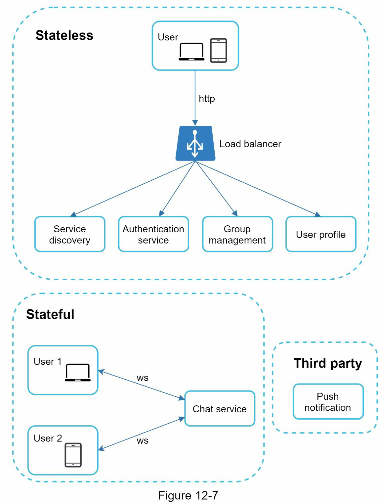

### Stateless services
- Service discovery
  - Give the client a list of DNS host names of chat servers that the client could connect to.
### Stateful service
- The service discovery coordinates closely with the chat service to avoid server overloading
### Third-party integration
- push notification is the most important third-party integration.
### Scalability

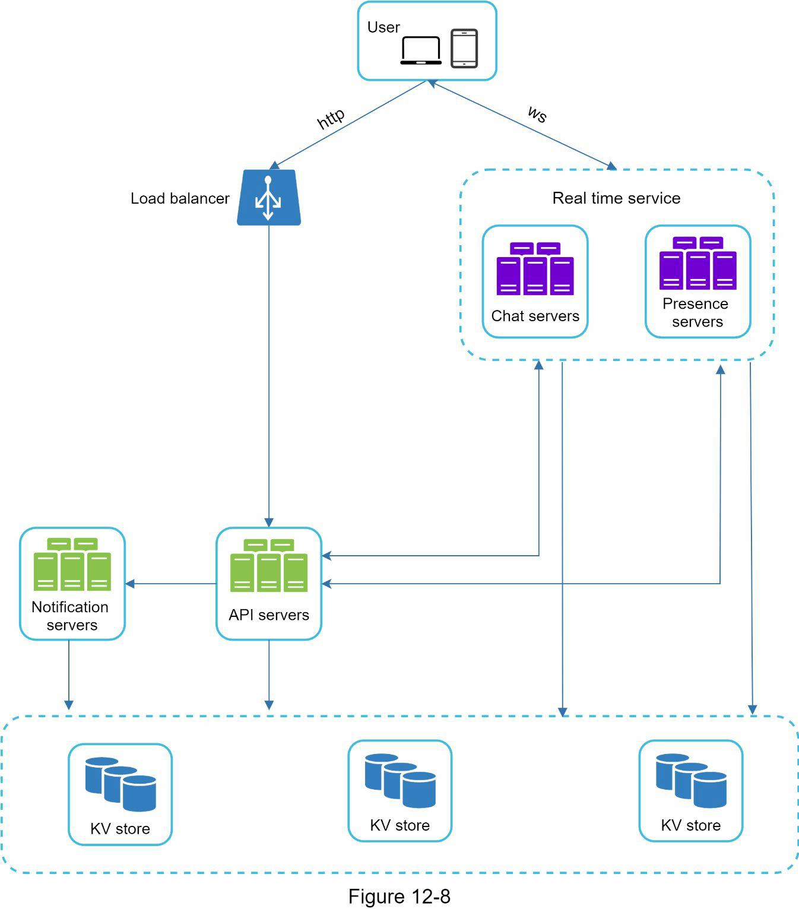

- Chat servers facilitate message sending/receiving.
- Presence servers manage online/offline status.
- API servers handle everything including user login, signup, change profile, etc.
- Notification servers send push notifications.
- The key-value store is used to store chat history. When an offline user comes online, she will see all her previous chat history.

### Storage
- Two types of data
  - Generic data
  - Chat history
    - The amount of data is enormous for chat systems. e.g. Facebook messenger and Whatsapp process 60 billion messages a day
    - Only recent chats are accessed frequently.
    - users might use features that require random access of data, such as search, view your mentions, jump to specific messages, etc. These cases should be supported by the data access layer.
    - The read to write ratio is about 1:1 for 1 on 1 chat apps

- Key-value stores for chat history
  - Easy horizontal scaling
  - Low latency
  - Relational databases do not handle long tail of data well.
  - Facebook messenger and Discord use key-value stores (HBase, Cassandra)

#### Schema

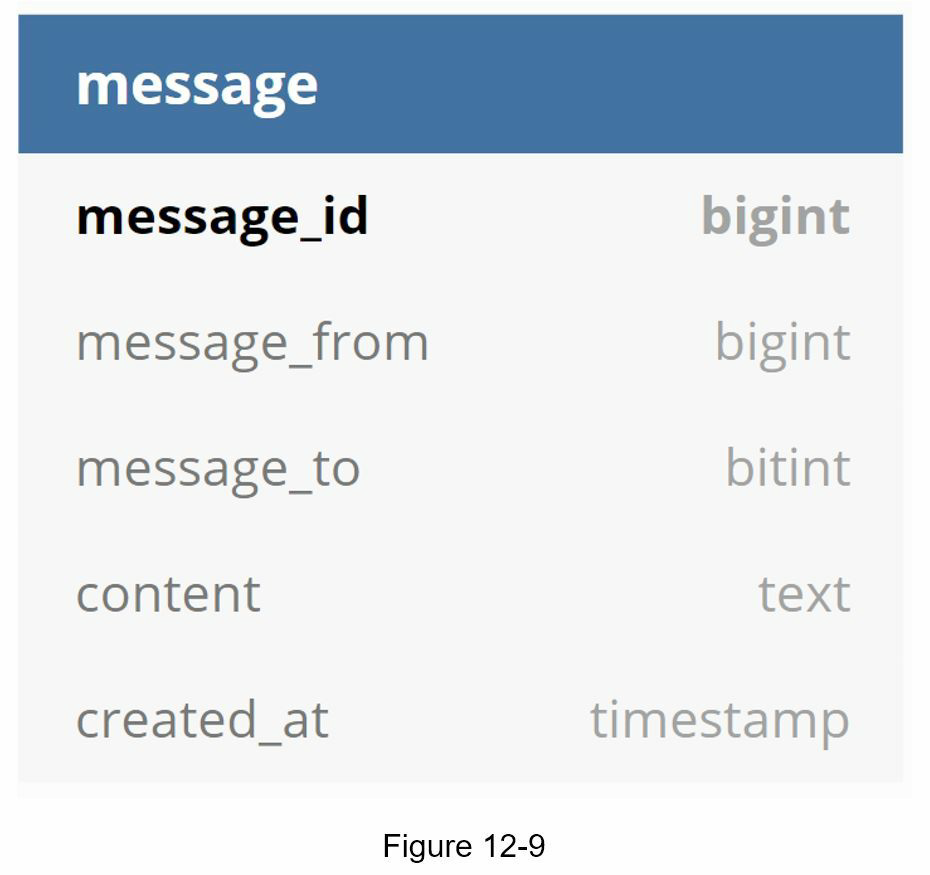

1 on 1 chat

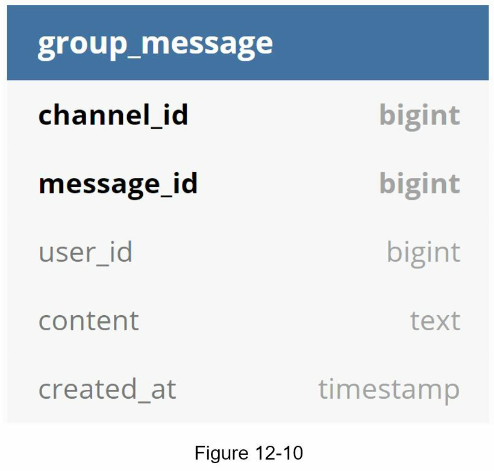

Group chat

#### Message ID
- Use local sequence number generator. Local means IDs are only unique within a group
- Maintaining message sequence within one-on-one channel or a group channel is sufficient

# Step 3

## Service discovery

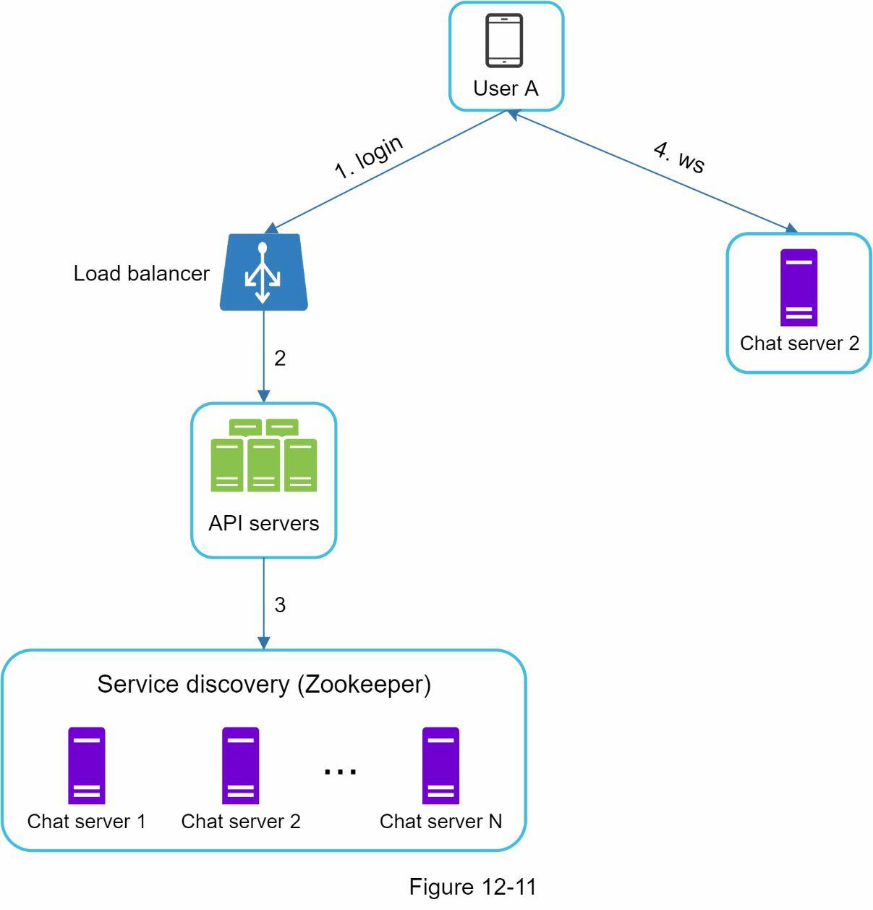

## Message flows

1. User A sends a chat message to Chat server 1.
2. Chat server 1 obtains a message ID from the ID generator.
3. Chat server 1 sends the message to the message sync queue.
4. The message is stored in a key-value store. 
   5.a. If User B is online, the message is forwarded to Chat server 2 where User B is connected. 
   5.b. If User B is offline, a push notification is sent from push notification (PN) servers.
6. Chat server 2 forwards the message to User B.

## Message synchronization across multiple devices

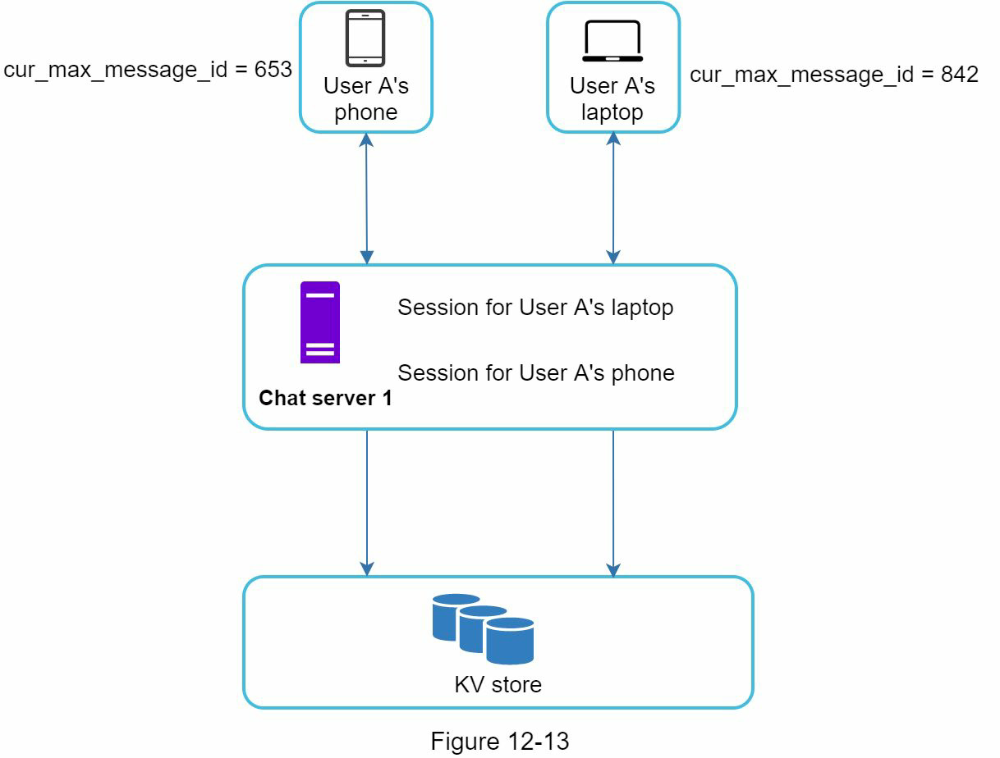

## Group chat

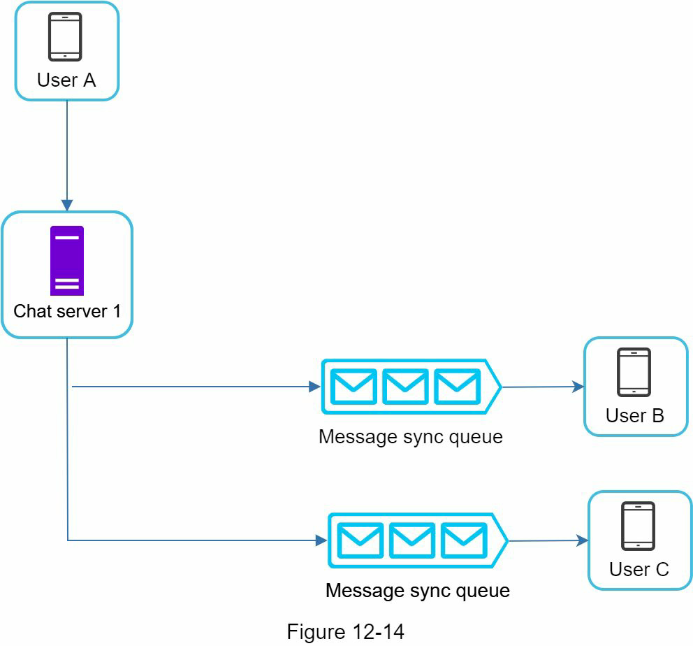

- It simplifies message sync flow as each client only needs to check its own inbox to get new messages.
- When the group number is small, storing a copy in each recipient’s inbox is not too expensive

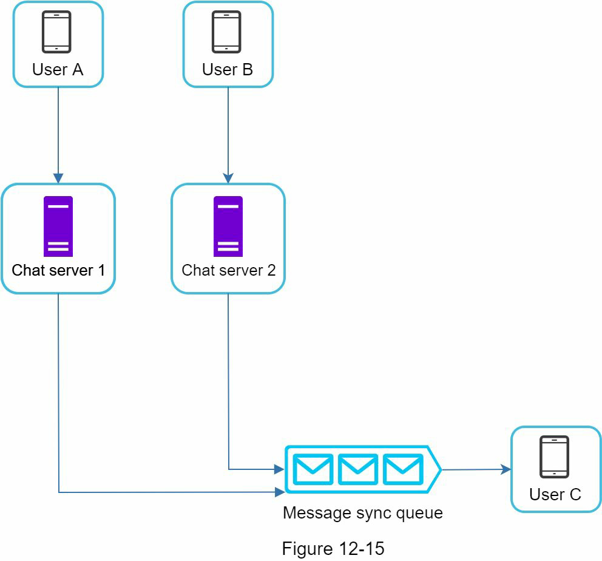

- Each recipient has an inbox (message sync queue) which contains messages from different senders.

## Online presence

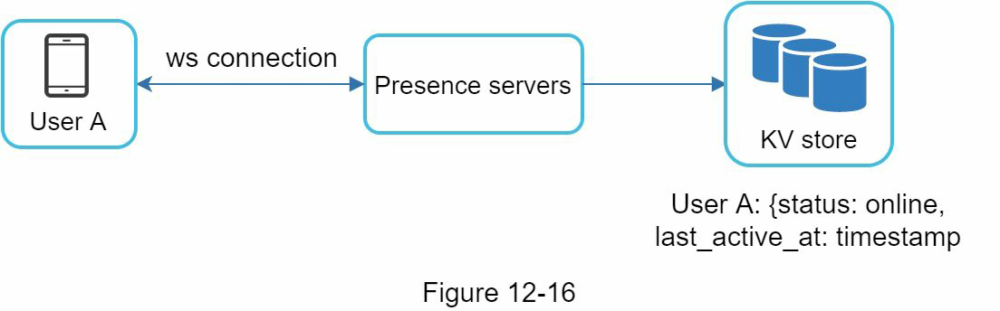

- After a WebSocket connection is built between the client and the real-time service, user A’s online status and last_active_at timestamp are saved in the KV store.

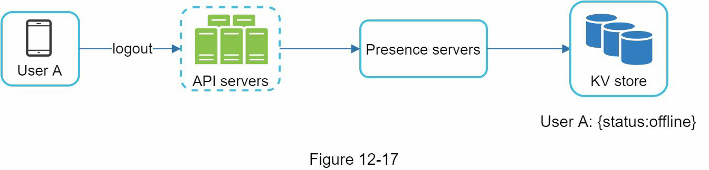

## User disconnection

- Use heartbeat mechanism

## Online status fanout

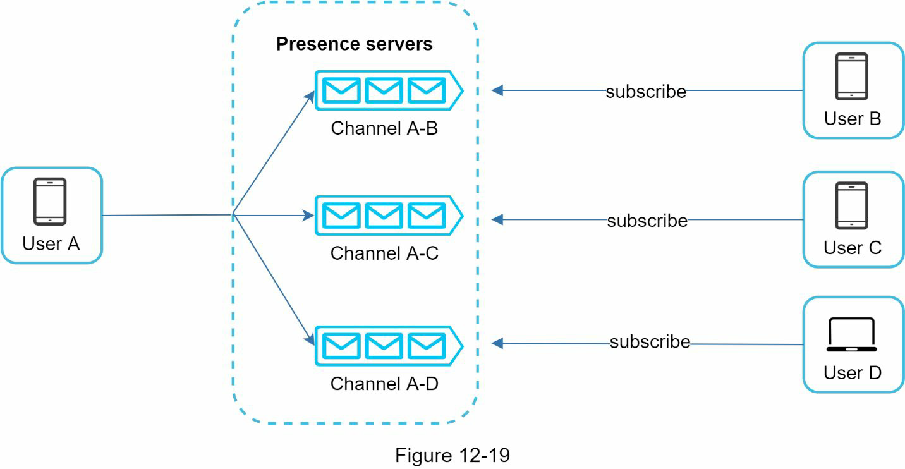

- When User A’s online status changes, it publishes the event to three channels, channel A-B, A-C, and A-D.
- The communication between clients and servers is through real-time WebSocket.

# Step 4 - Wrap up
- Extend the chat app to support media files
  - Compression, cloud storage, and thumbnails
- End-to-end encryption
- Caching messages on the client-side
- Improve load time
- Error handling
  - If a chat server goes offline, service discovery(Zookeeper) will provide a new chat server for clients to establish new connections with
  - Message resent mechanism.(Retry and queueing)