# 12. DESIGN A CHAT SYSTEM
### Step 1 - Understand the problem and establish design scope
---
- A one-on-one chat with low delivery latency
- Small group chat (max of 100 people)
- Online presence
- Multiple device support. The same account can be logged in to multiple accounts at the same time.
- Push notifications

### Step 2 - Propose high-level design and get buy-in
---
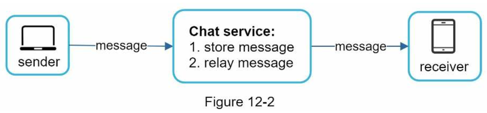

#### Polling
- Polling is a technique that the client periodically asks the server if there are messages available. 
- Depending on polling frequency, polling could be costly.

#### Long polling
- In long polling, a client holds the connection open until there are actually new messages available or a timeout threshold has been reached.
- Drawbacks:
    - Sender and receiver may not connect to the same chat server. HTTP based servers are usually stateless. If you use round robin for load balancing, the server that receives the message might not have a long-polling connection with the client who receives the message.
    - A server has no good way to tell if a client is disconnected.
    - If a user does not chat much, long polling still makes periodic connections after timeouts.

#### WebSocket
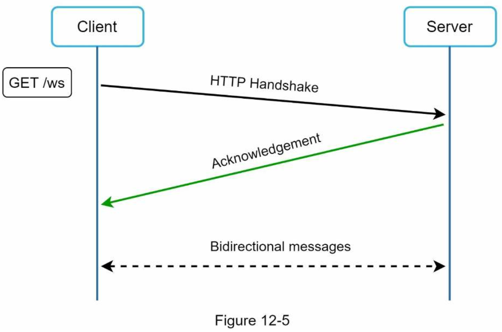
- It is bi-directional and persistent.
- It starts its life as a HTTP connection and could be “upgraded” via some well-defined handshake to a WebSocket connection.
- By using WebSocket for both sending and receiving, it simplifies the design and makes implementation on both client and server more straightforward.
- Since WebSocket connections are persistent, efficient connection management is critical on the server-side.

#### High-level design
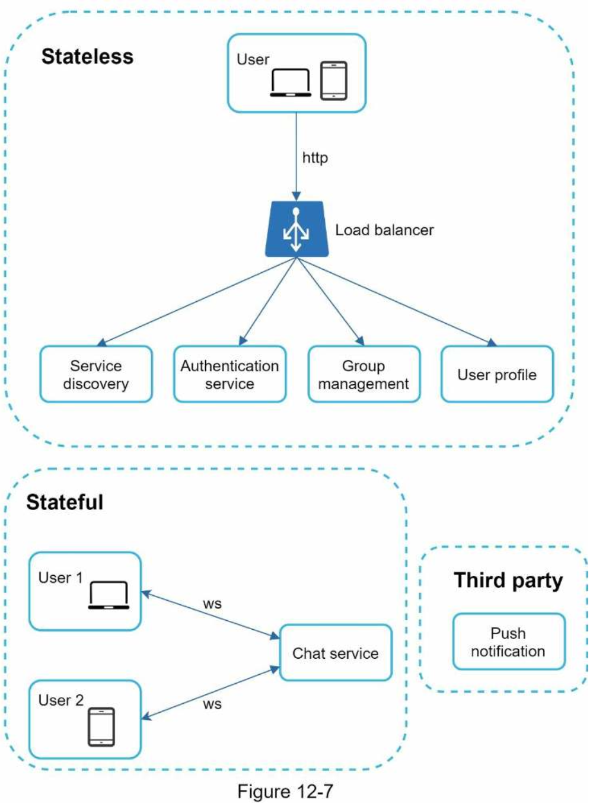

###### Stateless Services
- Stateless services are traditional public-facing request/response services, used to manage the login, signup, user profile, etc.
- These services can be monolithic or individual microservices.

###### Stateful Service
- The service is stateful because each client maintains a persistent network connection to a chat server.
- In this service, a client normally does not switch to another chat server as long as the server is still available.
- The service discovery coordinates closely with the chat service to avoid server overloading.

###### Third-party integration
- It is a way to inform users when new messages have arrived, even when the app is not running.

###### Scalability
- In our scenario, at 1M concurrent users, assuming each user connection needs 10K of memory on the server (this is a very rough figure and very dependent on the language choice), it only needs about 10GB of memory to hold all the connections on one box.
- If we propose a design where everything fits in one server, this may raise a big red flag in the interviewer’s mind. The single point of failure is the biggest among them.
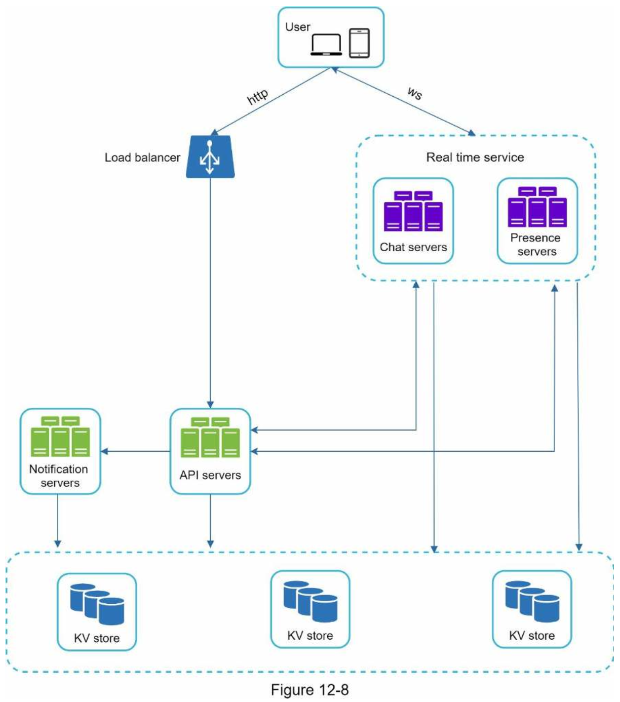
- Chat servers facilitate message sending/receiving.
- Presence servers manage online/offline status.
- API servers handle everything including user login, signup, change profile, etc.
- Notification servers send push notifications.
- Finally, the key-value store is used to store chat history. When an offline user comes online, she will see all her previous chat history.

###### Storage
- The first is generic data, such as user profile, setting, user friends list.
    - These data are stored in robust and reliable relational databases.
    - Replication and sharding are common techniques to satisfy availability and scalability requirements.
- The second is unique to chat systems: chat history data.
    - The amount of data is enormous for chat systems. A previous study reveals that Facebook messenger and Whatsapp process 60 billion messages a day.
    - Only recent chats are accessed frequently.
    - Although very recent chat history is viewed in most cases, users might use features that require random access of data, such as search, view your mentions, jump to specific messages, etc.
    - The read to write ratio is about 1:1 for 1 on 1 chat apps.
- We recommend key-value stores for the following reasons:
    - Key-value stores allow easy horizontal scaling.
    - Key-value stores provide very low latency to access data.
    - Relational databases do not handle long tail of data well. When the indexes grow large, random access is expensive.
    - Key-value stores are adopted by other proven reliable chat applications.

#### Data models
###### Message table for 1 on 1 chat
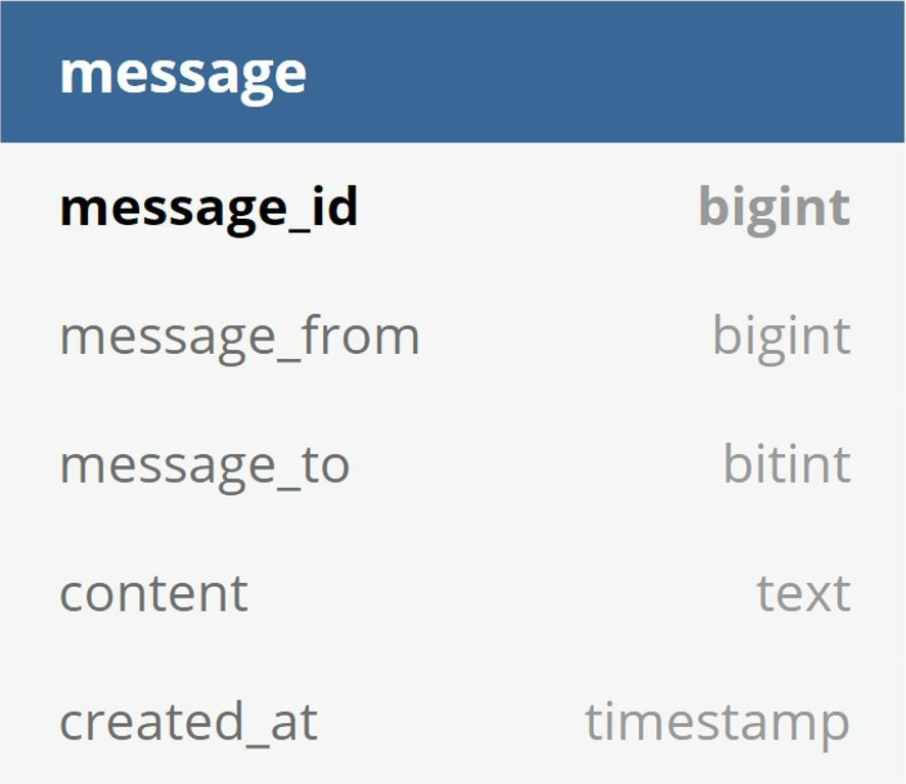
- The primary key is `message_id`, which helps to decide message sequence.
- We cannot rely on `created_at` to decide the message sequence because two messages can be created at the same time.

###### Message table for group chat
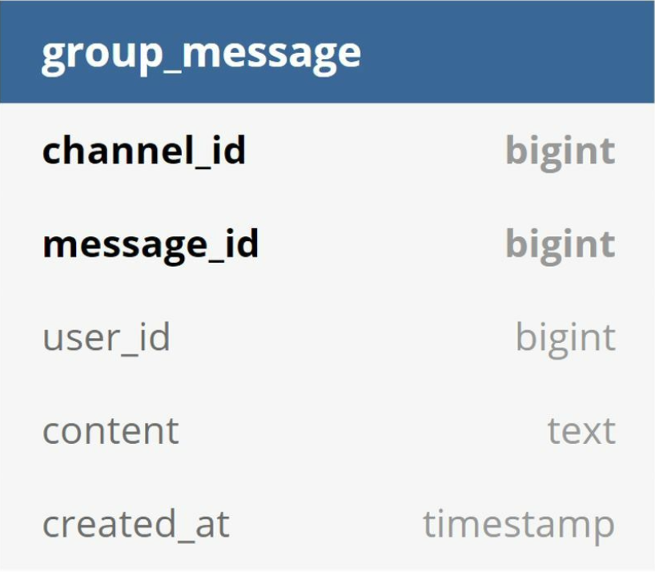
- The composite primary key is (`channel_id`, `message_id`)
- `channel_id` is the partition key because all queries in a group chat operate in a channel.
- `Message_id` carries the responsibility of ensuring the order of messages.
- `message_id` must satisfy the following two requirements:
    - IDs must be unique.
    - IDs should be sortable by time, meaning new rows have higher IDs than old ones.
- How can we achieve those two guarantees?
    - “auto_increment” keyword in MySql -> NoSQL databases usually do not provide such a feature.
    - Use a global 64-bit sequence number generator like Snowflake.
    - Use local sequence number generator. 

### Step 3 - Design deep dive
---
#### Service discovery
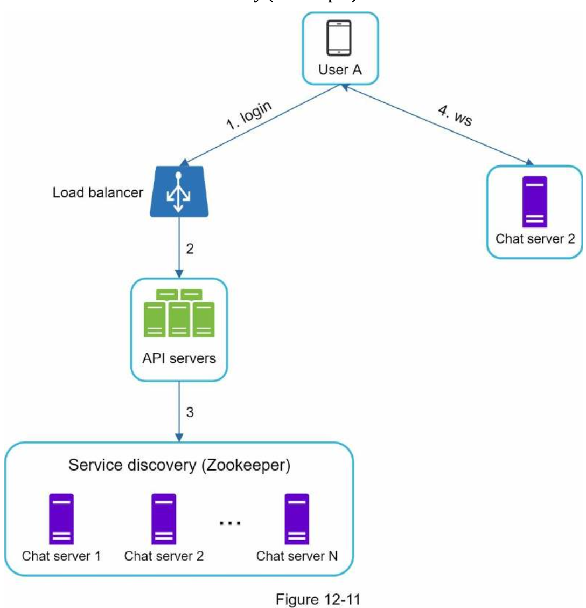
1. User A tries to log in to the app.
2. The load balancer sends the login request to API servers.
3. After the backend authenticates the user, service discovery finds the best chat server for User A. In this example, server 2 is chosen and the server info is returned back to User A.
4. User A connects to chat server 2 through WebSocket.

#### Message flows
###### 1 on 1 chat flow
1. User A sends a chat message to Chat server 1.
2. Chat server 1 obtains a message ID from the ID generator.
3. Chat server 1 sends the message to the message sync queue.
4. The message is stored in a key-value store.
    - a. If User B is online, the message is forwarded to Chat server 2 where User B is connected.
    - b. If User B is offline, a push notification is sent from push notification (PN) servers.
6. Chat server 2 forwards the message to User B. There is a persistent WebSocket connection between User B and Chat server 2.

###### Message synchronization across multiple devices
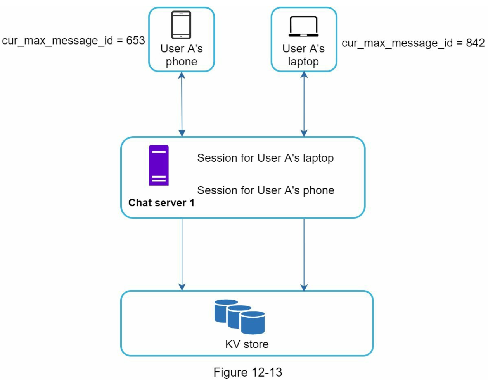
- The recipient ID is equal to the currently logged-in user ID.
- Message ID in the key-value store is larger than cur_max_message_id.

###### Small group chat flow
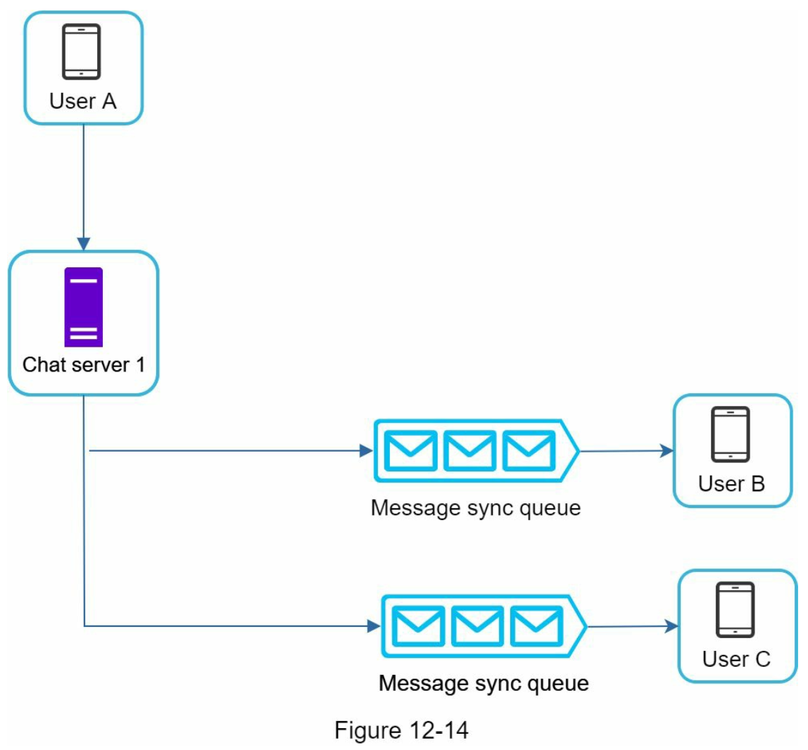
- First, the message from User A is copied to each group member’s message sync queue: one for User B and the second for User C.
- You can think of the message sync queue as an inbox for a recipient.
- It simplifies message sync flow as each client only needs to check its own inbox to get new messages.
- When the group number is small, storing a copy in each recipient’s inbox is not too expensive.
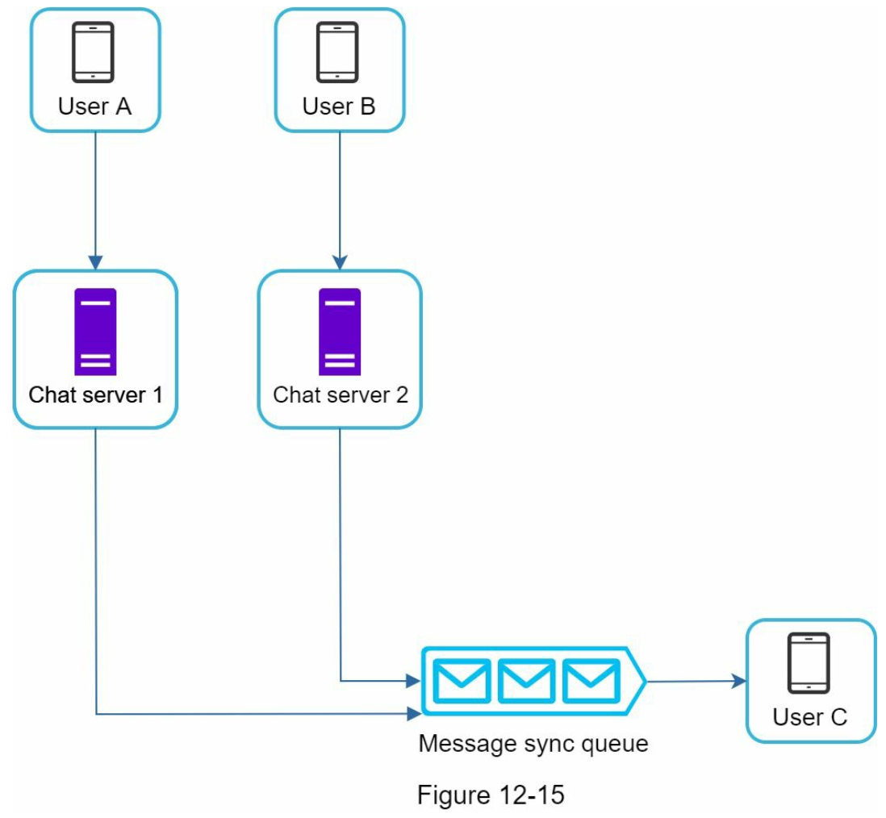
- For groups with a lot of users, storing a message copy for each member is not acceptable.
- On the recipient side, a recipient can receive messages from multiple users. Each recipient has an inbox (message sync queue) which contains messages from different senders.

#### Online presence
###### User login
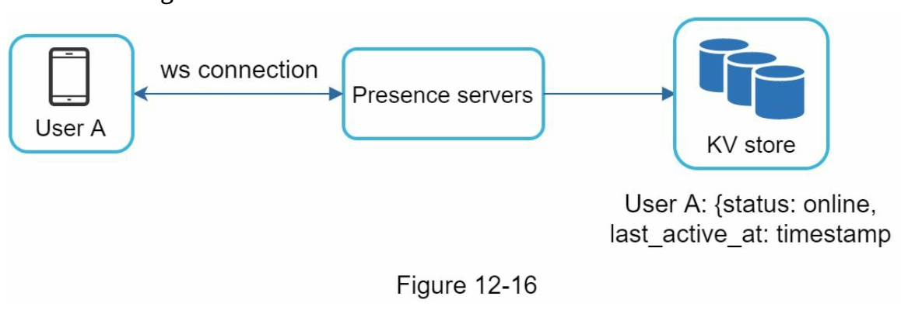
- After a WebSocket connection is built between the client and the real-time service, user A’s online status and last_active_at timestamp are saved in the KV store.

###### User logout
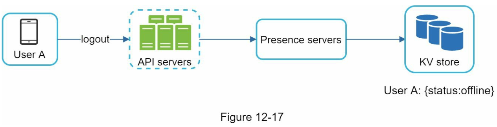
- When a user logs out, it goes through the user logout flow.

###### User disconnection
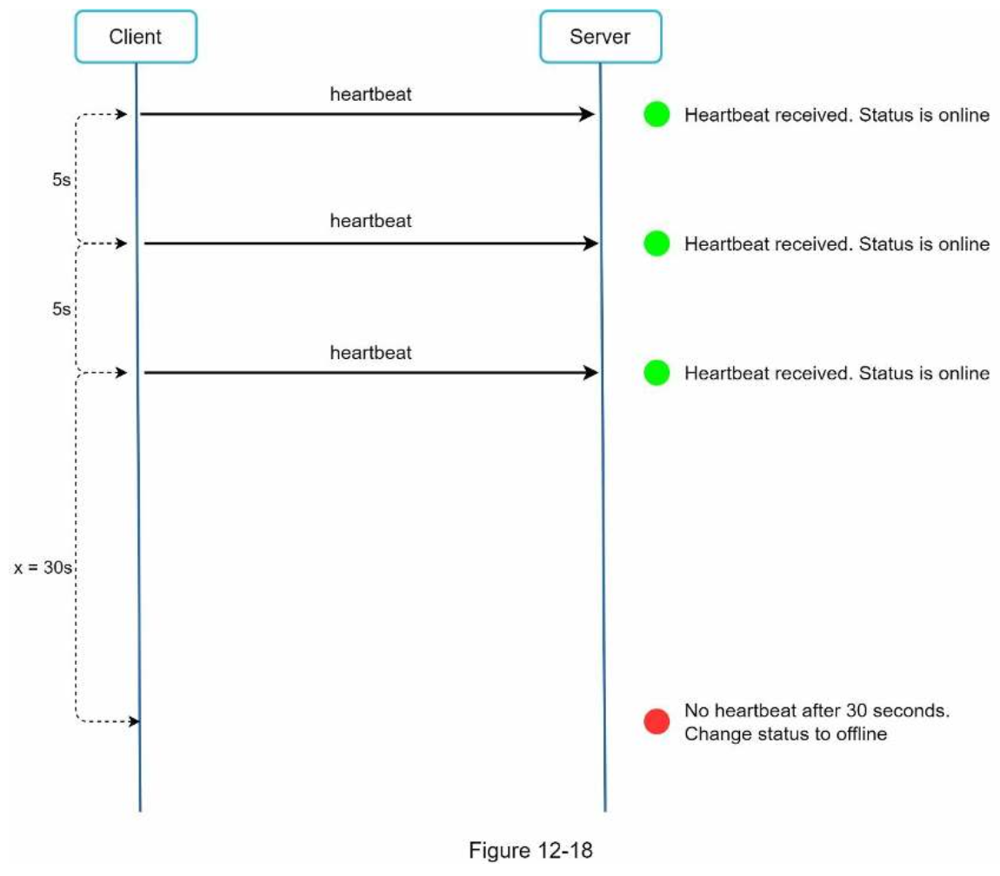
- We introduce a heartbeat mechanism to solve this problem. 
- If presence servers receive a heartbeat event within a certain time, say x seconds from the client, a user is considered as online. Otherwise, it is offline.

###### Online status fanout
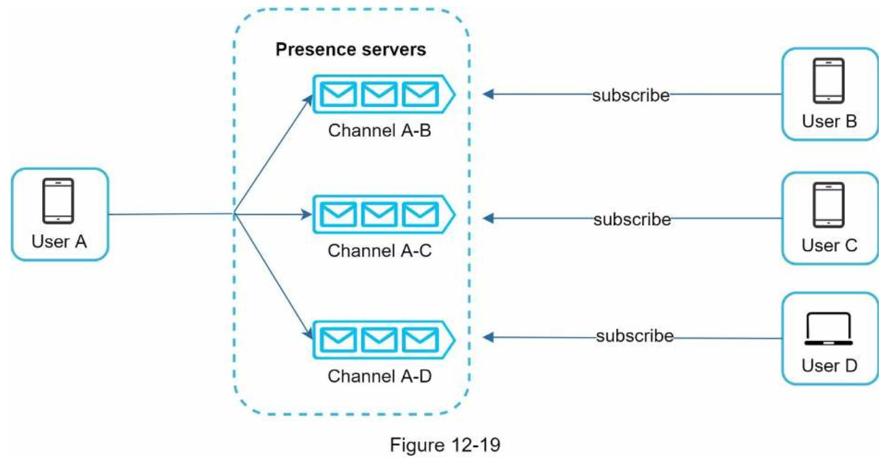
- Presence servers use a publish-subscribe model, in which each friend pair maintains a channel.
- When User A’s online status changes, it publishes the event to three channels, channel A-B, A-C, and A-D.
- For larger groups, informing all members about online status is expensive and time consuming. 
    - To solve the performance bottleneck, a possible solution is to fetch online status only when a user enters a group or manually refreshes the friend list.

### Step 4 - Wrap up
---
#### Additional talking points
- Extend the chat app to support media files such as photos and videos. Media files are significantly larger than text in size. Compression, cloud storage, and thumbnails are interesting topics to talk about.
- End-to-end encryption. Whatsapp supports end-to-end encryption for messages. Only the sender and the recipient can read messages. Interested readers should refer to the article in the reference materials.
- Caching messages on the client-side is effective to reduce the data transfer between the client and server.
- Improve load time. Slack built a geographically distributed network to cache users’ data, channels, etc. for better load time.
- Error handling.
    - The chat server error. There might be hundreds of thousands, or even more persistent connections to a chat server. If a chat server goes offline, service discovery (Zookeeper) will provide a new chat server for clients to establish new connections with.
    - Message resent mechanism. Retry and queueing are common techniques for resending messages.