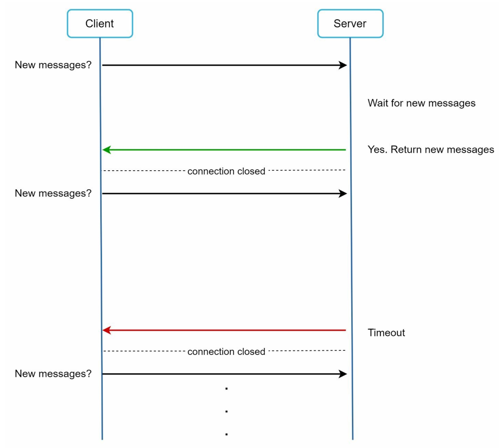
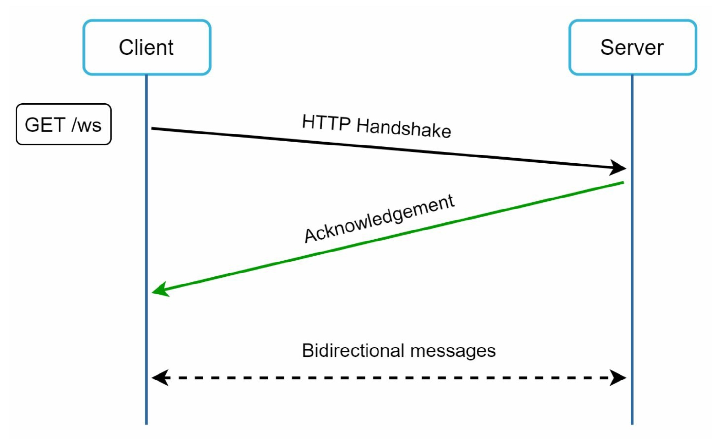
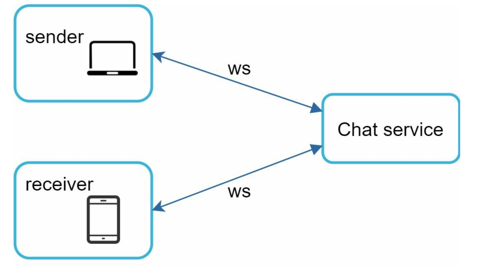
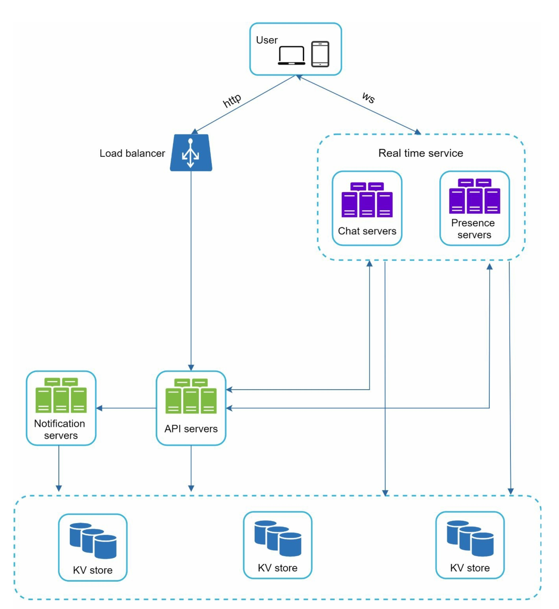
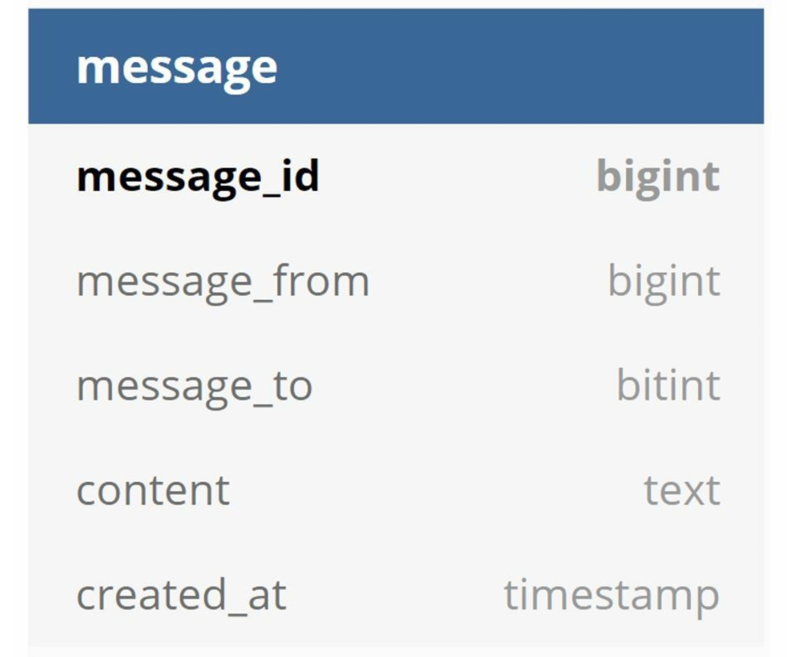
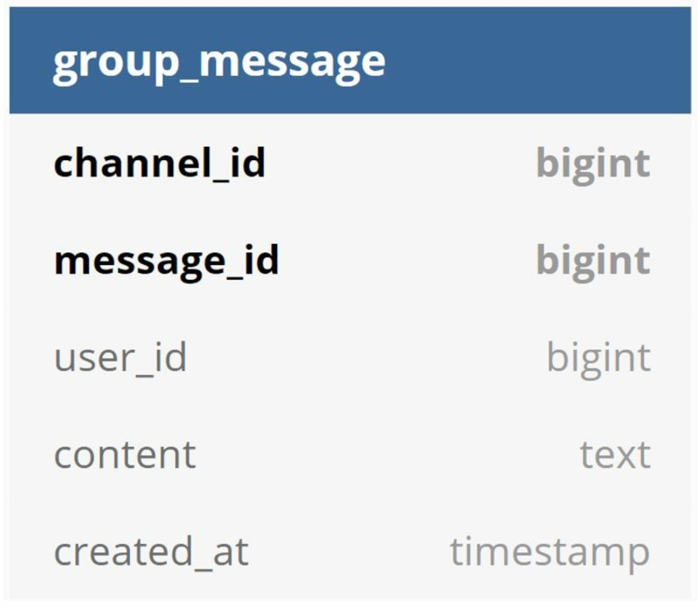
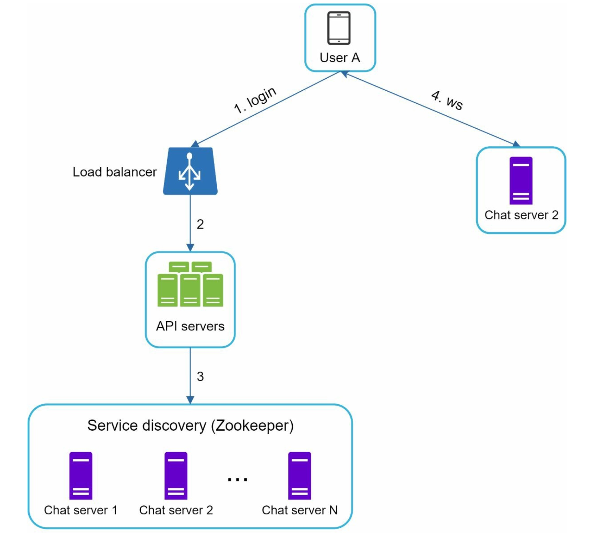
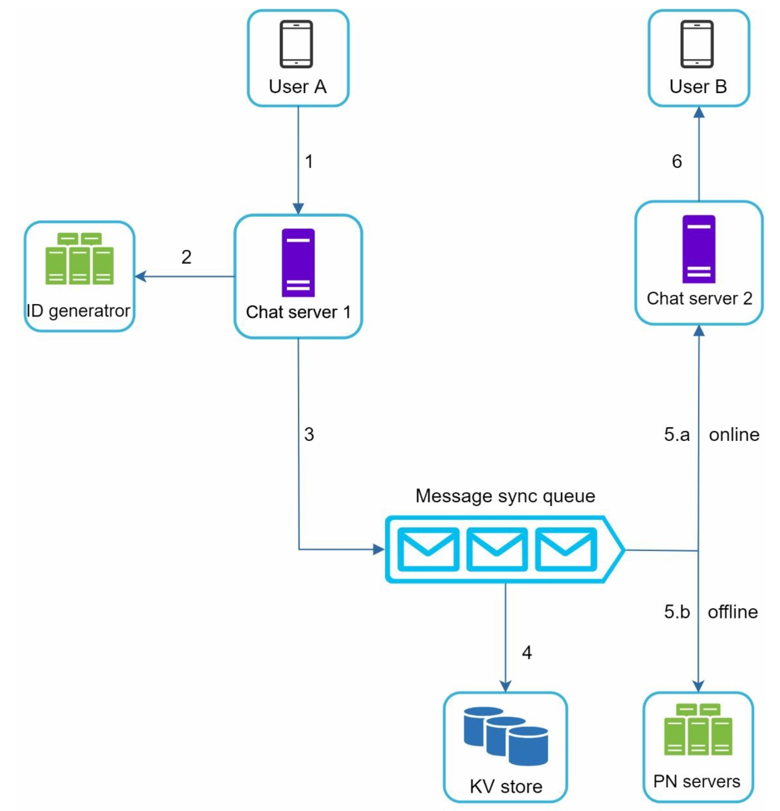
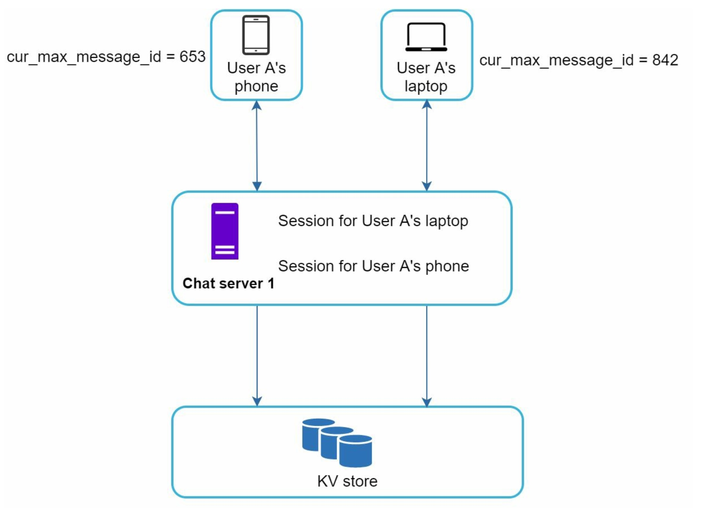
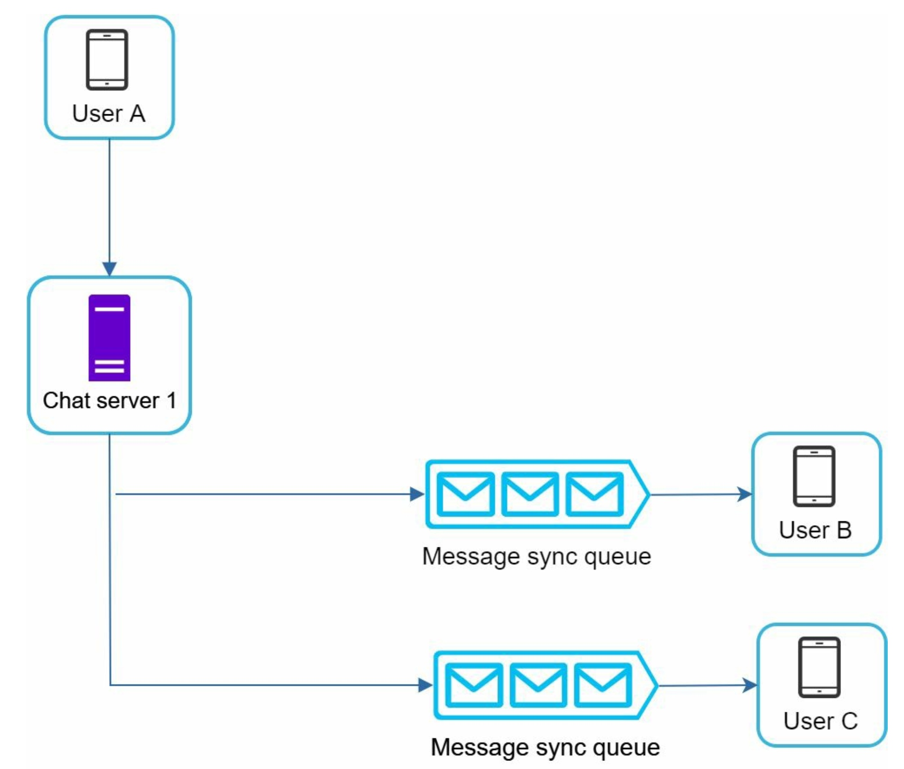

# Chater 12. Design a chat system

# Step 1 - Understand the probelm and establish design scope

Requirements:
- Support both 1 on 1 and group chat
- Both mobile and web app
- Supports 50 million DAU(Daily Active Users)
- Group member limit: 100 people
- Supports text messages only
- Message size limit: 100,000 characters 
- Encryption is not required
- Chat history is stored forever

# Step 2 - Propose high-level design and get buy-in
Clients connect to a chat service. THe chat service must support the followings:
- Receive messages from other clients
- Find the right recipients for each message and relay the message to the recipients
- If a recipient is not online, hold the messages for that recipient on the server until she is online

    
    <!-- 
Media content are stored in CDN for fast retrieval
 -->

When a client starts a chat, it connects the chats service suing one or more network protocols. 
In the above figure, when the sender sends a message to the receiver via the chat service, it uses the time-tested HTTP protocol. The client opens a HTTP connection with the chat service and sends the message, informing the service to send the message to the receiver. 

However, the receiver side is bit more complicated. Because HTTP is client-initiated, it is not trivial to send messages from the server. Many techniques are used to simulate a server-initiated connection: 
- polling
- long polling
- WebSocket

#### 2-1. Polling
Technique that the client periodically asks the server if there are messages available. Depending on polling frequency, polling could be costly. It could consume server resources to answer a question that offers no as an answer most of the time

    

#### 2-2. Long polling

    
    <!-- 
Media content are stored in CDN for fast retrieval
 -->

A client holds the connection open until there are actually new messages available or a timeout threshold has been reached. Once the client receives new messages, it immediately sends another request to the server, restarting the process.
Drawbacks:
- Sender and receiver may not connect to the same chat server. HTTP based servers are usually stateless. If we use round robin for load balancing, the server that receives the message might not have a long-polling connection with he client who receives the message
- A server has no good awy to tell if a client is disconnected
- Inefficient. If a user does not chat much, long polling still makes periodic connections after timeouts

#### 2-3. Websocket

Most common solution for sending asynchronous updates from server to client

    
    <!-- 
Media content are stored in CDN for fast retrieval
 -->

The connection is initiated by the client. It is **bi-directional** and persistent. It starts as HTTP connection and could be upgraded to a WebSocket connection. 

WebSocket connections generally work even if a firewall is in place because they use port 80 or 443 which are also used by HTTP/HTTPS connections.

Since WebSocket connections are persistent, efficient connection management is critical on the server-side

    
    
How WebSocket is used for both sender and receiver sides

#### 2-4. High-level design
Even though WebSocket was chosen as the main communication protocol, it is important to note that everything else does not have to be WebSocket. 

    
    
Three major categories of chat system: Stateless services, stateful services, and third-party integration

##### Stateless Service
Traditional public-facing request/response services like login, sign-up, user profile, etc. Stateless services sit behind a load balancer whose job is to route requests to the correct services based on the request paths. 

##### Stateful Service
THe only stateful service is the chat service because each client maintains a persistent network connection to chat server. A client normally does not switch to another chat server as long as the server is still available. 

##### Third-party integration
For a chat app, push notification is the most important third-party integration. 

##### Scalability
On a small scale, all services listed above could fit in one server. In our scenario, at 1 million concurrent users, assuming each user connection needs 10K of memory on the server, it only needs about 10GB of memory to hold all the connections on one box.

If we propose a design where everything fits in one server, this may raise big red flag in the interviewer's mind. The single point of failure is the biggest issue. However, it is perfectly fine to start with a single server design. Just make sure the interviewer knows this is a starting point.

    
    <!-- 
Media content are stored in CDN for fast retrieval
 -->

- Chat servers facilitate message sending/receiving
- Presence servers manage online/offline status
- API servers handle everything including user login, signup, change profile, etc
- Notification servers send push notifications
- Key-value store is used to store chat history. WHen an offline user comes online, she will see all her previous chat history

##### Storage
Important decision is to decide on the right type of database to use: relational databases or NoSQL database?
Two types of data exist in a typical chat system. 

**The first** is generic data, such as user profile, setting, user friends list. These data are stored in robust and reliable relational databases. Replication and sharding are common techniques to satisfy availability and scalability requirements.

**The second** is unique to chat systems: chat history data. It is important to understand the read/write pattern
- The amount of data is enormous for chat systems
- Only recent chats are accessed frequently. Users do not usually look up for old chats
- Although very recent chat history is viewed in most cases, users might use features that require random access of data, such as search, view your mentions, jump to specific messages, etc. Theses cases should be supported by the data access layer
- The read to write ratio is about 1:1 for 1 on 1 chat apps

key-value stores is recommended for the following reasons:
- Key-value stores allow easy horizontal scaling
- Key-value stores provide very low latency to access data
- Relational databases do not handle long tail of data well. When the indexes grow large, random access is expensive
- Key-value stores are adopted by other proven reliable chat applications

#### Data models
##### Message table for 1 on 1 chat

    

##### Message table for group chat
The composite primary key is (channel_id, message_id). channel_id is the partition key because all queries in a group chat operate in a channel.

    

##### Message ID
Message_id carries the responsibility of ensuring the order of messages. To ascertain the order of message, message_id must satisfy the following two requirements:
- IDs must be unique
- IDs should be sortable by time, meaning new rows have higher IDs than old ones

The first idea is auto_increment keyword in MySQL, but NoSQL databases usually do not provide such a feature.
The second approach is to use a global 64-bit sequence number generator like Snowflake.
The final approach is to use local sequence number generator. Local means IDs are only unique within a group. The reason why local IDs work is that maintaining message sequence within one-on-one channel or a group channel is sufficient. This approach is easier to implement in comparison to the global ID implementation.

### Step 3 - Design deep dive
For a chat system, service discovery, messaging flows, and online/offline indicators worth deeper exploration.

#### 3-1. Service discovery
The primary role of service discovery is to recommend the best chat server for a client based on the criteria like geographical location, server capacity, etc. Apache Zookeeper is a popular open-source solution, it registers all the available chat servers and picks the best chat server for a client based on predefined criteria.

    
    
How Zookeeper works

1. User A tries to log in to the app
2. The load balancer sends the login request to API servers
3. After the backend authenticates the user, service discovery finds the best chat server for User A
4. User A connects to chat server 2 through WebSocket

#### 3-2. Message flows
##### 1 on 1 chat flow

    

1. User A sends a chat message to Chat server 1
2. Chat server 1 obtains a message ID from the ID generator
3. Chat server 1 sends the message to the message sync queue
4. The message is stored in a key-value store
5.a. If user is online, the message is forwarded to Chat server 2 where User B is connected
5.b. If user is offline, a push notification is sent from push notification(PN) servers
6. Chat server 2 forwards the message to User B. There is a persistent WebSocket connection between User B and Chat server 2

#### 3-3. Message synchronization across multiple devices

    
    
Message synchronization

When User A logs in to the chat app with her phone, it establishes a WebSocket connection with Chat server1. Similarly, there is a connection between the laptop and Chat server 1.

Each device maintains a variable called *cur_max_message_id*, which keeps track of the latest message ID on the device. Messages that satisfy the following **two conditions** are considered as new messages:
- The recipient ID is equal to the currently logged-in user ID
- Message ID in the key-value store is larger than *cur_max_message_id*
With distinct *cur_max_message_id* on each device, message synchronization is easy as each device can get new messages from KV store.

#### 3-4. Small group chat flow

    
    
When user A sends a message in an group chat

First, the message from User A is copied to each group member's message sync queue. This design is good for small group chat because:
- it simplifies message sync flow as each client only needs to check its own inbox to get new messages
- when the group number is small, storing a copy in each recipient's inbox is not too expensive

However, for groups with a lot of users, storing a message copy for each member is not acceptable.

On the recipient side, a recipient can receive messages from multiple users. Each recipient has an inbox which contains messages from different senders like below.

    
    <!-- 
Media content are stored in CDN for fast retrieval
 -->

#### 3-5. Online presence
An online presence indicator is an essential feature of many chat applications. 
In the high-level design, presence servers are responsible for managing online status and communicating with clients through WebSocket. There are a few flows that will trigger online status change.

##### User login
After a WebSocket connection is build between the client and the real-time service, user A's online status and *last_active_at* timestamp are saved int he KV store. Presence indicator shows the sure is online after she logs in.

    
    <!-- 
Media content are stored in CDN for fast retrieval
 -->

##### User logout

    

##### User disconnection
When a user disconnects from the internet, the persistent connection between the client and server is lost. Because it is common for users to disconnect and reconnect to the internet frequently in a short time, updating online status on every disconnect/reconnect would make the presence indicator change too often, resulting in poor user experience.

We introduce a heartbeat mechanism to solve this problem. Periodically, an online client sends a heartbeat event to presence servers. If presence servers receive a heartbeat event within a certain time, a user is considered as online. Otherwise, it is offline

    
    
Client sends a heartbeat event to the server every 5 seconds

##### Online status fanout
How do user A's friends know about the status changes?
Presence servers use a publish-subscribe model, in which each friend pair maintains a channel.  WHen User A's online status changes, it publishes the event to three channels, channel A-B, A-C, and A-D.

    

FOr larger groups, informing all members about online status is expensive and time consuming. TO solve the performance bottleneck, a possible solution is to fetch online status only when a suer enters a group or manually refreshes the friend list.