# CHAPTER 13: DESIGN A SEARCH AUTOCOMPLETE SYSTEM

Design a search autocomplete system, also called “design top k” or “design top k most searched queries”.

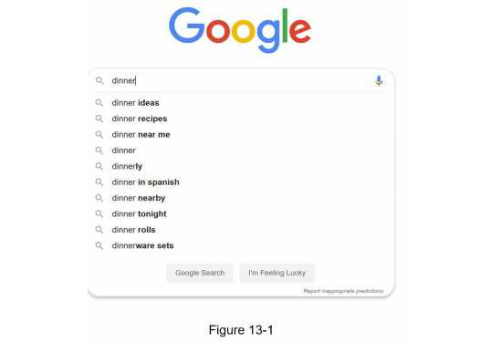

## Step 1 - Understand the problem and establish design scope

###  Requirements

```
Here is a summary of the requirements:
  • Fast response time: / 빠른응답
      As a user types a search query, autocomplete suggestions must show up fast enough. 
      Facebook’s autocomplete system -> 100 milliseconds. 
      Otherwise -> stuttering.
  • Relevant: / 연관성, 적합한 출력
      Autocomplete suggestions should be relevant to the search term.
  • Sorted: / 정렬, 인기도 등의 순위 모델
      Results returned by the system must be sorted by popularity or other ranking models.
  • Scalable: 확장성, 트래픽 감당
      The system can handle high traffic volume.
  • Highly available: 가용성, 장애 시/제약조건 시 그래도 동작
      The system should remain available and accessible when part of the 
  system is offline, slows down, or experiences unexpected network errors.
```

### Back of the envelope estimation
```
• Assume 10 million daily active users (DAU).
• An average person performs 10 searches per day.
• 20 bytes of data per query string:
  • Assume we use ASCII character encoding. 1 character = 1 byte
  • Assume a query = 4 words & 1 word = 5 characters, on average.
  • That is 4 x 5 x 1 byte = 20 bytes per query.
• For every character entered into the search box, a client sends a request to the backend for autocomplete suggestions.
  On average, 20 requests are sent for each search query.
  For example, the following 6 requests are sent to the backend by the time you finish typing 
      “dinner”.
      search?q=d
      search?q=di
      search?q=din
      search?q=dinn
      search?q=dinne
      search?q=dinner
• ~24,000 query per second (QPS) = 10,000,000 users * 10 queries / day * 20 characters / 24 hours / 3600 seconds. -> 23,184.148
• Peak QPS = QPS * 2 = ~48,000
• Assume 20% of the daily queries are new.
    10 million * 10 queries / day * 20 byte per query * 20% = 0.4 GB.
    This means 0.4GB of new data is added to storage daily.  
```

## Step 2 - Propose high-level design and get buy-in

At the high-level,
> • *Data gathering service*
```
: It gathers user input queries and aggregates them in real-time. 사용자입력 질의 실시간 수집
Real-time processing is not practical for large data sets;
however, it is a good starting point. We will explore a more realistic solution in deep dive.
```

> • *Query service* :
```
Given a search query or prefix, return 5 most frequently searched terms./ 5개 인기질의어 리턴
```

### Data gathering service
```
Assume a frequency table (the query string / frequency)  Figure 13-2.
empty ->  “twitch” ->  “twitter” -> “twitter,” -> “twillo” sequentially.
```
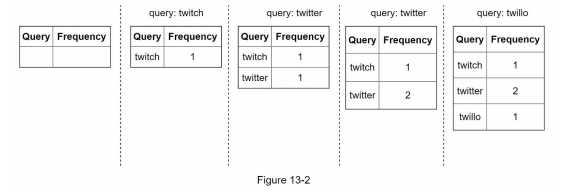

### Query service
```
Assume a frequency table Table 13-1.
Two fields.
• Query: it stores the query string.
• Frequency: it represents the number of times a query has been searched.
```
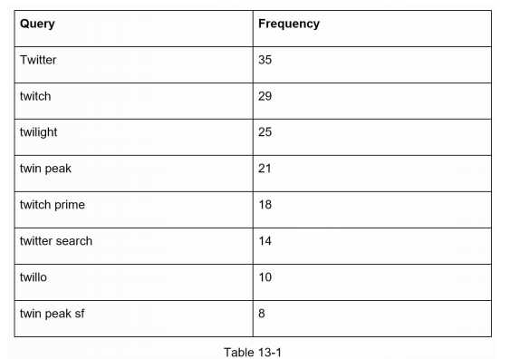

```
For example, Figure 13-3
When a user types “tw” in the search box, the following top 5 searched queries are displayed based on Table 13-1
```
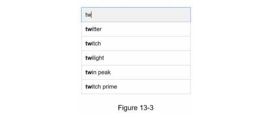

```
SQL query -> To get top 5 frequently searched queries
```
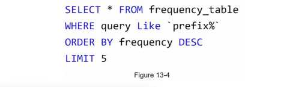

```
🌝 When the data set is small, This is an acceptable solution when the data set is small.
😱 When it is large, accessing the database becomes a bottleneck. 
```

## Step 3 - Design deep dive
Components & Optimizations 
```
• Trie data structure - 트라이 자료구조 소개
• Data gathering service - 이를 다시 적용
• Query service - 이를 다시 적용
• Trie operations
• Scale the storage
```

### (1) Trie data structure

```
Relational databases are used for storage in the high-level design. 
However, fetching the top 5 search queries from a relational database is inefficient.

🔥The data structure trie (prefix tree) is used to overcome the problem.
(관계형 데이터베이스의 병목현상 한개를 The data structure trie (prefix tree)로 해결한다.)

As trie data structure is crucial for the system
Therfore, understanding the basic trie data structure is essential before going further.

> An overview of the trie data structure / How to optimize the basic trie to improve response time

The main idea of trie consists of the following:
  • A trie is a tree-like data structure. 트리 형태의 자료구조
  • The root represents an empty string.  루트 노드는 빈 문자열
  • Each node stores a character and has 26 children, one for each possible character. 1개 글자와 26개 자식노드
    (To save space, we do not draw empty links.)
  • Each tree node represents a single word or a prefix string.
```

Figure 13-5 : A trie with search queries(highlighted) “tree”, “try”, “true”, “toy”, “wish”, “win”. 
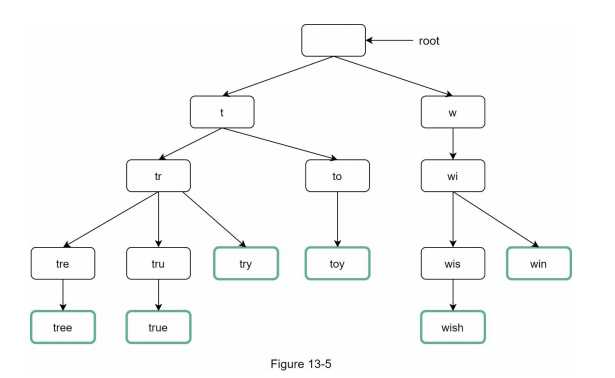

Table 13-2: To support sorting by frequency, frequency info is added
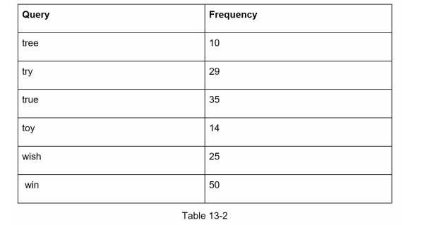


**Some terms** 
```
  • p: length of a prefix
  • n: total number of nodes in a trie
  • c: number of children of a given node
```

**How does autocomplete work with trie?**
```
Top k most searched queries
  1. Find the prefix.
      (Time complexity: O(p) p: length of a prefix)
  2. Traverse the subtree from the prefix node to get all valid children. 그로부터 유효노드들을 거쳐 자식노드 탐색
      A child is valid if it can form a valid query string.
      (Time complexity: O(c) c: number of children of a given node)
  3. Sort the children and get top k. Time complexity: O(clogc)
```

Example (Figure 13-7)
```
Assume k equals to 2 and a user types “be” in the search box. The algorithm works as follows:
  • Step 1: Find the prefix node “be”.
  • Step 2: Traverse the subtree to get all valid children. N
            Nodes [bee: 20], [beer: 10], [best: 35], [bet: 29] are valid.
  • Step 3: Sort the children and get top 2.
            [best: 35] and [bet: 29] are the top 2 queries with prefix “tr”.
```


```
The time complexity of this algorithm is the sum of time spent on each step mentioned above: 
  -> O(p) + O(c) + O(clogc)
The above algorithm is straightforward.
However, it is too slow😱 -> (worst-case scenario) the entire trie traverse

🙋‍♂️ Below are two optimizations:
  a. Limit the max length of a prefix
  b. Cache top search queries at each node 
```

#### a. Limit the max length of a prefix (prefix 최대길이제한 50)
```
Users rarely type a long search query into the search box. 
Thus, it is safe to say p is a small integer number, say 50. 
If we limit the length of a prefix,
  the time complexity for “Find the prefix”: O(p) -> 🌝O(small constant), aka O(1).
```
#### b. Cache top search queries at each node (인기검색어 캐시화)
```
Trade off: 상위 노드에서 인기검색어 캐시화  Time O(p) -> O(1)🌝 But, space is needed 😱
To avoid traversing the whole trie, we store top k most frequently used queries at each node.
Since 5 to 10 autocomplete suggestions are enough for users, k is a relatively small number. 
In our specific case, only the top 5 search queries are cached.
By caching top search queries at every node, we significantly reduce the time complexity to retrieve the top 5 queries.

🥵 However, this design requires a lot of space to store top queries at every node.
            Trading space for time is well worth it as fast response time is very important.
```
Example - Cache top search queries  
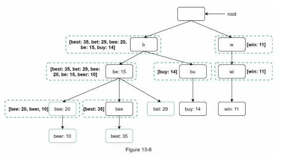

```
Optimized TC :
  1. Find the prefix node. Time complexity: O(1)
  2. Return top k. Since top k queries are cached, the time complexity for this step is O(1). 

Now, our algorithm takes 🔥only O(1) to fetch top k queries.
```


### (2) Data gathering service

```
In our previous design, It was a real-time service.

Not practical with two reasons:
  • Users may enter billions of queries per day. Updating the trie on every query significantly slows down the query service.
    수천만 query의 trie업데이트에 따른 심각한 속도 저하
  • Top suggestions may not change much once the trie is built. Thus, it is unnecessary to update the trie frequently.
    인기검색어 순위가 실시간 바뀔 필요가 없다(잘 안바뀜)

To design a scalable data gathering service, we examine where data comes from and how data is used.

> Twitter(Real-time applications) - up to date autocomplete suggestions
However,
> Google keywords - not  a daily basis change.

data gathering service의 use cases는 다르지만 the underlying foundation는 같다.

즉 Analytics or logging services.

```

#### *Redesigned* Data gathering service (Figure 13-9) 
No real-time service. 

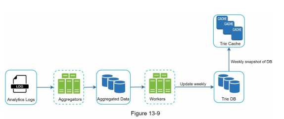

a. Analytics Logs:
```
  It stores raw data about search queries.
  Logs: Append-only, not indexed.
  데이터 분석 서비스 로그: 원본 데이터 보관(검색창에 입력된)
  신규 데이터가 추가 / 수정(X) / not indexed
```

**Example: Log File**

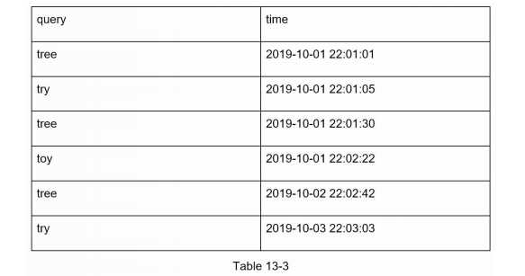

b. Aggregators(취합서버):
```
  - The size of analytics logs is usually very large, and data is not in the right format. (분석데이터 보통 대용량 & 다양한 형식)
  - We need to aggregate data so it can be easily processed by our system. (목적에 따라 손쉬운 가공을 위한 취합요)
  - Depending on the use case, we may aggregate data differently.
    For Real-time applications(Twitter) : shorter time interval as real-time results are important. 
  - On the other hand, aggregating data less frequently, say once per week, might be good enough for many use cases. (인터뷰 시 실시간 취합? 주기적 취합? 확인 중요)
  - During an interview session, verify whether real-time results are important. We assume trie is rebuilt weekly. (주당 취합으로 가정한다)
```


c. Aggregated Data(Table 13-4):
```
  취합된 데이터가 있게되고....
  Time: the start time of a week.
  Frequency: the sum of the occurrences for the corresponding query in that week.
```

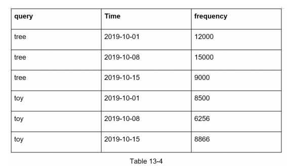

d. Workers(작업서버):
```
  그 취합된 데이터로 작업..
  - Workers are a set of servers that perform #asynchronous# jobs at regular intervals. (weekly 비동기수행서버)
  - They build the trie data structure and store it in Trie DB.(Trie DB에 맞게 데이터구조 생성 및 저장)
```

e. Trie Cache:
```
  Trie Cache is a distributed cache system that keeps trie in memory for fast read.(분산 캐시 시스템로 빠른 읽기연산수행)
  It takes a weekly snapshot of the DB. (주별 스냅샷 갱신)
```

f. Trie DB:
```
  Trie DB is the persistent storage. 영구저장
  <Two options>
  1. Document store(직렬화저장): (MongoDB... / XML, YAML, JSON..., etc formats) weekly베이트 tri 직렬화저장.
                 Since a new trie is built weekly, we can periodically take a snapshot of it, serialize it, and store the serialized data in the database.
                      
  2. Key-value store (해시테이블형태저장 Chapter 6):
                 해시 테이블 형태로 변환 저장
                  • [key]: every prefix in the trie -> be
                  • [value]: Data on each trie node -> [be: 15, bee:20, beer:10, best:35]
                Example (figure 13-10)   
```
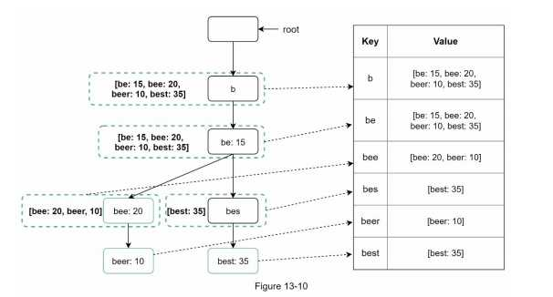


### (3) Query service

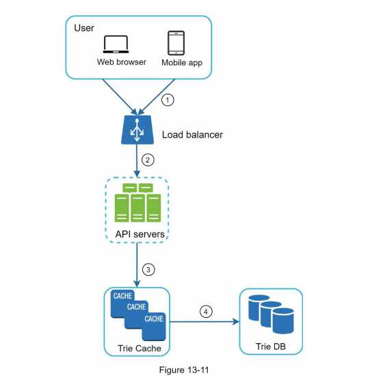
```
인기 검색어 다섯 개 DB로 부터 fetch
In the high-level design, the query service calls the database directly to fetch the top 5 results. 

Figure 13-11: the improved design as the previous design is inefficient.

  1. A search query is sent to the load balancer. (Query가 로드벨런서로 전송)
  2. The load balancer routes the request to API servers.(로드밸런서 그 Query API 서버로 전송)
  3. API servers get trie data from Trie Cache and construct autocomplete suggestions for the client.
      (API는 cache참조 요청에 대한 자동완성 검색어 응답 구성)
  4. In case the data is not in Trie Cache, we replenish data back to the cache. (트라이캐시에 없을땐 DB서 가져와서 캐시에 더함)

  This way, all subsequent requests for the same prefix are returned from the cache. 이 방식으로 차후요청은 캐시로부터 리턴
  A cache miss(캐시 부적중 <-> cache hit) can happen when a cache server is out of memory or offline.
     (Then, data should be replenished from the DB back to the cache. DB로 부터 cache에 data 충당)
```


** - Query service requires lightning-fast speed **

<Three proposed optimizations>

(a) AJAX request 
```
For web applications, browsers usually send AJAX requests to fetch autocomplete results.
The main benefit of AJAX is that sending/receiving a request/response does not refresh the whole web page.
```

(b) Browser caching (i.e. Google search engine).
```
For many applications, autocomplete search suggestions may not change much within a short time.
Thus, autocomplete suggestions can be saved in browser cache to allow subsequent requests to get results from the cache directly.

Figure 13-12: the response header when you type “system design interview” on the Google search engine.
As you can see, Google caches the results in the browser for 1 hour.
Please note: “private” in cache-control means results are intended for a single user and must not be cached by a shared cache.
             “max-age=3600” means the cache is valid for 3600 seconds, aka, an hour.
```
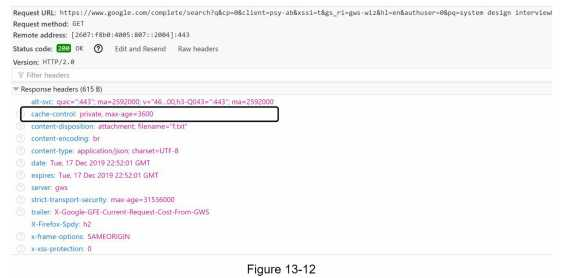

(c) Data sampling (N개의 요청 중 1개만 로깅기록)
```
For a large-scale system, logging every search query requires a lot of processing power and storage.
Data sampling is important.
For instance, only 1 out of every N requests is logged by the system.
```

### (4) Trie operations
Trie is a core component of the autocomplete system. 

> Create / Update / Delete

#### Create
```
Trie is created by workers using aggregated data. The source of data is from Analytics Log/DB.
  (Trie 생성 - worker 서버 담당/  Analytics Log/DB나 데이터베이스 취합데이터 이용)
```

#### Update
```
Two ways
- Option 1: Update the trie weekly. (매주 한 번 갱신방안)  Once a new trie is created, the new trie replaces the old one. 
- Option 2: Update individual trie node directly.
            해당 방식은 느리지만 트라이 사이즈가 작다면 적용해봄직하다( 책에서는 느려서 고려친않았음)

When we update a trie node, its ancestors all the way up to the root must be updated because ancestors store top queries of children.
(주의! 최상단 루트노드 반드시 업데이트할것 -> top queries가 저장되므로)           
```

An example of how the update operation works(Figure 13-13)
```  
  Search query “beer”
  value 10 -> 30(its ancestors)
```
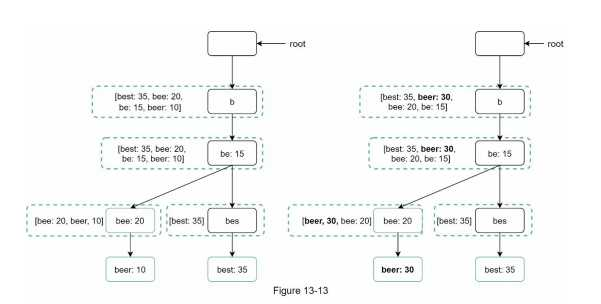


#### Delete
```
We have to remove hateful, violent, sexually explicit, or dangerous autocomplete suggestions.
(트라이 캐시 앞에 필터 배치하여 부적절한 응답 리턴 방지)
Having a filter layer gives us the flexibility of removing results based on different filter rules.
Unwanted suggestions are removed physically from the database asynchronically so the correct data set will be used to build trie in the next update cycle.
```
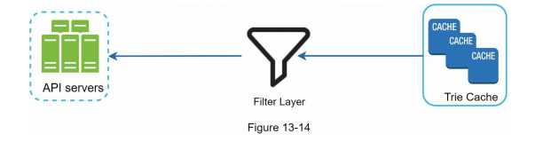


### (5) Scale the storage 
```

- Since English is the only supported language, a naive way to shard is based on the first character.(영어기준, 첫 글자 기준으로 샤딩방안)

  Here are some examples.
    • If we need two servers for storage, we can store queries starting with ‘a’ to ‘m’ on the first server, and ‘n’ to ‘z’ on the second server.
      2대 서버 필요 시, 'a'~'m' 시작하는 검색어 ->  1st server 저장 / the rest -> 2nd server 저장
    • If we need three servers, we can split queries into ‘a’ to ‘i’, ‘j’ to ‘r’ and ‘s’ to ‘z’.
      3대 서버 필요시, ‘a’ ~‘i’ /  ‘j’ ~ ‘r’ / ‘s’ ~ ‘z’
    • Following this logic, we can split queries up to 26 servers because there are 26 alphabetic characters in English.
      해당 방안은 서버 26개로 제한( 알파벳26 때문)
    • To store data beyond 26 servers, we can shard on the second or even at the third level.
      26개 이상 시 샤딩의 계층화필요 예 하나의 ‘a’대해 -> 4 servers 나눔: ‘aa-ag’, ‘ah-an’, ‘ao-au’, ‘av-az’.

- Historical data distribution pattern (과거 query 패턴 적용 방안) 아래 그림참조
     • The shard map manager maintains a lookup database for identifying where rows should be stored.
       shard map manager 검색어와 저장된 서버 매핑관계 관리하고 패턴에 따른 배분 샤딩방식
        For example,
                  the number of ‘s’ 시작어
                        =
                  the number of ‘u’, ‘v’, ‘w’, ‘x’, ‘y’ and ‘z’ 시작어
        then,
               Two shards ‘s’ / ‘u’ ~‘z’
```

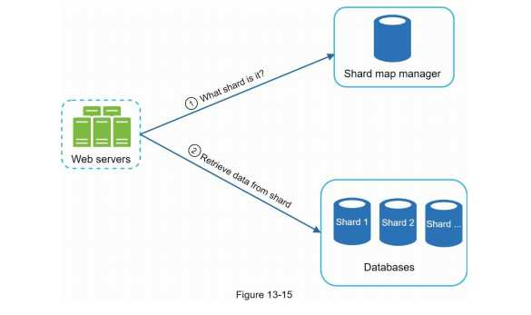


## Step 4 - Wrap up
Some follow up questions

> How do you extend your design to support multiple languages?
```
Unicode 코드 고려하여 적용한다.
To support other non-English queries, we store Unicode characters in trie nodes.
Unicode: an encoding standard covering all the characters(world, modern and ancient)
```

> What if top search queries in one country are different from others?
```
다른 국가에 따른 다른 트라이 필요. 응답시간 향상위해 CDN 활용한다.
In this case, we might build different tries for different countries. 
To improve the response time, we can store tries in CDNs.
      A CDN is a network of geographically dispersed servers used to deliver static content.
      CDN servers cache static content like images, videos, CSS, JavaScript files, etc.
      (CDN: 사용자에게 웹 콘텐츠를 효율적으로 제공할 수 있는 서버의 분산 네트워크)
```

> How can we support the trending (real-time) search queries?
```
Assuming a news event breaks out, a search query suddenly becomes popular. 갑자기 한 질의어가 폭발적 인기 시
Our original design will not work because: 기존 방안으로 대응 어렵다. 왜냐면
  • Offline workers are not scheduled to update the trie yet because this is scheduled to run on weekly basis. (주별기준서버의 업데이트로 인한 미반영)
  • Even if it is scheduled, it takes too long to build the trie. (반영된다해도 오래걸림)

이는 스콥이 벗어나지만 아래 내용으로 생각해볼수있다. A few ideas for a real-time search autocomplete

• Reduce the working data set by sharding. (샤딩 - 작업데이터셋 축소)
• Change the ranking model and assign more weight to recent search queries.(최근검색에 가중치 부여)
• Data may come as streams, so we do not have access to all the data at once. ???
      Streaming data: generated data continuously.
      Stream processing requires a different set of systems:
                Apache Hadoop MapReduce [6], Apache Spark Streaming [7], Apache Storm [8], Apache Kafka [9], etc.
```

