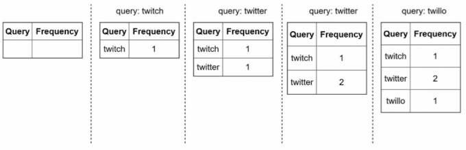
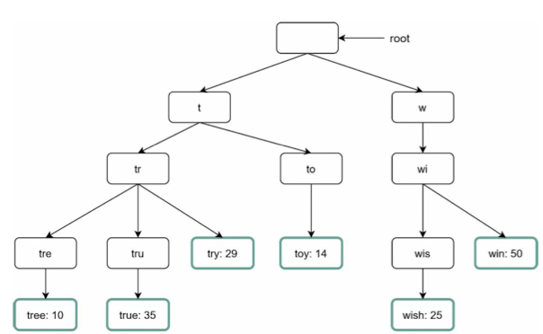
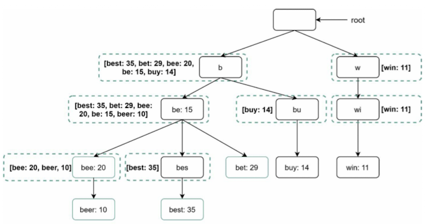
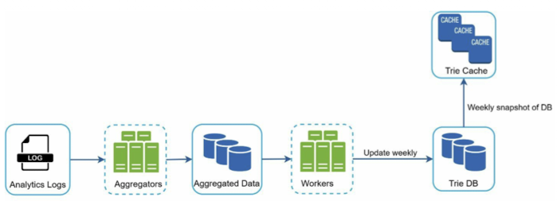
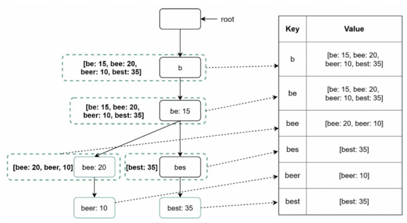
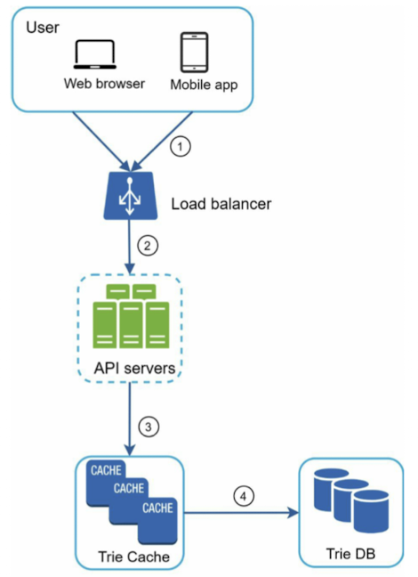
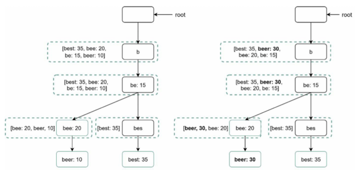

# Chapter 13. Design a search autocomplete system

## Step 1. Understand the problem and establish design scope
- Is the matching only supported at the beginning of a search query or in the middle as well?
- How many autocomplete suggestions should the system return?
- How does the system know which 5 suggestions to return?
- Does the system suport spell check?
- Are search querues in English?
- Do we allow capitalization and special characters?
- How many users use the product?

### Requirements
- Fast response time.
- Relevant.
- Sorted.
- Highlt available

### Back of the envelope estimation.
- Assume 10 million daily active users (DAU)
- An average person performs 10 searches per day.
- 20 bytes of data per query string:    
    - Assume we use ASCII chracter encoding, 1 character = 1 byte
    - Assume a query contains 4 words, and each word contains 5 characters on average
    - That is 4 x 5 = 20 bytes per query.
- ~24,000 query per second (QPS) = 10,000,000 users * 10 queries / day * 20 characters / 24 hours / 3600 seconds.
- Peak QPS = QPS * 2 = ~48,000
- Assume 20% of the daily queries are new. 10 million * 10 queries / day * 20 byte per query * 20% = 0.4TB. This means 0.4GB of new data is added to storage daily.

## Step 2. Propose high-level design and get buy-in
### Data gathering service
- Frequency table\


### Query service
- Query and frequency

## Step 3. Design deep dive
### Trie data structure
- Fetching the op 5 search quereis from a relational database is inefficient.
- The data structure trie(prefix tree) is used to overcome the problem.
- The main idea of trie consists of the following:  
    * A trie is a tree-like data structure.
    * The root represents and empty string.
    * Each node stores a character and has 26 children, one for each possible character.
    * Each tree node represents a single word or a prefix string
- 

- **How does autocomplete work with trie?**
```
p: length of a prefix
n: total number of nodes in a trie
c: number of children of a given node
```
1. Fine the prefix. Time complexity: O(p).
2. Traverse the subtree from the prefix node to get all valid children. A child is valid if it can form a valid query string. Time complexity: O(c)
3. Sort the children and get top k. Time complexity: O(clogc)

- The time complexity of this algorithm is the sum of time spent on each step mentioned above: O(p) + O(c) + O(clogc)

#### Limit the max length of a prefix
- Users rarely type a long search query into the search box. Thus, it is safe to say p is a small integer number, say 50. If we limit the length of a prefix, the time complexity for "Fine the prefix" can be reduced from O(p) to O(small constant), aka O(1)

#### Cache top search queries at each node
- To avoid traversing the whole trie, we store top k most frequently used queries at each node. Since 5 to 10 autocomplete suggestions are enough for users, k is relatively small nubmer. In our specific case, only the top 5 search queries are cached.
- By caching top search queries at every node, we significantly reduce the time complexity to retrieve the top 5 queries.
- 

### Data gathering service
- In our previous desing, whenever a user types a search query, data is updated in real-time. This approach is not practical for the following two reasons:
  - Users may enter billions of queries per day. Updating the trie on every query significantly slows down the query service.
  - Top suggestions may not change much once the trie is built. Thus, it is unnecessary to update the trie frequently.
- 
  - **Analytics logs**: It stores raw data about search queries. Logs are append-only and are not indexed.
  - **Aggregators**: The size of analytics logs is usually very large, and data is not in the right format.
  - **Aggregated data**
  - **Worker**: Workers are a set of servers that perform asynchronus jobs ar regular intervals. They build the trie data structure and store it in Trie DB.
  - **Trie Cache**: Trie cache is a distributed cache system that keeps trie in memory for fast read. It takes a weekly snapshot of the DB.
  - **Trie DB**: Trie DB is thre persistent storage.
    - 1. Document store: Since a new trie is built weekly, we can periodically take a snapshot of it, serialize it, and store thre serialized data in the database.
    - 2. Key-value store: A trie can be represented in a hash table form by applying the followin logic:
      - Every prefix in the trie is mapped to a key in a hash table.
      - Data on each trie node is mapped to a value in a hash table.
- 
  
### Query service
- 
- Query service requires lighting-fast speed:
  - AJAX request. For web applications, browers usually send AJAZ requests to fetch autocomplete results. The main benefit of AJAX is that sending/receiving a request/response does not refresh the whole web page.
  - Browser caching
  - Data sampling

### Trie operations
- Create
- Update
  - Option1: Update the trie weekly. once a new trie is created, the new trie replaces the old one.
  - Option2: Update individual trie node directly.
  - 
- Delete
  - We have to remove inappropriated autocomplete suggestions with a filter layer.

### Scale the storage
- A naive way to shard is based on the first character.
- Using a historical data distribution pattern and apply smarter sharding logic

## Step 4. Wrap up
- How do you extend your design to support multiple languages?
  - Use Unicod character in trie nodes.
- What if top search queries in one country are different from others?
  - Build different tries for different countries. To improve the response time, we can store tries in CDNs.
