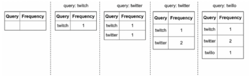
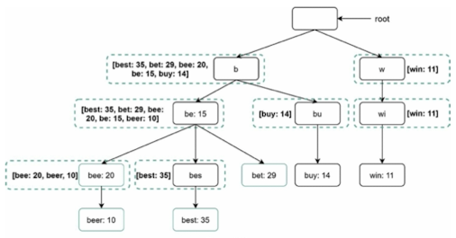
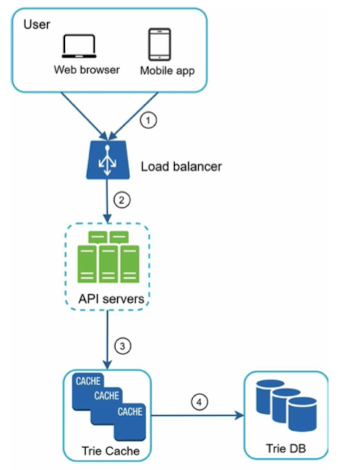
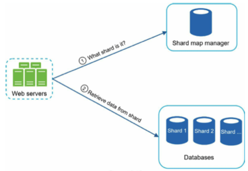

# Chapter 13 : Design A Search Autocomplete System

## Step 1 - Understand the problem and establish design scope

- 구글이나 아마존에서 검색 시, 타이핑하면서 자동완성 제안이 나타남
- 자동완성, typeahead, search-as-you-type, incremental search

### Requirements
    - 빠른 응답 시간 : 사용자가 검색 쿼리를 입력하면, 자동완성 제안이 빨리 나타나야 함
    - 관련성 : 검색 용어와 관련이 있어야 함
    - 정렬 : 시스템에 의해 반환된 결과는 popularity나 다른 순위 모델에 따라 정렬되어야 함
    - 확장성 : 높은 트래픽 볼륨을 처리할 수 있어야 함
    - Highly available : 일부가 오프라인 상태이거나, 느려지거나, 예상치 못한 네트워크 오류를 경험할 때도 사용 가능하고 접근 가능해야 함

## Step 2 - Propose high-level design and get buy-in

### Data gathering service

- 사용자 입력 쿼리를 수집하고 실시간으로 집계

### Query service

- 검색 쿼리나 접두사가 주어지면, 가장 자주 검색된 5개 용어 반환

## Step 3 - Design deep dive

- Trie data structure

- Data gathering service

- Trie operations
    - Create
    - Update
    - Delete

- Scale the storage

## Step 4 - Wrap up

- 다국어 지원 확장 방법
- 국가별 상위 검색 쿼리 다를 경우
- 트렌딩(실시간) 검색 쿼리 지원 방법