# CHAPTER 13: DESIGN A SEARCH AUTOCOMPLETE SYSTEM

When searching on Google or shopping at Amazon, as you type in the search box, one or more matches for the search term are presented to you. This feature is referred to as
autocomplete, typeahead, search-as-you-type, or incremental search.


## Step 1 - Understand the problem and establish design scope
**Candidate:** Is the matching only supported at the beginning of a search query or in the middle as well?\
**Interviewer:** Only at the beginning of a search query.\
**Candidate:** How many autocomplete suggestions should the system return?\
**Interviewer:** 5\
**Candidate:** How does the system know which 5 suggestions to return?\
**Interviewer:** This is determined by popularity, decided by the historical query frequency.\
**Candidate:** Does the system support spell check?\
**Interviewer:** No, spell check or autocorrect is not supported.\
**Candidate:** Are search queries in English?\
**Interviewer:** Yes. If time allows at the end, we can discuss multi-language support.\
**Candidate:** Do we allow capitalization and special characters?\
**Interviewer:** No, we assume all search queries have lowercase alphabetic characters.\
**Candidate:** How many users use the product?\
**Interviewer:** 10 million DAU.

#### Requirements
Here is a summary of the requirements:
- Fast response time: As a user types a search query, autocomplete suggestions must show up fast enough. An article about Facebook’s autocomplete system reveals that the system needs to return results **within 100 milliseconds**. Otherwise it will cause stuttering.
- Relevant: Autocomplete suggestions should be **relevant** to the search term.
- Sorted: Results returned by the system must be sorted by popularity or other ranking models.
- Scalable: The system can handle high traffic volume.
- Highly available: The system should remain available and accessible when part of the system is offline, slows down, or experiences unexpected network errors.

### Back of the envelope estimation
- Assume 10 million daily active users (DAU).
- An average person performs 10 searches per day.
- 20 bytes of data per query string:
- Assume we use ASCII character encoding. 1 character = 1 byte
- Assume a query contains 4 words, and each word contains 5 characters on average.
- That is 4 x 5 = 20 bytes per query.
- For every character entered into the search box, a client sends a request to the backend for autocomplete suggestions. On average, 20 requests are sent for each search query. For example, the following 6 requests are sent to the backend by the time you finish typing “dinner”.\
`search?q=dsearch?q=di`\
`search?q=din`\
`search?q=dinn`\
`search?q=dinne`\
`search?q=dinner`
- ~24,000 query per second (QPS) = 10,000,000 users * 10 queries / day * 20 characters / 24 hours / 3600 seconds.
- Peak QPS = QPS * 2 = ~48,000
- Assume 20% of the daily queries are new. 10 million * 10 queries / day * 20 byte per query * 20% = 0.4 GB. This means 0.4GB of new data is added to storage daily.

## Step 2 - Propose high-level design and get buy-in
At the high-level, the system is broken down into two:
- **Data gathering service:** It gathers user input queries and aggregates them in real-time. Real-time processing is not practical for large data sets; however, it is a good starting point. We will explore a more realistic solution in deep dive.
- **Query service:** Given a search query or prefix, return 5 most frequently searched terms. 

### Data gathering service 
In the beginning, the frequency table is empty. Later, users enter queries `“twitch” -> “twitter” -> “twitter,” -> “twillo”` sequentially. Figure 13-2 shows how the frequency table is updated.
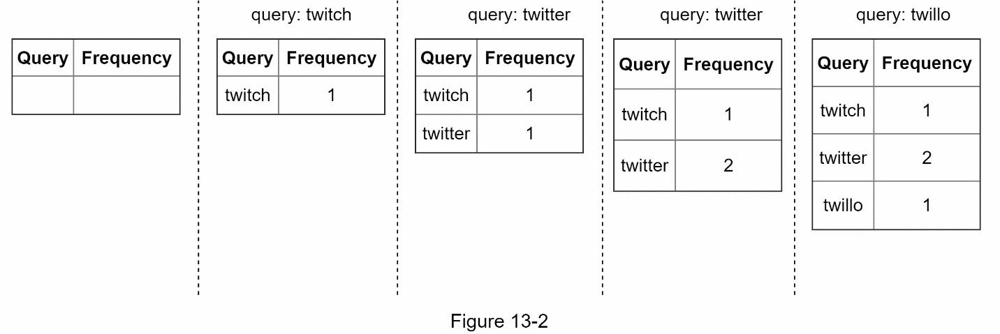

### Query service
Assume we have a frequency table as shown in Table 13-1. It has two fields.
- Query: it stores the query string.
- Frequency: it represents the number of times a query has been searched.

| **Query**          | **Frequency** |
|--------------------|---------------|
| Twitter            | 35            |
| twitch             | 29            |
| twilight           | 25            |
| twin peak          | 21            |
| twitch prime       | 18            |
| twitter search     | 14            |
| twillo             | 10            |
| twin peak sf       | 8             |
*Table 13 - 1*

When a user types “tw” in the search box, the following top 5 searched queries are displayed (Figure 13-3), assuming the frequency table is based on Table 13-1.

| **tw**          |
|-----------------|
| **tw**itter     |
| **tw**itch      |
| **tw**ilight    |
| **tw**in peak   |
| **tw**itch prime|
*Figure 13-3*

To get top 5 frequently searched queries, execute the following SQL query:
```sql
SELECT * FROM frequency_table  
WHERE query Like `prefix%`  
ORDER BY frequency DESC  
LIMIT 5  
```

However when it is large, accessing the database becomes a bottleneck. We will explore optimizations in deep dive.

## Step 3 - Design deep dive
The high-level design is not optimal, but it serves as a good starting point. We will dive deep into a few components and explore optimizations as follows:
- [Trie data structure](#trie-data-structure)
- [Data gathering service](#data-gathering-service-1)
- [Query service](#query-service-1)
- [Trie operations](#trie-operations)
- [Scale the storage](#scale-the-storage)

### Trie data structure
Relational databases are used for storage in the high-level design. However, fetching the top 5 search queries from a relational database is inefficient. The data structure **trie (prefix tree)** is used to overcome the problem. As trie data structure is crucial for the system, we will dedicate significant time to design a customized trie.

Understanding the basic trie data structure is essential for this interview question. However, this is more of a data structure question than a system design question. Besides, we will only discuss an overview of the trie data structure and focus on how to optimize the basic trie to improve response time.

Trie (pronounced “try”) is a tree-like data structure that can compactly store strings. The name comes from the word retrieval, which indicates it is designed for string retrieval operations. The main idea of trie consists of the following:
- A trie is a tree-like data structure.
- The root represents an empty string.
- Each node stores a character and has 26 children, one for each possible character. To save space, we do not draw empty links.
- Each tree node represents a single word or a prefix string.

Figure 13-5 shows a trie with search queries “tree”, “try”, “true”, “toy”, “wish”, “win”.
Search queries are highlighted with a thicker border.
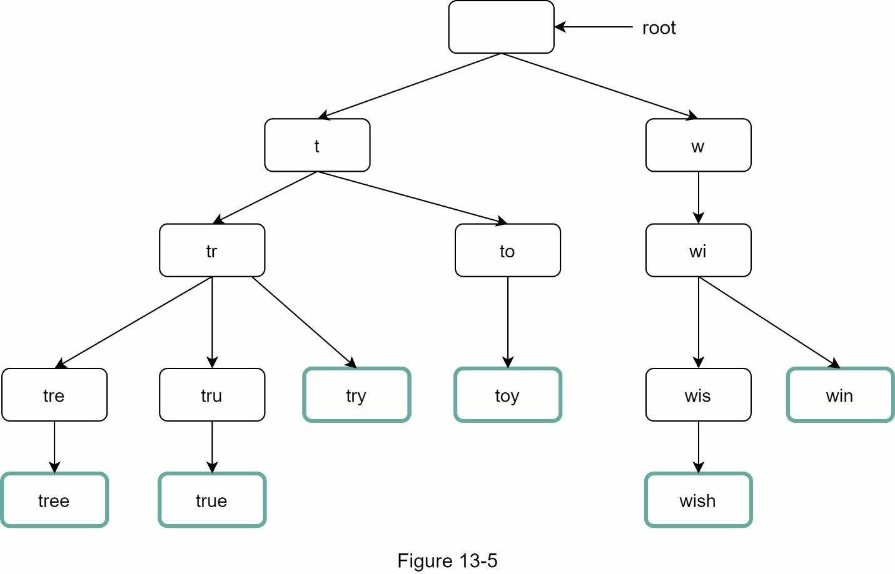

Basic trie data structure stores characters in nodes. To support sorting by frequency, frequency info needs to be included in nodes. Assume we have the following frequency table.
| **Query** | **Frequency** |
|-----------|---------------|
| tree      | 10            |
| try       | 29            |
| true      | 35            |
| toy       | 14            |
| wish      | 25            |
| win       | 50            |

After adding frequency info to nodes, updated trie data structure is shown in Figure 13-6.
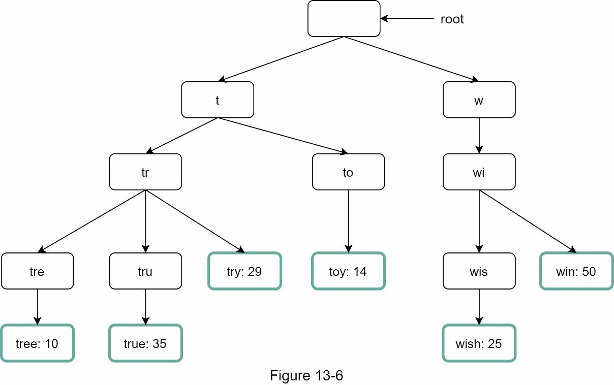

How does autocomplete work with trie? Before diving into the algorithm, let us define some
terms.
- *p*: length of a prefix
- *n*: total number of nodes in a trie
- *c*: number of children of a given node
Steps to get top k most searched queries are listed below:
1. Find the prefix. Time complexity: *O(p)*
2. Traverse the subtree from the prefix node to get all valid children. A child is valid if it
can form a valid query string. Time complexity: *O(c)*
3. Sort the children and get top k. Time complexity: *O(clogc)*
Let us use an example as shown in Figure 13-7 to explain the algorithm. Assume k equals to 2 and a user types “tr” in the search box. The algorithm works as follows:
- Step 1: Find the prefix node “tr”.
- Step 2: Traverse the subtree to get all valid children. In this case, nodes [tree: 10], [true: 35], [try: 29] are valid.
- Step 3: Sort the children and get top 2. [true: 35] and [try: 29] are the top 2 queries with prefix “tr”.

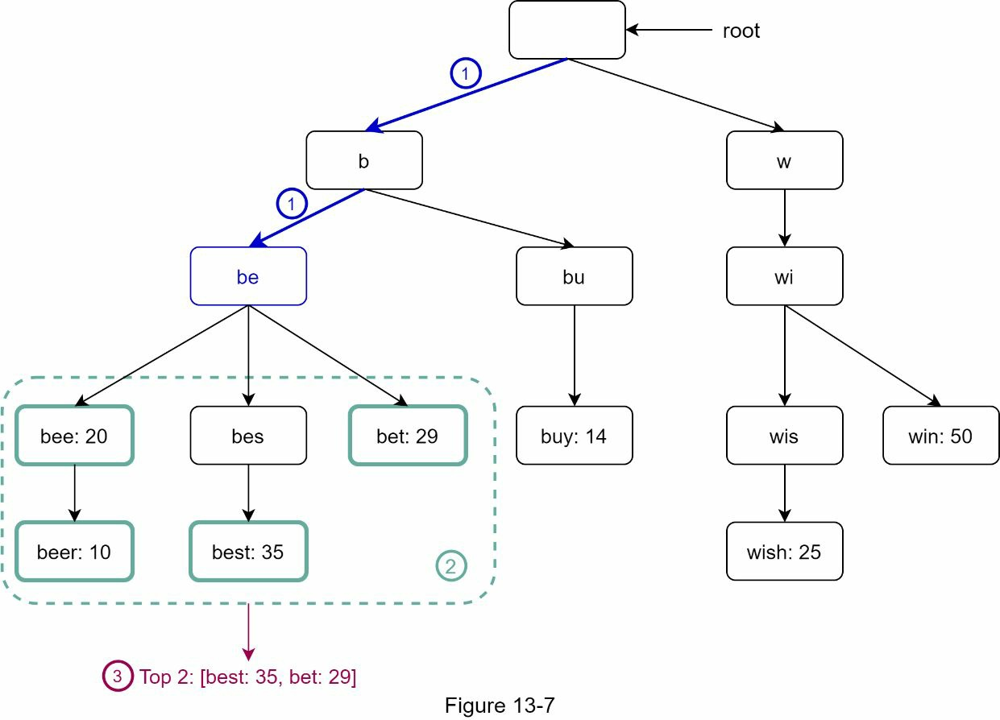

The time complexity of this algorithm is the sum of time spent on each step mentioned above: `O(p) + O(c) + O(clogc)`
The above algorithm is straightforward. However, it is too slow because we need to traverse the entire trie to get top k results in the worst-case scenario. Below are two optimizations:
1. Limit the max length of a prefix
2. Cache top search queries at each node
Let us look at these optimizations one by one.

#### Limit the max length of a prefix
Users rarely type a long search query into the search box. Thus, it is safe to say `p` is a small integer number, say 50. If we limit the length of a prefix, the time complexity for “Find the prefix” can be reduced from *O(p)* to *O(small constant)*, aka *O(1)*.

#### Cache top search queries at each node
Caching top queries at each node improves speed but requires more memory. For example, the node with prefix "be" may store [best: 35, bet: 29, bee: 20, be: 15, beer: 10].
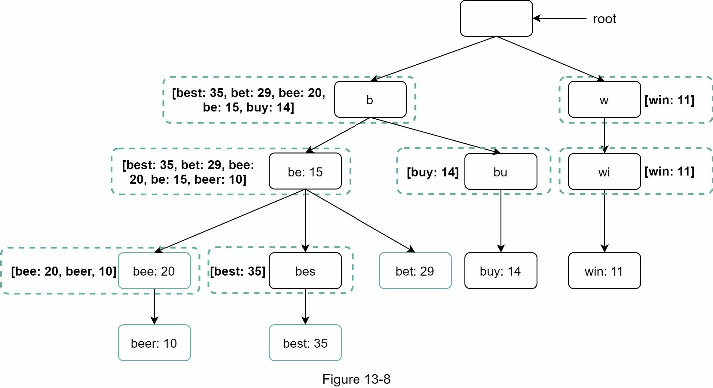
After applying those two optimizations:
1. Find the prefix node. Time complexity: O(1)
2. Return top k. Since top k queries are cached, the time complexity for this step is O(1).

As the time complexity for each of the steps is reduced to O(1), our algorithm takes only O(1) to fetch top k queries.

### Data gathering service
In our previous design, whenever a user types a search query, data is updated in **real-time**.
This approach is not practical for the following two reasons:
- Users may enter billions of queries per day. Updating the trie on every query significantly slows down the query service.
- Top suggestions may not change much once the trie is built. Thus, it is unnecessary to update the trie frequently.

To design a scalable data gathering service, we examine where data comes from and how data is used. Real-time applications like Twitter require up to date autocomplete suggestions.
However, autocomplete suggestions for many Google keywords might not change much on a daily basis.
Despite the differences in use cases, the underlying foundation for data gathering service remains the same because data used to build the trie is usually from analytics or logging services.
Figure 13-9 shows the redesigned data gathering service. Each component is examined one by one.
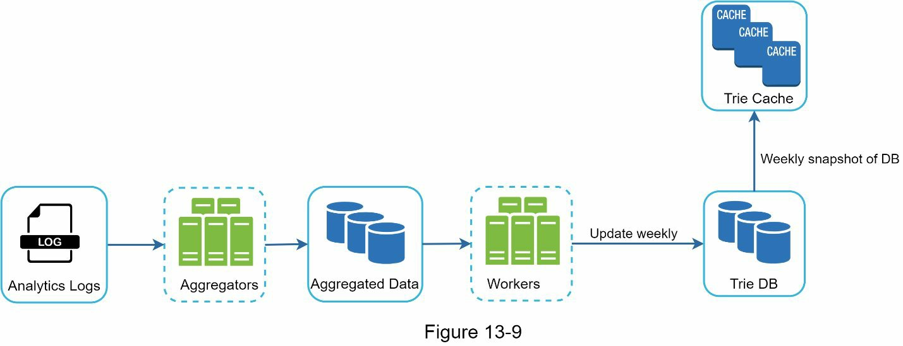

**Analytics Logs**: It stores raw data about search queries. Logs are append-only and are not indexed. 
Example of the log file:

| query | time                |
|-------|---------------------|
| tree  | 2019-10-01 22:01:01 |
| try   | 2019-10-01 22:01:05 |
| tree  | 2019-10-01 22:01:30 |
| toy   | 2019-10-01 22:02:22 |
| tree  | 2019-10-02 22:02:42 |
| try   | 2019-10-03 22:03:03 |

**Aggregators**: The size of analytics logs is usually very large, and data is not in the right format. We need to aggregate data so it can be easily processed by our system.

- For real-time systems like Twitter, data is aggregated over short intervals (e.g., every minute or hour). This ensures the latest trends are captured.
- For less dynamic systems like Google Search, data is aggregated over longer intervals (e.g., weekly). This reduces computational load because frequent updates aren’t necessary.

During an interview session, verify whether real-time results are important.

**Aggregated Data**: Table 13-4 shows an example of aggregated weekly data. “time” field represents the start time of a week. “frequency” field is the sum of the occurrences for the corresponding query in that week.

| query | Time       | frequency |
|-------|------------|-----------|
| tree  | 2019-10-01 | 12000     |
| tree  | 2019-10-08 | 15000     |
| tree  | 2019-10-15 | 9000      |
| toy   | 2019-10-01 | 8500      |
| toy   | 2019-10-08 | 6256      |
| toy   | 2019-10-15 | 8866      |

**Workers**: A set of servers that perform asynchronous jobs at regular intervals. They build the trie data structure and store it in Trie DB.
Workers handle the heavy processing of building the trie in the background without affecting real-time query performance.

**Trie Cache**: A distributed cache system that keeps trie in memory for **fast read**. It takes a weekly snapshot of the DB.

**Trie DB**: The persistent storage. Two options are available to store the data:
1. Document store: Since a new trie is built weekly, we can periodically take a snapshot of it, serialize it, and store the serialized data in the database. Document stores like MongoDB are good fits for serialized data.
2. Key-value store: A trie can be represented in a hash table form by applying the following logic:
    - Every prefix in the trie is mapped to a key in a hash table.
    - Data on each trie node is mapped to a value in a hash table.

The mapping between the trie and hash table:
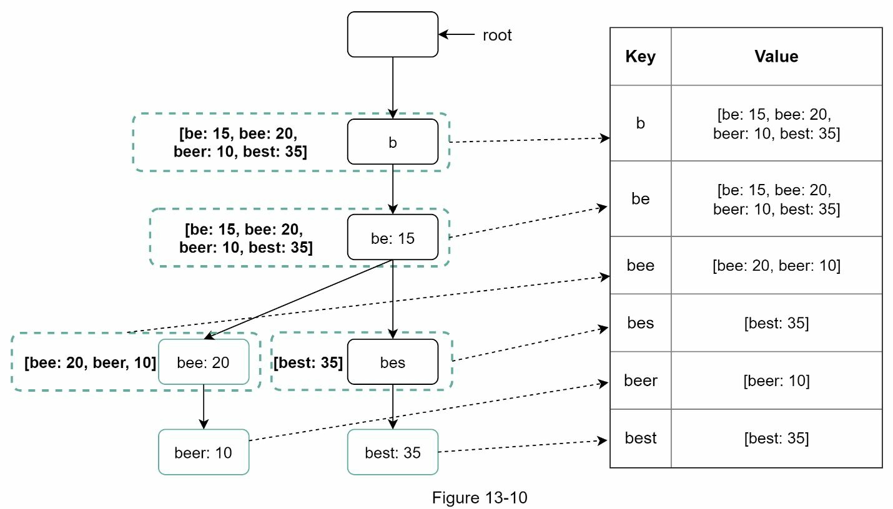
each trie node on the left is mapped to the `<key, value>` pair on the right.

### Query service
In the high-level design, query service calls the database directly to fetch the top 5 results.
Figure 13-11 shows the improved design as previous design is inefficient.
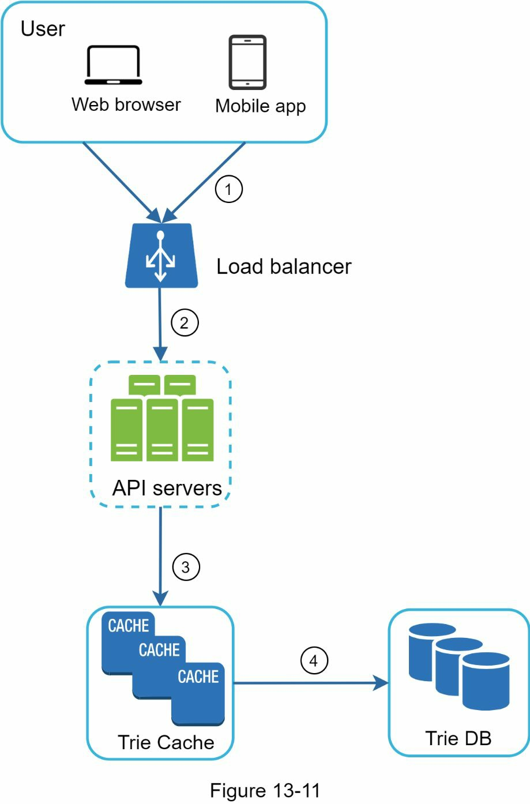
1. A search query is sent to the load balancer.
2. The load balancer routes the request to API servers.
3. API servers get trie data from Trie Cache and construct autocomplete suggestions for the client.
4. In case the data is not in Trie Cache, we restoring the cache with the missing data to the cache. This way, all subsequent requests for the same prefix are returned from the cache. A cache miss can happen when a cache server is out of memory or offline.

Query service requires lightning-fast speed. We propose the following optimizations:
- AJAX request. For web applications, browsers usually send AJAX requests to fetch autocomplete results. The main benefit of AJAX is that sending/receiving a request/response does not refresh the whole web page.
- Browser caching. For many applications, autocomplete search suggestions may not change much within a short time. Thus, autocomplete suggestions can be saved in browser cache to allow subsequent requests to get results from the cache directly. Google search engine uses the same cache mechanism. Figure 13-12 shows the response header when you type “system design interview” on the Google search engine. As you can see, Google caches the results in the browser for 1 hour. Please note: “private” in cache-control means results are intended for a single user and must not be cached by a shared cache. “max- age=3600” means the cache is valid for 3600 seconds, aka, an hour.
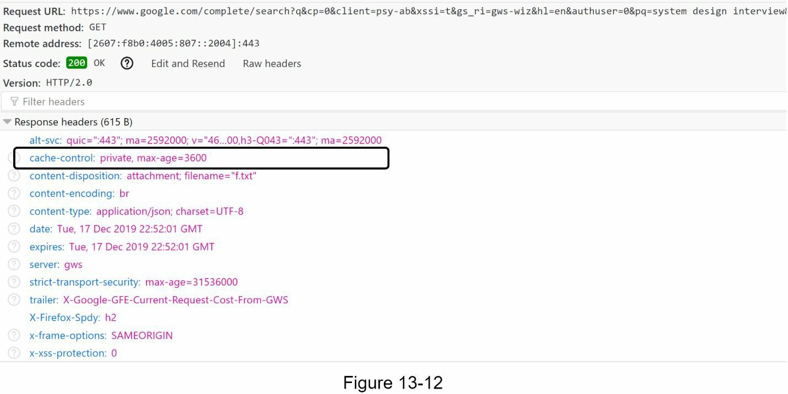
- Data sampling: For a large-scale system, logging every search query requires a lot of processing power and storage. Data sampling is important. For instance, only 1 out of every N requests is logged by the system

### Trie operations
Trie is a core component of the autocomplete system. Let us look at how trie operations (create, update, and delete) work.
#### Create
Trie is created by workers using aggregated data. The source of data is from Analytics Log/DB.
#### Update
There are two ways to update the trie.
1. Update the trie weekly. Once a new trie is created, the new trie replaces the old one.
2.  Update individual trie node directly. We try to avoid this operation because it is slow. However, if the size of the trie is small, it is an acceptable solution. When we update a trie node, its ancestors all the way up to the root must be updated because ancestors store top queries of children. 
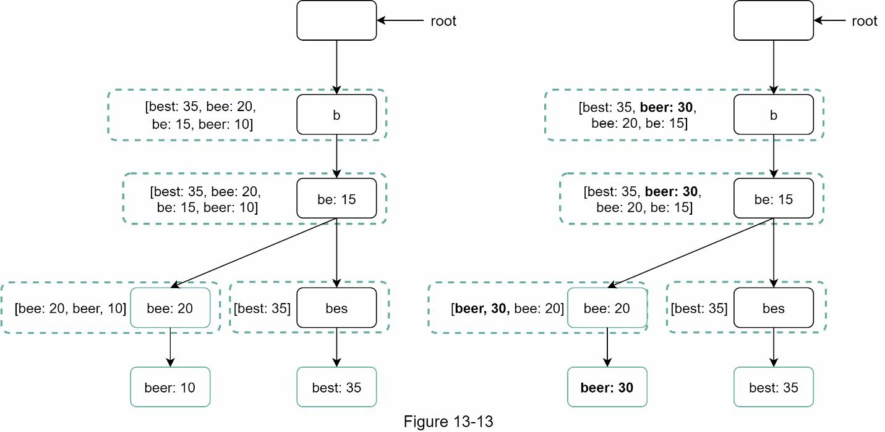
An example of how the update operation works. On the left side, the search query “beer” has the original value 10. On the right side, it is updated to 30. As you can see, the node and its ancestors have the “beer” value updated to 30.

#### Delete
We have to remove hateful, violent, sexually explicit, or dangerous autocomplete suggestions. We add a filter layer (Figure 13-14) in front of the Trie Cache to filter out unwanted suggestions. Having a **filter layer** gives us the flexibility of removing results based on different filter rules. Unwanted suggestions are removed physically from the database asynchronically so the correct data set will be used to build trie in the next update cycle.
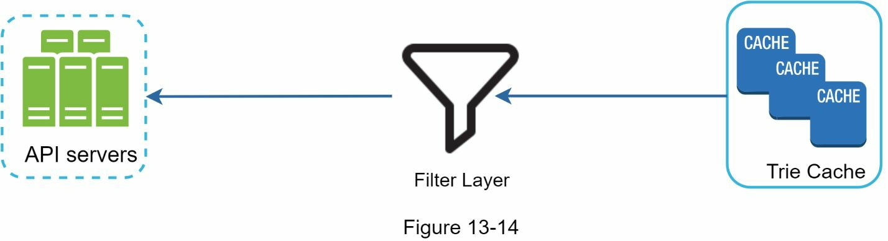

### Scale the storage
Since English is the only supported language, a naive way to shard is based on the first character. Here are some examples.

First-Level Sharding: Based on the First Character\
Initially, they use a naive approach to shard data based on the first letter of the query. Here’s how it works:

The 26 letters of the English alphabet (a to z) act as keys to divide data.

For example:

If there are 2 servers:\
Server 1 stores queries starting with a to m.\
Server 2 stores queries starting with n to z.\
If there are 3 servers:\
Server 1: a to i.\
Server 2: j to r.\
Server 3: s to z.\
This approach works up to 26 servers because there are 26 letters. Each server handles queries starting with specific letters.

Second-Level Sharding: Going Beyond 26 Servers\
When more than 26 servers are needed, they shard based on additional characters in the query:

Example: If queries starting with a are too many for one server, you further split them:\
Server 1: aa to ag\
Server 2: ah to an\
Server 3: ao to au\
Server 4: av to az\
This allows the system to scale even further by dividing data within a letter group.

Problem with Naive Sharding: Uneven Data Distribution\
The naive approach assumes an equal number of queries for each letter, which is not true:

Some letters (e.g., c, s, t) are more common as the starting letter of queries than others (e.g., x, z).\
If you evenly divide letters, servers responsible for popular letters (like c) will get much more data, creating hotspots (overloaded servers).

Smarter Sharding: Based on Historical Data Patterns\
To solve the imbalance problem, the system analyzes historical query data to determine how to split shards.

For example:\
If the letter s has as many queries as all queries starting with u, v, w, x, y, and z combined, you create two shards:\
Shard 1: Queries starting with s.\
Shard 2: Queries starting with u to z.\
This smarter approach ensures balanced data distribution across servers.

Shard Map Manager\
The shard map manager keeps track of which server (shard) holds data for specific query prefixes.

It is like a lookup table that answers questions like:\
“Which server handles queries starting with ‘s’?”\
“Where should queries for ‘weather’ or ‘weather app’ be stored?”\
By maintaining this mapping, the system can efficiently locate and access the correct shard.
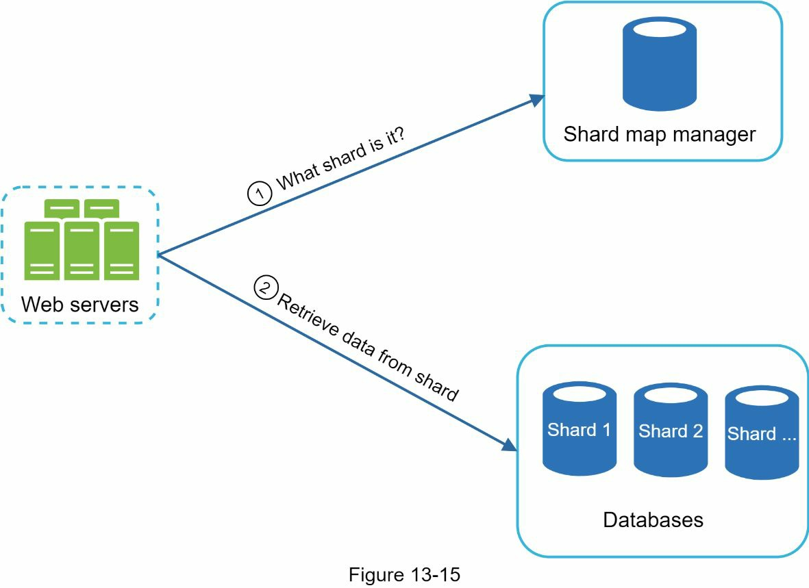

## Step 4 - Wrap up
After you finish the deep dive, your interviewer might ask you some follow up questions.\
Interviewer: How do you extend your design to support multiple languages?
- To support other non-English queries, we store Unicode characters in trie nodes. If you are not familiar with Unicode, here is the definition: “an encoding standard covers all the characters for all the writing systems of the world, modern and ancient”.

Interviewer: What if top search queries in one country are different from others?
- In this case, we might build different tries for different countries. To improve the response time, we can store tries in CDNs.

Interviewer: How can we support the trending (real-time) search queries?
- Assuming a news event breaks out, a search query suddenly becomes popular. Our original design will not work because:
    - Offline workers are not scheduled to update the trie yet because this is scheduled to run on weekly basis.
    - Even if it is scheduled, it takes too long to build the trie.
    Building a real-time search autocomplete is complicated and is beyond the scope of this book so we will only give a few ideas:
    - Reduce the working data set by sharding.
    - Change the ranking model and assign more weight to recent search queries.
    - Data may come as streams, so we do not have access to all the data at once. Streaming data means data is generated continuously. Stream processing requires a different set of systems: Apache Hadoop MapReduce, Apache Spark Streaming, Apache Storm, Apache Kafka, etc. Because all those topics require specific domain knowledge, we are not going into detail here.