# Chapter13 : Design a search autocomplete system
- In the search box, one or more matches for the search term are presented.
- Autocomplete
- Example for typing 'dinner' in the search box of google

## Step 1 - Understand the problem and establish design scope
### Possible question and answers
- Is the matching only supported at the beginning of a search query or in the middle as well?
  - Only at the begining of a search query
- How many autocomplete suggestions should the system return?
  - 5
- How does the system know which 5 suggestions to return?
  - Determined by popularity, decided by the historical query frequency
- Does the system support spell check?
  - No, spell check or autocorrect is not supported
- Are search queries in English?
  - Yes
- Do we allow capitalization and special characters?
  - No, onlhy lowercase alphabetic characters
- How many user use the product?
  - 10 million DAU

### Requirement summary
- Fast response time
- Relevant
- Sorted
- Scalable
- Highly available

### Back of the envelope estimation
- 10 million daily DAU
- An average person performs 10 searches per day
- 20 bytes of data per querying string
  - 1 byte per character x 4 words x 5 characters on each word => 20 bytes
- For every character entered into the search box, a client sends a request to the backend for autocomplete suggestions. On average 20 requests are sent for each query. For example, the following 6 requests are sent to the backend by the time you finishing typing 'dinner'
  - ~24,000 query per second(QPS) = 10,000,000 users * 10 queries / day * 20 characters / 24 hours / 3600 seconds.
  - Peak QPS = QPS x 2 = ~48,000
- Assume 20% of the daily queries are new. 10 million x 10 queries / day x 20 byte per query x 20% = 0.4 GB. This means 0.4 GB of new data is added to storage daily.

## Step 2 - Propose high-level design and get buy-in
- At the high-level, the system is broken down into two
  - Data gatehering service
  - Query service

### Data gethering service
- Simple example to use how data gathering service works
- Frequency table that stores the query string and its frequency
- Below figure show the frequency and query strings are updated and stored
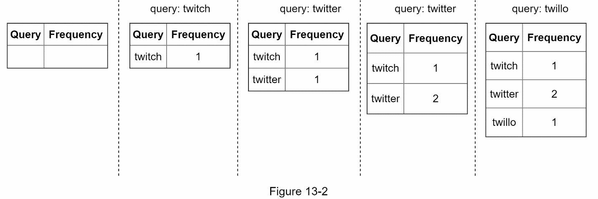

### Query service
- Assume we have a frequency table, it has two fields
  - Query: it stores the query string
  - Frequency : it presents the number of times a query has been searched
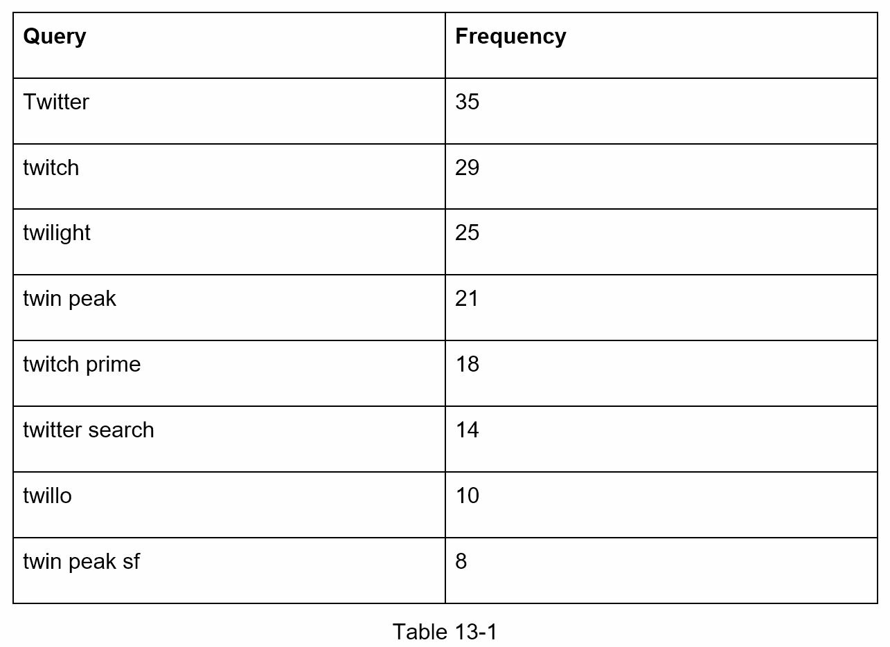
- When a user types 'tw' in the search box, the following top 5 searched queries are displayed(figure 13-3), assuming the frequecy table is tabed on table 13-1

- To get top 5 frequently searched queries, execute the following SQL query.
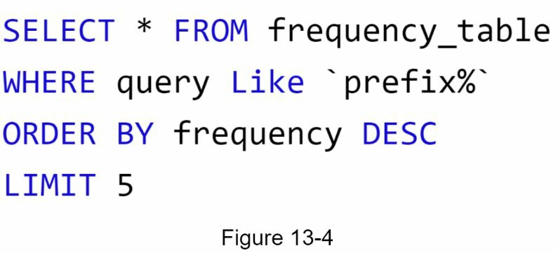
- This is an acceptable solution when the data set is small.
- When it is large, accessing the database becomes a bottleneck. 

## Step 3 - Design deep dive
- Dive deep into more components and explore optimization as follows
  - Tire data structure
  - Data gathering service
  - Query service
  - Sacle the storage
  - Trie operations

### Trie data structure
- RDB are used for storage in the high-level design, however fetching the top 5 search queries from a RDB is inefficient.
- Trie (prefix tree) is used to overcome the problem
- Only focus this here how to optimize the basic trie to improve response time
- Trie
  - Name came from the word, retrieval
  - Designed for string retrieval operation
  - A trie is a tree-like data structure
  - The root represent an empty string
  - Each node stores a character and ahs 26 children, one for each possible character. To save space, we do not draw empty link
  - Each tree node represents a single word or a prefix string 

- Show a trie with search quries : tree, try, true, toy, wish, win

- Basic trie data structure stores character in nodes
- To supporting sorting by frequency, frequency info needs to be included in nodes.
- Example for frequency table
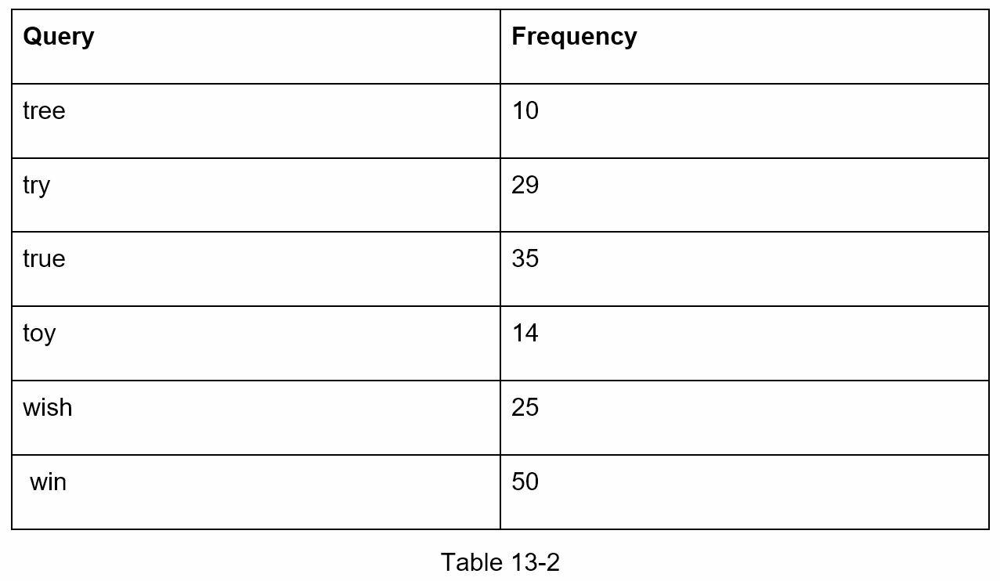

- Updated trie data structure, which having the frequency info at nodes
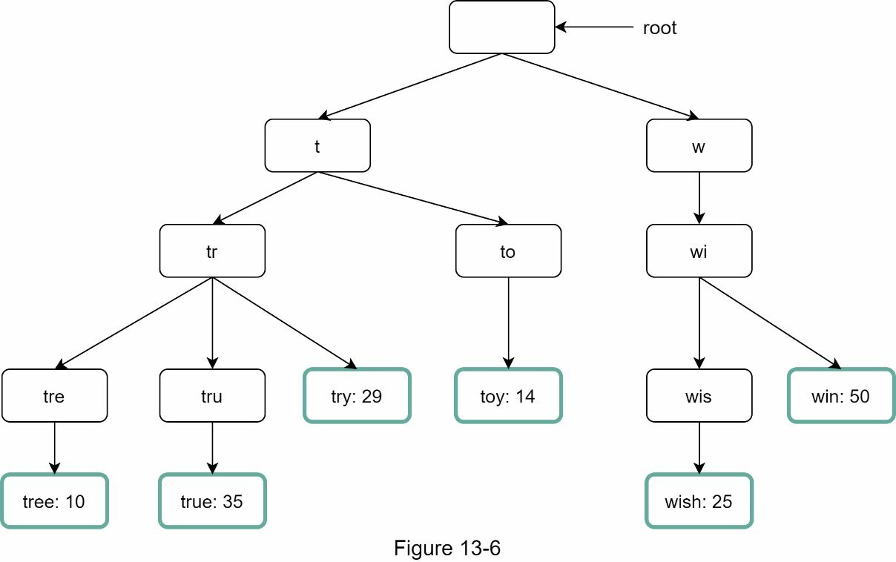

- How does autocomplete work with trie?
  - Terms
    - p: length of a prefix
    - n: total number of nodes in a trie
    - c: number of children of a given node
  - Steps to get top k most searched queries 
    - Find the prefix: Time complexity: O(p)
    - Traverse the subtree from the prefix node to get all valid children: O(c)
    - Sort the children and get top k : OI(c logc)
  - Use an exmpale - Figure 13-7 to explain algorithm
- Assume k equals to 2 and a user types 'tr' in the search box
  - Step1: Find the prefix node 'tr'
  - Step2: Traverse the subtree to get all valid children. In this case, nodes [tree:10], [true:35], [try:29] are valid
  - Step3: Sort the children and get top 2, [true:35], and [try:29] are the top 2 queries with prefix 'tr'
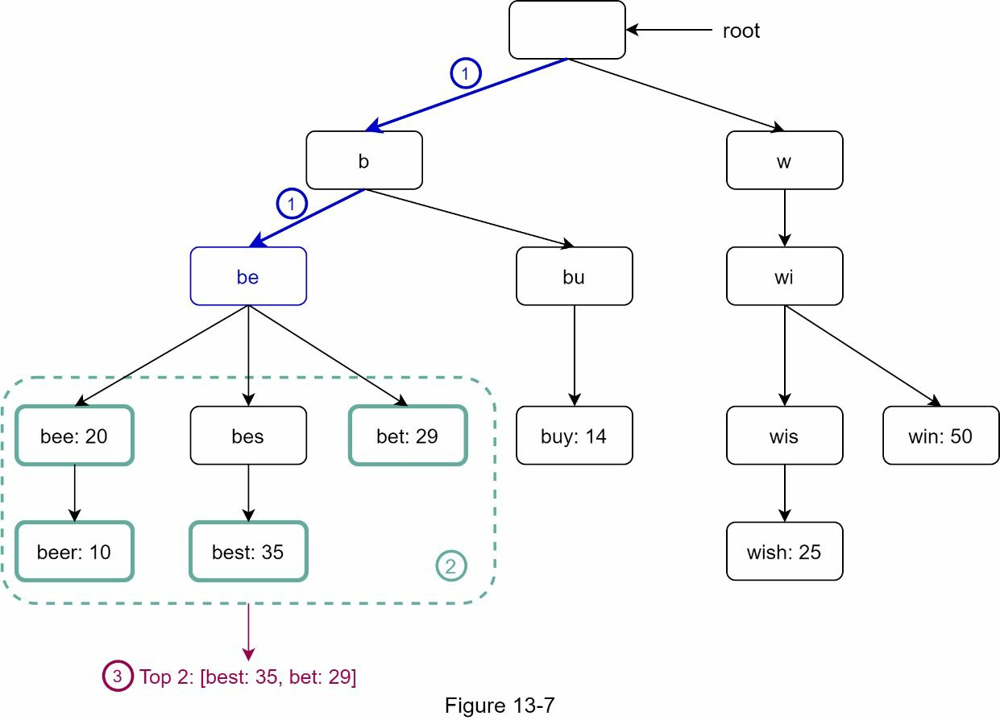
- The time complexity
  - O(p) + O(c) + O(c logc)
  - Straightforward
  - But is it too slow because it is needed to traverse the entire trie to get top k results in the worst-case scenario
  - How to optimize?
    - Limit the max length of a prefix
    - Cache top search queries at each node

#### Limit the max length of a prefix
- User rarely type a long search query into the search box
- Thus, it is safe to say p is a small integer number, say 50. 
- If twe limit the length of a prefix, the time complexity for "Find the prefix" can be reduce from O(p) to O(small constant), aka O(1)

#### Cache top search queries at each node
- To avoid traversing the whole trie, we store top k most frequently used queries at each node. 
- Since 5 to 10 autocomplete suggestions are enough for users, k is a relatively small number
- By caching top search queires at every node, can siginificantly reduce the time complexity to retrieve the top 5 queries.
- However, this design requires a lot of space to store top queries at every node. 

- Updated trie data structure
  - Top 5 queries are stored on each node
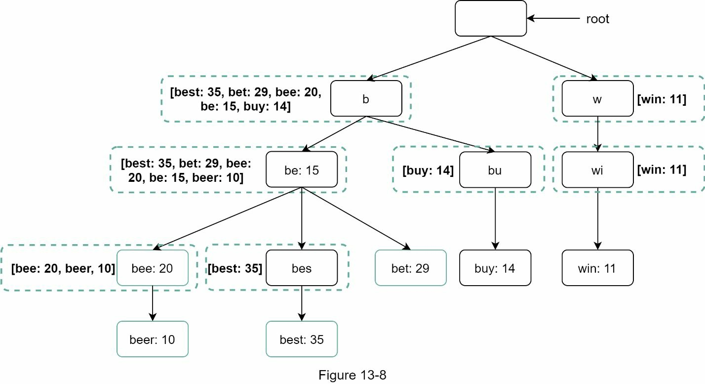
- Time complexity of the algorithm after applying two optimization
  - Find the prefix node. O(1)
  - Return top k: O(1) 
  - But how to update the k word in trie? 

### Data gathering Service
- Search querie can not be updated in real-time, it's not practical. Why?
  - Uses may enter billions of query per day. Updating the trie on every query significantly slows down the query service. 
  - Top suggestions may not change much once the trie is built. Thus it is unnecessary to update the trie frequently.
- To design a scalable data gathering serfvice, examine where dat comes from and how data is used
  - Real-time app like Twitter require up to data autocomplete suggestion
  - However, autocomplete suggestions for many google keyword might not change much on a daily basis.
- Despite the differences in use cases, the underlying foundation for data gathering service remains the same because data used to build the trie is usually from anlaytics or logging services
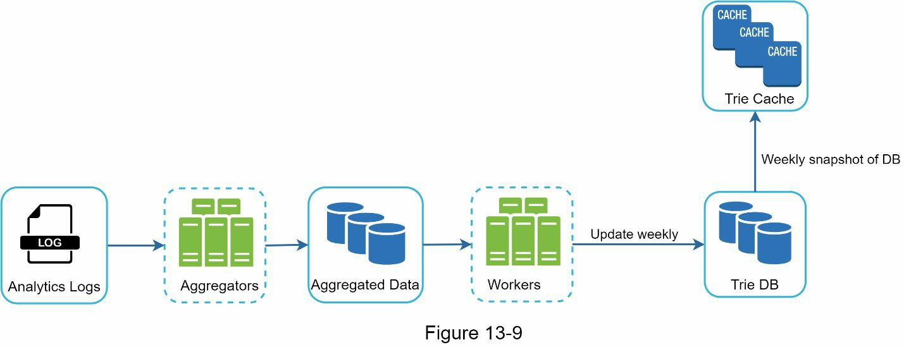

#### Analytic logs
- Stores a raw data about search queries
- Logs are apped-only and are not indexed. 
- Example of the log file
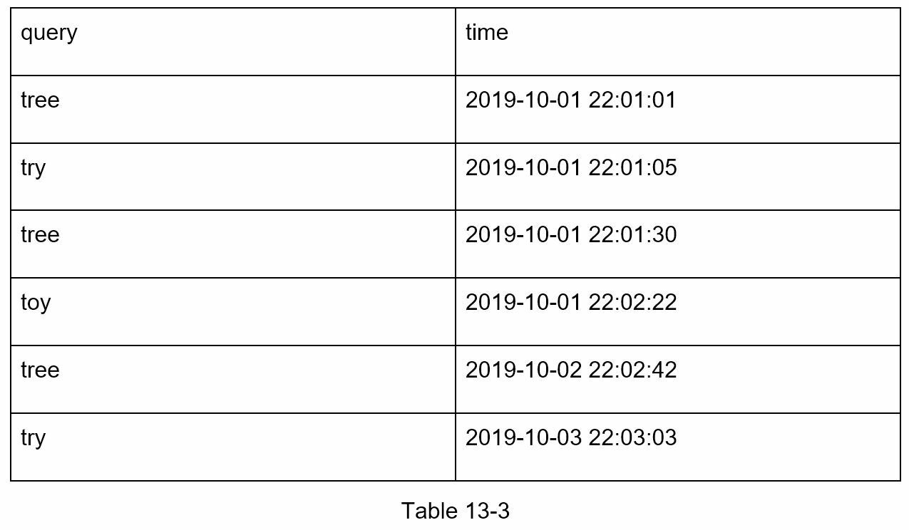

#### Aggregators
- The size of analytics logs is usually very large, and data is not in the right format.
- Need to aggregate data so it can be easily processed by our system
- Depending on our use cases, we may aggregate data differently
  - Real-time app: Aggregate data in a shorter time interval
  - Less frequently app: once per week might be good enough 

#### Aggregated Data
- Example for aggregated weekly data
  - Time: represents the start time of a week
  - frequency: the sum of the occurrences for the corresponding query in that weeek.
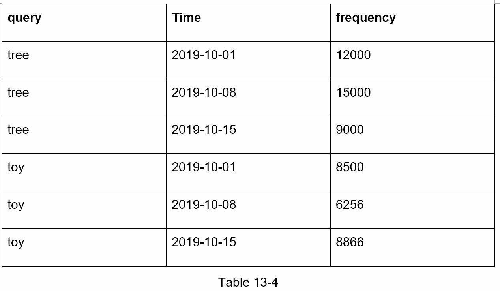

#### Workers
- Set of servers that perform asynchronous jobs at regular intervals
- They build the trie data structure and store it in Trie DB

#### Trie cache
- Distributed cache system that keeps trie in memory for fast read
- It takes a weekly snapshot of the DB

#### Trie DB
- Persistent storage
- Two options are available to store the data
  - Document store : periodically take a snapshot of it, serialize it, and store the serialized data in the DB
  - Key-value store
    - A trie can be represented in a hash table from applying the following logic
      - Every prefix in the trie is mapped to a key in a hash table
      - Data on each trie node is mapped to a value in a hash table
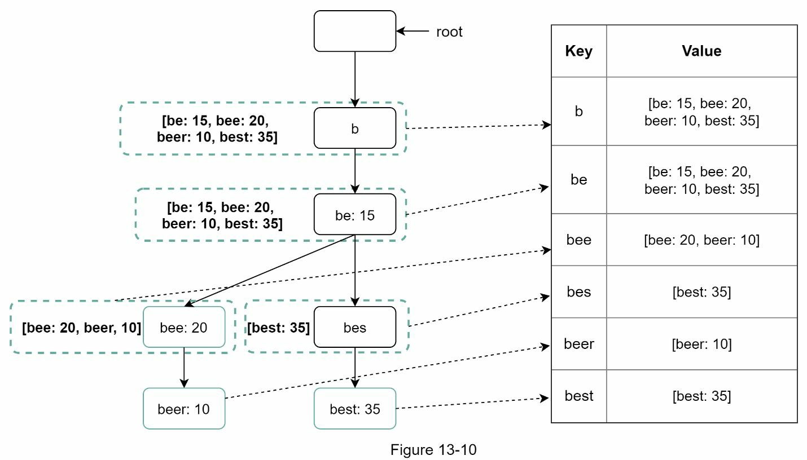
- Each trie node on the left is mapped to the <key, value> pair on the right

### Query service
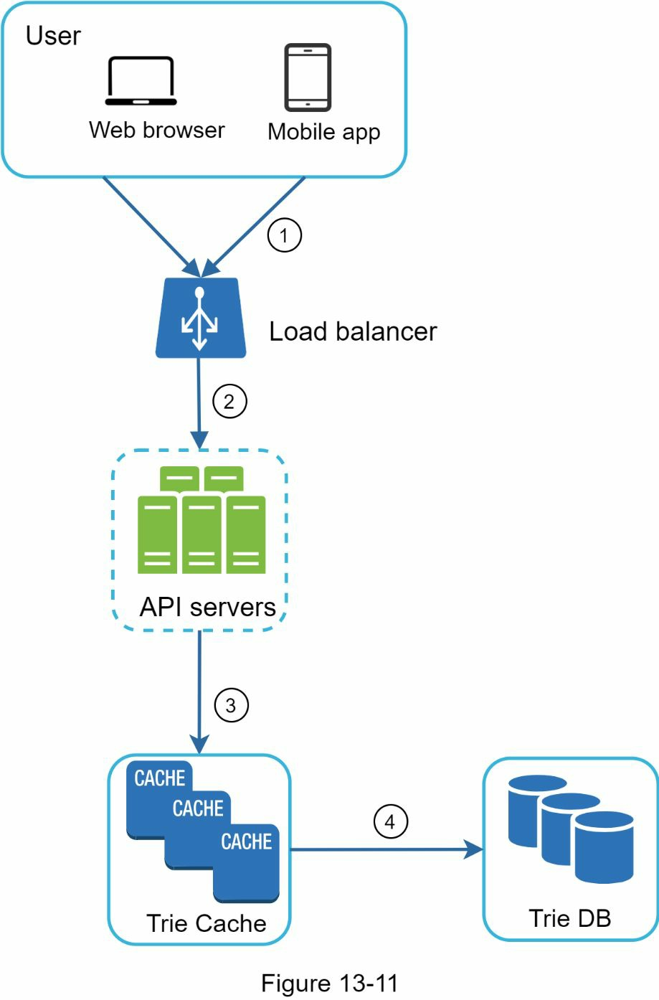
- Improve design
  - A search query is sent to the load balancer
  - The load balancer routes the request to API servers
  - API servers get trie data from Trie cache and construct autocomplete sugesstion for the client
  - In cache the data is not in Trie Cache, we replenish data back to cache. 

- Query service requries lightning-fast speed. 
  - AJAX reqeust
  - Brower caching - Many app , autocomplete search suggestions may not change much within a short time. 

- Example of response header from Google Search Engine
  - Google caches the result in the browser for 1 hr.
  - Private -> inteneded for a single user
  - Max-age=3600 means the cache is valid for 3600 seconds
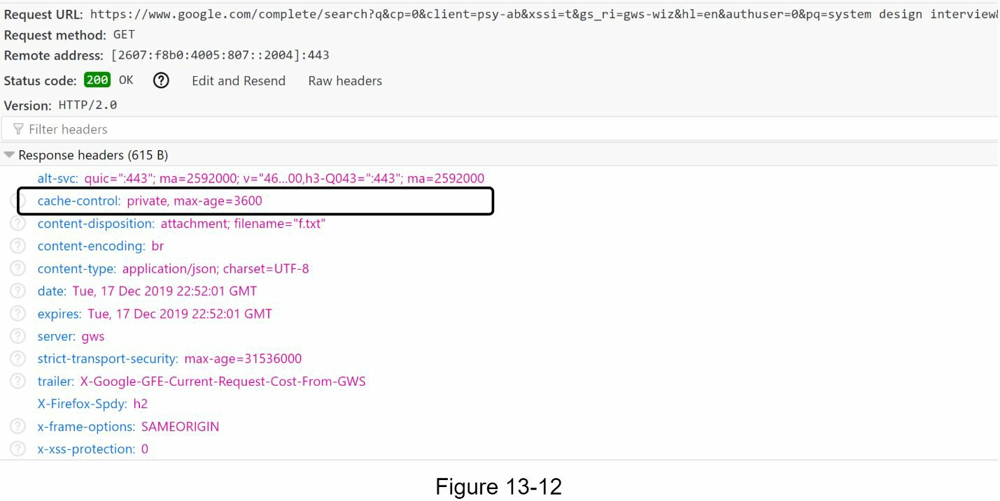

### Trie operations
- Trie is a core component of the autocomplete system

#### Create
- Trie is created by workers using aggregation data. The source of data is from Analytics LOG/DB

#### Update
- Two ways of update the trie
  - Option1 : Update trie weekly. Once a new trie is create4d, the new trie replaces the old one
  - Option2
    - Update individual trie node directly. 
    - Slow, not recommended
    - But if the size of trie is small, it is an acceptable solution
- Example the node update of ancestor
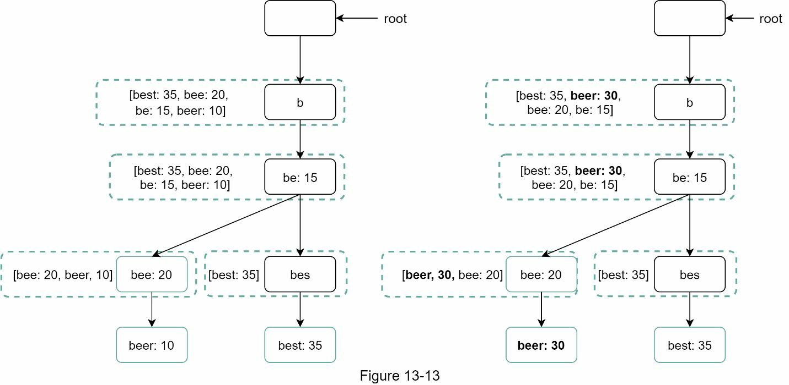

#### Delete
- There is case for delete suggestion
- Add filter layer in front of the Trie Cache to filter out unwanted suggestions
- Having a filter layer gives us the flexibility of removing results based on different filter rules
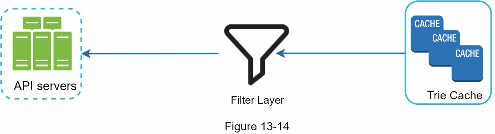

### Scale the storage
- The scalability issue when the trie grows too large to fit in one server
- Example
  - Split depend on the first character
    - two groups: 1) a~m, 2) n~z
    - three groups: 1) a-i, 2) j~r, 3) s~z
- Not only first layer, it can be adapted to second layer
- Exmple design using Shard map manager
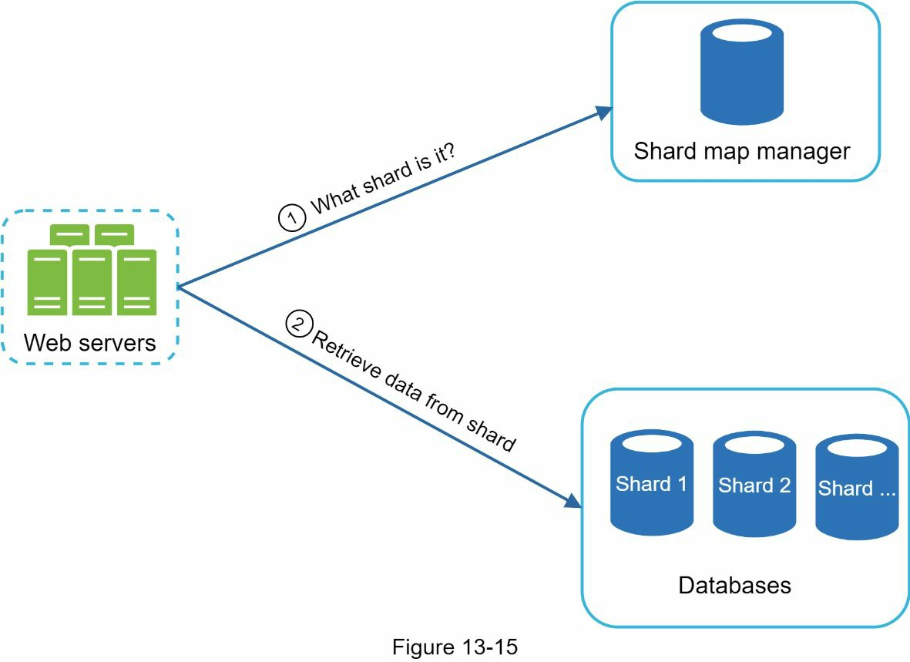

## Step 4 - Wrap up
### Possible follow up questions
- How do you extend your design to support multiple language?
  - Using Unicode characters in trie nodes
- What if top search queries in one country are different from others?
  - Might build different trie for different countries
  - To improve the response time, we can store tires in CDNs
- How can we support the trending(real-time) search queries?
  - Reduce the working data set by shadring
  - Change the ranking model and assign more weight to recent search queries