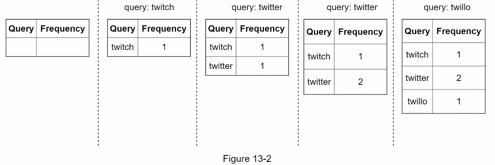
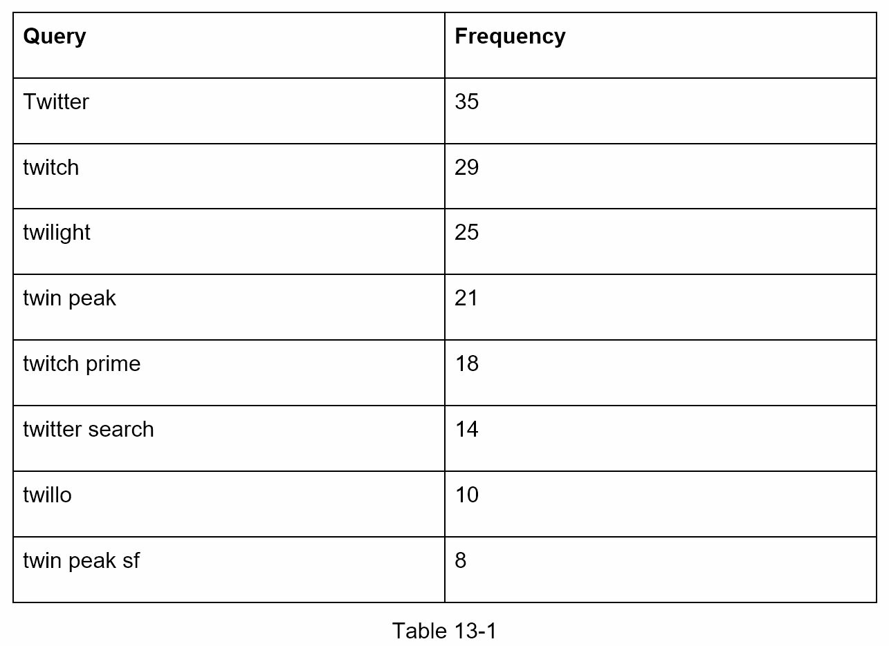
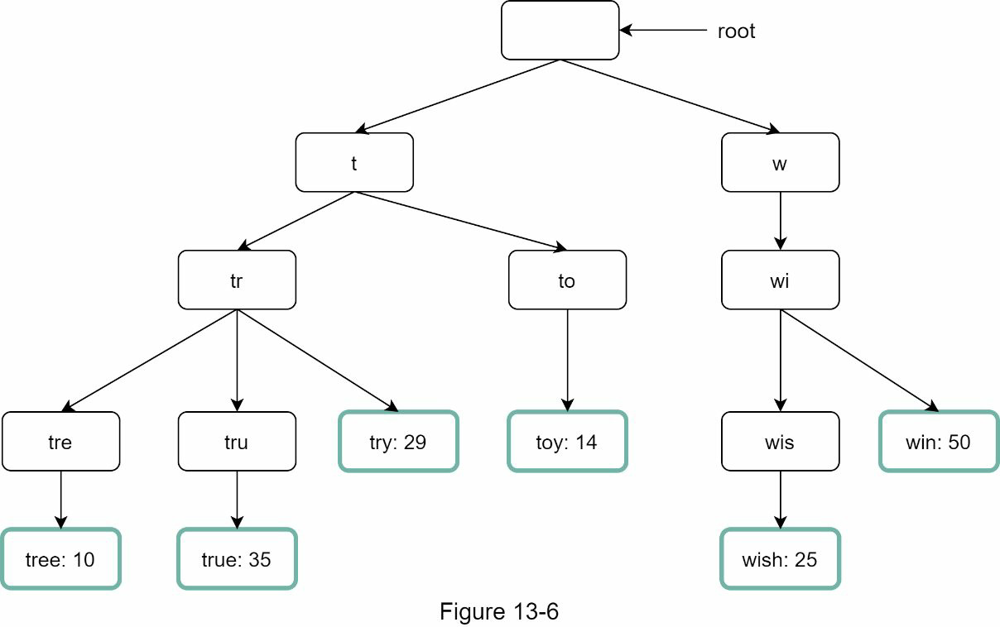
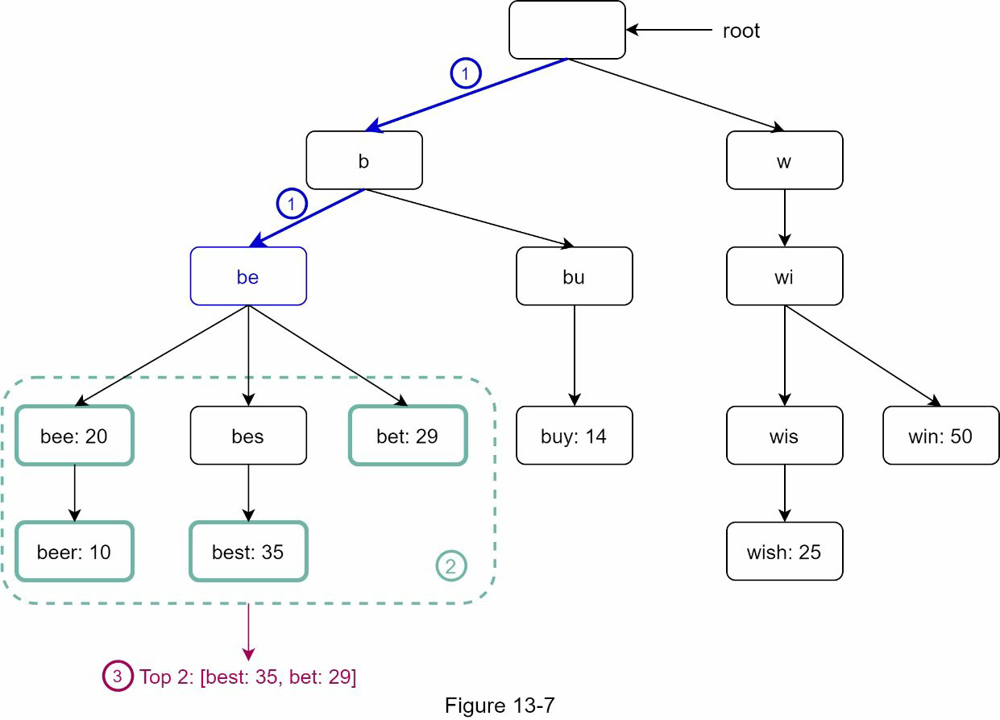
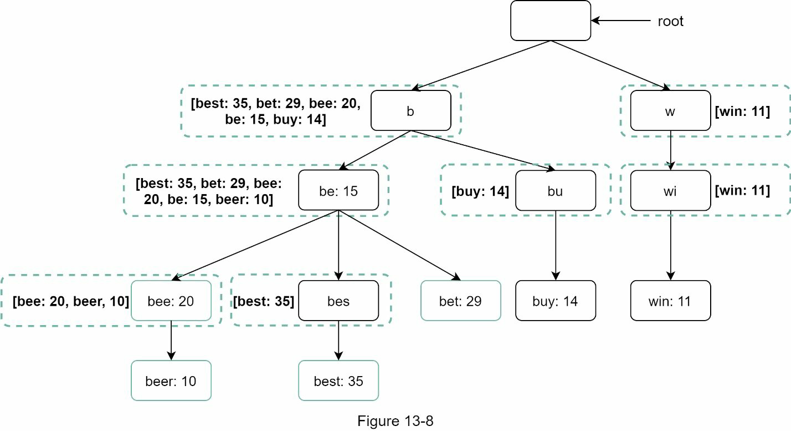
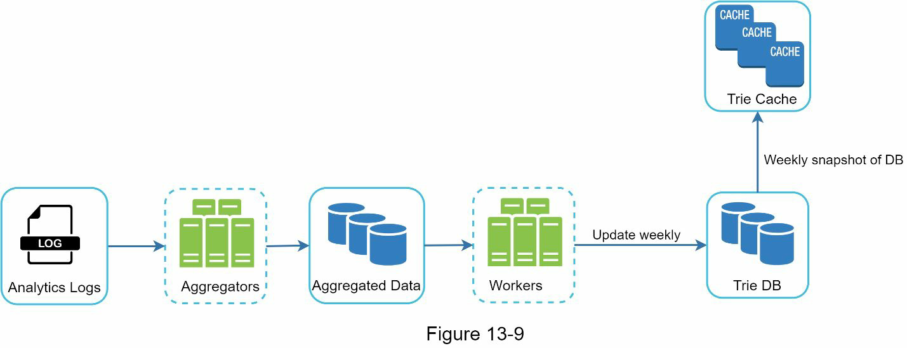
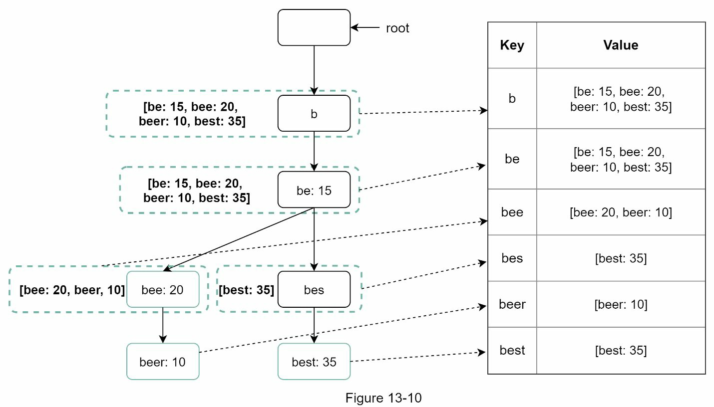
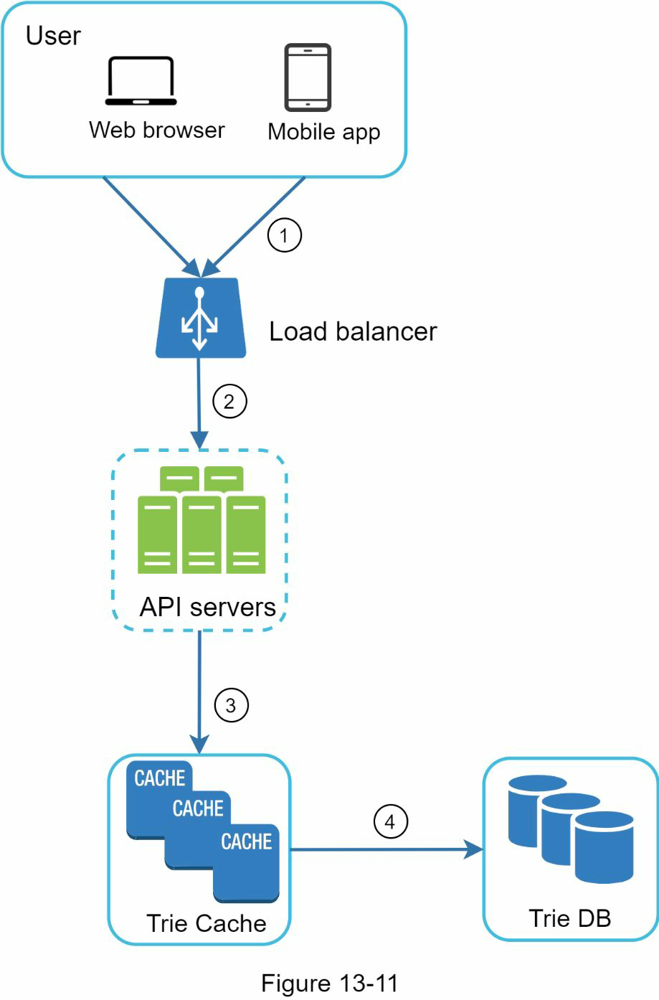
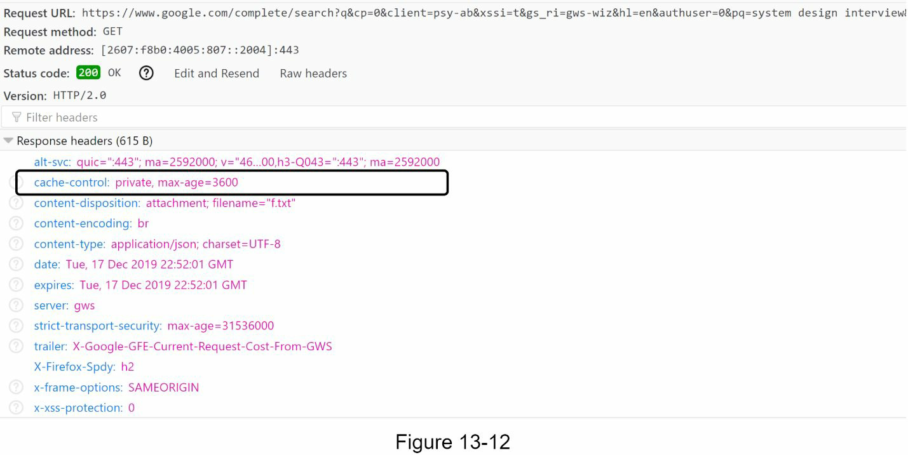
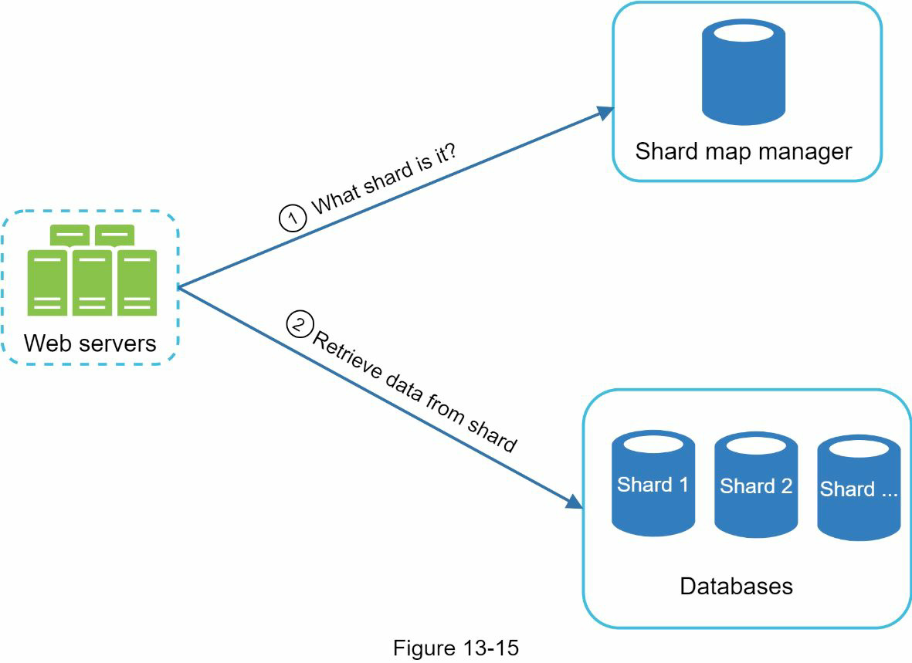

# Step 1 - Understand the problem and establish design scope

- Is the matching only supported at the beginning of a search query or in the middle as well?
  - Only at the beginning of a search query
- How many autocomplete suggestions?
  - 5
- How does the system know which 5 suggestions to return?
  - determined by popularity, decided by the historical query frequency
- Support spell check?
  - No
- Language support?
  - English
- Allow capitalization and special characters?
  - All search queries have lowercase alphabetic characters
- DAU?
  - 10 mil

- Other requirements
  - Fast response time
  - Relevant
  - Sorted
  - Scalable
  - Highly available

## Back of the envelope estimate
- 10 mil daily active users (DAU)
- Avg 10 searches per day for each person
- 20 bytes of data per query string
  - ASCII character encoding. 1 character = 1 byte
  - Query contains 4 words, and each word contains 5 characters on average
  - 20 bytes per query
- 10,000,000 users * 10 queries / day * 20 characters / 24 hours / 3600 seconds
- Peak QPS = QPS * 2 = ~48,000
- Assume 20% of the daily queries are new. 10 million * 10 queries / day * 20 byte per query * 20% = 0.4 GB. This means 0.4GB of new data is added to storage daily.

# Step 2 - high level design

Query service

- When it is large, accessing the database becomes a bottleneck.

# Step 3 - Design deep dive

## Trie data structure
- The root represents an empty string.
- Each node stores a character and has 26 children, one for each possible character. To save space, we do not draw empty links.
- Each tree node represents a single word or a prefix string.

Time complexity: O(p) + O(c) + O(clogc)
- p: length of a prefix
- n: total number of nodes in a trie
- c: number of children of a given node

## Limit the max length of a prefix
- Reduced from O(p) to O(small constant), aka O(1)

## Cache top search queries at each node

1. Find the prefix node. Time complexity: O(1)
2. Return top k. Since top k queries are cached, the time complexity for this step is O(1).

## Data gathering service
Real time data update is not practical
- Users may enter billions of queries per day. Updating the trie on every query significantly slows down the query service.
- Top suggestions may not change much once the trie is built. Thus, it is unnecessary to update the trie frequently

### Analytics Logs
- Stores raw data about search queries. Logs are append-only and are not indexed

### Aggregators
- Aggregate data so it can be easily processed by our system

### Workers
- Perform asynchronous jobs at regular intervals. They build the trie data structure and store it in Trie DB

### Trie cache
- Distributed cache system that keeps trie in memory for fast read
- It takes a weekly snapshot of the DB

### Trie DB
- Document store
  - periodically take a snapshot of it, serialize it, and store the serialized data in the database
- Key-value store
  - Every prefix in the trie is mapped to a key in a hash table.
  - Data on each trie node is mapped to a value in a hash table

### Query service

- Browser cache

- Data sampling: For a large-scale system, logging every search query requires a lot of processing power and storage. Data sampling is important.

## Trie operations

### Create
- Created by workers using aggregated data. The source of data is from Analytics Log/DB.

### Update
- Update the trie weekly.
- Update individual trie node directly
  - Avoid this operation because it is slow. However, if the size of the trie is small, it is an acceptable solution.

### Delete
- Having a filter layer gives us the flexibility of removing results based on different filter rules.

## Scale the storage

- Avoid uneven distribution
  - The shard map manager maintains a lookup database for identifying where rows should be stored. For example, if there are a similar number of historical queries for ‘s’ and for ‘u’, ‘v’, ‘w’, ‘x’, ‘y’ and ‘z’ combined, we can maintain two shards: one for ‘s’ and one for ‘u’ to ‘z’.

# Step 4
- Multi language support: Unicode
- What if top search queries in one country are different from others
  - Different tries for different countries, use CDNs
- Support the trending (real-time) search queries
  - Reduce the working data set by sharding
  - Change the ranking model and assign more weight to recent search queries
  - 