# 13. DESIGN A SEARCH AUTOCOMPLETE SYSTEM
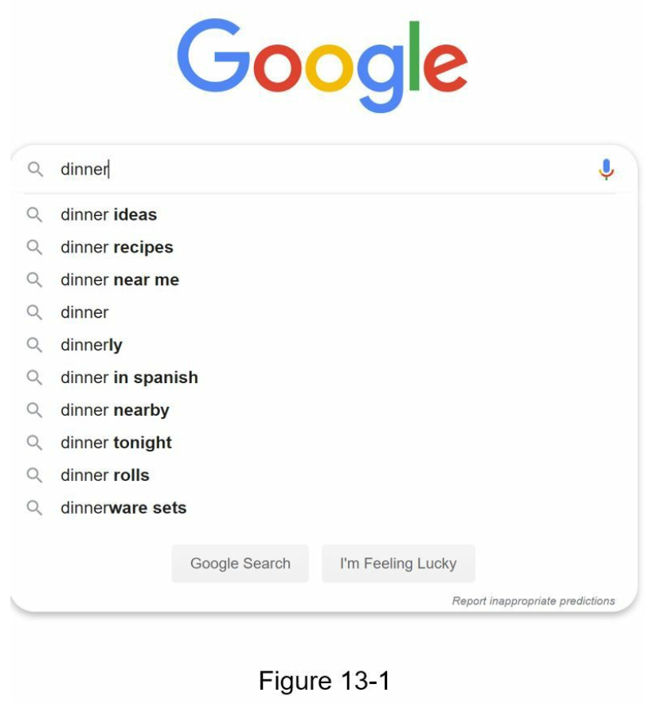
- also called “design top k” or “design top k most searched queries”.
### Step 1 - Understand the problem and establish design scope
#### Requirements
- Fast response time: As a user types a search query, autocomplete suggestions must show up fast enough. An article about Facebook’s autocomplete system [1] reveals that the system needs to return results within 100 milliseconds. Otherwise it will cause stuttering.
- Relevant: Autocomplete suggestions should be relevant to the search term.
- Sorted: Results returned by the system must be sorted by popularity or other ranking models.
- Scalable: The system can handle high traffic volume.
- Highly available: The system should remain available and accessible when part of the system is offline, slows down, or experiences unexpected network errors.

#### Back of the envelope estimation
- Assume 10 million daily active users (DAU).
- An average person performs 10 searches per day.
- 20 bytes of data per query string:
    - Assume we use ASCII character encoding. 1 character = 1 byte
    - Assume a query contains 4 words, and each word contains 5 characters on average.
    - That is 4 x 5 = 20 bytes per query.
- On average, 20 requests are sent for each search query. (ie, 6 requests)
    - search?q=d
    - search?q=di
    - search?q=din
    - search?q=dinn
    - search?q=dinne
    - search?q=dinner
- ~24,000 query per second (QPS) = 10,000,000 users * 10 queries / day * 20 characters / 24 hours / 3600 seconds.
- Peak QPS = QPS * 2 = ~48,000
- Assume 20% of the daily queries are new. 10 million * 10 queries / day * 20 byte per query * 20% = 0.4 GB. This means 0.4GB of new data is added to storage daily.

### Step 2 - Propose high-level design and get buy-in
---
#### Data gathering service
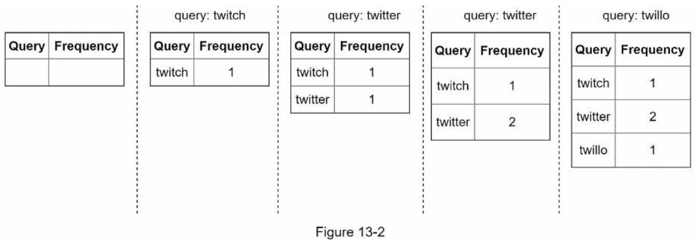
#### Query service
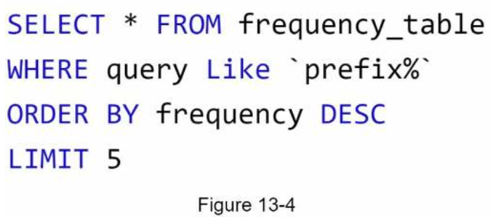
- This is an acceptable solution when the data set is small. When it is large, accessing the database becomes a bottleneck.

### Step 3 - Design deep dive
---
#### Trie(prefix tree) data structure
- The name comes from the word retrieval, which indicates it is designed for string retrieval operations.
- The main idea of trie:
    - A trie is a tree-like data structure.
    - The root represents an empty string.
    - Each node stores a character and has 26 children, one for each possible character. To save space, we do not draw empty links.
    - Each tree node represents a single word or a prefix string.
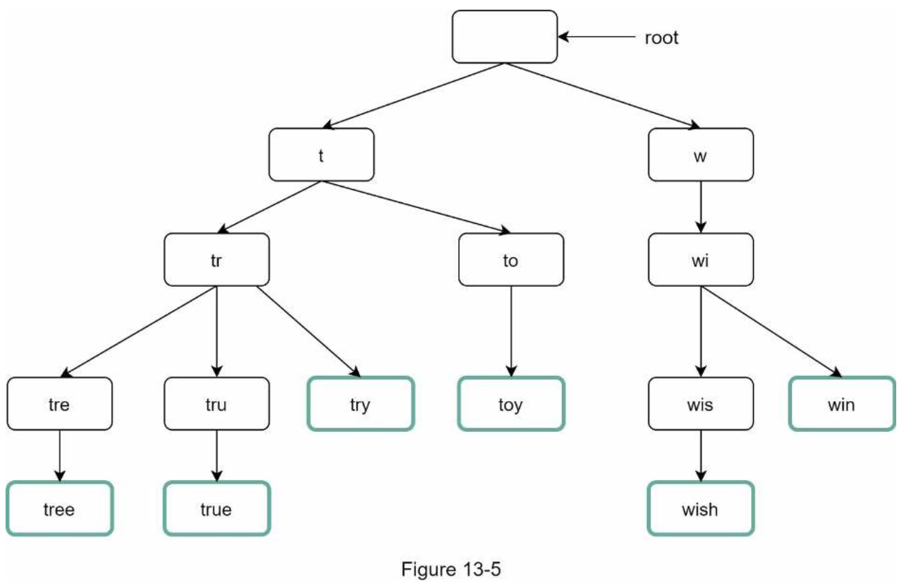
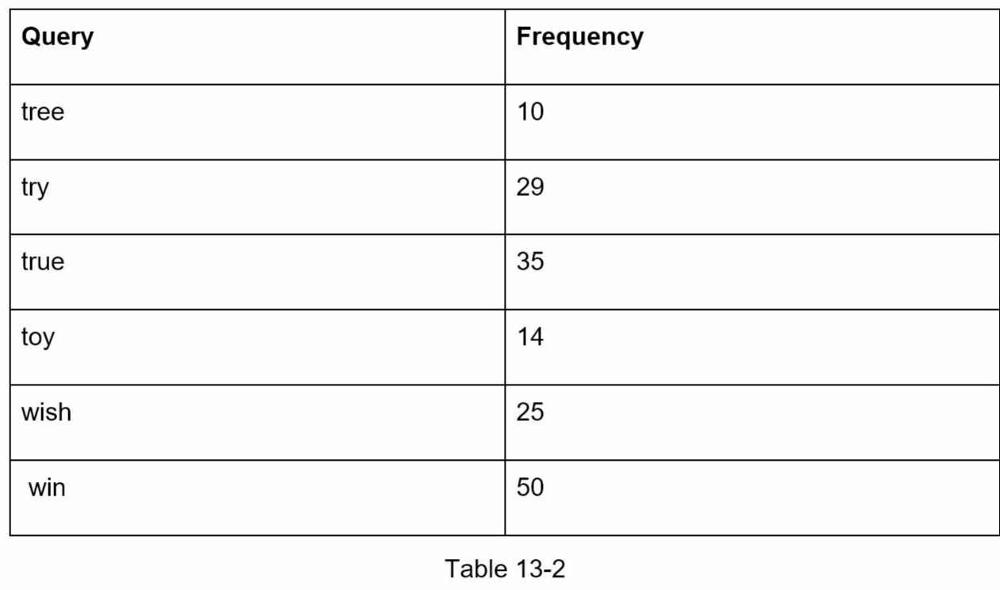
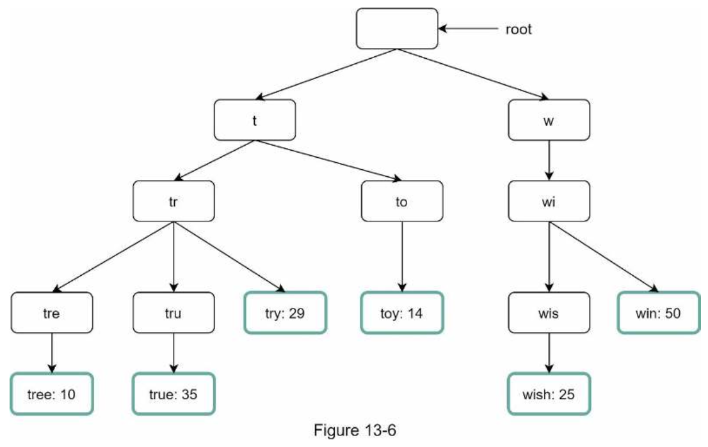
- The algorithm works as follows:
    - Step 1: Find the prefix node “tr”.
    - Step 2: Traverse the subtree to get all valid children. In this case, nodes [tree: 10], [true: 35], [try: 29] are valid.
    - Step 3: Sort the children and get top 2. [true: 35] and [try: 29] are the top 2 queries with prefix “tr”.
- The time complexity of this algorithm is the sum of time spent on each step mentioned above: **O(p) + O(c) + O(clogc)**
- Two optimizations:
    - 1. Limit the max length of a prefix
    - 2. Cache top search queries at each node
###### Limit the max length of a prefix
- If we limit the length of a prefix, the time complexity for “Find the prefix” can be reduced from O(p) to O(small constant), aka O(1).

###### Cache top search queries at each node
- To avoid traversing the whole trie, we store top k most frequently used queries at each node.
- By caching top search queries at every node, we significantly reduce the time complexity to retrieve the top 5 queries.
- However, this design requires a lot of space to store top queries at every node. Trading space for time is well worth it as fast response time is very important.
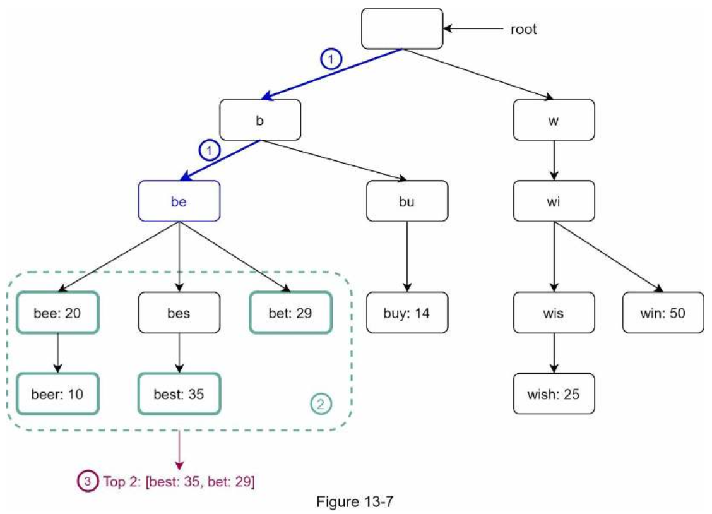
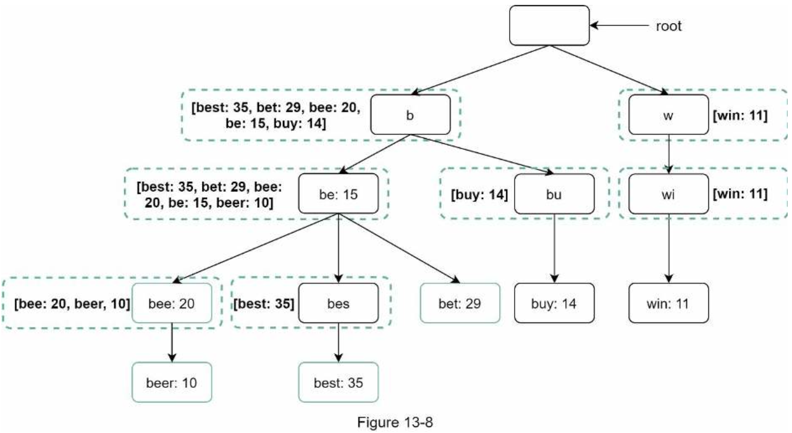

#### Data gathering service
- The previous approach is not practical for the following two reasons:
    - Users may enter billions of queries per day. Updating the trie on every query significantly slows down the query service.
    - Top suggestions may not change much once the trie is built. Thus, it is unnecessary to update the trie frequently.
- To design a scalable data gathering service, we examine where data comes from and how data is used.
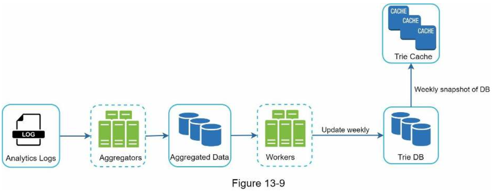
###### Analytics Logs
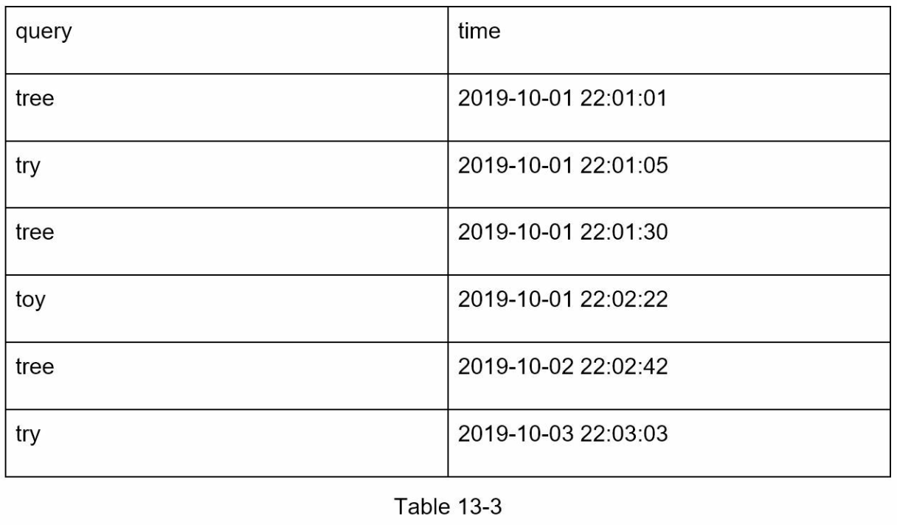
- It stores raw data about search queries. 
- Logs are append-only and are not indexed.
###### Aggregators
- The size of analytics logs is usually very large, and data is not in the right format.
- We need to aggregate data so it can be easily processed by our system.
###### Aggregated Data
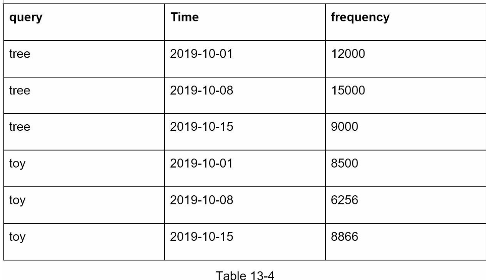
- “time” field represents the start time of a week.
- “frequency” field is the sum of the occurrences for the corresponding query in that week.
###### Workers
- Workers are a set of servers that perform asynchronous jobs at regular intervals.
###### Trie Cache
- Trie Cache is a distributed cache system that keeps trie in memory for fast read.
###### Trie DB
- Trie DB is the persistent storage.
    - 1. Document store: Since a new trie is built weekly, we can periodically take a snapshot of it, serialize it, and store the serialized data in the database.
    - 2. Key-value store
        - Every prefix in the trie is mapped to a key in a hash table.
        - Data on each trie node is mapped to a value in a hash table.
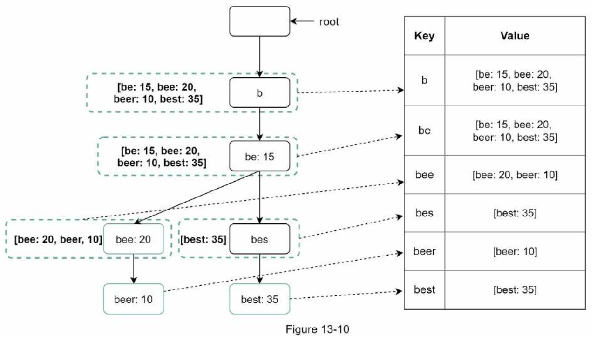

#### Query service

1. A search query is sent to the load balancer.
2. The load balancer routes the request to API servers.
3. API servers get trie data from Trie Cache and construct autocomplete suggestions for the client.
4. In case the data is not in Trie Cache, we replenish data back to the cache. This way, all subsequent requests for the same prefix are returned from the cache. A cache miss can happen when a cache server is out of memory or offline.
###### Optimizations
- AJAX request
- Browser caching
- Data sampling

#### Trie operations
- Trie is a core component of the autocomplete system.
###### Create
- Trie is created by workers using aggregated data.
- The source of data is from Analytics Log/DB.
###### Update
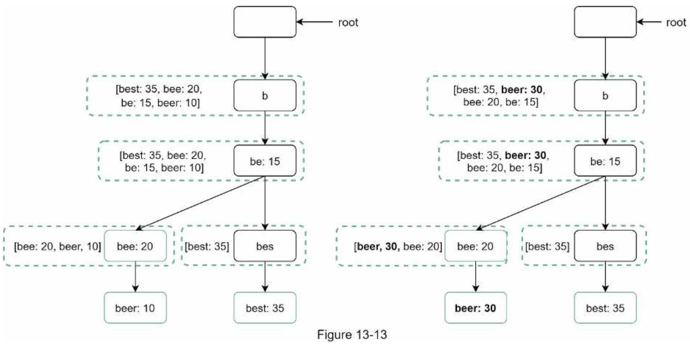
- There are two ways to update the trie.
    - Update the trie weekly. 
    - Update individual trie node directly.
###### Delete
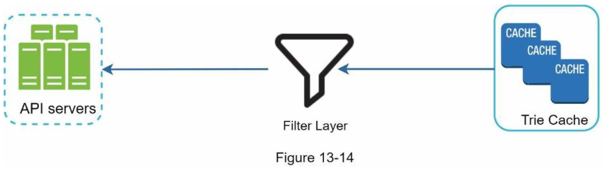
- Having a filter layer gives us the flexibility of removing results based on different filter rules.
- Unwanted suggestions are removed physically from the database asynchronically so the correct data set will be used to build trie in the next update cycle.

#### Scale the storage
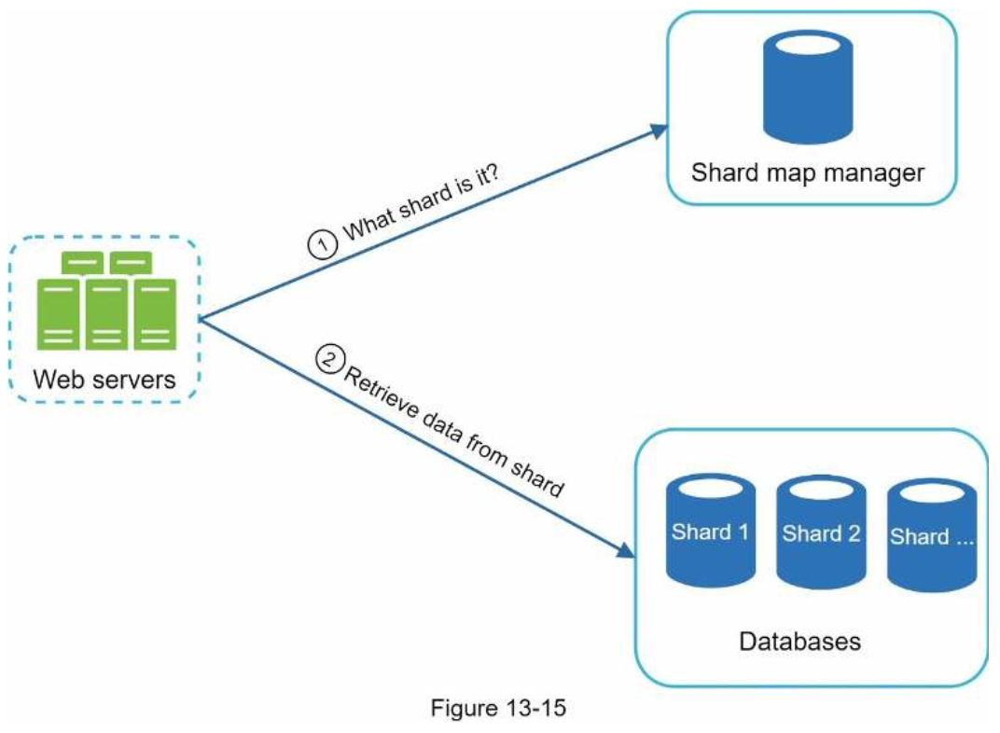
- The shard map manager maintains a lookup database for identifying where rows should be stored.
- If there are a similar number of historical queries for `s` and for `u`, `v`, `w`, `x`, `y` and `z` combined, we can maintain two shards: one for `s` and one for `u` to `z`.

### Step 4 - Wrap up
---
##### Interviewer: How do you extend your design to support multiple languages?
- To support other non-English queries, we store Unicode characters in trie nodes.

##### Interviewer: What if top search queries in one country are different from others?
- In this case, we might build different tries for different countries. To improve the response time, we can store tries in CDNs.

##### Interviewer: How can we support the trending (real-time) search queries?
- Our original design will not work because:
    - Offline workers are not scheduled to update the trie yet because this is scheduled to run on weekly basis.
    - Even if it is scheduled, it takes too long to build the trie.
- Ideas for building a real-time search autocomplete:
    - Reduce the working data set by sharding.
    - Change the ranking model and assign more weight to recent search queries.
    - Data may come as streams, so we do not have access to all the data at once.
