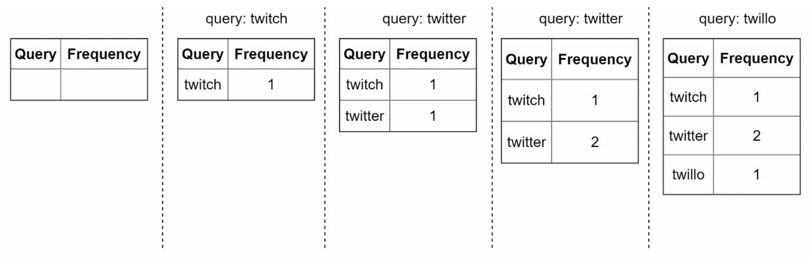
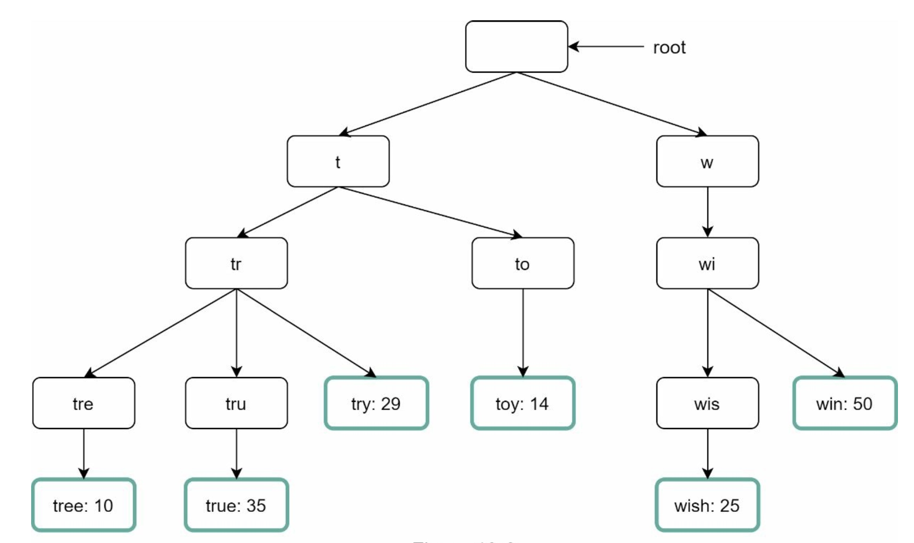
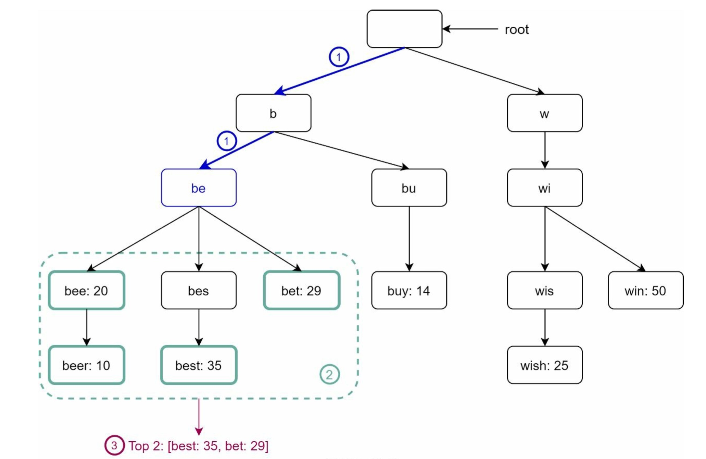
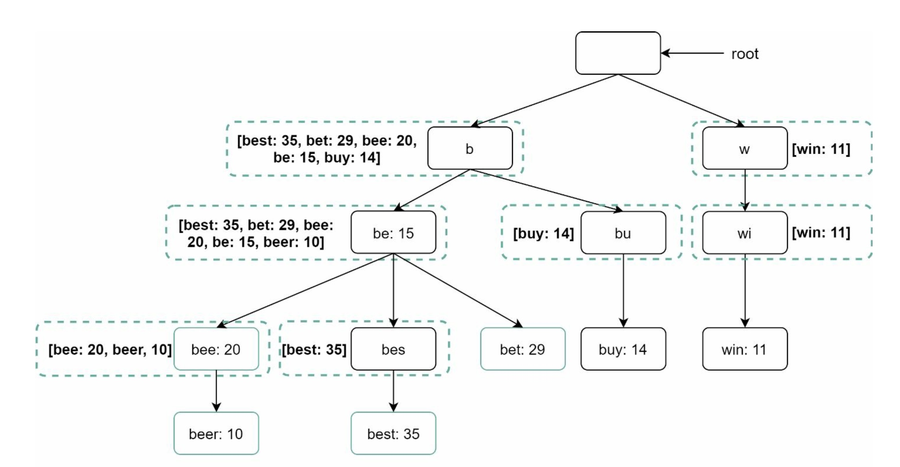
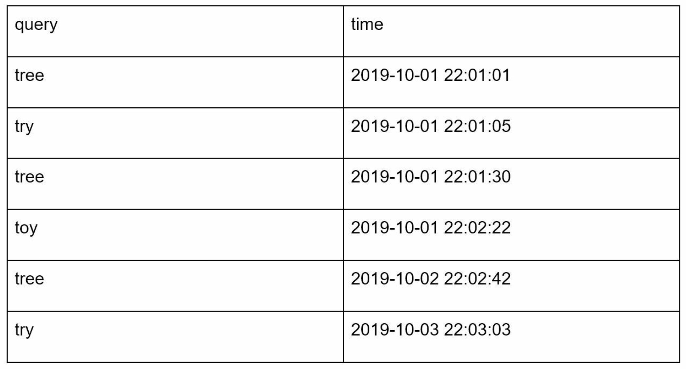
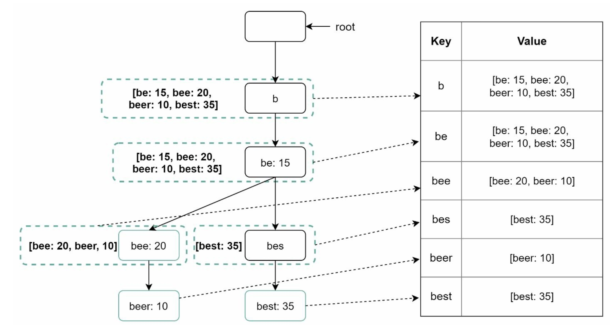

# Chapter 13. Design a search autocomplete system
This design question is also called **"design top k"** or **"design top k most searched queries"**

### Step 1 - Understand the problem and establish design scope
Requirements:
- The matching only supported at the beginning of a search query
- 5 autocomplete suggestions should be returned
- the suggestions are determined by popularity, and historical query frequency
- spell check or autocorrect is not supported
- All search queries have lowercase alphabetic characters
- 10 million DAU

#### Back of the envelope estimation
- Assume 10 million DAU
- Average person performs 10 searches per day
- 20 bytes of data per query string:
    - Assume we use ASCII character encoding. 1 character = 1 byte 
    - Assume a query contains 4 words, and each word contains 5 characters on average
    - 20 bytes per query
- For every character entered into the search box, a client sends a request to the backend for autocomplete suggestions. On average, 20 requests are sent for each search query
- ~24,000 query per second(QPS) = 10,000,000 users * 10 queries / day * 20 characters / 24 hours / 3600 seconds
- Peak QPS = QPS * 2 = ~48,000
- Assume 20% of the daily queries are new. 10 million * 10 queries/day * 20 bytes per query * 20% = 0.4GB. This means 0.4GB of new data is added to storage daily

### Step 2 - Propose high-level design and get buy-in
THe system is broken down into two:
- Data gathering service: It gathers user input queries an aggregates them in real-time. Real-time processing is not practical for large data sets; but it is a good starting point
- Query service: Given a search query or prefix, return 5 most frequently searched terms

#### 2-1. Data gathering service
Assume we have a frequency table that stores the query string and its frequency as shown in below figure. In the beginning, the frequency table is empty. Later users enter queries "twitch", "twitter", "twitter", and "twillo" sequentially.
<div align="center">
    
</div>

#### 2-2. Query Service
<div align="center">
    
</div>

When a user types "tw" in the search box, the following top 5 searched queries are displayed, assuming the frequency table is based on the above

<div align="center">
    
</div>

The top 5 frequently searched queries, execute the following SQL query:
```SQL
    SELECT * FROM frequency_table
    WHERE query like 'prefix%'
    ORDER BY frequency DESC
    LIMIT 5
```
This is an acceptable solution when the data set is small.

### Step 3 - Design deep dive
A few more components and optimization as follows:
- Trie data structure
- Data gathering service
- Query service
- Scale the storage
- Trie operations

#### 3-1. Trie data structure
Fetching the top 5 search queries from a relational database is inefficient. The data structure **Trie**(prefix tree) is used to overcome the problem. 

Trie is a tree-like data structure that can compactly store strings. The name comes from the word re**trie**val, which indicates it is designed for string retrieval operations. The main idea of trie are the following:
- A trie is a tree-like data structure
- The root represents an empty string
- Each node stores a character and has 26 children, one for each possible character. To save space, we do not draw empty links
- Each tree node represents a single word or a prefix string

<div align="center">
    
    <p>Trie with search queries "tree", "try", "true", "toy", "wish", "win"</p>
</div>

Basic trie data structure stores characters in nodes. To support sorting by frequency, frequency info needs to be included in nodes.

<div align="center">
    
</div>
After adding the above frequency to the nodes, updated trie data structure looks like below.
<div align="center">
    
</div>

Before we dive into how autocomplete work with trie, let us define some terms:
- *p*: length of a prefix
- *n*: total number of nodes in a trie
- *c*: number of children of a given node

Steps to get top *k* most searched queries are listed below:
1. Find the prefix. Time complexity: **O(p)**
2. Traverse the subtree from the prefix node to get all valid children. A child is valid if it can form a valid query string. Time complexity: **O(c)**
3. Sort the children and get top *k*. Time complexity: **O(clogc)**

e.g.
<div align="center">
    
</div>

- Step 1: Find the prefix node "be"
- Step 2: Traverse the subtree to get all valid children. In this case, nodes [bee: 20], [beer: 10], [best: 35], [bet: 29] are valid
- Step 3: Sort the children and get top 2. [best: 35] and [bet: 29] are the top 2 queries with prefix "be"

The time complexity of this algorithm is the sum of time spend on each step: **O(p) + O(c) + O(clogc)**

The algorithm is straightforward, but we need to traverse the entire trie to get top *k* results in the worst-case scenario. Below are two optimizations:
1. Limit the max length of a prefix
2. Cache top search queries at each node

#### Limit the max length of a prefix
Since users rarely type a long search query into the search box, it is safe to say *p* is a small integer number like 50. If we limit the length of a prefix, the time complexity for "Find the prefix" can be reduced from O(p) to O(small constant), which is O(1)

#### Cache top search queries at each node
To avoid traversing the whole trie, we store top *k* most frequently used queries at each node. 

By caching top search queries at every node, we significantly reduce the time complexity to retrieve the top queries. However, this design requires a lot of space to store top queries at every node. Trading space for time is well worth it as fast response time is very important.

Below is the updated structure where top 5 queries are stored on each node.
<div align="center">
    
</div>
After we apply these two optimizations above, the time complexity will be:
1. Find the prefix node. Time complexity: O(1)
2. Return top *k*. Since top *k* queries are cached, the time complexity for this step is O(1)

#### 3-2. Data gathering service
Updating data in real-time is not practical because
- users may enter billions of queries per day. Updating the trie on every query significantly slows down the query service
- top suggestions may not change much once the trie is built. Thus, it is unnecessary to update the trie frequently

>Updated data gathering service
<div align="center">
    
</div>

**Analytic logs**: it stores raw data about search queries. Logs are append-only and are not indexed. 
e.g.
<div align="center">
    
</div>

**Aggregators**: the size of analytics logs is usually very large, and data is not in the right format. We need to aggregate data so it can be easily processed by our system. In this chapter, we assume trie is built weekly

**Aggregated data**: 
<div align="center">
    
</div>

*time*: represents the start time of a week
*frequency*: sum of the occurrences for the corresponding query in that week

**Workers**: set of servers that perform asynchronous jobs at regular intervals. They build the trie data structure and store it in Trie DB
**Trie Cache**: distributed cache system that keeps trie in memory for fast read. It takes a weekly snapshot of the DB
**Trie DB**: two options are available:
    - Document store: Since a new trie is build weekly, we can periodically take a snapshot of it, serialize it, and store the serialized data in the database. 
    - Key-value store: a trie can be represented in a hash table form by applying the following logic:
        1. Every prefix in the trie is mapped to a key in a hash table
        2. Data on each trie node is mapped to a value in a hash table
        
e.g.
<div align="center">
    
    <p></p>
</div>

#### 3-3. Query service
*Improved query service:*
<div align="center">
    
</div>
1. A search query is sent to the load balancer
2. The load balancer routes the request to API servers
3. API servers get trie data from Trie Cache and construct autocomplete suggestions for the client
4. In case the data is not in Trie Cache, we replenish data back the cache. This way, all subsequent requests for the same prefix are returned from the cache. A cache miss can happen when a cache server is out of memory or offline

**Query service requires lightning-fast speed.** 
Optimizations proposed:
- AJAX request: benefit of AJAX is that sending/receiving a request/response does not refresh the whole web page
- Browser caching: Autocomplete search suggestions may not change much within a short time. So it can be saved in browser cache to allow subsequent requests to get result from the cache directly
- Data sampling: For a large-scale system, logging every search query requires a lot of processing power and storage

#### 3-4. Trie operations
Core component of autocomplete system. Let us look at how trie operations work.
 
##### a. Create
Trie is created by workers using aggregated data. The source of data is from Analytics Log/DB

##### b. Update
Two ways to update the trie:
1. Update the trie weekly. Once a new trie is created, the new trie replaces the old one
2. Update individual trie node directly. We try to avoid this operation because it is slow. However, if the size of the trie is small, it is an acceptable solution. When we update a trie node, its ancestors all the way up to the root must be updated because ancestors store top queries of children.

*e.g. when "beer" is updated*
<div align="center">
    
    <p></p>
</div>

##### c. Delete
We have to remove hateful, violent, sexually explicit, or dangerous autocomplete suggestions. We add filter layer in front of the Trie Cache to filter out unwanted suggestions. Having a filter layer gives us the flexibility of removing results based on different filter rules. Unwanted suggestions are removed physically from the database asynchronously so the correct data set will be used to build trie in the next update cycle

<div align="center">
    
</div>

#### 3-5. Scale the storage
We need to solve the scalability issue when the trie grows too large to fit in one server

Since English is the only supported language, a naive way to shard is based on the first character.
*e.g.*
- If we need two servers for storage, we can store queries starting with 'a' to 'm' on the first server, and 'n' to 'z' on the second server
- If we need three servers, we can split queries into 'a' to 'i', 'j' to 'r' and 's' to 'z'.

To store data beyond 26 servers, we can shard on the second or even at the third level. For example, data queries that start with 'a' can be split into 4 servers. 'aa-ag', 'ah-an', 'ao-au', and 'av-az'.

However this creates uneven distribution because there are a lot more words that start with the letter 'c' than 'x'.

To mitigate the data imbalance problem, we analyze historical data distribution pattern and apply smarter sharding logic like below
<div align="center">
    
    <p></p>
</div>
The shard map manager maintains a lookup database for identifying where rows should be stored. 
e.g.
- if there are a similar number of historical queries for 's' and for 'u', 'v', 'w', 'x', 'y' and 'z' combined, we can maintain two shards; one for 's' and one for 'u' to 'z'.