# Chapter 14. Design youtube

## Step 1. Understand the problem and establish design scope
- What features are important?
- What clients do we need to support?
- How many daily active users do we have?
- What is the average daily time spent on the product?
- Do we need to support international users?
- What are the supported video resolutions?
- Is encryption required?
- Any file size requirement for videos?
- Can we leverage some of the existing cloud infrastructures provided by Amazon, Google, or Microsoft?

### Back of the envelope estimation.
- Daily active users (DAU): 5 million users.
- Users watch 5 videos per day.
- 10% of users unpload 1 video per day.
- Assume the average vidoe size is 300 MB.
- Total daily storage space needed: 5 million * 10% * 300 MB = 150TB
- CDN cost
  - When cloud CDN serves a vidoe, you are charged for data transferred out of the CDN.
  - 5 million * 5 vidoes * 0.3GB * $0.02 (AWS CloudFront) = $150,000 per day.

## Step 2. Propose high-level design and get buy-in
- High-level design\
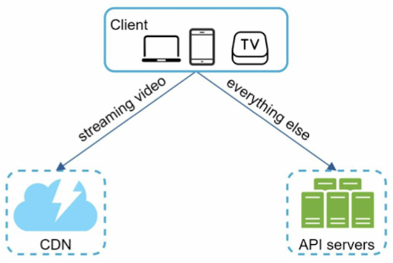
- Client
  - It can be on computer, mobile phone, and smart TV.
- CDN
  - Videos are stored in CDN. A video is streamed from the CDN.
- API servers
  - Everything else except vidoe streaming goes through API servers. This includes fedd recommendation, generating video upload URL, updating metadata database and cache, user signup.

### Video uploading flow
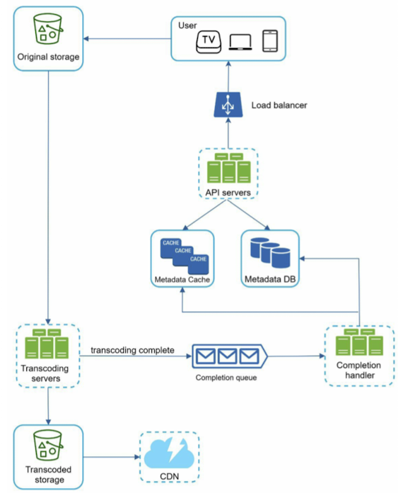
- Components
    - user
    - Load balancer
    - API servers: All user requests go through API servers except video streaming.
    - Metadata DB
    - Metadata cache
    - Original storage: A blob storage system is used to store original videos.
    - Transcoding servers
- A. Flow a: upload the actual video
    - 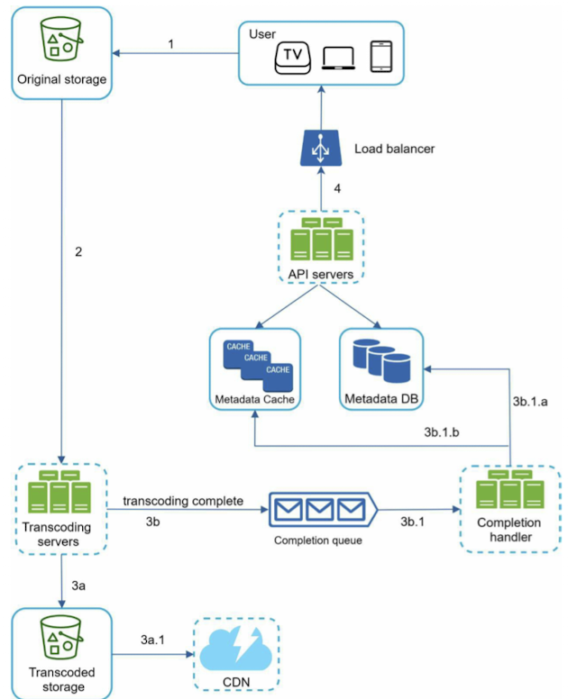
    - Once transcoding is complete, the following two steps are executed in parallel:
      - 3a. Tanscoded videos are sent to transcoded storage.
      - 3b. Transcoding completion events are queued in the completiong queue.
- B. Flow b: update the metadata
    - 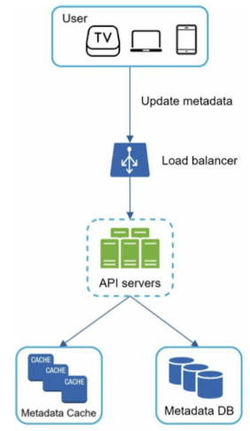

### Video streaming flow
- Streaming protocols

## Step 3. Design deep dive
### Video transcoding
- Raw video consumes large amounts of storage space
- Many devices and browsers only support certain types of video formats.
- Network conditions can change, especially on mobile devices. (Switching video quality automatically)
- Encoding formats
  - Container: This is like a basket that contains the video file, audio, and metadata.
  - Codecs: To reduce the vidoe size while preserving the video quality. (H.264, VP9, and HEVC)

### Directed acyclic graph (DAG) model
- 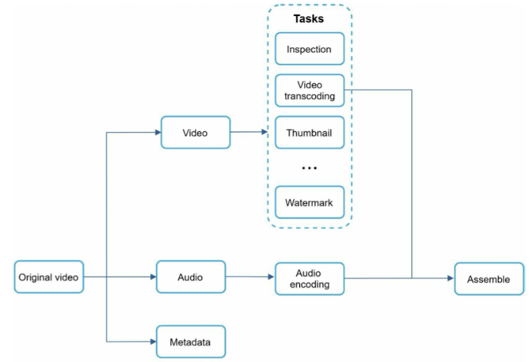
- Video, audio, and metadata.
- Video
  - Inspection
  - Video encodings
  - Thumbnail
  - Watermark

### Video transcoding architecture
- 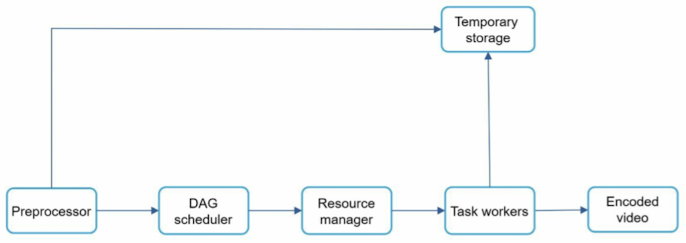

#### Preprocessor
1. Video splitting: Video stream is split or further split into smaller Group of Pictures (GOP) alignment. GOP is a group/chunk of frames arranged in a specific order. Each chunk is an independently playable unit, usually a few seconds in length.
2. Preprocessor split videos by GOP alignment for old clients.
3. DAG generation
4. Cache data: The preprocessor is a cache for segmented videos. For better reliability, the preprocessor stored GOPs and metadata in temporary storage.

#### DAG scheduler
- 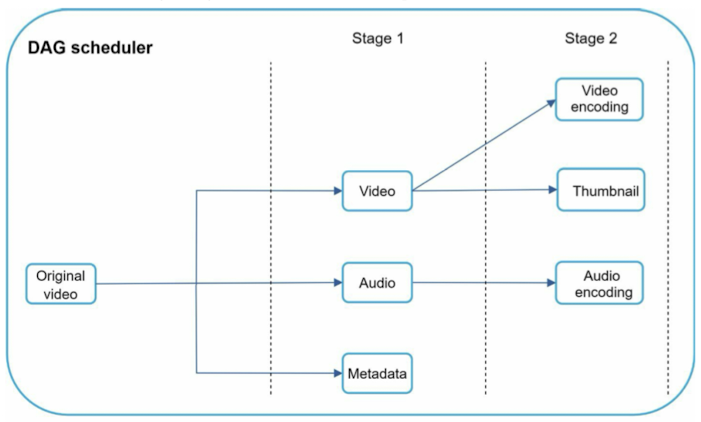

#### Resource manager
- The resource manager is responsible for managing the efficiency of resource allocation.
- 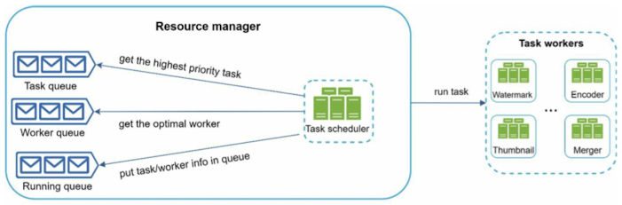
- Task queue
- Worker queue
- Running queue
- Task scheduler
  - The task scheduler gets the highest priority task from the task queue.

#### Task workers
- Task workers run the tasks which are defined in the DAG. Different task workers may run different tasks.

#### Temporary stoarge
- Blog storage: video and audio data.

#### Encoded video
- Encoded vidoe is the final output of the encoding pipeline.

### System optimizations
#### Speed optimization
1. Parallelize video uploading
    - 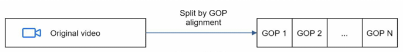
    - 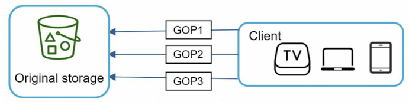
2. Place upload centers close to users
    - Another way to improve the upload speed is by setting up multiple upload centers across the globe.
3. Parallelism everywhere
   - 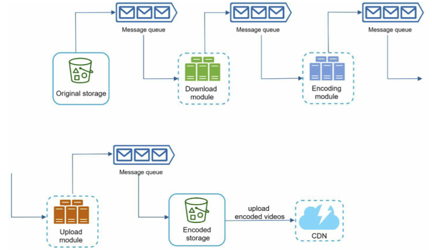
   - 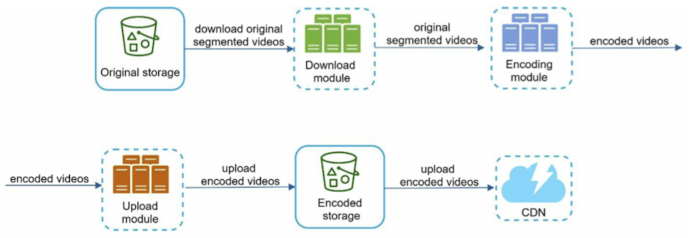
     - Before the message queue is introduced, the encoding module must wait for the output of the download module.
     - After the message queue is introduced, the encoding module does not need to wait for the output of the download module anymore. If there are events in the message queue, the encoding moduel can execute those jobs in paralle.

#### Safety optimization
1. Pre-signed upload URL
   - 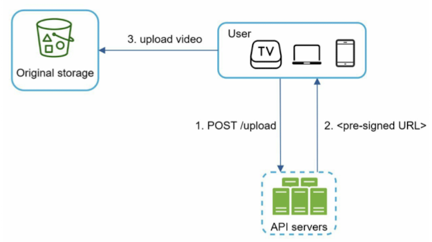
2. Protect your videos.
    - Digital rights management (DRM) systems
    - AES encryption
    - Visual watermarking

#### Cost-saving optimization
1. Only serve the most popular videos from CDN and other videos from our high capacity stoarge video servers.
2. For less popular content, we may not need to store many encoded vidoe versions. Short videos can be encoded on-demand.
3. Some videos are popular only in certain regions. There is no need to distribute these videos to other regions.
4. Build your own CDN like Netflix and partner with Internet Service Providers (ISPs)

### Error handling
- Recoverable error
- Non-recoverable error

## Step 4. Wrap up
- Live streaming
  - Live streaming has a higher latency requirement.
- Video takedowns
